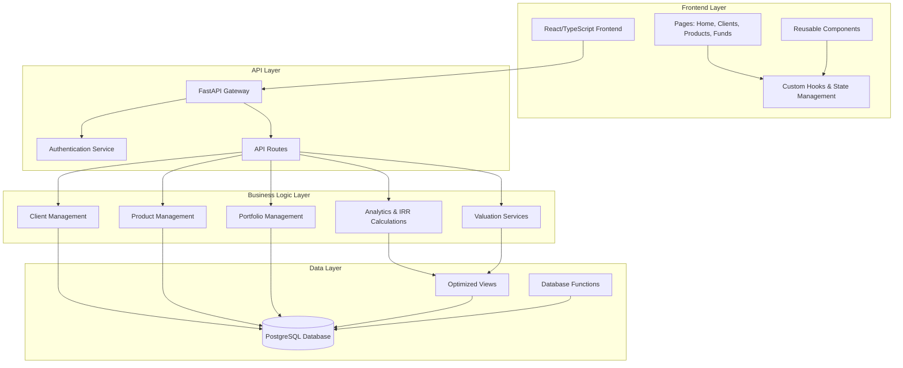
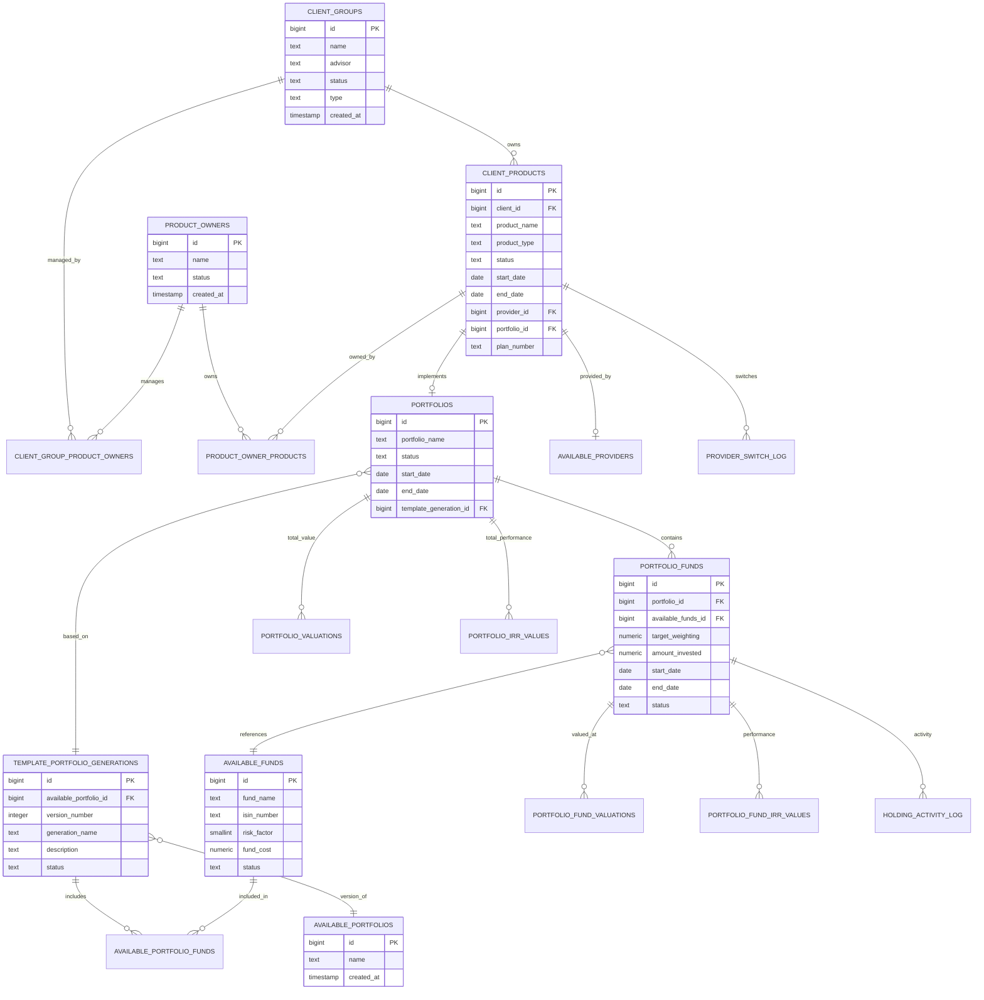

# Kingston's Wealth Management Portal - Architecture Overview

## System Overview

This is a comprehensive wealth management portal system built with a modern full-stack architecture. The system manages client groups, their financial products, portfolios, funds, and performance tracking.

## Architecture Diagram



## Core Entity Relationships



## Data Flow Architecture

```mermaid
flowchart TD
    subgraph "User Interface"
        Dashboard[Dashboard/Home]
        ClientList[Client Groups List]
        ClientDetail[Client Details]
        ProductMgmt[Product Management]
        PortfolioView[Portfolio Views]
    end

    subgraph "API Endpoints"
        BulkAPI[/bulk_client_data]
        ClientAPI[/client_groups]
        ProductAPI[/client_products]
        PortfolioAPI[/portfolios]
        FundAPI[/portfolio_funds]
        AnalyticsAPI[/analytics]
    end

    subgraph "Optimized Views"
        ClientCompleteView[client_group_complete_data]
        ProductListView[products_list_view]
        LatestValuations[latest_portfolio_valuations]
        LatestIRR[latest_portfolio_irr_values]
        FundCompleteData[complete_fund_data]
    end

    subgraph "Core Tables"
        ClientTables[client_groups, client_products]
        PortfolioTables[portfolios, portfolio_funds]
        ValuationTables[portfolio_valuations, portfolio_fund_valuations]
        IRRTables[portfolio_irr_values, portfolio_fund_irr_values]
        ActivityTables[holding_activity_log]
    end

    Dashboard --> BulkAPI
    ClientList --> BulkAPI
    ClientDetail --> ClientAPI
    ProductMgmt --> ProductAPI
    PortfolioView --> PortfolioAPI
    PortfolioView --> FundAPI

    BulkAPI --> ClientCompleteView
    ClientAPI --> ClientTables
    ProductAPI --> ProductListView
    PortfolioAPI --> LatestValuations
    FundAPI --> FundCompleteData
    AnalyticsAPI --> LatestIRR

    ClientCompleteView --> ClientTables
    ProductListView --> ClientTables
    ProductListView --> PortfolioTables
    LatestValuations --> ValuationTables
    LatestIRR --> IRRTables
    FundCompleteData --> PortfolioTables
    FundCompleteData --> ValuationTables
```

## System Functionality

### 1. Client Management
- **Client Groups**: Main entities representing families, businesses, or trusts
- **Product Owners**: Individuals who own/manage specific products within client groups
- **Relationships**: Many-to-many relationship between client groups and product owners

### 2. Product Management
- **Client Products**: Financial products (pensions, ISAs, etc.) owned by client groups
- **Provider Management**: Different financial service providers
- **Provider Switching**: Track when products move between providers
- **Product Lifecycle**: Active/inactive status tracking

### 3. Portfolio Management
- **Template System**: 
  - `available_portfolios`: Master portfolio templates
  - `template_portfolio_generations`: Versioned implementations of templates
  - `portfolios`: Actual portfolio instances used by products
- **Fund Allocation**:
  - `portfolio_funds`: Specific fund holdings within portfolios
  - `available_funds`: Master fund catalog
  - Target weightings and actual invested amounts

### 4. Performance Tracking
- **Valuations**:
  - Portfolio-level valuations for overall performance
  - Fund-level valuations for detailed tracking
- **IRR Calculations**:
  - Portfolio-level IRR for overall returns
  - Fund-level IRR for detailed analysis
- **Activity Logging**: All investment activities (investments, withdrawals, switches)

### 5. Analytics & Reporting
- **Dashboard Metrics**: Total FUM, Company IRR, Client counts
- **Performance Views**: Latest valuations and IRR values
- **Distribution Charts**: Fund, provider, and template distributions
- **Search Functionality**: Global search across all entities

## Key Technical Features

### 1. Performance Optimization
- **Bulk Data Endpoints**: Single API calls for complex data requirements
- **Database Views**: Pre-computed aggregations for common queries
- **Indexed Searches**: Optimized database indexes for fast lookups

### 2. Data Integrity
- **Foreign Key Constraints**: Ensures referential integrity
- **Status Management**: Soft deletes with status fields
- **Audit Trails**: Creation timestamps and activity logging

### 3. Scalability Features
- **Pagination**: All list endpoints support pagination
- **Filtering**: Advanced filtering on multiple criteria
- **Sorting**: Flexible sorting on various fields
- **Caching**: Optimized for front-end caching strategies

### 4. Security
- **Authentication**: JWT-based authentication system
- **Authorization**: Role-based access control
- **Input Validation**: Comprehensive input sanitization
- **CORS Configuration**: Proper cross-origin resource sharing

## Frontend Architecture

### 1. Page Structure
- **Home/Dashboard**: Overview metrics and charts
- **Clients**: Client group management and listing
- **Products**: Financial product management
- **Funds**: Fund catalog and performance
- **Client Details**: Comprehensive client information

### 2. State Management
- **React Query**: Server state management with caching
- **Custom Hooks**: Reusable data fetching logic
- **Context API**: Authentication state management

### 3. UI Components
- **Reusable Components**: StatBox, DataTable, Charts
- **Responsive Design**: Mobile-first responsive layouts
- **Loading States**: Skeleton loaders and error boundaries

## Integration Points

### 1. Data Synchronization
- **Real-time Updates**: Optimistic UI updates with React Query
- **Error Handling**: Comprehensive error boundary system
- **Retry Logic**: Automatic retry for failed requests

### 2. External Systems
- **Provider APIs**: Ready for integration with financial service providers
- **Valuation Services**: Automated valuation data imports
- **Reporting Tools**: Export capabilities for external reporting

This architecture provides a solid foundation for a comprehensive wealth management system with strong separation of concerns, optimized performance, and excellent scalability potential. 