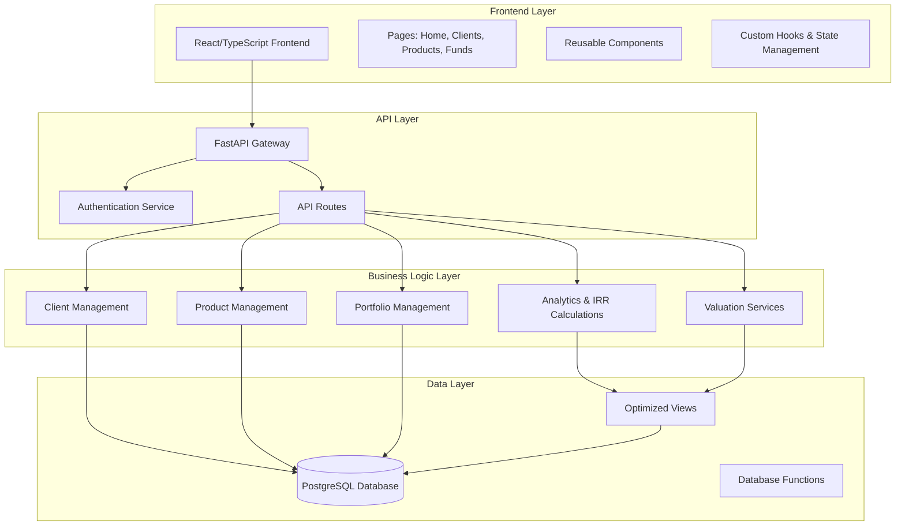
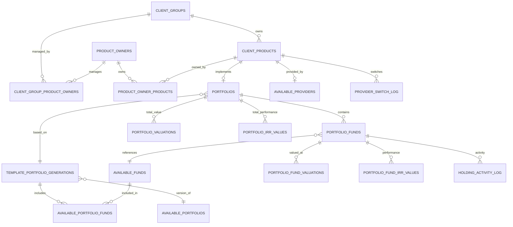

# Kingston's Portal - Comprehensive Project Report

## Executive Summary

Kingston's Portal is a comprehensive wealth management platform designed for financial advisors to manage client portfolios, investment products, and performance analytics. The system provides a full-stack solution with a React/TypeScript frontend, FastAPI backend, and PostgreSQL database, enabling efficient management of client relationships, investment funds, and portfolio performance tracking.

## Project Architecture

### System Overview


## Frontend Architecture

### Technology Stack
- **Framework**: React 18.2.0 with TypeScript
- **Build Tool**: Vite (v6.2.6)
- **UI Library**: 
  - Material-UI (v7.0.1) for components
  - Tailwind CSS for styling
  - Headless UI for accessible components
- **State Management**: 
  - React Context API for authentication
  - TanStack Query (v5.75.1) for server state
- **Routing**: React Router DOM v6.22.1
- **Charts**: Recharts v2.15.3
- **Date Handling**: Date-fns, Moment.js, DayJS
- **HTTP Client**: Axios v1.6.7

### Directory Structure
```
frontend/src/
├── components/
│   ├── auth/          # Authentication components
│   ├── generation/    # Portfolio generation components
│   ├── layout/        # Layout components (Sidebar, TopBar, Footer)
│   ├── report/        # Report-related components
│   ├── reports/       # Report generation components
│   └── ui/           # Reusable UI components
├── context/          # React Context providers
├── hooks/            # Custom React hooks
├── pages/            # Page components
├── services/         # API service layer
├── styles/           # CSS styles
├── types/            # TypeScript type definitions
├── utils/            # Utility functions
└── tests/            # Test files
```

### Key Pages and Components

#### Core Pages (34 total)
1. **Client Management**
   - `Clients.tsx` - Client list view
   - `ClientDetails.tsx` - Individual client details
   - `AddClient.tsx` - Add new client
   - `ProductOwners.tsx` - Product owner management
   - `ProductOwnerDetails.tsx` - Individual product owner details

2. **Product Management**
   - `Products.tsx` - Product list view
   - `ProductDetails.tsx` - Product details
   - `CreateClientProducts.tsx` - Client-product associations
   - `AddProducts.tsx` - Add new products

3. **Portfolio Management**
   - `PortfolioTemplates.tsx` - Portfolio template management
   - `PortfolioTemplateDetails.tsx` - Template details
   - `AddPortfolioTemplate.tsx` - Create new templates
   - `AddPortfolioGeneration.tsx` - Create template versions
   - `EditPortfolioGeneration.tsx` - Edit template versions

4. **Fund Management**
   - `Funds.tsx` - Fund list view
   - `FundDetails.tsx` - Individual fund details
   - `AddFund.tsx` - Add new investment funds

5. **Analytics & Reporting**
   - `Analytics.tsx` - Performance analytics
   - `Revenue.tsx` - Revenue analytics
   - `ReportGenerator.tsx` - Report generation
   - `ReportDisplayPage.tsx` - Report display
   - `ProductIRRCalculation.tsx` - IRR calculations
   - `ProductIRRHistory.tsx` - IRR history

6. **Administration**
   - `Providers.tsx` - Provider management
   - `ProviderDetails.tsx` - Provider details
   - `AddProvider.tsx` - Add new providers

#### UI Components
- **Form Components**: BaseInput, NumberInput, BaseDropdown, ActionButton
- **Data Display**: StandardTable, EditableMonthlyActivitiesTable
- **Modals**: AddProviderModal, AddFundModal, CreateProductOwnerModal
- **Layout**: Sidebar, TopBar, Footer, ProtectedRoute

## Backend Architecture

### Technology Stack
- **Framework**: FastAPI 0.104.1
- **Server**: Uvicorn with Gunicorn
- **Database**: PostgreSQL via Supabase
- **Authentication**: JWT with python-jose
- **Password Hashing**: Passlib with bcrypt
- **Environment Management**: python-dotenv
- **Financial Calculations**: numpy-financial
- **Testing**: pytest with pytest-asyncio

### Directory Structure
```
backend/
├── app/
│   ├── api/
│   │   └── routes/        # API route handlers
│   ├── db/               # Database utilities
│   ├── models/           # Data models
│   └── utils/            # Utility functions
├── tests/                # Test files
├── main.py              # FastAPI application
├── requirements.txt     # Python dependencies
└── pytest.ini          # Test configuration
```

### API Endpoints

#### Authentication (7 endpoints)
- `POST /api/auth/signup` - User registration
- `POST /api/auth/login` - User login
- `POST /api/auth/logout` - User logout
- `POST /api/auth/forgot-password` - Password reset request
- `POST /api/auth/verify-reset-token` - Reset token verification
- `POST /api/auth/reset-password` - Password reset
- `GET /api/auth/me` - Current user profile

#### Client Management (5 endpoints)
- `GET /api/clients` - List all clients
- `POST /api/clients` - Create new client
- `GET /api/clients/{client_id}` - Get specific client
- `PATCH /api/clients/{client_id}` - Update client
- `DELETE /api/clients/{client_id}` - Delete client

#### Product Management (5 endpoints)
- `GET /api/products` - List all products
- `POST /api/products` - Create new product
- `GET /api/products/{product_id}` - Get specific product
- `PATCH /api/products/{product_id}` - Update product
- `DELETE /api/products/{product_id}` - Delete product

#### Fund Management (5 endpoints)
- `GET /api/funds_under_management` - List all funds
- `POST /api/funds_under_management` - Create new fund
- `GET /api/funds_under_management/{fund_id}` - Get specific fund
- `PATCH /api/funds_under_management/{fund_id}` - Update fund
- `DELETE /api/funds_under_management/{fund_id}` - Delete fund

#### Portfolio Management (5 endpoints)
- `GET /api/portfolios` - List all portfolios
- `POST /api/portfolios` - Create new portfolio
- `GET /api/portfolios/{portfolio_id}` - Get specific portfolio
- `PATCH /api/portfolios/{portfolio_id}` - Update portfolio
- `DELETE /api/portfolios/{portfolio_id}` - Delete portfolio

#### Provider Management (5 endpoints)
- `GET /api/providers` - List all providers
- `POST /api/providers` - Create new provider
- `GET /api/providers/{provider_id}` - Get specific provider
- `PATCH /api/providers/{provider_id}` - Update provider
- `DELETE /api/providers/{provider_id}` - Delete provider

#### Analytics & Reporting (1+ endpoints)
- `GET /api/analytics/product_client_counts` - Client counts per product
- Additional analytics endpoints for IRR calculations, valuations, and reporting

#### Client-Product Associations (3 endpoints)
- `GET /api/client_products` - List client-product associations
- `POST /api/client_products` - Create association
- `DELETE /api/client_products/{client_id}/{product_id}` - Delete association

## Database Architecture

### Core Entity Relationships


### Key Database Tables

#### Core Entity Tables
1. **profiles** - User profiles and preferences
2. **client_groups** - Client groups (families, businesses, trusts)
3. **product_owners** - Individuals who own products within client groups
4. **client_group_product_owners** - Many-to-many relationship
5. **available_providers** - Financial service providers
6. **client_products** - Financial products owned by clients
7. **product_owner_products** - Links products to specific owners

#### Portfolio & Fund Tables
1. **available_portfolios** - Master portfolio templates
2. **template_portfolio_generations** - Versioned portfolio implementations
3. **portfolios** - Actual portfolio instances
4. **available_funds** - Master fund catalog
5. **available_portfolio_funds** - Funds available in templates
6. **portfolio_funds** - Actual fund holdings in portfolios

#### Performance & Activity Tables
1. **portfolio_valuations** - Portfolio-level valuations
2. **portfolio_fund_valuations** - Fund-level valuations
3. **portfolio_irr_values** - Portfolio IRR calculations
4. **portfolio_fund_irr_values** - Fund IRR calculations
5. **holding_activity_log** - Activity tracking
6. **provider_switch_log** - Provider change history

#### Optimized Views
1. **client_group_complete_data** - Complete client information
2. **products_list_view** - Product display information
3. **complete_fund_data** - Complete fund information
4. **latest_portfolio_valuations** - Most recent portfolio values
5. **latest_portfolio_irr_values** - Most recent IRR calculations
6. **company_revenue_analytics** - Revenue analysis
7. **provider_revenue_breakdown** - Provider revenue metrics

### Database Features
- **Comprehensive Indexing**: Optimized for query performance
- **Materialized Views**: For complex analytics queries
- **Referential Integrity**: Foreign key constraints
- **Audit Trails**: Created timestamps and status tracking
- **Performance Optimization**: Query-specific indexes

## Key Features

### Client Management
- Client group management (families, businesses, trusts)
- Product owner tracking within client groups
- Relationship management between clients and product owners
- Client status tracking and advisor assignment

### Product Management
- Financial product lifecycle management
- Provider assignment and switching
- Product type categorization (pensions, ISAs, etc.)
- Fee structure management (fixed costs, percentage fees)

### Portfolio Management
- Template-based portfolio system
- Versioned portfolio generations
- Fund allocation and weighting
- Portfolio performance tracking

### Fund Management
- Investment fund catalog
- ISIN number tracking
- Risk factor assessment (1-7 scale)
- Fund cost management

### Analytics & Reporting
- Internal Rate of Return (IRR) calculations
- Performance analytics and trending
- Revenue analytics by provider
- Custom report generation
- Historical performance tracking

### System Administration
- User authentication and authorization
- Provider management
- System health monitoring
- Data export capabilities

## Security Features

### Authentication & Authorization
- JWT-based authentication
- Password hashing with bcrypt
- Session management
- Role-based access control (implied)

### Data Protection
- Environment variable management
- No hard-coded credentials
- Input validation and sanitization
- SQL injection prevention through ORM

### API Security
- CORS configuration
- Request/response validation
- Error handling without data exposure
- Rate limiting (configurable)

## Performance Optimizations

### Database Optimizations
- Comprehensive indexing strategy
- Materialized views for complex queries
- Query-specific index optimizations
- Database function usage

### Frontend Optimizations
- Code splitting with Vite
- Lazy loading implementations
- Optimized asset loading
- Responsive design patterns

### Backend Optimizations
- Async/await patterns
- Connection pooling
- Caching strategies
- Batch processing capabilities

## Deployment Architecture

### Development Environment
- Local development with hot reloading
- Docker support (implied from .dockerignore)
- Environment-based configuration
- Comprehensive testing suite

### Production Deployment
- PowerShell deployment scripts
- Static file serving
- Health check endpoints
- Monitoring and logging

## Testing Strategy

### Frontend Testing
- Jest testing framework
- React Testing Library
- Component unit tests
- User interaction testing

### Backend Testing
- pytest framework
- Async testing support
- API endpoint testing
- Database integration testing

## Documentation

### Available Documentation
- Architecture overview
- API documentation (Swagger/ReDoc)
- Deployment instructions
- Contributing guidelines
- Feature-specific documentation

## Project Purpose

Kingston's Portal serves as a comprehensive wealth management platform specifically designed for financial advisors and wealth management professionals. The system addresses the complex needs of managing:

1. **Client Relationships**: Multi-generational family groups, business entities, and trust structures
2. **Product Lifecycle**: From initial setup through provider switches and performance tracking
3. **Portfolio Management**: Template-based systems for consistent investment strategies
4. **Performance Analytics**: Real-time IRR calculations and historical performance tracking
5. **Regulatory Compliance**: Proper documentation and audit trails
6. **Revenue Analytics**: Provider-based revenue tracking and analysis

The platform streamlines the advisor workflow while providing clients with transparent, real-time access to their investment performance and portfolio composition.

## Technology Strengths

1. **Modern Stack**: React/TypeScript frontend with FastAPI backend
2. **Scalable Architecture**: Modular design with clear separation of concerns
3. **Performance Focus**: Optimized queries and efficient data handling
4. **Security First**: Comprehensive authentication and data protection
5. **Extensible Design**: Plugin-ready architecture for future enhancements
6. **Developer Experience**: Comprehensive tooling and documentation

## Future Considerations

1. **Mobile Application**: React Native or progressive web app
2. **Advanced Analytics**: Machine learning integration for investment recommendations
3. **Third-party Integrations**: Direct data feeds from financial institutions
4. **Workflow Automation**: Automated rebalancing and compliance checking
5. **Client Portal**: Direct client access to portfolio information
6. **API Ecosystem**: Public API for third-party integrations

This comprehensive platform represents a modern approach to wealth management technology, balancing powerful functionality with user-friendly design and robust security measures. 