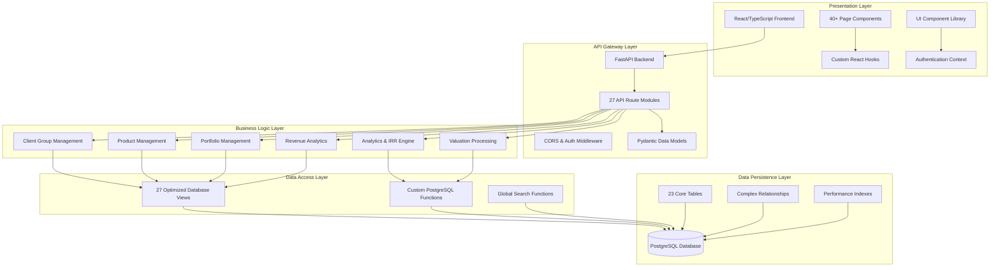
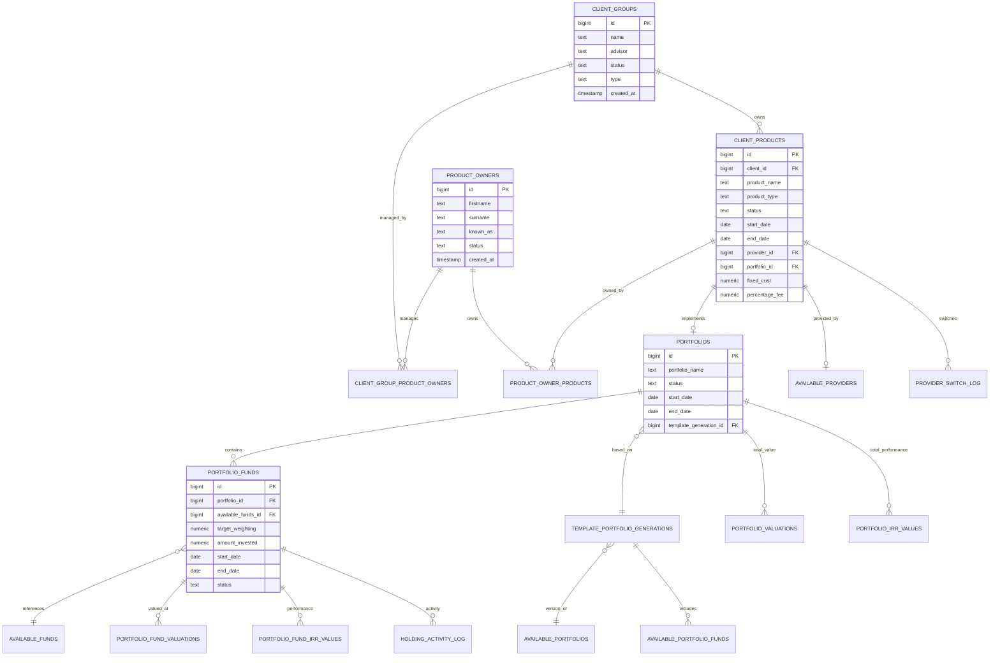
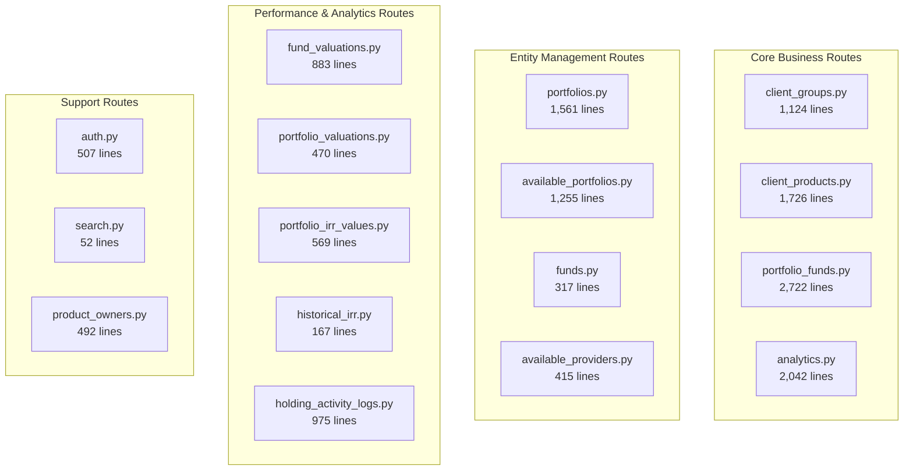

# Kingston's Wealth Management Portal - Comprehensive Project Structure Report

## Executive Summary

Kingston's Wealth Management Portal is a sophisticated full-stack financial management system built with modern technologies. It manages client groups, financial products, investment portfolios, funds, and performance tracking with a focus on IRR (Internal Rate of Return) calculations and comprehensive analytics.

## System Architecture Overview



## Database Architecture

### Core Entity Model



### Database Layer Summary

**Core Tables (23 total):**
- **Identity & Access**: `profiles`, `authentication`, `session`
- **Client Management**: `client_groups`, `product_owners`, `client_group_product_owners`
- **Product Management**: `client_products`, `product_owner_products`
- **Portfolio System**: `portfolios`, `available_portfolios`, `template_portfolio_generations`
- **Fund Management**: `available_funds`, `portfolio_funds`, `available_portfolio_funds`
- **Valuation System**: `portfolio_fund_valuations`, `portfolio_valuations`
- **Performance Tracking**: `portfolio_fund_irr_values`, `portfolio_irr_values`
- **Activity Logging**: `holding_activity_log`, `provider_switch_log`
- **Provider Management**: `available_providers`

**Optimized Views (27 total):**
- **Performance Views**: `latest_portfolio_fund_irr_values`, `latest_portfolio_valuations`, `portfolio_historical_irr`, `fund_historical_irr`
- **Aggregation Views**: `client_group_complete_data`, `complete_fund_data`, `fund_activity_summary`
- **Analytics Views**: `company_revenue_analytics`, `provider_revenue_breakdown`, `products_list_view`

**Key Features:**
- Multi-level portfolio template system with generations/versions
- Comprehensive IRR tracking at fund and portfolio levels
- Revenue analytics with fixed costs and percentage fees
- Global search functionality across all entities
- Optimized bulk data queries for performance

## Frontend Architecture

### Application Structure

**Technology Stack:**
- React 18 with TypeScript
- React Router for navigation
- TanStack Query for data fetching
- Tailwind CSS for styling
- Custom UI component library

**Page Structure (40+ pages):**

```mermaid
graph LR
    subgraph "Authentication"
        Login[Login.tsx]
        SignUp[SignUp.tsx]
        ResetPassword[Reset Password Forms]
    end
    
    subgraph "Dashboard"
        Home[Home.tsx - Dashboard]
        Analytics[Analytics.tsx]
        Revenue[Revenue.tsx]
    end
    
    subgraph "Client Management"
        Clients[Clients.tsx - List View]
        ClientDetails[ClientDetails.tsx]
        AddClient[AddClient.tsx]
        CreateProducts[CreateClientProducts.tsx]
    end
    
    subgraph "Product Management"
        Products[Products.tsx]
        ProductDetails[ProductDetails.tsx]
        ProductOverview[ProductOverview.tsx]
        ProductOwners[ProductOwners.tsx]
        ProductOwnerDetails[ProductOwnerDetails.tsx]
        ProductIRR[ProductIRRCalculation.tsx]
    end
    
    subgraph "Definitions/Admin"
        DefFunds[DefinitionsFunds.tsx]
        DefProviders[DefinitionsProviders.tsx]
        DefTemplates[DefinitionsTemplates.tsx]
        FundDetails[FundDetails.tsx]
        ProviderDetails[ProviderDetails.tsx]
        PortfolioDetails[PortfolioTemplateDetails.tsx]
    end
    
    subgraph "Reporting"
        ReportGenerator[ReportGenerator.tsx]
        ReportDisplay[ReportDisplay.tsx]
        Reporting[Reporting.tsx]
    end
```

**UI Component Library (45+ components):**
- **Form Components**: `BaseInput`, `NumberInput`, `DateInput`, `TextArea`, `SearchableDropdown`
- **Display Components**: `StatBox`, `StatCard`, `DataTable`, `FundDistributionChart`
- **Navigation**: `Navbar`, `Sidebar`, `TopBar`
- **Utility Components**: `ErrorDisplay`, `EmptyState`, `Skeleton`, `ProfileAvatar`

### Key Frontend Features

1. **Dashboard with Real-time Analytics**
   - Company-wide FUM and IRR statistics
   - Fund/Provider/Template distribution charts
   - Risk analysis widgets

2. **Advanced Client Management**
   - Bulk client data loading with React Query
   - Advanced filtering and sorting
   - Client group relationship management

3. **Sophisticated Product Management**
   - Multi-step product creation workflows
   - IRR calculations with date selection
   - Product owner assignment system

4. **Comprehensive Reporting System**
   - Dynamic report generation
   - Customizable display formats
   - Data export capabilities

## Backend Architecture

### API Structure

**Technology Stack:**
- FastAPI with Python 3.8+
- Supabase PostgreSQL integration
- Pydantic for data validation
- Custom IRR calculation engine

**API Route Organization (27 modules):**



### Key Backend Features

1. **Optimized Data Fetching**
   - Bulk data endpoints for performance
   - React Query integration
   - Database view utilization

2. **Advanced IRR Calculations**
   - Excel-compatible IRR algorithms
   - Multi-level calculations (fund, portfolio, client, company)
   - Historical IRR tracking

3. **Revenue Analytics Engine**
   - Fixed cost and percentage fee calculations
   - Provider revenue breakdown
   - Company-wide revenue analytics

4. **Comprehensive Activity Logging**
   - All fund activities tracked
   - Provider switch logging
   - Audit trail maintenance

## Data Flow Architecture

```mermaid
flowchart TD
    subgraph "Frontend Data Flow"
        Dashboard[Dashboard Components]
        ClientList[Client List Views]
        ClientDetail[Client Detail Views]
        ProductMgmt[Product Management]
        Analytics[Analytics Views]
    end

    subgraph "API Layer"
        BulkAPI[/api/bulk_client_data]
        ClientAPI[/api/client_groups]
        ProductAPI[/api/client_products]
        PortfolioAPI[/api/portfolio_funds]
        AnalyticsAPI[/api/analytics/*]
    end

    subgraph "Optimized Database Views"
        ClientCompleteView[client_group_complete_data]
        ProductListView[products_list_view]
        CompleteFundData[complete_fund_data]
        LatestValuations[latest_portfolio_*_valuations]
        LatestIRR[latest_portfolio_*_irr_values]
        RevenueAnalytics[company_revenue_analytics]
    end

    subgraph "Core Data Tables"
        ClientTables[client_groups, client_products]
        PortfolioTables[portfolios, portfolio_funds]
        ValuationTables[portfolio_*_valuations]
        IRRTables[portfolio_*_irr_values]
        ActivityTables[holding_activity_log]
    end

    Dashboard --> BulkAPI
    ClientList --> BulkAPI
    ClientDetail --> ClientAPI
    ProductMgmt --> ProductAPI
    Analytics --> AnalyticsAPI
    
    BulkAPI --> ClientCompleteView
    ClientAPI --> ClientTables
    ProductAPI --> ProductListView
    PortfolioAPI --> CompleteFundData
    AnalyticsAPI --> RevenueAnalytics
    
    ClientCompleteView --> ClientTables
    ProductListView --> ClientTables
    CompleteFundData --> PortfolioTables
    LatestValuations --> ValuationTables
    LatestIRR --> IRRTables
    RevenueAnalytics --> ClientTables
    
    PortfolioTables --> ActivityTables
    ValuationTables --> ActivityTables
```

## Key Business Features

### 1. Multi-Level Client Management
- **Client Groups**: Family, Business, Trust entities
- **Product Owners**: Individual ownership within client groups
- **Advisor Assignment**: Dedicated advisor relationships

### 2. Sophisticated Portfolio System
- **Template-Based Portfolios**: Reusable portfolio templates
- **Portfolio Generations**: Versioned template system
- **Bespoke Portfolios**: Custom portfolio creation
- **Fund Weightings**: Target allocation management

### 3. Advanced Performance Tracking
- **Multi-Level IRR**: Fund, Portfolio, Product, Client, Company levels
- **Historical Tracking**: Complete performance history
- **Valuation Management**: Time-series valuation tracking
- **Activity Logging**: Comprehensive transaction history

### 4. Revenue Analytics
- **Fixed Costs**: Annual fixed fees per product
- **Percentage Fees**: Value-based fee calculations
- **Provider Revenue**: Revenue breakdown by provider
- **Company Analytics**: Comprehensive revenue analysis

### 5. Provider Management
- **Multi-Provider Support**: Multiple financial service providers
- **Provider Switching**: Historical switch tracking
- **Theme Integration**: Provider-specific UI theming

## Security & Performance Features

### Security
- **JWT Authentication**: Secure API access
- **Role-Based Access**: User permission system
- **Input Validation**: Pydantic model validation
- **SQL Injection Protection**: Parameterized queries

### Performance Optimizations
- **Database Views**: Pre-computed aggregations
- **Bulk Data Endpoints**: Minimized API calls
- **React Query Caching**: Intelligent data caching
- **Database Indexing**: Optimized query performance
- **Pagination**: Large dataset handling

## Technical Architecture Recommendations

### Strengths
1. **Comprehensive Data Model**: Well-structured entity relationships
2. **Performance Optimization**: Extensive use of database views
3. **Modern Frontend**: React with TypeScript and modern patterns
4. **Scalable API**: FastAPI with proper structure
5. **Rich Analytics**: Advanced IRR and revenue calculations

### Areas for Enhancement
1. **Testing Coverage**: Implement comprehensive test suites
2. **Error Handling**: Enhance error boundary patterns
3. **Caching Strategy**: Redis integration for better performance  
4. **API Documentation**: Enhanced OpenAPI documentation
5. **Monitoring**: Application performance monitoring

## Deployment Architecture

The system follows a modern containerized deployment pattern:
- **Frontend**: React SPA built and served as static files
- **Backend**: FastAPI application with Uvicorn server
- **Database**: PostgreSQL with custom views and functions
- **Container Support**: Dockerized deployment ready

## Summary

Kingston's Wealth Management Portal represents a sophisticated, enterprise-grade financial management system with:

- **40+ Frontend Pages** delivering comprehensive user experiences
- **27 Backend API Modules** providing robust business logic
- **23 Database Tables** with **27 Optimized Views** for performance
- **Advanced IRR Engine** with multi-level calculations
- **Revenue Analytics System** with comprehensive reporting
- **Modern Technology Stack** with React, FastAPI, and PostgreSQL

The system demonstrates excellent architectural patterns, comprehensive business logic implementation, and strong performance optimization strategies suitable for managing complex wealth management operations. 