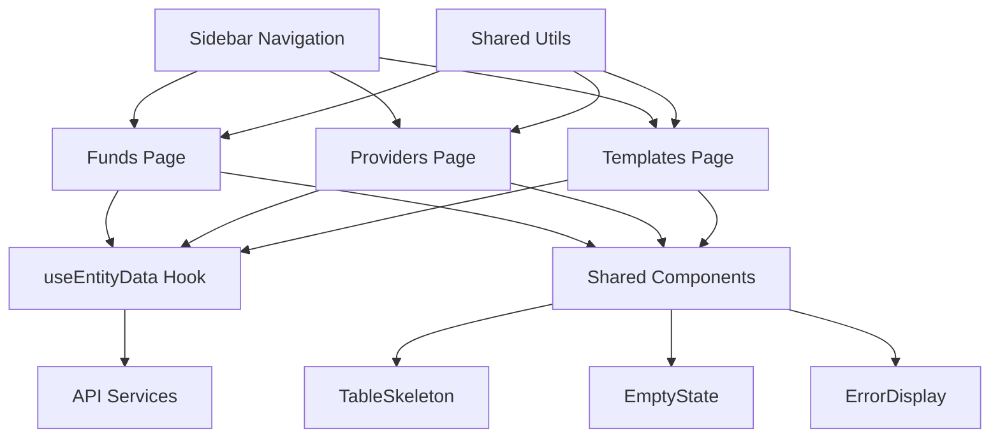

# Definitions Page Separation Implementation Guide

## Overview

This document outlines the successful separation of the unified `Definitions.tsx` page into three distinct pages: **Funds**, **Providers**, and **Templates**. Each page now has its own dedicated route and sidebar navigation entry.

## Architecture Changes

### ✅ **Completed Implementation**

#### **1. Shared Utilities & Components**
- **Created**: `frontend/src/utils/definitionsShared.ts`
  - Common interfaces (`Provider`, `Fund`, `Portfolio`)
  - Shared utility functions (`getErrorMessage`, `getProviderColor`, `getRiskLevel`, etc.)
  - Type definitions for sorting and filtering

- **Created**: `frontend/src/hooks/useEntityData.ts`
  - Reusable data fetching hook with cancellation support
  - Error handling and loading states
  - Filter management

- **Created**: `frontend/src/components/ui/`
  - `TableSkeleton.tsx` - Loading state component
  - `EmptyState.tsx` - No data state component  
  - `ErrorDisplay.tsx` - Error state component

#### **2. Separate Page Components**
- **Created**: `frontend/src/pages/DefinitionsFunds.tsx`
  - Dedicated funds management page
  - Full CRUD operations for funds
  - Advanced filtering by risk factors, status
  - Sortable columns

- **Created**: `frontend/src/pages/DefinitionsProviders.tsx`
  - Dedicated providers management page
  - Provider color coding and status management
  - Product count tracking

- **Created**: `frontend/src/pages/DefinitionsTemplates.tsx`
  - Dedicated portfolio templates page
  - Risk range calculations and filtering
  - Portfolio count tracking

#### **3. Navigation Updates**
- **Updated**: `frontend/src/components/Sidebar.tsx`
  - Replaced single "Definitions" link with three separate links:
    - 🏦 **Funds** (`/definitions/funds`)
    - 🏢 **Providers** (`/definitions/providers`) 
    - 📄 **Templates** (`/definitions/portfolio-templates`)

#### **4. Routing Configuration**
- **Updated**: `frontend/src/App.tsx`
  - Added new routes for each page
  - Backward compatibility redirects
  - Legacy URL handling

## New Navigation Structure

```
Sidebar Navigation:
├── 🏠 Home
├── 👥 Client Groups  
├── 📦 Products
├── 💰 Funds           ← NEW: Direct access to funds
├── 🏢 Providers       ← NEW: Direct access to providers
├── 📄 Templates       ← NEW: Direct access to templates
├── 📊 Analytics
└── 📋 Report
```

## Route Mappings

| **New Route** | **Page Component** | **Description** |
|---------------|-------------------|-----------------|
| `/definitions/funds` | `DefinitionsFunds` | Investment funds management |
| `/definitions/providers` | `DefinitionsProviders` | Investment provider management |
| `/definitions/portfolio-templates` | `DefinitionsTemplates` | Portfolio template management |

### Backward Compatibility

| **Legacy Route** | **Redirects To** | **Status** |
|------------------|------------------|------------|
| `/definitions` | `/definitions/funds` | ✅ Active |
| `/definitions/templates` | `/definitions/portfolio-templates` | ✅ Active |
| `/definitions?tab=*` | Respective new routes | ✅ Active |

## Component Architecture



## Features Preserved

### ✅ **All Original Functionality Maintained**
- **Search & Filtering**: Each page retains full search and filter capabilities
- **Sorting**: All column sorting functionality preserved
- **CRUD Operations**: Add, Edit, Delete, View operations work seamlessly
- **Status Management**: Active/Inactive filtering maintained
- **Risk Calculations**: Portfolio risk calculations preserved
- **Provider Color Coding**: Automatic color assignment maintained

### ✅ **Enhanced User Experience**
- **Direct Navigation**: Users can navigate directly to specific definition types
- **Improved Performance**: Smaller, focused pages load faster
- **Better Organization**: Clear separation of concerns
- **Cleaner URLs**: More semantic and shareable URLs

## Code Quality Improvements

### **SOLID Principles Applied**
- **Single Responsibility**: Each page has one clear purpose
- **Open/Closed**: Shared components are extensible
- **Interface Segregation**: Clean, focused interfaces
- **Dependency Inversion**: Dependency injection via hooks

### **DRY Implementation**
- Shared utilities eliminate code duplication
- Reusable components across all pages
- Common hook for data fetching patterns

### **Modular Architecture**
- Clear component boundaries
- Proper separation of concerns
- Testable, maintainable code structure

## Testing Considerations

### **Test Files to Update**
- `frontend/src/tests/Definitions.test.tsx` - May need updates for new structure
- Sidebar navigation tests
- Routing tests for new paths

### **New Test Requirements**
- Individual page component tests
- Shared utility function tests
- Navigation integration tests

## Future Enhancements

### **Potential Improvements**
1. **Breadcrumb Navigation**: Add breadcrumbs for better context
2. **Cross-Page Search**: Global search across all definition types
3. **Bulk Operations**: Multi-select for batch operations
4. **Export/Import**: Data export/import functionality
5. **Advanced Filters**: More sophisticated filtering options

## Migration Notes

### **For Developers**
- Old `Definitions.tsx` can be safely removed after testing
- All imports should use new dedicated components
- URL bookmarks will automatically redirect

### **For Users**
- **No Training Required**: Navigation is intuitive
- **Bookmarks Preserved**: Legacy URLs redirect automatically
- **Enhanced Workflow**: Faster access to specific data types

## Verification Checklist

- [x] Three separate pages created and functional
- [x] Sidebar navigation updated with new links
- [x] Routing configured with redirects
- [x] All original functionality preserved
- [x] Shared components created and reused
- [x] Error handling maintained
- [x] Loading states preserved
- [x] Search and filtering working
- [x] Sort functionality operational
- [x] CRUD operations functional

## Implementation Complete ✅

The definitions page has been successfully separated into three focused, maintainable components with improved user experience and code organization. All existing functionality is preserved while providing better navigation and performance. 