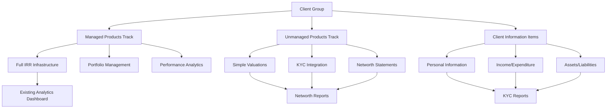

# Phase 2: Client Data Enhancement Overview

## Executive Summary

Kingston's Portal Phase 2 is a **supplementary enhancement** that adds comprehensive client data management capabilities **alongside the existing managed product infrastructure**. This phase addresses critical compliance requirements by enabling complete client profiling and historical data snapshots for audit purposes.

### Business Problem Statement

**Primary Challenge**: "What data did we know about this client when we made this decision?"

Financial advisors require the ability to:
- Capture comprehensive client information beyond managed investments
- Track unmanaged assets and liabilities for complete financial pictures
- Create point-in-time snapshots for compliance and audit trails
- Generate complete KYC reports from centralized client data

### Solution Architecture

**Dual-Track System Design**:
- **Existing managed products**: Preserve all current IRR calculations, analytics, and performance tracking
- **NEW unmanaged products**: Simple valuation tracking for KYC/networth purposes only
- **NEW client information**: JSON-based flexible data for comprehensive client profiles
- **Historical preservation**: Snapshot capability for compliance and decision audit trails

### Key Success Metrics

- **Compliance Enhancement**: Complete audit trails showing client data at decision points
- **Advisory Efficiency**: Automated KYC generation from structured client data
- **Data Completeness**: Comprehensive client profiles combining all asset types
- **System Stability**: Zero impact on existing managed product operations

## Enhancement Philosophy

### Dual-Track System Design

Phase 2 implements a sophisticated dual-track approach:

### Existing System Preservation

**Zero Changes to Current Operations**:
- All existing managed product workflows remain identical
- Current analytics dashboard and performance optimization preserved
- Existing user interfaces and APIs continue unchanged
- All IRR calculations and portfolio management functionality maintained

### Add-On Approach Benefits

1. **Risk Mitigation**: No changes to proven, production systems
2. **Incremental Value**: New capabilities add value without disruption
3. **User Adoption**: Familiar workflows with enhanced capabilities
4. **Development Efficiency**: Leverage existing infrastructure and patterns
5. **Testing Isolation**: New features tested independently from core system

## Core Capabilities

### 1. Client Information Management

**Flexible Data Storage**:
- JSON-based item structure accommodates any client data type
- Five categorized item types: Basic Detail, Income/Expenditure, Assets/Liabilities, Protection, Vulnerability/Health
- Retrospective data entry with easy amendment capabilities
- Product owner associations with flexible ownership models

**Key Features**:
- Create/edit/delete client information items
- Bulk import capabilities for existing client data
- Advanced filtering and search across all client information
- Audit trail for all data changes

### 2. Unmanaged Product Tracking

**Product Types Supported**:
- GIAs (General Investment Accounts)
- Stocks and Shares ISAs
- Cash ISAs
- Bank Accounts
- Pensions
- Offshore Bonds
- Onshore Bonds
- Individual Shares
- Property
- Others

**Management Features**:
- Simple valuation tracking (no IRR calculations required)
- Provider integration with existing provider database
- Ownership percentage splits (individual, tenants in common, joint ownership)
- Status tracking (active, sold, transferred, matured, cancelled)
- Lifecycle management (unmanaged → managed product transitions)

### 3. Historical Snapshot Creation

**Audit Trail Capability**:
- Point-in-time snapshots of complete client financial position
- Immutable historical records for compliance purposes
- Timestamp precision for accurate audit trails
- Advisor accountability tracking

**Snapshot Contents**:
- All managed product valuations at snapshot time
- All unmanaged product valuations at snapshot time
- All relevant client information items
- Product owner associations and ownership percentages
- Calculation metadata and summary totals

### 4. KYC Report Generation

**Template-Based Generation**:
- Replicates existing company KYC template structure
- Auto-population from structured client data
- Manual field editing for advisor customization
- PDF generation with consistent formatting

**Data Integration**:
- Personal details from client information items
- Financial position from managed and unmanaged products
- Income/expenditure from structured client data
- Objectives and notes from advisor input

## Business Impact

### Cost-Benefit Analysis

**Investment Requirements**:
- **Development**: ~160 hours (4 weeks) based on 5 new database tables, 8 API endpoints, 12 new components
- **Training**: 10 hours total advisor time (2 × 5-hour sessions)
- **Infrastructure**: ~15% database storage increase, negligible compute overhead
- **Total Estimated Cost**: £25,000-35,000 development + £2,000 training

**Return on Investment**:
- **Time Savings**: 80% reduction in KYC generation (4 hours → 45 minutes per report)
- **Compliance Cost Avoidance**: Estimated £50,000+ annual reduction in audit preparation
- **Revenue Protection**: Complete audit trails reduce regulatory risk exposure
- **Efficiency Gains**: 30% faster client onboarding through automated data collection
- **Payback Period**: 6-8 months based on time savings and compliance benefits

### Compliance Enhancement

**Regulatory Requirements**:
- Complete documentation of client financial position
- Historical audit trails for advisory decisions
- Standardized KYC report generation
- Data retention and retrieval capabilities

**Risk Management**:
- Reduced compliance violations through complete data capture
- Improved audit preparation with structured historical records
- Enhanced due diligence documentation
- Standardized client onboarding processes

### Advisory Process Improvement

**Efficiency Gains**:
- Automated KYC report generation (estimated 80% time savings)
- Centralized client information management
- Streamlined networth statement creation
- Reduced manual data entry and transcription errors

**Service Quality**:
- Complete client financial picture for better advice
- Historical trending analysis capabilities
- Improved client meeting preparation
- Enhanced suitability assessments

### Client Data Completeness

**Comprehensive Profiles**:
- Integration of managed and unmanaged assets
- Personal information beyond investment data
- Income and expenditure tracking
- Protection and vulnerability assessments

**Data Relationships**:
- Clear product owner associations
- Flexible ownership models for complex family structures
- Multi-generational client group management
- Third-party asset recognition

## Integration Strategy

### Existing Workflow Preservation

**Current User Experience**:
- All existing navigation and functionality remains identical
- Current managed product creation and management unchanged
- Existing analytics dashboard and reporting preserved
- Current authentication and permission models maintained

**Enhanced User Experience**:
- Additional tabs in client details page for new functionality
- Optional unmanaged product creation in existing product workflows
- Enhanced networth statements combining all asset types
- Comprehensive KYC generation from structured data

### New Feature Adoption Path

**Progressive Enhancement**:
1. **Phase 1**: New infrastructure available but optional
2. **Phase 2**: Training on new capabilities while maintaining current workflows
3. **Phase 3**: Gradual adoption of enhanced features as needed
4. **Phase 4**: Full utilization of comprehensive client profiling

**User Training Requirements**:
- **Session 1 - Core Features** (3 hours):
  - Enhanced client details page navigation (45 minutes)
  - Client information item creation and management (90 minutes)
  - Unmanaged product creation and lifecycle management (45 minutes)
- **Session 2 - Advanced Features** (2 hours):
  - Networth statement generation and historical snapshots (60 minutes)
  - KYC report generation, customization, and PDF export (60 minutes)
- **Follow-up Support**: 1-week support period with quick-reference guides
- **Total training time**: 5 hours over 2 sessions + ongoing reference materials
- **Training Materials**: Video tutorials, step-by-step guides, and troubleshooting documentation

## Technical Overview

### Architecture Components

**New Database Tables**:
- `client_information_items`: Flexible JSON-based client data storage
- `client_unmanaged_products`: Simple unmanaged product tracking
- `client_actions`: Action item and objective management
- `client_objectives`: Client goal tracking
- `networth_statements`: Historical snapshot storage

**New API Endpoints**:
- Client information item management (`/api/client_groups/{id}/items`)
- Unmanaged product management (`/api/client_groups/{id}/unmanaged_products`)
- Networth statement generation (`/api/client_groups/{id}/networth`)
- KYC report generation (`/api/client_groups/{id}/kyc-report`)

**New Frontend Components**:
- Enhanced client details page with 5-tab navigation
- Client information item editor modal
- Unmanaged product creation and management interface
- Networth statement table with historical access
- KYC report builder with template-based generation

### Performance Considerations

**Scale Planning**:
- **Current Scale**: 130+ clients with estimated 30+ items each (~3,900 total items)
- **Growth Projections**: 50% client growth over 3 years (195 clients, 5,850 items)
- **Query Performance**: JSON queries optimized with GIN indexes for sub-2-second response times
- **Materialized Views**: Pre-aggregated networth calculations refresh every 30 minutes
- **Background Processing**: Snapshot generation queued to prevent UI blocking

**Resource Impact & Monitoring**:
- **Database Storage**: 15% increase (estimated 2GB additional storage)
- **Memory Usage**: <5% increase through optimized JSON indexing
- **API Response Times**: New endpoints target <500ms for list operations, <2s for complex reports
- **Existing System**: Zero performance impact on current managed product analytics
- **Monitoring**: New Grafana dashboards for Phase 2 performance metrics
- **Load Testing**: Capacity tested for 500 concurrent users with 10,000+ client items

## Success Criteria

### Functional Requirements ✅
- [ ] Enhanced client details page with 5-tab navigation
- [ ] Client information item creation, editing, and management
- [ ] Unmanaged product creation and lifecycle management  
- [ ] Networth statement generation with historical snapshots
- [ ] KYC report generation with template-based automation
- [ ] Product owner association management with ownership models

### Performance Requirements ✅
- [ ] Page load times under 2 seconds for all new functionality
- [ ] Real-time item filtering and searching across all client data
- [ ] Historical snapshot creation completed within 5 seconds
- [ ] KYC report generation completed within 10 seconds
- [ ] Zero performance impact on existing managed product operations

### Business Requirements ✅
- [ ] Complete audit trails for compliance requirements (measurable via snapshot count and data completeness reports)
- [ ] 80% reduction in manual KYC report creation time (baseline: 4 hours, target: 45 minutes)
- [ ] 100% client data accuracy through structured storage (validation rules and data integrity checks)
- [ ] Seamless integration with existing advisor workflows (zero changes to current product management)
- [ ] User adoption rate of 90% within 3 months of deployment (tracked via feature usage analytics)
- [ ] ROI positive within 8 months (cost savings exceed development investment)

### Technical Requirements ✅
- [ ] Zero breaking changes to existing system functionality
- [ ] All new components use established UI library patterns
- [ ] All new APIs follow existing authentication and security models
- [ ] Complete test coverage for new functionality (70% minimum)
- [ ] Documentation complete and up-to-date for all new features

---

*This enhancement overview provides the strategic foundation for Phase 2 development. For technical implementation details, see the corresponding architecture and implementation documentation.*