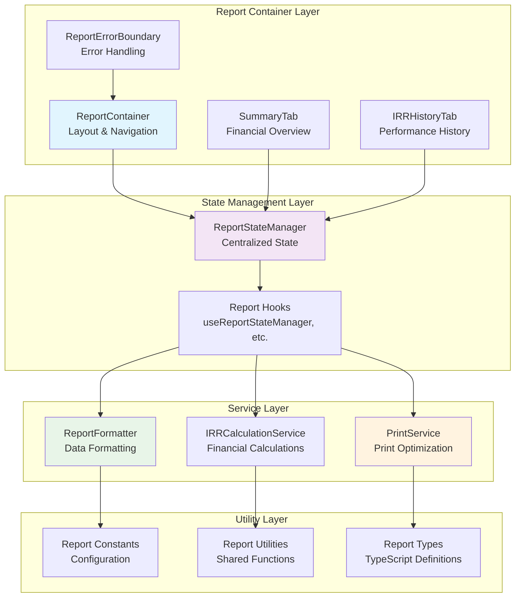
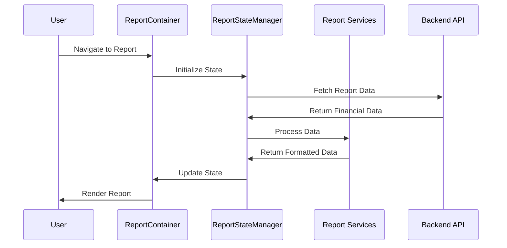
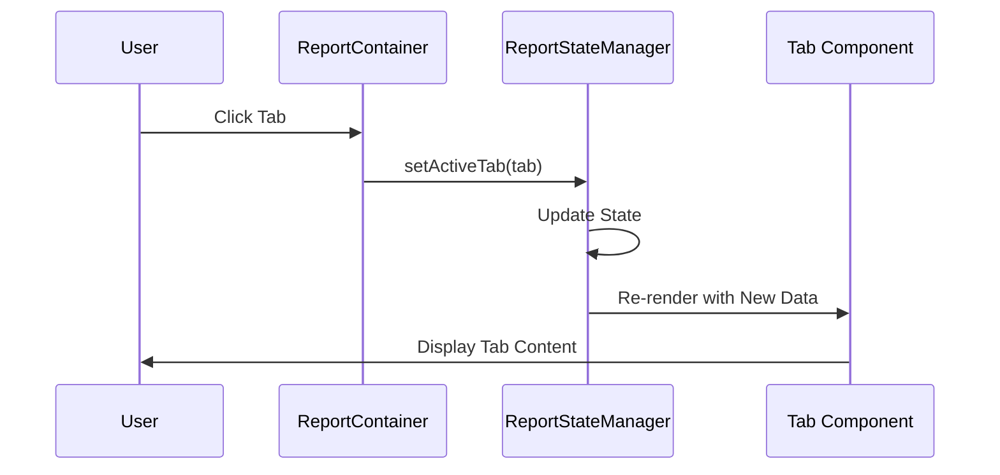
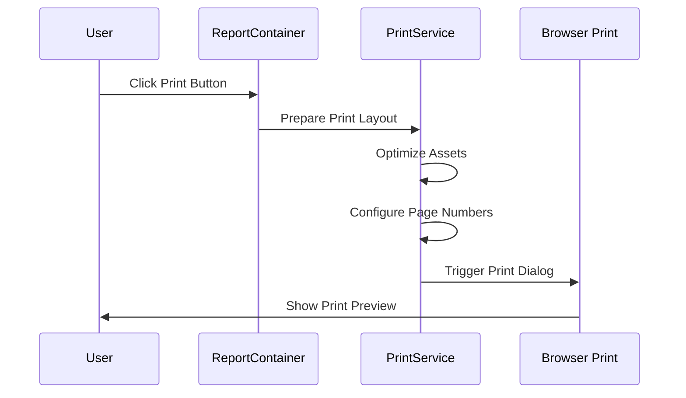

# Report Generation Architecture

## Overview

Kingston's Portal features a sophisticated, modular report generation system that provides comprehensive financial reporting capabilities. The system follows a layered architecture pattern with specialized services, state management, and optimized printing functionality.

## Architecture Overview



## Core Components

### 1. Report Container (`ReportContainer.tsx`)
**Location**: `frontend/src/components/report/ReportContainer.tsx`

**Purpose**: Main orchestration component providing layout structure and coordination.

**Key Features:**
- ✅ **Navigation Integration**: Back button with smart navigation patterns
- ✅ **Tab Management**: Summary and IRR History tab navigation
- ✅ **Print Integration**: react-to-print integration with custom options
- ✅ **Modal Management**: Title editing and product owner management
- ✅ **Performance Optimization**: Memoized computed values and callbacks

**Architecture Pattern:**
```typescript
// Container orchestrates all child components and services
const ReportContainer: React.FC<ReportContainerProps> = ({ reportData, children }) => {
  // State management integration
  const { state, actions } = useReportStateManager();
  
  // Print service integration
  const printService = useMemo(() => new PrintService(), []);
  
  // Memoized computed values for performance
  const reportTitle = useMemo(() => computeTitle(reportData, customTitles), [reportData, customTitles]);
  
  return (
    <div className="report-layout">
      <NavigationHeader />
      <ReportTitleSection />
      <TabNavigation />
      {children}
      <ModalsAndOverlays />
    </div>
  );
};
```

### 2. Report Tabs System

#### Summary Tab (`SummaryTab.tsx`)
**Purpose**: Displays financial overview with portfolio summaries and key metrics.

**Key Features:**
- ✅ **Responsive Tables**: DataTable integration with sorting and filtering
- ✅ **Financial Formatting**: Currency, percentage, and date formatting
- ✅ **Conditional Display**: Hide zero values, visual signing options
- ✅ **Performance Metrics**: Real-time IRR calculations and totals

#### IRR History Tab (`IRRHistoryTab.tsx`)  
**Purpose**: Shows historical performance data with trend analysis.

**Key Features:**
- ✅ **Time Series Display**: Historical IRR data with date ranges
- ✅ **Trend Analysis**: Performance comparison across time periods
- ✅ **Interactive Tables**: Sortable columns with performance indicators
- ✅ **Data Validation**: End valuation date matching with user feedback

### 3. State Management System

#### ReportStateManager Service
**Location**: `frontend/src/services/report/ReportStateManager.ts`

**Purpose**: Centralized state management for all report-related data and UI state.

**State Structure:**
```typescript
interface ReportState {
  // UI State
  activeTab: ReportTab;
  hideZeros: boolean;
  visualSigning: boolean;
  showTitleModal: boolean;
  showProductOwnerModal: boolean;
  
  // Data State
  customTitles: Record<number, string>;
  customProductOwnerNames: Record<number, string>;
  irrHistoryData: IRRHistoryItem[];
  realTimeTotalIRR: number | null;
  
  // Loading States
  loading: LoadingStates;
}

interface StateUpdateActions {
  setActiveTab: (tab: ReportTab) => void;
  setHideZeros: (hide: boolean) => void;
  setVisualSigning: (enabled: boolean) => void;
  setCustomTitle: (productId: number, title: string) => void;
  // ... additional actions
}
```

**Key Features:**
- ✅ **Immutable Updates**: Uses immer for safe state mutations
- ✅ **Action-Based API**: Redux-style actions for predictable state changes
- ✅ **Performance Optimization**: Selective state updates to minimize re-renders
- ✅ **Type Safety**: Full TypeScript integration with strict typing

#### Report Hooks System
**Location**: `frontend/src/hooks/report/`

**Available Hooks:**
- `useReportStateManager`: Main state management hook
- `useReportFormatter`: Data formatting utilities  
- `useIRRCalculationService`: Financial calculation utilities
- `usePrintService`: Print functionality and configuration

### 4. Service Layer Architecture

#### ReportFormatter Service
**Location**: `frontend/src/services/report/ReportFormatter.ts`

**Purpose**: Centralized data formatting for consistent report display.

**Capabilities:**
```typescript
class ReportFormatter {
  // Financial formatting
  formatCurrency(amount: number, options?: CurrencyOptions): string;
  formatPercentage(value: number, options?: PercentageOptions): string;
  formatIRR(irr: number, precision?: number): string;
  
  // Data transformation
  transformPortfolioData(data: PortfolioData[]): FormattedPortfolioData[];
  aggregateFinancialMetrics(data: FinancialData[]): AggregatedMetrics;
  
  // Export formatting
  formatForExport(data: any[], format: 'csv' | 'excel'): ExportData;
}
```

#### IRRCalculationService
**Location**: `frontend/src/services/report/IRRCalculationService.ts`

**Purpose**: Specialized financial calculations with performance optimization.

**Key Features:**
- ✅ **numpy-financial Integration**: Accurate IRR calculations using Python algorithms ported to JavaScript
- ✅ **Caching Layer**: Memoized calculations for improved performance
- ✅ **Bulk Operations**: Optimized for calculating multiple IRRs simultaneously
- ✅ **Error Handling**: Graceful handling of invalid cash flow sequences

```typescript
class IRRCalculationService {
  calculateIRR(cashFlows: number[]): number | null;
  calculateBulkIRR(portfolios: PortfolioData[]): IRRResult[];
  calculateRealTimeIRR(data: LiveData): number;
  
  // Performance optimization
  private readonly cache = new Map<string, number>();
  private getCacheKey(cashFlows: number[]): string;
}
```

#### PrintService
**Location**: `frontend/src/services/report/PrintService.ts`

**Purpose**: Advanced print functionality with layout optimization and page numbering.

**Key Features:**
- ✅ **Landscape Optimization**: Optimized for landscape-oriented financial reports
- ✅ **Page Numbering**: Configurable page numbering with multiple formats
- ✅ **Asset Optimization**: Image and chart optimization for print
- ✅ **Browser Compatibility**: Cross-browser print support with fallbacks

**Print Configuration:**
```typescript
interface PrintOptions {
  orientation: 'portrait' | 'landscape';
  pageNumbers: {
    enabled: boolean;
    position: 'top-left' | 'top-center' | 'top-right' | 'bottom-left' | 'bottom-center' | 'bottom-right';
    format: 'page-only' | 'page-total' | 'custom';
    customFormat?: string;
  };
  optimization: {
    assetCompression: boolean;
    chartResolution: 'standard' | 'high';
    fontOptimization: boolean;
  };
}
```

## Data Flow Architecture

### 1. Report Loading Flow


### 2. Tab Navigation Flow


### 3. Print Generation Flow


## Performance Optimizations

### 1. Component-Level Optimizations
```typescript
// Memoization for expensive computations
const reportTitle = useMemo(() => 
  computeReportTitle(reportData, customTitles), 
  [reportData, customTitles]
);

// Callback memoization to prevent child re-renders
const handleTabChange = useCallback((tab: ReportTab) => {
  setActiveTab(tab);
}, [setActiveTab]);

// Component memoization
export const SummaryTab = React.memo(({ data, options }) => {
  // Component implementation
});
```

### 2. State Management Optimizations
```typescript
// Selective state updates to minimize re-renders
const updateCustomTitle = useCallback((productId: number, title: string) => {
  setState(draft => {
    draft.customTitles[productId] = title;
    // Only this specific field updates, other state unchanged
  });
}, [setState]);

// Batch state updates
const batchStateUpdate = useCallback((updates: StateUpdates) => {
  setState(draft => {
    Object.assign(draft, updates);
  });
}, [setState]);
```

### 3. Service-Level Optimizations
```typescript
// IRR calculation caching
class IRRCalculationService {
  private cache = new Map<string, number>();
  
  calculateIRR(cashFlows: number[]): number | null {
    const cacheKey = this.getCacheKey(cashFlows);
    
    if (this.cache.has(cacheKey)) {
      return this.cache.get(cacheKey)!;
    }
    
    const result = this.computeIRR(cashFlows);
    this.cache.set(cacheKey, result);
    return result;
  }
}
```

## Error Handling & Resilience

### 1. Error Boundary Implementation
```typescript
// ReportErrorBoundary.tsx
class ReportErrorBoundary extends Component<Props, State> {
  static getDerivedStateFromError(error: Error): State {
    return { hasError: true, error };
  }

  componentDidCatch(error: Error, errorInfo: ErrorInfo) {
    // Log error to monitoring service
    console.error('Report generation error:', error, errorInfo);
  }

  render() {
    if (this.state.hasError) {
      return <ReportErrorFallback error={this.state.error} />;
    }
    return this.props.children;
  }
}
```

### 2. Service-Level Error Handling
```typescript
class ReportFormatter {
  formatCurrency(amount: number): string {
    try {
      if (typeof amount !== 'number' || isNaN(amount)) {
        return '$0.00';
      }
      return new Intl.NumberFormat('en-US', {
        style: 'currency',
        currency: 'USD'
      }).format(amount);
    } catch (error) {
      console.error('Currency formatting error:', error);
      return '$0.00';
    }
  }
}
```

## Testing Strategy

### 1. Component Testing
```typescript
// ReportContainer.test.tsx
describe('ReportContainer', () => {
  const mockReportData = createMockReportData();
  
  test('renders all required sections', () => {
    render(<ReportContainer reportData={mockReportData}>{children}</ReportContainer>);
    
    expect(screen.getByText('Report Title')).toBeInTheDocument();
    expect(screen.getByRole('tablist')).toBeInTheDocument();
    expect(screen.getByText('Print')).toBeInTheDocument();
  });
  
  test('handles tab navigation correctly', () => {
    const { user } = renderWithUser(<ReportContainer {...props} />);
    
    user.click(screen.getByText('IRR History'));
    expect(screen.getByTestId('irr-history-tab')).toBeVisible();
  });
});
```

### 2. Service Testing
```typescript
// ReportFormatter.test.ts
describe('ReportFormatter', () => {
  let formatter: ReportFormatter;
  
  beforeEach(() => {
    formatter = new ReportFormatter();
  });
  
  describe('formatCurrency', () => {
    test('formats positive amounts correctly', () => {
      expect(formatter.formatCurrency(1234.56)).toBe('$1,234.56');
    });
    
    test('handles invalid inputs gracefully', () => {
      expect(formatter.formatCurrency(NaN)).toBe('$0.00');
      expect(formatter.formatCurrency(null as any)).toBe('$0.00');
    });
  });
});
```

### 3. Integration Testing
```typescript
// ReportGeneration.integration.test.tsx
describe('Report Generation Integration', () => {
  test('generates complete report with all services', async () => {
    const mockData = await loadMockReportData();
    
    render(<ReportContainer reportData={mockData}>{children}</ReportContainer>);
    
    // Verify state management
    expect(screen.getByDisplayValue('Summary')).toBeChecked();
    
    // Verify service integration
    expect(screen.getByText('$1,234,567.89')).toBeInTheDocument(); // Formatted currency
    expect(screen.getByText('12.34%')).toBeInTheDocument(); // Formatted IRR
    
    // Verify print functionality
    const printButton = screen.getByText('Print');
    user.click(printButton);
    
    await waitFor(() => {
      expect(mockPrintService.prepare).toHaveBeenCalledWith(expect.any(Object));
    });
  });
});
```

## Configuration & Customization

### 1. Report Constants
**Location**: `frontend/src/utils/reportConstants.ts`

```typescript
export const REPORT_TABS = {
  SUMMARY: 'summary',
  IRR_HISTORY: 'irr-history'
} as const;

export const PRINT_CONFIGURATIONS = {
  DEFAULT_LANDSCAPE: {
    orientation: 'landscape',
    pageNumbers: { enabled: true, position: 'bottom-right' }
  },
  EXECUTIVE_SUMMARY: {
    orientation: 'portrait', 
    pageNumbers: { enabled: false }
  }
} as const;
```

### 2. Type Definitions
**Location**: `frontend/src/types/reportServices.ts`

```typescript
export interface IReportStateManager {
  getState(): ReportState;
  setState(updater: StateUpdater<ReportState>): void;
  subscribe(listener: StateListener): UnsubscribeFn;
}

export interface IReportFormatter {
  formatCurrency(amount: number, options?: CurrencyOptions): string;
  formatPercentage(value: number, options?: PercentageOptions): string;
  transformData<T, R>(data: T[], transformer: DataTransformer<T, R>): R[];
}
```

## Future Enhancements

### 1. Planned Features
- **Export Functionality**: CSV/Excel export with preserved formatting
- **Template System**: Customizable report templates for different use cases
- **Chart Integration**: Interactive charts with print optimization
- **Batch Reporting**: Generate multiple reports simultaneously
- **Report Scheduling**: Automated report generation and delivery

### 2. Performance Improvements
- **Virtual Scrolling**: For large datasets in tables
- **Progressive Loading**: Load report sections as needed
- **Web Workers**: Move heavy calculations to background threads
- **Service Worker Caching**: Cache formatted data for offline access

### 3. User Experience Enhancements
- **Drag-and-Drop Customization**: Rearrange report sections
- **Real-Time Collaboration**: Multiple users editing reports simultaneously
- **Version History**: Track report changes over time
- **Advanced Filtering**: Complex filter combinations for data views

## Integration Examples

### Basic Report Implementation
```typescript
const MyReportPage: React.FC = () => {
  const [reportData, setReportData] = useState<ReportData | null>(null);
  
  useEffect(() => {
    loadReportData().then(setReportData);
  }, []);
  
  if (!reportData) return <LoadingSpinner />;
  
  return (
    <ReportContainer reportData={reportData}>
      <SummaryTab data={reportData.summary} />
      <IRRHistoryTab data={reportData.irrHistory} />
    </ReportContainer>
  );
};
```

### Custom Print Configuration
```typescript
const CustomPrintReport: React.FC = () => {
  const { printReport, configurePrint } = usePrintService();
  const contentRef = useRef<HTMLDivElement>(null);
  
  const handlePrint = useCallback(async () => {
    configurePrint({
      orientation: 'portrait',
      pageNumbers: {
        enabled: true,
        position: 'top-center',
        format: 'custom',
        customFormat: 'Page {page} | Kingston\'s Portal'
      }
    });
    
    await printReport(contentRef);
  }, [printReport, configurePrint]);
  
  return (
    <div>
      <button onClick={handlePrint}>Print Custom Report</button>
      <div ref={contentRef}>
        {/* Report content */}
      </div>
    </div>
  );
};
```

This comprehensive report generation architecture provides a robust, scalable foundation for financial reporting while maintaining excellent performance, user experience, and code maintainability through its modular design patterns.