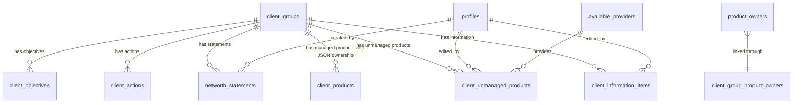

# Phase 2 Database Schema

## Database Architecture Overview

Phase 2 enhances Kingston's Portal with **supplementary tables** that work alongside the existing managed product infrastructure. This approach preserves all current functionality while adding comprehensive client data management capabilities.

### Enhancement Strategy

**Preservation First Approach**:
- All existing tables remain unchanged
- New tables integrate seamlessly with current schema
- Existing views and performance optimizations preserved
- Current IRR calculations and analytics infrastructure maintained

**Storage & Performance Impact**:
- **Database Size**: +15% (estimated 2GB for 130 clients × 30 items, 5% annual growth)
- **Query Performance**: <2s response time with GIN indexes on JSONB fields
- **Concurrent Users**: System designed for 4 concurrent users maximum
- **Backup Impact**: +10 minutes to nightly backup routine
- **Migration Time**: Up to 1 week downtime allowed for Phase 2 refactor deployment

**New Data Architecture**:
```
Existing Infrastructure (ENHANCED)
├── client_groups (enhanced with inception_date)
├── client_products (ENHANCED - adds ownership_details JSONB field)
├── product_owner_products (REMOVED - replaced by JSON ownership in client_products)
├── portfolios, portfolio_funds, portfolio_valuations (unchanged)
├── portfolio_irr_values, portfolio_fund_irr_values (unchanged)
└── All existing analytics views (updated for new ownership model)

New Phase 2 Infrastructure (ADDED)
├── client_information_items (flexible client data)
├── client_unmanaged_products (simple product tracking)
├── client_actions (task management)
├── client_objectives (goal tracking)
└── networth_statements (historical snapshots)
```

### Table Relationship Mapping



## New Table Specifications

### 1. client_information_items

**Purpose**: Flexible storage for all client information using JSON structure
**Integration**: Works alongside existing client data, no conflicts

```sql
CREATE TABLE client_information_items (
    id BIGINT GENERATED ALWAYS AS IDENTITY PRIMARY KEY,
    client_group_id BIGINT NOT NULL,
    item_type VARCHAR(50) NOT NULL CHECK (
        item_type IN (
            'basic_detail', 'income_expenditure', 'assets_liabilities', 
            'protection', 'vulnerability_health'
        )
    ),
    item_category VARCHAR(100) NOT NULL,  -- e.g., "Home Address", "Bank Account"
    data_content JSONB NOT NULL DEFAULT '{}',
    created_at TIMESTAMP WITH TIME ZONE DEFAULT NOW(),
    updated_at TIMESTAMP WITH TIME ZONE DEFAULT NOW(),
    last_edited_by BIGINT NOT NULL,
    
    -- Foreign Key Constraints
    CONSTRAINT fk_client_items_client_group 
        FOREIGN KEY (client_group_id) REFERENCES client_groups(id) ON DELETE CASCADE,
    CONSTRAINT fk_client_items_editor 
        FOREIGN KEY (last_edited_by) REFERENCES profiles(id) ON DELETE RESTRICT,
    
    -- Enhanced JSON Schema Validation
    CONSTRAINT valid_data_content CHECK (
        jsonb_typeof(data_content) = 'object' AND
        jsonb_array_length(jsonb_object_keys(data_content)) <= 50 AND  -- Max 50 fields per item
        pg_column_size(data_content) <= 65536  -- Max 64KB per JSON object
    ),
    
    -- Business Logic Constraints
    CONSTRAINT item_category_not_empty CHECK (LENGTH(TRIM(item_category)) > 0)
);

-- Performance Indexes
CREATE INDEX idx_client_items_client_group ON client_information_items(client_group_id);
CREATE INDEX idx_client_items_type ON client_information_items(item_type);
CREATE INDEX idx_client_items_category ON client_information_items(item_category);
CREATE INDEX idx_client_items_updated_at ON client_information_items(updated_at DESC);

-- GIN Index for JSON queries (supports all ? and @> operators)
CREATE INDEX idx_client_items_content_gin ON client_information_items 
USING GIN (data_content);

-- Specific JSON field indexes for common queries
CREATE INDEX idx_client_items_valuation ON client_information_items 
USING BTREE ((data_content->>'latest_valuation')::numeric) 
WHERE data_content ? 'latest_valuation';

-- Partial indexes for performance optimization
CREATE INDEX idx_client_items_recent ON client_information_items (client_group_id, updated_at DESC)
WHERE updated_at > (NOW() - INTERVAL '1 year');

-- Composite index for complex queries
CREATE INDEX idx_client_items_type_client ON client_information_items 
(client_group_id, item_type, item_category);
```

**JSON Structure Examples**:

```json
-- Basic Detail: Home Address
{
  "address_line_one": "1 New Street",
  "address_line_two": "Neverland", 
  "postcode": "N0TH 3R3",
  "country": "United Kingdom",
  "residence_type": "Primary",
  "date_from": "2020-01-01",
  "current_residence": true
}

-- Assets/Liabilities: Bank Account with Ownership
{
  "bank": "Barclays",
  "account_type": "Current Account",
  "latest_valuation": 2500.00,
  "valuation_date": "2024-08-26",
  "associated_product_owners": {
    "association_type": "tenants_in_common",
    "123": 60,
    "456": 40
  }
}

-- Income/Expenditure: Employment Income
{
  "income_type": "Employment",
  "employer": "Tech Solutions Ltd",
  "annual_gross": 45000.00,
  "annual_net": 35000.00,
  "frequency": "Monthly",
  "currency": "GBP"
}
```

### Standardized JSON Structure Requirements

**Design Philosophy**: Maintain consistent JSON structures across item types while allowing flexibility

**Common JSON Fields** (used across multiple item types):
```json
{
  // Standard valuation fields (for assets/liabilities)
  "latest_valuation": 25000.00,
  "valuation_date": "2024-08-26",
  "currency": "GBP",
  
  // Standard ownership fields (when applicable)
  "associated_product_owners": {
    "association_type": "tenants_in_common",
    "123": 33.33,
    "456": 33.33,
    "789": 33.34
  },
  
  // Standard contact fields (for addresses, employment)
  "address_line_one": "string",
  "address_line_two": "string",
  "postcode": "string",
  "country": "United Kingdom",
  
  // Configurable dropdown fields (advisor-maintainable)
  "gender": "Male",  // Options: Male, Female, Non-binary, Prefer not to say, [Custom: Pineapple]
  "marital_status": "Married",  // Options: Single, Married, Divorced, Widowed, [Custom additions]
  "employment_status": "Employed"  // Options: Employed, Self-employed, Retired, Unemployed, [Custom additions]
}
```

**Validation Rules**:
- **User Input Validation**: Frontend validates all data before saving to ensure clean JSON storage
- **Precision**: All percentages stored to 0.01% precision (33.33%)
- **Required Fields**: Each item type has mandatory fields defined in frontend validation
- **Dropdown Maintenance**: Advisors can add custom options to predetermined dropdown lists
- **Data Integrity**: No automatic ownership transfers - changes require explicit advisor action
```

### 2. Enhanced client_products Table

**Purpose**: Extend existing managed products table with ownership details using JSON
**Change Type**: SCHEMA ENHANCEMENT (adds new column, removes product_owner_products dependency)
**Migration Impact**: Requires data migration from product_owner_products to ownership_details JSONB

```sql
-- Add ownership details to existing client_products table
ALTER TABLE client_products 
ADD COLUMN ownership_details JSONB DEFAULT '{"association_type": "individual"}',
ADD CONSTRAINT valid_product_ownership_details CHECK (
    jsonb_typeof(ownership_details) = 'object' AND 
    ownership_details ? 'association_type' AND 
    ownership_details->>'association_type' IN ('individual', 'tenants_in_common', 'joint_ownership') AND
    -- Validate percentage totals for shared ownership (0.01% precision)
    CASE 
        WHEN ownership_details->>'association_type' IN ('tenants_in_common', 'joint_ownership') 
        THEN (
            SELECT SUM((value::numeric * 100)::integer / 100.0)  -- Round to 0.01% precision
            FROM jsonb_each_text(ownership_details) 
            WHERE key ~ '^[0-9]+$'
        ) BETWEEN 99.99 AND 100.01
        ELSE true
    END
);

-- Create index for JSON queries on managed products
CREATE INDEX idx_client_products_ownership_gin ON client_products 
USING GIN (ownership_details);

-- Migration script to transfer existing ownership data
-- This will be part of the Phase 2 deployment migration
INSERT INTO temp_ownership_migration 
SELECT 
    cp.id as product_id,
    jsonb_build_object(
        'association_type', 
        CASE 
            WHEN COUNT(pop.product_owner_id) = 1 THEN 'individual'
            ELSE 'tenants_in_common'  -- Default assumption for multiple owners
        END
    ) || 
    CASE 
        WHEN COUNT(pop.product_owner_id) > 1 THEN
            jsonb_object_agg(pop.product_owner_id::text, (100.0 / COUNT(pop.product_owner_id))::numeric(5,2))
        ELSE 
            jsonb_object_agg(pop.product_owner_id::text, 100.0)
    END as ownership_details
FROM client_products cp
JOIN product_owner_products pop ON cp.id = pop.product_id
GROUP BY cp.id;
```

### 3. client_unmanaged_products

**Purpose**: Track unmanaged financial products for KYC and networth purposes only
**Integration**: Complements existing managed products, excluded from analytics/dashboards
**Analytics Exclusion**: These products will NOT appear in any performance analytics or business dashboards

```sql
CREATE TABLE client_unmanaged_products (
    id BIGINT GENERATED ALWAYS AS IDENTITY PRIMARY KEY,
    client_group_id BIGINT NOT NULL,
    product_name VARCHAR(255) NOT NULL,
    product_type VARCHAR(50) NOT NULL CHECK (
        product_type IN (
            'GIAs', 'Stocks_and_Shares_ISAs', 'Cash_ISAs', 'Bank_Accounts', 
            'Pensions', 'Offshore_Bonds', 'Onshore_Bonds', 'Individual_Shares', 
            'Property', 'Others'
        )
    ),
    provider_id BIGINT,
    latest_valuation NUMERIC(15,2) CHECK (latest_valuation >= 0),
    valuation_date DATE NOT NULL DEFAULT CURRENT_DATE,
    ownership_details JSONB DEFAULT '{}',
    status VARCHAR(50) DEFAULT 'active' CHECK (
        status IN ('active', 'sold', 'transferred', 'matured', 'cancelled')
    ),
    notes TEXT,
    created_at TIMESTAMP WITH TIME ZONE DEFAULT NOW(),
    updated_at TIMESTAMP WITH TIME ZONE DEFAULT NOW(),
    last_edited_by BIGINT NOT NULL,
    
    -- Foreign Key Constraints
    CONSTRAINT fk_unmanaged_products_client_group 
        FOREIGN KEY (client_group_id) REFERENCES client_groups(id) ON DELETE CASCADE,
    CONSTRAINT fk_unmanaged_products_provider 
        FOREIGN KEY (provider_id) REFERENCES available_providers(id) ON DELETE SET NULL,
    CONSTRAINT fk_unmanaged_products_editor 
        FOREIGN KEY (last_edited_by) REFERENCES profiles(id) ON DELETE RESTRICT,
    
    -- Enhanced JSON Schema Validation with 0.01% precision
    CONSTRAINT valid_ownership_details CHECK (
        jsonb_typeof(ownership_details) = 'object' AND 
        pg_column_size(ownership_details) <= 8192 AND  -- Max 8KB per ownership object
        (
            ownership_details = '{}' OR
            (ownership_details ? 'association_type' AND 
             ownership_details->>'association_type' IN ('individual', 'tenants_in_common', 'joint_ownership') AND
             -- Validate percentage totals for shared ownership (0.01% precision)
             CASE 
                 WHEN ownership_details->>'association_type' IN ('tenants_in_common', 'joint_ownership') 
                 THEN (
                     SELECT SUM((value::numeric * 100)::integer / 100.0)  -- Round to 0.01% precision
                     FROM jsonb_each_text(ownership_details) 
                     WHERE key ~ '^[0-9]+$'
                 ) BETWEEN 99.99 AND 100.01
                 ELSE true
             END)
        )
    ),
    
    -- Business Logic Constraints
    CONSTRAINT valid_valuation_date CHECK (valuation_date <= CURRENT_DATE),
    CONSTRAINT product_name_not_empty CHECK (LENGTH(TRIM(product_name)) > 0)
);

-- Performance Indexes
CREATE INDEX idx_unmanaged_products_client_group ON client_unmanaged_products(client_group_id);
CREATE INDEX idx_unmanaged_products_provider ON client_unmanaged_products(provider_id);
CREATE INDEX idx_unmanaged_products_type ON client_unmanaged_products(product_type);
CREATE INDEX idx_unmanaged_products_status ON client_unmanaged_products(status);
CREATE INDEX idx_unmanaged_products_valuation_date ON client_unmanaged_products(valuation_date DESC);

-- GIN Index for ownership queries
CREATE INDEX idx_unmanaged_products_ownership_gin ON client_unmanaged_products 
USING GIN (ownership_details);
```

**Ownership Details JSON Examples**:

```json
-- Individual Ownership
{
  "association_type": "individual",
  "product_owner_id": 123
}

-- Tenants in Common
{
  "association_type": "tenants_in_common",
  "123": 70,
  "456": 30
}

-- Joint Ownership
{
  "association_type": "joint_ownership",
  "collective_percentage": 100,
  "joint_owners": [123, 456]
}
```

### 3. client_actions

**Purpose**: Task and action item management for client advisory process
**Integration**: New functionality, no conflicts with existing systems

```sql
CREATE TABLE client_actions (
    id BIGINT GENERATED ALWAYS AS IDENTITY PRIMARY KEY,
    client_group_id BIGINT NOT NULL,
    action_name VARCHAR(255) NOT NULL,
    description TEXT,
    owner VARCHAR(20) NOT NULL CHECK (owner IN ('advisor', 'client')),
    status VARCHAR(20) DEFAULT 'outstanding' CHECK (
        status IN ('outstanding', 'completed', 'cancelled')
    ),
    active BOOLEAN DEFAULT true,
    target_date DATE,
    completed_at TIMESTAMP WITH TIME ZONE,
    created_at TIMESTAMP WITH TIME ZONE DEFAULT NOW(),
    updated_at TIMESTAMP WITH TIME ZONE DEFAULT NOW(),
    created_by BIGINT NOT NULL,
    
    -- Foreign Key Constraints
    CONSTRAINT fk_client_actions_client_group 
        FOREIGN KEY (client_group_id) REFERENCES client_groups(id) ON DELETE CASCADE,
    CONSTRAINT fk_client_actions_creator 
        FOREIGN KEY (created_by) REFERENCES profiles(id) ON DELETE RESTRICT,
    
    -- Business Logic Constraints
    CONSTRAINT action_name_not_empty CHECK (LENGTH(TRIM(action_name)) > 0),
    CONSTRAINT completed_status_logic CHECK (
        (status = 'completed' AND completed_at IS NOT NULL) OR
        (status != 'completed' AND completed_at IS NULL)
    )
);

-- Performance Indexes
CREATE INDEX idx_client_actions_client_group ON client_actions(client_group_id);
CREATE INDEX idx_client_actions_status ON client_actions(status);
CREATE INDEX idx_client_actions_owner ON client_actions(owner);
CREATE INDEX idx_client_actions_active ON client_actions(active);
CREATE INDEX idx_client_actions_target_date ON client_actions(target_date);
```

### 4. client_objectives

**Purpose**: Goal tracking and objective management for clients
**Integration**: New functionality, enhances client advisory process

```sql
CREATE TABLE client_objectives (
    id BIGINT GENERATED ALWAYS AS IDENTITY PRIMARY KEY,
    client_group_id BIGINT NOT NULL,
    title VARCHAR(255) NOT NULL,
    description TEXT,
    target_date DATE,
    priority INTEGER CHECK (priority BETWEEN 1 AND 5),
    status VARCHAR(20) DEFAULT 'active' CHECK (
        status IN ('active', 'achieved', 'modified', 'cancelled')
    ),
    progress_percentage INTEGER DEFAULT 0 CHECK (progress_percentage BETWEEN 0 AND 100),
    created_at TIMESTAMP WITH TIME ZONE DEFAULT NOW(),
    updated_at TIMESTAMP WITH TIME ZONE DEFAULT NOW(),
    created_by BIGINT NOT NULL,
    
    -- Foreign Key Constraints
    CONSTRAINT fk_client_objectives_client_group 
        FOREIGN KEY (client_group_id) REFERENCES client_groups(id) ON DELETE CASCADE,
    CONSTRAINT fk_client_objectives_creator 
        FOREIGN KEY (created_by) REFERENCES profiles(id) ON DELETE RESTRICT,
    
    -- Business Logic Constraints
    CONSTRAINT title_not_empty CHECK (LENGTH(TRIM(title)) > 0)
);

-- Performance Indexes
CREATE INDEX idx_client_objectives_client_group ON client_objectives(client_group_id);
CREATE INDEX idx_client_objectives_status ON client_objectives(status);
CREATE INDEX idx_client_objectives_priority ON client_objectives(priority);
CREATE INDEX idx_client_objectives_target_date ON client_objectives(target_date);
```

### 5. networth_statements

**Purpose**: Historical snapshots for compliance and audit trails
**Integration**: References all product types for comprehensive statements

```sql
CREATE TABLE networth_statements (
    id BIGINT GENERATED ALWAYS AS IDENTITY PRIMARY KEY,
    client_group_id BIGINT NOT NULL,
    statement_name VARCHAR(255),
    created_by BIGINT NOT NULL,
    created_at TIMESTAMP WITH TIME ZONE DEFAULT NOW(),
    snapshot_data JSONB NOT NULL,
    total_assets NUMERIC(15,2) DEFAULT 0,
    total_liabilities NUMERIC(15,2) DEFAULT 0,
    net_worth NUMERIC(15,2) GENERATED ALWAYS AS (total_assets - total_liabilities) STORED,
    
    -- Foreign Key Constraints
    CONSTRAINT fk_networth_statements_client_group 
        FOREIGN KEY (client_group_id) REFERENCES client_groups(id) ON DELETE CASCADE,
    CONSTRAINT fk_networth_statements_creator 
        FOREIGN KEY (created_by) REFERENCES profiles(id) ON DELETE RESTRICT,
    
    -- JSON Schema Validation
    CONSTRAINT valid_snapshot_data CHECK (
        jsonb_typeof(snapshot_data) = 'object' AND 
        snapshot_data ? 'snapshot_timestamp' AND
        snapshot_data ? 'managed_products' AND
        snapshot_data ? 'unmanaged_products' AND
        snapshot_data ? 'information_items'
    ),
    
    -- Business Logic Constraints
    CONSTRAINT valid_totals CHECK (
        total_assets >= 0 AND total_liabilities >= 0
    )
);

-- Performance Indexes
CREATE INDEX idx_networth_statements_client_group ON networth_statements(client_group_id);
CREATE INDEX idx_networth_statements_created_at ON networth_statements(created_at DESC);
CREATE INDEX idx_networth_statements_net_worth ON networth_statements(net_worth DESC);

-- GIN Index for snapshot data queries
CREATE INDEX idx_networth_statements_snapshot_gin ON networth_statements 
USING GIN (snapshot_data);
```

**Snapshot Data JSON Structure**:

```json
{
  "snapshot_timestamp": "2024-08-26T14:30:00Z",
  "managed_products": [
    {
      "id": 123,
      "product_name": "Zurich GIA",
      "product_type": "GIAs", 
      "current_valuation": 25000.00,
      "ownership": {"123": 100}
    }
  ],
  "unmanaged_products": [
    {
      "id": 456,
      "product_name": "Halifax ISA",
      "product_type": "Cash_ISAs",
      "current_valuation": 15000.00,
      "ownership": {"123": 50, "456": 50}
    }
  ],
  "information_items": [
    {
      "id": 789,
      "item_category": "Property",
      "current_valuation": 300000.00,
      "ownership": {"joint": 100}
    }
  ],
  "product_owners": [
    {"id": 123, "name": "John Smith"},
    {"id": 456, "name": "Jane Smith"}
  ],
  "section_totals": {
    "GIAs": 25000.00,
    "Cash_ISAs": 15000.00,
    "Property": 300000.00
  },
  "calculation_metadata": {
    "total_assets": 340000.00,
    "total_liabilities": 0.00,
    "net_worth": 340000.00,
    "advisor_id": 789,
    "advisor_name": "Financial Advisor"
  }
}
```

## Table Modifications

### Existing Table Enhancements

**product_owners Table Enhancement**:
```sql
-- Add inception date for product owner ordering
ALTER TABLE product_owners 
ADD COLUMN inception_date TIMESTAMP WITH TIME ZONE DEFAULT NOW();

-- Update existing records with created_at value
UPDATE product_owners 
SET inception_date = created_at 
WHERE inception_date IS NULL;

-- Add index for performance
CREATE INDEX idx_product_owners_inception_date 
ON product_owners(inception_date);
```

**client_groups Table Enhancement** (Optional):
```sql
-- Add metadata for enhanced client management
ALTER TABLE client_groups 
ADD COLUMN client_type VARCHAR(50) DEFAULT 'individual' CHECK (
    client_type IN ('individual', 'couple', 'family', 'trust', 'corporate')
);

-- Add index for filtering
CREATE INDEX idx_client_groups_type ON client_groups(client_type);
```

## JSON Schema Patterns

### Ownership Structure Standards

**Standard Ownership JSON Schema**:
```typescript
interface OwnershipDetails {
    association_type: 'individual' | 'tenants_in_common' | 'joint_ownership';
    
    // For individual ownership
    product_owner_id?: number;
    
    // For tenants in common (key = product_owner_id, value = percentage)
    [product_owner_id: string]: number | string;
    
    // For joint ownership
    collective_percentage?: number;
    joint_owners?: number[];
}
```

### Item Type Specifications

**Basic Detail Items**:
- Personal information (names, DOB, addresses)
- Employment details
- Contact information
- Identification documents

**Income/Expenditure Items**:
- Employment income
- Self-employment income  
- Investment income
- Rental income
- Living expenses
- Insurance premiums

**Assets/Liabilities Items**:
- Property valuations
- Bank account balances
- Investment account values
- Loan balances
- Mortgage details

**Protection Items**:
- Life insurance policies
- Income protection policies
- General insurance
- Professional indemnity

**Vulnerability/Health Items**:
- Health conditions
- Vulnerable client indicators
- Special circumstances
- Care requirements

### Validation Rules

**JSON Validation Functions**:
```sql
-- Function to validate ownership percentages
CREATE OR REPLACE FUNCTION validate_ownership_percentages(ownership_data JSONB)
RETURNS BOOLEAN AS $$
DECLARE
    total_percentage NUMERIC := 0;
    key TEXT;
    value NUMERIC;
BEGIN
    -- Skip validation for non-ownership JSON
    IF NOT (ownership_data ? 'association_type') THEN
        RETURN TRUE;
    END IF;
    
    -- Validate tenants in common percentages
    IF ownership_data->>'association_type' = 'tenants_in_common' THEN
        FOR key IN SELECT jsonb_object_keys(ownership_data)
        LOOP
            -- Skip non-numeric keys
            IF key ~ '^[0-9]+$' THEN
                value := (ownership_data->key)::NUMERIC;
                IF value < 0 OR value > 100 THEN
                    RETURN FALSE;
                END IF;
                total_percentage := total_percentage + value;
            END IF;
        END LOOP;
        
        -- Allow total to be less than 100% for third-party ownership
        RETURN total_percentage <= 100;
    END IF;
    
    RETURN TRUE;
END;
$$ LANGUAGE plpgsql;

-- Add check constraint using validation function
ALTER TABLE client_unmanaged_products 
ADD CONSTRAINT valid_ownership_percentages 
CHECK (validate_ownership_percentages(ownership_details));

ALTER TABLE client_information_items 
ADD CONSTRAINT valid_item_ownership_percentages 
CHECK (validate_ownership_percentages(data_content->'associated_product_owners'));
```

## Performance Optimization

### Materialized Views

**Enhanced Client Summary View**:
```sql
CREATE MATERIALIZED VIEW client_complete_summary AS
SELECT 
    cg.id AS client_group_id,
    cg.name AS client_name,
    cg.type AS client_type,
    cg.status,
    
    -- Managed products summary
    COUNT(DISTINCT cp.id) AS managed_product_count,
    COALESCE(SUM(pv.valuation), 0) AS total_managed_value,
    
    -- Unmanaged products summary
    COUNT(DISTINCT cup.id) AS unmanaged_product_count,
    COALESCE(SUM(cup.latest_valuation), 0) AS total_unmanaged_value,
    
    -- Information items summary
    COUNT(DISTINCT cii.id) AS information_item_count,
    
    -- Combined totals
    COALESCE(SUM(pv.valuation), 0) + COALESCE(SUM(cup.latest_valuation), 0) AS total_client_value,
    
    -- Recent activity
    GREATEST(
        COALESCE(MAX(cp.updated_at), '1900-01-01'::timestamp),
        COALESCE(MAX(cup.updated_at), '1900-01-01'::timestamp),
        COALESCE(MAX(cii.updated_at), '1900-01-01'::timestamp)
    ) AS last_updated

FROM client_groups cg
LEFT JOIN client_products cp ON cg.id = cp.client_id AND cp.status = 'active'
LEFT JOIN portfolio_valuations pv ON cp.portfolio_id = pv.portfolio_id
LEFT JOIN client_unmanaged_products cup ON cg.id = cup.client_group_id AND cup.status = 'active'
LEFT JOIN client_information_items cii ON cg.id = cii.client_group_id

WHERE cg.status = 'active'
GROUP BY cg.id, cg.name, cg.type, cg.status;

-- Create unique index for performance
CREATE UNIQUE INDEX idx_client_complete_summary_id 
ON client_complete_summary(client_group_id);

-- Refresh schedule (run nightly)
CREATE OR REPLACE FUNCTION refresh_client_complete_summary()
RETURNS VOID AS $$
BEGIN
    REFRESH MATERIALIZED VIEW CONCURRENTLY client_complete_summary;
END;
$$ LANGUAGE plpgsql;
```

### Query Optimization Strategy

**Optimized Queries for Common Operations**:

```sql
-- Fast client information item lookup with filtering
EXPLAIN (ANALYZE, BUFFERS) 
SELECT * FROM client_information_items 
WHERE client_group_id = $1 
  AND item_type = $2 
  AND data_content ? $3
ORDER BY updated_at DESC;

-- Fast unmanaged product summary by type
EXPLAIN (ANALYZE, BUFFERS)
SELECT product_type, COUNT(*), SUM(latest_valuation) 
FROM client_unmanaged_products 
WHERE client_group_id = $1 AND status = 'active'
GROUP BY product_type;

-- Fast networth statement retrieval
EXPLAIN (ANALYZE, BUFFERS)
SELECT id, created_at, total_assets, total_liabilities, net_worth
FROM networth_statements 
WHERE client_group_id = $1 
ORDER BY created_at DESC 
LIMIT 10;
```

### Indexing Strategy

**Performance Indexes Priority**:
1. **High Priority**: client_group_id indexes on all tables
2. **High Priority**: JSON GIN indexes for ownership and content queries
3. **Medium Priority**: Status and type filtering indexes
4. **Medium Priority**: Date range indexes for temporal queries
5. **Low Priority**: Full-text search indexes for notes and descriptions

**Index Monitoring**:
```sql
-- Monitor index usage
SELECT schemaname, tablename, indexname, idx_scan, idx_tup_read, idx_tup_fetch
FROM pg_stat_user_indexes 
WHERE schemaname = 'public' 
  AND tablename LIKE 'client_%'
ORDER BY idx_scan DESC;

-- Identify unused indexes
SELECT schemaname, tablename, indexname, idx_scan
FROM pg_stat_user_indexes 
WHERE idx_scan = 0 
  AND schemaname = 'public' 
  AND tablename LIKE 'client_%';
```

## Migration Strategy

### Data Preservation Plan

**Zero-Risk Migration Approach**:
1. **Phase 1**: Create all new tables with constraints and indexes
2. **Phase 2**: Add optional enhancements to existing tables
3. **Phase 3**: Create materialized views for performance
4. **Phase 4**: Populate initial data where applicable
5. **Phase 5**: Enable new application features

**Migration Validation**:
```sql
-- Verify all new tables created successfully
SELECT table_name, table_rows 
FROM information_schema.tables 
WHERE table_schema = 'public' 
  AND table_name LIKE 'client_%'
  AND table_name NOT IN (SELECT table_name FROM information_schema.tables WHERE table_schema = 'backup');

-- Verify all indexes created
SELECT tablename, indexname, indexdef 
FROM pg_indexes 
WHERE schemaname = 'public' 
  AND tablename LIKE 'client_%'
ORDER BY tablename, indexname;

-- Verify all constraints active
SELECT conname, contype, confrelid::regclass, conkey 
FROM pg_constraint 
WHERE conrelid IN (
    SELECT oid FROM pg_class 
    WHERE relname LIKE 'client_%' AND relnamespace = (
        SELECT oid FROM pg_namespace WHERE nspname = 'public'
    )
);
```

### Rollback Procedures

**Rollback Strategy**:
```sql
-- Phase 1: Drop new tables (preserves all existing data)
DROP TABLE IF EXISTS networth_statements CASCADE;
DROP TABLE IF EXISTS client_objectives CASCADE; 
DROP TABLE IF EXISTS client_actions CASCADE;
DROP TABLE IF EXISTS client_unmanaged_products CASCADE;
DROP TABLE IF EXISTS client_information_items CASCADE;

-- Phase 2: Remove enhancements to existing tables
ALTER TABLE product_owners DROP COLUMN IF EXISTS inception_date;
ALTER TABLE client_groups DROP COLUMN IF EXISTS client_type;

-- Phase 3: Drop materialized views
DROP MATERIALIZED VIEW IF EXISTS client_complete_summary;

-- Phase 4: Drop custom functions
DROP FUNCTION IF EXISTS validate_ownership_percentages(JSONB);
DROP FUNCTION IF EXISTS refresh_client_complete_summary();
```

### Testing Approach

**Comprehensive Testing Strategy**:
1. **Schema Validation**: Verify all tables, indexes, and constraints
2. **Data Integrity**: Test all foreign key relationships and constraints
3. **Performance Testing**: Validate query performance with sample data
4. **JSON Validation**: Test all JSON schema constraints and functions
5. **Integration Testing**: Verify compatibility with existing system queries
6. **Rollback Testing**: Validate complete rollback procedures
7. **Migration Validation**: Full ownership data migration testing
8. **Concurrent User Testing**: 4-user simultaneous access testing

### Post-Migration Monitoring Framework

**Index Performance Monitoring**:
```sql
-- Monitor index usage and performance
CREATE OR REPLACE VIEW index_usage_monitoring AS
SELECT 
    schemaname,
    tablename,
    indexname,
    idx_tup_read,
    idx_tup_fetch,
    idx_scan,
    ROUND((idx_tup_fetch::numeric / NULLIF(idx_tup_read, 0)) * 100, 2) as efficiency_percent
FROM pg_stat_user_indexes 
WHERE tablename IN ('client_products', 'client_information_items', 'client_unmanaged_products')
ORDER BY idx_scan DESC;

-- Weekly maintenance script
CREATE OR REPLACE FUNCTION weekly_index_maintenance()
RETURNS void AS $$
BEGIN
    -- Rebuild GIN indexes on JSON columns
    REINDEX INDEX CONCURRENTLY idx_client_items_content_gin;
    REINDEX INDEX CONCURRENTLY idx_unmanaged_products_ownership_gin;
    REINDEX INDEX CONCURRENTLY idx_client_products_ownership_gin;
    
    -- Update table statistics
    ANALYZE client_products;
    ANALYZE client_information_items;
    ANALYZE client_unmanaged_products;
    
    -- Log maintenance completion
    INSERT INTO maintenance_log (operation, completed_at, notes)
    VALUES ('weekly_index_maintenance', NOW(), 'GIN indexes rebuilt and statistics updated');
END;
$$ LANGUAGE plpgsql;
```

**Backup Validation Enhancement**:
```sql
-- Enhanced backup validation for JSON data integrity
CREATE OR REPLACE FUNCTION validate_backup_json_integrity()
RETURNS TABLE(table_name TEXT, invalid_json_count BIGINT, issues TEXT) AS $$
BEGIN
    RETURN QUERY
    SELECT 
        'client_information_items'::TEXT,
        COUNT(*) as invalid_count,
        'Invalid JSON in data_content field' as issues
    FROM client_information_items 
    WHERE NOT (data_content IS NOT NULL AND jsonb_typeof(data_content) = 'object')
    
    UNION ALL
    
    SELECT 
        'client_unmanaged_products'::TEXT,
        COUNT(*) as invalid_count,
        'Invalid JSON in ownership_details field' as issues
    FROM client_unmanaged_products 
    WHERE NOT (ownership_details IS NOT NULL AND jsonb_typeof(ownership_details) = 'object')
    
    UNION ALL
    
    SELECT 
        'client_products'::TEXT,
        COUNT(*) as invalid_count,
        'Invalid JSON in ownership_details field' as issues
    FROM client_products 
    WHERE NOT (ownership_details IS NOT NULL AND jsonb_typeof(ownership_details) = 'object');
END;
$$ LANGUAGE plpgsql;

-- Run after each backup to ensure data integrity
-- Should be integrated into backup scripts
SELECT * FROM validate_backup_json_integrity() WHERE invalid_json_count > 0;
```

---

*This database schema documentation provides the complete foundation for Phase 2 implementation. For SQL implementation scripts, see `/docs/09_database/02_phase2_database_implementation.md`.*