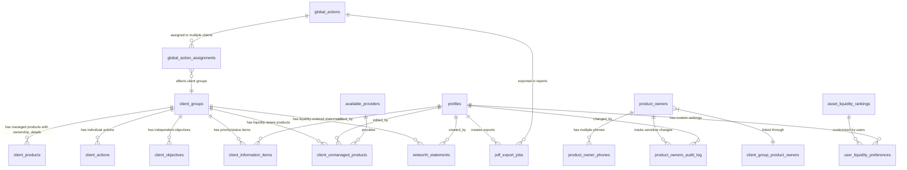

# Phase 2 Database Schema - Complete Refactor

## Executive Summary

Phase 2 transforms Kingston's Portal into a **professional wealth management interface** with information-dense displays, enhanced client data management, and comprehensive audit capabilities. This complete database refactor integrates client demo feedback requiring:

- **3-Section Product Owner Layout** with flexible phone management
- **Complete Objectives/Actions Separation** with global action capabilities
- **Asset Liquidity Rankings** with user customization
- **Enhanced Security & Compliance** with field-level encryption
- **Professional Interface Support** optimized for information density

## Database Architecture Philosophy

### Information Density Priority

**Professional Interface Requirements** (from demo feedback):
- Database optimized for **dense data display** over simplicity
- **Complete separation** of objectives and actions at schema level
- **Enhanced audit logging** for sensitive field changes
- **Flexible phone management** supporting multiple international formats
- **Liquidity-based asset ordering** with user customization
- **Global actions architecture** supporting cross-client workflows

### Storage & Performance Framework

**Enhanced Performance Targets**:
- **Database Size**: +20% (estimated 2.4GB for 130 clients with enhanced data)
- **Query Performance**: <500ms for dense table rendering
- **Virtual Scrolling Support**: Optimized for 1000+ row datasets
- **Concurrent Users**: Enhanced for 4 users with real-time data sync
- **Backup Impact**: +15 minutes with encrypted sensitive fields
- **Migration Window**: Up to 7 days for comprehensive schema refactor

**Enhanced Data Architecture** (Post Demo Feedback):
```
Existing Infrastructure (SIGNIFICANTLY ENHANCED)
├── client_groups (enhanced with client_type, inception_date)
├── client_products (ENHANCED - ownership_details JSONB, liquidity support)
├── product_owners (MAJOR ENHANCEMENT - 3-section layout fields)
├── product_owner_phones (NEW - flexible multi-type phone system)
├── product_owners_audit_log (NEW - sensitive field change tracking)
├── portfolios, portfolio_funds, portfolio_valuations (unchanged)
├── portfolio_irr_values, portfolio_fund_irr_values (unchanged)
└── All existing analytics views (updated for liquidity ordering)

New Phase 2 Infrastructure (COMPREHENSIVE ADDITION)
├── client_information_items (enhanced with priority/status)
├── client_unmanaged_products (liquidity-aware product tracking)
├── client_actions (SEPARATED - no objective dependencies)
├── client_objectives (SEPARATED - independent goal tracking)
├── global_actions (NEW - cross-client action management)
├── global_action_assignments (NEW - client group mappings)
├── asset_liquidity_rankings (NEW - user-customizable liquidity system)
├── user_liquidity_preferences (NEW - personalized asset ordering)
├── networth_statements (enhanced with liquidity ordering)
└── pdf_export_jobs (NEW - background PDF generation tracking)
```

### Enhanced Table Relationship Mapping



## Table Specifications - Complete Refactor

### 1. Product Owners Table (3-Section Layout Enhancement)

**Purpose**: Enhanced product owner management with 3-section card layout supporting professional interface requirements
**Demo Feedback Integration**: Mobile/house/work phone fields, security words, notes encryption, compliance tracking

```sql
-- Enhanced product_owners table with 3-section layout support
ALTER TABLE product_owners 
ADD COLUMN IF NOT EXISTS security_words TEXT, -- ENCRYPTED FIELD
ADD COLUMN IF NOT EXISTS notes TEXT, -- ENCRYPTED FIELD 
ADD COLUMN IF NOT EXISTS next_meeting_date TIMESTAMP WITH TIME ZONE,
ADD COLUMN IF NOT EXISTS date_signed_tc DATE,
ADD COLUMN IF NOT EXISTS last_fee_agreement_date DATE,
ADD COLUMN IF NOT EXISTS inception_date TIMESTAMP WITH TIME ZONE DEFAULT NOW(),
ADD COLUMN IF NOT EXISTS updated_at TIMESTAMP WITH TIME ZONE DEFAULT NOW(),
ADD COLUMN IF NOT EXISTS updated_by VARCHAR(100);

-- Add constraints for compliance fields
ALTER TABLE product_owners 
ADD CONSTRAINT chk_meeting_date_future 
    CHECK (next_meeting_date IS NULL OR next_meeting_date > NOW()),
ADD CONSTRAINT chk_tc_date_valid 
    CHECK (date_signed_tc IS NULL OR date_signed_tc <= CURRENT_DATE),
ADD CONSTRAINT chk_fee_agreement_valid 
    CHECK (last_fee_agreement_date IS NULL OR last_fee_agreement_date <= CURRENT_DATE);

-- Performance indexes for 3-section layout queries
CREATE INDEX idx_product_owners_inception_date ON product_owners(inception_date);
CREATE INDEX idx_product_owners_next_meeting ON product_owners(next_meeting_date) 
WHERE next_meeting_date IS NOT NULL;
CREATE INDEX idx_product_owners_updated_at ON product_owners(updated_at DESC);
```

**3-Section Layout Field Organization**:
```typescript
interface ProductOwner3SectionLayout {
  // Section 1: Personal Details (Left Column)
  personalDetails: {
    first_name: string;
    last_name: string;
    date_of_birth: Date;
    gender: string;
    marital_status: string;
    nationality: string;
    inception_date: Date;
  };
  
  // Section 2: Contact Information (Right Column)
  contactInfo: {
    email: string;
    address_line_1: string;
    address_line_2?: string;
    postcode: string;
    phones: PhoneNumber[]; // Flexible multi-type system
  };
  
  // Section 3: Additional Information (Full Width Bottom)
  additionalInfo: {
    security_words: string; // ENCRYPTED
    notes: string; // ENCRYPTED
    next_meeting_date?: Date;
    date_signed_tc?: Date;
    last_fee_agreement_date?: Date;
    updated_at: Date;
    updated_by: string;
  };
}
```

### 2. Phone Numbers System (Flexible Multi-Type Structure)

**Purpose**: Flexible international phone number management supporting mobile, house, work, and custom types
**Demo Feedback Integration**: Enhanced phone management with international format support and primary phone designation

```sql
-- Flexible phone numbers table supporting international formats
CREATE TABLE product_owner_phones (
    id BIGINT GENERATED ALWAYS AS IDENTITY PRIMARY KEY,
    product_owner_id BIGINT NOT NULL,
    phone_type VARCHAR(20) NOT NULL CHECK (
        phone_type IN ('mobile', 'house_phone', 'work', 'other')
    ),
    phone_number VARCHAR(25) NOT NULL, -- International format support
    label VARCHAR(50), -- Required for 'other' type
    is_primary BOOLEAN DEFAULT false,
    created_at TIMESTAMP WITH TIME ZONE DEFAULT NOW(),
    updated_at TIMESTAMP WITH TIME ZONE DEFAULT NOW(),
    updated_by VARCHAR(100),
    
    -- Foreign Key Constraints
    CONSTRAINT fk_phone_product_owner 
        FOREIGN KEY (product_owner_id) REFERENCES product_owners(id) ON DELETE CASCADE,
    
    -- Business Logic Constraints
    CONSTRAINT chk_phone_format CHECK (
        phone_number ~ '^[+]?[0-9\s\-\(\)\.]{7,25}$' -- International variety
    ),
    CONSTRAINT chk_other_requires_label CHECK (
        phone_type != 'other' OR (phone_type = 'other' AND label IS NOT NULL)
    ),
    CONSTRAINT phone_number_not_empty CHECK (LENGTH(TRIM(phone_number)) >= 7)
);

-- Unique constraint: Only one primary phone per product owner
CREATE UNIQUE INDEX idx_product_owner_phones_primary 
    ON product_owner_phones(product_owner_id) 
    WHERE is_primary = true;

-- Performance indexes
CREATE INDEX idx_product_owner_phones_owner_id ON product_owner_phones(product_owner_id);
CREATE INDEX idx_product_owner_phones_type ON product_owner_phones(phone_type);
CREATE INDEX idx_product_owner_phones_updated_at ON product_owner_phones(updated_at DESC);
```

**Phone Number Business Rules**:
```typescript
interface PhoneManagementRules {
  validation: {
    internationalFormat: '^[+]?[0-9\s\-\(\)\.]{7,25}$';
    supportedFormats: [
      '+44 20 1234 5678', // UK with country code
      '020 1234 5678',    // UK without country code
      '07123 456789',     // UK mobile
      '+1 (555) 123-4567' // US format
    ];
  };
  constraints: {
    maxPhonesPerOwner: 10; // Practical limit
    onePrimaryOnly: true;
    otherTypeRequiresLabel: true;
  };
  businessLogic: {
    primaryPhoneDisplay: 'Always shown first in contact info';
    phoneTypeOrdering: ['primary', 'mobile', 'house_phone', 'work', 'other'];
    internationalSupport: 'Format validation flexible for global clients';
  };
}
```

### 3. Security Fields (Encrypted Storage for Sensitive Data)

**Purpose**: Comprehensive audit logging and encryption for sensitive client information
**Demo Feedback Integration**: Security words and notes encryption, audit trail for compliance

```sql
-- Audit logging table for sensitive field changes
CREATE TABLE product_owners_audit_log (
    id BIGINT GENERATED ALWAYS AS IDENTITY PRIMARY KEY,
    product_owner_id BIGINT NOT NULL,
    field_changed VARCHAR(50) NOT NULL,
    old_value_hash TEXT, -- Hash for sensitive fields (not actual values)
    new_value_hash TEXT,
    change_type VARCHAR(20) NOT NULL CHECK (
        change_type IN ('create', 'update', 'delete', 'view_sensitive')
    ),
    changed_by VARCHAR(100) NOT NULL,
    changed_at TIMESTAMP WITH TIME ZONE DEFAULT NOW(),
    ip_address INET,
    user_agent TEXT,
    business_justification TEXT, -- Required for sensitive field access
    
    -- Foreign Key Constraints
    CONSTRAINT fk_audit_product_owner 
        FOREIGN KEY (product_owner_id) REFERENCES product_owners(id) ON DELETE CASCADE,
    
    -- Business Logic Constraints
    CONSTRAINT chk_sensitive_justification CHECK (
        field_changed NOT IN ('security_words', 'notes') OR 
        business_justification IS NOT NULL
    )
);

-- Performance indexes for audit queries
CREATE INDEX idx_audit_product_owner_id ON product_owners_audit_log(product_owner_id);
CREATE INDEX idx_audit_changed_at ON product_owners_audit_log(changed_at DESC);
CREATE INDEX idx_audit_changed_by ON product_owners_audit_log(changed_by);
CREATE INDEX idx_audit_field_changed ON product_owners_audit_log(field_changed);

-- Index for compliance reporting
CREATE INDEX idx_audit_sensitive_access ON product_owners_audit_log(changed_at, field_changed) 
WHERE field_changed IN ('security_words', 'notes');
```

**Encryption Implementation Strategy**:
```typescript
interface EncryptionStrategy {
  sensitiveFields: {
    security_words: {
      encryption: 'AES-256-GCM';
      keyManagement: 'Application-level key rotation';
      auditRequirement: 'Log all access with justification';
    };
    notes: {
      encryption: 'AES-256-GCM';
      keyManagement: 'Application-level key rotation';
      auditRequirement: 'Log all modifications';
    };
  };
  implementation: {
    encryptionLibrary: '@node-rs/bcrypt for hashing, crypto for AES';
    keyStorage: 'Environment variables with rotation capability';
    decryptionLogging: 'Every decryption logged with user context';
  };
  compliance: {
    dataRetention: '7 years for audit logs';
    accessControl: 'Role-based with justification requirements';
    keyRotation: 'Annual with backward compatibility';
  };
}
```

### Product Owner Definition vs. Client Information Items

**CRITICAL DISTINCTION:**

**Product Owners** are defined by the `product_owners` table and include:
- **Basic Personal Details fields**: Title, Forename, Middle Names, Surname, Known As, Date of Birth, Previous Name(s), Last Modified
- **Contact fields**: Email address, phone numbers (via `product_owner_phones` table), home address
- **Compliance fields**: Meeting dates, T&C signing dates, security words
- **Purpose**: Define the individuals who can own/be associated with client information items

**Client Information Items** reference product owners but do NOT include Basic Personal Details as an item type:
- Items in `client_information_items` table have either:
  - **Simple reference**: `product_owners` array field (for basic_detail, income_expenditure, vulnerability_health)
  - **Complex ownership**: `associated_product_owners` structure with percentages (for assets_liabilities, protection)
- **Basic Personal Details is NOT in the `item_type` CHECK constraint**
- Product owners must be created first, then referenced in information items

**Example Flow**:
1. Create Product Owner → John Smith (product_owners table with title, forename, surname, DOB, etc.)
2. Create Information Item → Home Address (client_information_items with `product_owners: [john_smith_id]`)
3. Create Information Item → Cash Account (client_information_items with `associated_product_owners: {john_smith_id: 100%}`)

### 4. client_information_items (Enhanced with Priority/Status)

**Purpose**: Flexible storage for all client information using JSON structure (references product owners, does NOT define them)
**Integration**: Works alongside existing client data, no conflicts

```sql
-- Enhanced client_information_items with 70+ item types for comprehensive client data management
CREATE TABLE client_information_items (
    id BIGINT GENERATED ALWAYS AS IDENTITY PRIMARY KEY,
    client_group_id BIGINT NOT NULL,
    item_type VARCHAR(100) NOT NULL CHECK (
        item_type IN (
            -- Basic Detail Items
            -- NOTE: 'Basic Personal Details' is NOT an item type - it defines Product Owners in the product_owners table
            'Address', 'Email Address', 'Phone Number',
            'Special Relationships', 'Client Management', 'Meeting Schedule',
            'Client Declaration', 'Privacy Declaration', '3 Words & Share With',
            'Ongoing Fee Agreement', 'AML Check',
            
            -- Income & Expenditure Items
            'Basic Salary', 'Bonuses/Commissions', 'Benefits in Kind', 'State Pension',
            'Drawdown Income', 'UFPLS', 'Annuities', 'State Benefit - Taxable',
            'State Benefit - Non-Taxable', 'Rental Profit', 'Interest', 'Dividends',
            'Trust Distribution', 'Directors Salary', 'Directors Dividend',
            'Rent', 'Council Tax', 'Utility Bills', 'Insurance Costs', 'Transport Costs',
            'Household Expenditure', 'Debt Service Costs', 'Leisure & Entertainment',
            'Holidays', 'Clothing', 'Personal Care', 'Children Expenses',
            'Regular Charitable Giving', 'Care Home Fees',
            
            -- Assets & Liabilities Items  
            'Cash Accounts', 'Premium Bonds', 'Cash ISA', 'Stocks and Shares ISA',
            'General Investment Account', 'Onshore Investment Bond', 'Offshore Investment Bond',
            'Individual Shares', 'Personal Pensions (Unmanaged)', 'Workplace Pensions (Unmanaged)',
            'Property', 'Business Assets', 'Collectibles', 'Artwork', 'Cars', 'Jewelry',
            'Other Physical Assets', 'Mortgage', 'Personal Loans', 'Credit Cards',
            'Overdrafts', 'Business Debts', 'Student Loans', 'Car Finance',
            
            -- Protection Items
            'Protection Policy',
            
            -- Vulnerability & Health Items
            'Risk Questionnaire - Family', 'Risk Questionnaire - Business', 'Risk Questionnaire - Trust',
            'Manual Risk Assessment - Family', 'Manual Risk Assessment - Business', 'Manual Risk Assessment - Trust',
            'Health Issues'
        )
    ),
    category VARCHAR(50) NOT NULL CHECK (
        category IN ('basic_detail', 'income_expenditure', 'assets_liabilities', 'protection', 'vulnerability_health')
    ), -- Big 5 categories
    name VARCHAR(255), -- Instance name to distinguish multiple items of same item_type
    priority VARCHAR(20) DEFAULT 'standard' CHECK (
        priority IN ('low', 'standard', 'high', 'critical')
    ),
    status VARCHAR(50) DEFAULT 'current' CHECK (
        status IN ('current', 'outdated', 'pending_review', 'verified', 'archived')
    ),
    data_content JSONB NOT NULL DEFAULT '{}', -- JSON storage for item-specific fields
    created_at TIMESTAMP WITH TIME ZONE DEFAULT NOW(),
    updated_at TIMESTAMP WITH TIME ZONE DEFAULT NOW(),
    last_edited_by BIGINT NOT NULL,
    
    -- Foreign Key Constraints
    CONSTRAINT fk_client_items_client_group 
        FOREIGN KEY (client_group_id) REFERENCES client_groups(id) ON DELETE CASCADE,
    CONSTRAINT fk_client_items_editor 
        FOREIGN KEY (last_edited_by) REFERENCES profiles(id) ON DELETE RESTRICT,
    
    -- Enhanced JSON Schema Validation
    CONSTRAINT valid_data_content CHECK (
        jsonb_typeof(data_content) = 'object' AND
        jsonb_array_length(jsonb_object_keys(data_content)) <= 50 AND  -- Max 50 fields per item
        pg_column_size(data_content) <= 65536  -- Max 64KB per JSON object
    ),
    
    -- Business Logic Constraints
    CONSTRAINT item_category_not_empty CHECK (LENGTH(TRIM(item_category)) > 0)
);

-- Performance Indexes (Enhanced for Dense UI)
CREATE INDEX idx_client_items_client_group ON client_information_items(client_group_id);
CREATE INDEX idx_client_items_type ON client_information_items(item_type);
CREATE INDEX idx_client_items_category ON client_information_items(category);
CREATE INDEX idx_client_items_priority ON client_information_items(priority);
CREATE INDEX idx_client_items_status ON client_information_items(status);
CREATE INDEX idx_client_items_updated_at ON client_information_items(updated_at DESC);

-- Composite indexes for dense table filtering and sorting
CREATE INDEX idx_client_items_priority_status ON client_information_items(priority, status);
CREATE INDEX idx_client_items_client_type_priority ON client_information_items(client_group_id, item_type, priority);
CREATE INDEX idx_client_items_status_updated ON client_information_items(status, updated_at DESC) 
WHERE status IN ('outdated', 'pending_review');

-- GIN Index for JSON queries (supports all ? and @> operators)
CREATE INDEX idx_client_items_content_gin ON client_information_items 
USING GIN (data_content);

-- Specific JSON field indexes for common queries
CREATE INDEX idx_client_items_valuation ON client_information_items 
USING BTREE ((data_content->>'latest_valuation')::numeric) 
WHERE data_content ? 'latest_valuation';

-- Partial indexes for professional interface optimization
CREATE INDEX idx_client_items_recent ON client_information_items (client_group_id, updated_at DESC)
WHERE updated_at > (NOW() - INTERVAL '1 year');

-- Critical items index for priority filtering
CREATE INDEX idx_client_items_critical ON client_information_items (client_group_id, category, updated_at DESC)
WHERE priority IN ('high', 'critical');

-- Outdated items index for review workflows
CREATE INDEX idx_client_items_review_needed ON client_information_items (updated_at DESC, last_edited_by)
WHERE status IN ('outdated', 'pending_review');

-- Composite index for complex queries
CREATE INDEX idx_client_items_type_client ON client_information_items 
(client_group_id, item_type, category);
```

**JSON Structure Examples** (Updated with Full Item Types Specification):

**IMPORTANT**: Product owner field structure depends on category:
- **basic_detail & income_expenditure & vulnerability_health**: Use simple `product_owners` array
- **assets_liabilities & protection**: Use complex `associated_product_owners` structure with percentages

```json
-- Basic Detail: Address (item_type="Address", category="basic_detail")
// Uses simple product_owners array
{
  "product_owners": [123, 456],  // Simple array of product owner IDs
  "address_line_one": "1 New Street",
  "address_line_two": "Neverland",
  "postcode": "N0TH 3R3",
  "notes": "Current primary residence"
}

-- Basic Detail: Email Address (item_type="Email Address", category="basic_detail")
// Uses simple product_owners array
{
  "product_owners": [123],  // Simple array
  "email_address": "john.smith@email.com",
  "notes": "Primary email"
}

-- Basic Detail: Phone Number (item_type="Phone Number", category="basic_detail")
// Uses simple product_owners array
{
  "product_owners": [123],  // Simple array
  "phone_number": "07712345678",
  "phone_type": "Mobile",
  "notes": "Primary contact number"
}

-- Income/Expenditure: Basic Salary (item_type="Basic Salary", category="income_expenditure")
// Uses simple product_owners array
{
  "product_owners": [123],  // Simple array for income items
  "description": "Tech Solutions Ltd",
  "amount": 45000.00,
  "frequency": "Annually",
  "date": "15/03/2024",
  "notes": "Annual salary review due in March"
}

-- Income/Expenditure: Income Tax (item_type="Income Tax", category="income_expenditure")
// Uses simple product_owners array
{
  "product_owners": [123],  // Simple array
  "description": "PAYE deductions",
  "amount": 12500.00,
  "frequency": "Annually",
  "date": "05/04/2024",
  "notes": ""
}

-- Assets/Liabilities: Cash Accounts (item_type="Cash Accounts", category="assets_liabilities")
// Uses complex associated_product_owners structure with percentages
{
  "provider": "Barclays",
  "current_value": 2500.00,
  "value_date": "15/09/2024",
  "start_date": "15/03/2020",
  "account_number": "12345678",
  "associated_product_owners": {  // Complex structure for assets
    "association_type": "tenants_in_common",
    "123": 60.00,  // Product owner ID: percentage
    "456": 40.00   // Must total 100.00
  },
  "notes": "Main household account"
}

-- Assets/Liabilities: Land and Property (item_type="Land and Property", category="assets_liabilities")
// Uses complex associated_product_owners structure
{
  "address": {
    "address_line_one": "123 Oak Street",
    "address_line_two": "Manchester",
    "postcode": "M1 1AA"
  },
  "current_value": 450000.00,
  "value_date": "01/09/2024",
  "start_date": "01/06/2018",
  "type_of_property": "Residential",
  "associated_product_owners": {  // Complex structure for assets
    "association_type": "joint_tenants",
    "123": 50.00,
    "456": 50.00
  },
  "notes": "Family home, recent valuation"
}

-- Protection: Protection Policy (item_type="Protection Policy", category="protection")
// Uses complex associated_product_owners structure
{
  "provider": "Aviva",
  "policy_number": "POL123456",
  "cover_type": "Life",
  "term_type": "Level Term",
  "lives_assured": "John Smith, Mary Smith",
  "sum_assured": 100000.00,
  "monthly_payment": 25.50,
  "start_date": "01/01/2020",
  "end_date": "01/01/2045",
  "associated_product_owners": {  // Complex structure for protection
    "association_type": "joint_tenants",
    "123": 50.00,
    "456": 50.00
  },
  "notes": "Level term policy"
}

-- Vulnerability/Health: Risk Questionnaire (item_type="Risk Questionnaire", category="vulnerability_health")
// Uses simple product_owners array
{
  "product_owners": [123, 456],  // Simple array for vulnerability/health
  "date": "15/08/2024",
  "score": 6,
  "group_description": "6 - Adventurous",
  "notes": "Completed jointly, both parties in agreement"
}
```

### Big 5 Category Integration

**Architecture**: Each item type is categorized into one of the "Big 5" categories for organizational and UI purposes:

| Category | Purpose | Item Types | Date Field |
|----------|---------|------------|------------|
| **basic_detail** | Personal and contact information | Address, Email Address, Phone Number, Special Relationships, Client Management, Meeting Schedule, Client Declaration, Privacy Declaration, 3 Words & Share With, Ongoing Fee Agreement, AML Check<br>*Note: Basic Personal Details defines product owners, NOT a client item type* | updated_at (last_modified) |
| **income_expenditure** | Income and expense tracking | Basic Salary, Bonuses/Commissions, Benefits in Kind, State Pension, Drawdown Income, UFPLS, Annuities, State Benefits, Rental Profit, Interest, Dividends, Trust Distribution, Directors Salary/Dividend, Rent, Council Tax, Utility Bills, Insurance Costs, Transport Costs, Household Expenditure, Debt Service Costs, Leisure & Entertainment, Holidays, Clothing, Personal Care, Children Expenses, Regular Charitable Giving, Care Home Fees | updated_at (last_modified) |
| **assets_liabilities** | Financial assets and debts | Cash Accounts, Premium Bonds, Cash ISA, Stocks and Shares ISA, General Investment Account, Onshore/Offshore Investment Bond, Individual Shares, Personal/Workplace Pensions (Unmanaged), Property, Business Assets, Collectibles, Artwork, Cars, Jewelry, Other Physical Assets, Mortgage, Personal Loans, Credit Cards, Overdrafts, Business Debts, Student Loans, Car Finance | start_date + updated_at |
| **protection** | Insurance and protection policies | Protection Policy | updated_at (last_modified) |
| **vulnerability_health** | Risk assessment and health information | Risk Questionnaire (Family/Business/Trust), Manual Risk Assessment (Family/Business/Trust), Health Issues | updated_at (last_modified) |

**Category-Specific Behavior**:
- **Assets & Liabilities**: Only category with `start_date` in JSON + card interface display
- **All Other Categories**: Use `updated_at` timestamp as last_modified + table interface display

### Standardized JSON Structure Requirements

**Design Philosophy**: Maintain consistent JSON structures across item types while supporting category-specific requirements

**Common JSON Fields** (standardized across multiple item types):

**Date Fields (DD/MM/YYYY format)**:
```json
{
  "start_date": "15/03/2020",     // Assets & Liabilities only - when item commenced
  // updated_at timestamp used as last_modified for all other categories
}
```

**Address Block Structure** (standardized format):
```json
{
  "address_line_one": "123 High Street",    // Building number and street
  "address_line_two": "Manchester",         // Town/city/area (optional)
  "postcode": "M1 1AA"                      // Postcode (required)
}
```

**Product Owner Relationships** (TWO standardized patterns based on category):

**Pattern 1: Simple Product Owner Array** (basic_detail, income_expenditure, vulnerability_health):
```json
{
  "product_owners": [123, 456]  // Array of product_owner IDs
}
```
Used by:
- Address, Email Address, Phone Number (basic_detail)
- ALL income/expenditure items (Basic Salary, Bonuses, Benefits, State Pension, Drawdown Income, UFPLS, Annuities, State Benefits, Rental Profit, Interest, Dividends, Non-Taxable Income, Chargeable Event, Other Income, Income Tax, Salary Sacrifice)
- Vulnerability & Health items

**Pattern 2: Complex Ownership Structure** (assets_liabilities, protection):
```json
{
  "associated_product_owners": {
    "association_type": "tenants_in_common", // or "joint_tenants"
    "123": 60.00, // product_owner_id: percentage (must total 100.00)
    "456": 40.00
  }
}
```
Used by:
- ALL assets_liabilities items (Cash Accounts, Premium Bonds, ISAs, Investment Accounts, Bonds, Shares, Pensions, Property, Mortgage, Loans, Credit Cards, Student Loans, Tax Debt, etc.)
- Protection items (Life Cover, Critical Illness, Income Protection)

**Currency and Financial Fields** (standardized validation):
```json
{
  "current_value": 25000.00,      // Assets: current_value
  "current_amount": 3500.00,      // Income/Expenditure: current_amount  
  "sum_assured": 100000.00,       // Protection: sum_assured
  "currency": "GBP",              // Always GBP unless specified
  "frequency": "Monthly"          // Annual, Monthly, Weekly, etc.
}
```

**Notes Field** (available on all item types):
```json
{
  "notes": "Free-form text for additional information"
}
```

**Dropdown Enhancement** (all dropdowns support custom entries):
```json
{
  "employment_type": "Permanent",  // Standard options + "Other" with custom text input
  "phone_type": "Mobile",          // Standard: Mobile, House Phone, Work, Other + custom additions
  "employment_status": "Employed"  // Options: Employed, Self-employed, Retired, Unemployed, [Custom additions]
}
```

**Field-Level Encryption Requirements**:
```json
{
  // Sensitive fields requiring AES-256-GCM encryption
  "phone_number": "encrypted_value",        // Phone numbers
  "account_number": "encrypted_value",      // Bank account numbers
  "sort_code": "encrypted_value",           // Bank sort codes
  "policy_number": "encrypted_value",       // Insurance policy numbers
  "national_insurance_number": "encrypted_value", // NI numbers
  "date_of_birth": "encrypted_value"        // Date of birth
}
```

**Conditional Field Logic** (dynamic form behavior):
```json
{
  // Example: Protection Policy conditional fields
  "cover_type": "Term Life",
  // If cover_type == "Term Life", show policy_end_date
  "policy_end_date": "01/01/2045",
  // If cover_type == "Whole of Life", hide policy_end_date
  
  // Example: Income conditional fields  
  "income_source": "Employment",
  // If income_source == "Employment", show employer field
  "employer": "Tech Solutions Ltd",
  // If income_source == "Self-Employment", show business_name field
  
  // Example: Asset conditional fields
  "asset_type": "Property", 
  // If asset_type == "Property", show property_address
  "property_address": { "address_line_one": "123 Oak Street", ... }
  // If asset_type == "Investment", show provider and fund_name
}
```

**Validation Rules**:
- **User Input Validation**: Frontend validates all data before saving to ensure clean JSON storage
- **Precision**: All percentages stored to 0.01% precision (33.33%)
- **Required Fields**: Each item type has mandatory fields defined in frontend validation
- **Dropdown Maintenance**: Advisors can add custom options to predetermined dropdown lists
- **Data Integrity**: No automatic ownership transfers - changes require explicit advisor action
```

### 2. Enhanced client_products Table

**Purpose**: Extend existing managed products table with ownership details using JSON
**Change Type**: SCHEMA ENHANCEMENT (adds new column, removes product_owner_products dependency)
**Migration Impact**: Requires data migration from product_owner_products to ownership_details JSONB

```sql
-- Add ownership details to existing client_products table
ALTER TABLE client_products 
ADD COLUMN ownership_details JSONB DEFAULT '{"association_type": "individual"}',
ADD CONSTRAINT valid_product_ownership_details CHECK (
    jsonb_typeof(ownership_details) = 'object' AND 
    ownership_details ? 'association_type' AND 
    ownership_details->>'association_type' IN ('individual', 'tenants_in_common', 'joint_ownership') AND
    -- Validate percentage totals for shared ownership (0.01% precision)
    CASE 
        WHEN ownership_details->>'association_type' IN ('tenants_in_common', 'joint_ownership') 
        THEN (
            SELECT SUM((value::numeric * 100)::integer / 100.0)  -- Round to 0.01% precision
            FROM jsonb_each_text(ownership_details) 
            WHERE key ~ '^[0-9]+$'
        ) BETWEEN 99.99 AND 100.01
        ELSE true
    END
);

-- Create index for JSON queries on managed products
CREATE INDEX idx_client_products_ownership_gin ON client_products 
USING GIN (ownership_details);

-- Migration script to transfer existing ownership data
-- This will be part of the Phase 2 deployment migration
INSERT INTO temp_ownership_migration 
SELECT 
    cp.id as product_id,
    jsonb_build_object(
        'association_type', 
        CASE 
            WHEN COUNT(pop.product_owner_id) = 1 THEN 'individual'
            ELSE 'tenants_in_common'  -- Default assumption for multiple owners
        END
    ) || 
    CASE 
        WHEN COUNT(pop.product_owner_id) > 1 THEN
            jsonb_object_agg(pop.product_owner_id::text, (100.0 / COUNT(pop.product_owner_id))::numeric(5,2))
        ELSE 
            jsonb_object_agg(pop.product_owner_id::text, 100.0)
    END as ownership_details
FROM client_products cp
JOIN product_owner_products pop ON cp.id = pop.product_id
GROUP BY cp.id;
```

### 5. Objectives/Actions (Complete Separation Architecture)

**Purpose**: Complete architectural separation of objectives and actions with global action capabilities
**Demo Feedback Integration**: Global actions across client groups, PDF export, independent management

```sql
-- Separate client_objectives table (no action dependencies)
CREATE TABLE client_objectives (
    id BIGINT GENERATED ALWAYS AS IDENTITY PRIMARY KEY,
    client_group_id BIGINT NOT NULL,
    title VARCHAR(255) NOT NULL,
    description TEXT,
    objective_type VARCHAR(50) DEFAULT 'financial' CHECK (
        objective_type IN ('financial', 'protection', 'tax_planning', 'estate_planning', 'other')
    ),
    target_date DATE,
    target_value NUMERIC(15,2), -- Financial target if applicable
    priority INTEGER CHECK (priority BETWEEN 1 AND 5),
    status VARCHAR(20) DEFAULT 'active' CHECK (
        status IN ('active', 'achieved', 'modified', 'cancelled', 'on_hold')
    ),
    progress_percentage INTEGER DEFAULT 0 CHECK (progress_percentage BETWEEN 0 AND 100),
    created_at TIMESTAMP WITH TIME ZONE DEFAULT NOW(),
    updated_at TIMESTAMP WITH TIME ZONE DEFAULT NOW(),
    created_by BIGINT NOT NULL,
    updated_by BIGINT,
    
    -- Foreign Key Constraints
    CONSTRAINT fk_objectives_client_group 
        FOREIGN KEY (client_group_id) REFERENCES client_groups(id) ON DELETE CASCADE,
    CONSTRAINT fk_objectives_creator 
        FOREIGN KEY (created_by) REFERENCES profiles(id) ON DELETE RESTRICT,
    CONSTRAINT fk_objectives_updater 
        FOREIGN KEY (updated_by) REFERENCES profiles(id) ON DELETE RESTRICT,
    
    -- Business Logic Constraints
    CONSTRAINT title_not_empty CHECK (LENGTH(TRIM(title)) > 0),
    CONSTRAINT valid_target_date CHECK (
        target_date IS NULL OR target_date > CURRENT_DATE
    )
);

-- Separate client_actions table (no objective dependencies)
CREATE TABLE client_actions (
    id BIGINT GENERATED ALWAYS AS IDENTITY PRIMARY KEY,
    client_group_id BIGINT NOT NULL,
    action_name VARCHAR(255) NOT NULL,
    description TEXT,
    action_type VARCHAR(50) DEFAULT 'general' CHECK (
        action_type IN ('review', 'follow_up', 'compliance', 'documentation', 'meeting', 'general')
    ),
    owner VARCHAR(20) NOT NULL CHECK (owner IN ('advisor', 'client', 'both')),
    status VARCHAR(20) DEFAULT 'outstanding' CHECK (
        status IN ('outstanding', 'in_progress', 'completed', 'cancelled', 'on_hold')
    ),
    priority VARCHAR(20) DEFAULT 'medium' CHECK (
        priority IN ('low', 'medium', 'high', 'critical')
    ),
    active BOOLEAN DEFAULT true,
    target_date DATE,
    drop_dead_date DATE, -- Hard deadline
    completed_at TIMESTAMP WITH TIME ZONE,
    created_at TIMESTAMP WITH TIME ZONE DEFAULT NOW(),
    updated_at TIMESTAMP WITH TIME ZONE DEFAULT NOW(),
    created_by BIGINT NOT NULL,
    updated_by BIGINT,
    
    -- Foreign Key Constraints
    CONSTRAINT fk_actions_client_group 
        FOREIGN KEY (client_group_id) REFERENCES client_groups(id) ON DELETE CASCADE,
    CONSTRAINT fk_actions_creator 
        FOREIGN KEY (created_by) REFERENCES profiles(id) ON DELETE RESTRICT,
    CONSTRAINT fk_actions_updater 
        FOREIGN KEY (updated_by) REFERENCES profiles(id) ON DELETE RESTRICT,
    
    -- Business Logic Constraints
    CONSTRAINT action_name_not_empty CHECK (LENGTH(TRIM(action_name)) > 0),
    CONSTRAINT completed_status_logic CHECK (
        (status = 'completed' AND completed_at IS NOT NULL) OR
        (status != 'completed' AND completed_at IS NULL)
    ),
    CONSTRAINT valid_deadline_order CHECK (
        drop_dead_date IS NULL OR target_date IS NULL OR drop_dead_date >= target_date
    )
);

-- Performance indexes for objectives
CREATE INDEX idx_objectives_client_group ON client_objectives(client_group_id);
CREATE INDEX idx_objectives_status ON client_objectives(status);
CREATE INDEX idx_objectives_priority ON client_objectives(priority);
CREATE INDEX idx_objectives_target_date ON client_objectives(target_date);
CREATE INDEX idx_objectives_type ON client_objectives(objective_type);

-- Performance indexes for actions
CREATE INDEX idx_actions_client_group ON client_actions(client_group_id);
CREATE INDEX idx_actions_status ON client_actions(status);
CREATE INDEX idx_actions_priority ON client_actions(priority);
CREATE INDEX idx_actions_owner ON client_actions(owner);
CREATE INDEX idx_actions_active ON client_actions(active);
CREATE INDEX idx_actions_target_date ON client_actions(target_date);
CREATE INDEX idx_actions_type ON client_actions(action_type);
```

### 6. Global Actions (Cross-Client Management)

**Purpose**: Global actions that can be assigned to multiple client groups with comprehensive workflow management
**Demo Feedback Integration**: Cross-client action management, PDF export capabilities, workflow tracking

```sql
-- Global actions table for cross-client management
CREATE TABLE global_actions (
    id BIGINT GENERATED ALWAYS AS IDENTITY PRIMARY KEY,
    title VARCHAR(255) NOT NULL,
    description TEXT,
    action_type VARCHAR(50) DEFAULT 'general' CHECK (
        action_type IN ('review', 'follow_up', 'compliance', 'documentation', 'meeting', 'audit', 'general')
    ),
    priority VARCHAR(20) DEFAULT 'medium' CHECK (
        priority IN ('low', 'medium', 'high', 'critical')
    ),
    status VARCHAR(20) DEFAULT 'pending' CHECK (
        status IN ('pending', 'in_progress', 'completed', 'cancelled', 'overdue')
    ),
    due_date DATE,
    estimated_hours NUMERIC(5,2), -- Time estimation
    created_by VARCHAR(100) NOT NULL,
    assigned_to VARCHAR(100),
    created_at TIMESTAMP WITH TIME ZONE DEFAULT NOW(),
    updated_at TIMESTAMP WITH TIME ZONE DEFAULT NOW(),
    updated_by VARCHAR(100),
    completion_notes TEXT,
    
    -- Business Logic Constraints
    CONSTRAINT title_not_empty CHECK (LENGTH(TRIM(title)) > 0),
    CONSTRAINT valid_hours CHECK (estimated_hours IS NULL OR estimated_hours > 0),
    CONSTRAINT completion_notes_required CHECK (
        status != 'completed' OR completion_notes IS NOT NULL
    )
);

-- Global action assignments to client groups
CREATE TABLE global_action_assignments (
    id BIGINT GENERATED ALWAYS AS IDENTITY PRIMARY KEY,
    global_action_id BIGINT NOT NULL,
    client_group_id BIGINT NOT NULL,
    assignment_type VARCHAR(20) DEFAULT 'primary' CHECK (
        assignment_type IN ('primary', 'secondary', 'notification_only')
    ),
    custom_due_date DATE, -- Override global due date if needed
    assignment_status VARCHAR(20) DEFAULT 'assigned' CHECK (
        assignment_status IN ('assigned', 'in_progress', 'completed', 'skipped')
    ),
    assigned_at TIMESTAMP WITH TIME ZONE DEFAULT NOW(),
    assigned_by VARCHAR(100) NOT NULL,
    completion_notes TEXT,
    
    -- Foreign Key Constraints
    CONSTRAINT fk_assignments_global_action 
        FOREIGN KEY (global_action_id) REFERENCES global_actions(id) ON DELETE CASCADE,
    CONSTRAINT fk_assignments_client_group 
        FOREIGN KEY (client_group_id) REFERENCES client_groups(id) ON DELETE CASCADE,
    
    -- Unique constraint
    CONSTRAINT unique_action_client_assignment 
        UNIQUE(global_action_id, client_group_id)
);

-- Performance indexes for global actions
CREATE INDEX idx_global_actions_status ON global_actions(status);
CREATE INDEX idx_global_actions_priority ON global_actions(priority);
CREATE INDEX idx_global_actions_assigned_to ON global_actions(assigned_to);
CREATE INDEX idx_global_actions_due_date ON global_actions(due_date);
CREATE INDEX idx_global_actions_type ON global_actions(action_type);

-- Performance indexes for assignments
CREATE INDEX idx_assignments_global_action ON global_action_assignments(global_action_id);
CREATE INDEX idx_assignments_client_group ON global_action_assignments(client_group_id);
CREATE INDEX idx_assignments_status ON global_action_assignments(assignment_status);
CREATE INDEX idx_assignments_assigned_at ON global_action_assignments(assigned_at);
```

**Global Actions Business Rules**:
```typescript
interface GlobalActionRules {
  workflow: {
    stateTransitions: {
      'pending -> in_progress': ['advisor', 'senior_advisor'];
      'in_progress -> completed': ['assigned_user', 'supervisor'];
      'pending -> cancelled': ['senior_advisor', 'manager'];
      'any -> overdue': ['system']; // Automated transition
    };
    requiredFields: {
      completion: ['completion_notes', 'updated_by'];
      cancellation: ['cancellation_reason'];
    };
  };
  assignments: {
    maxClientsPerAction: 50; // Practical limit
    dueDateOverride: 'Client-specific due dates allowed';
    assignmentTypes: {
      primary: 'Full responsibility for completion';
      secondary: 'Support role in completion';
      notification_only: 'Awareness only, no action required';
    };
  };
  pdfExport: {
    formats: ['summary', 'detailed', 'timeline'];
    grouping: ['by_client', 'by_due_date', 'by_priority'];
    maxExportSize: 500; // Actions per export
  };
}
```

### 7. client_unmanaged_products (Liquidity-Aware)

**Purpose**: Track unmanaged financial products with liquidity awareness for professional net worth ordering
**Demo Feedback Integration**: Liquidity-based ordering, enhanced ownership models, compliance tracking
**Analytics Integration**: Excluded from performance analytics but included in net worth and compliance reporting

```sql
-- Enhanced client_unmanaged_products with liquidity awareness
CREATE TABLE client_unmanaged_products (
    id BIGINT GENERATED ALWAYS AS IDENTITY PRIMARY KEY,
    client_group_id BIGINT NOT NULL,
    product_name VARCHAR(255) NOT NULL,
    product_type VARCHAR(50) NOT NULL CHECK (
        product_type IN (
            'Bank_Accounts', 'Cash_ISAs', 'Stocks_and_Shares_ISAs', 'GIAs',
            'Individual_Shares', 'Onshore_Bonds', 'Offshore_Bonds', 
            'Pensions', 'Property', 'Crypto', 'Others'
        )
    ),
    provider_id BIGINT,
    latest_valuation NUMERIC(15,2) CHECK (latest_valuation >= 0),
    valuation_date DATE NOT NULL DEFAULT CURRENT_DATE,
    ownership_details JSONB DEFAULT '{}',
    liquidity_rank INTEGER, -- Links to asset_liquidity_rankings
    status VARCHAR(50) DEFAULT 'active' CHECK (
        status IN ('active', 'sold', 'transferred', 'matured', 'cancelled', 'frozen')
    ),
    notes TEXT,
    compliance_notes TEXT, -- Regulatory compliance information
    created_at TIMESTAMP WITH TIME ZONE DEFAULT NOW(),
    updated_at TIMESTAMP WITH TIME ZONE DEFAULT NOW(),
    last_edited_by BIGINT NOT NULL,
    
    -- Foreign Key Constraints
    CONSTRAINT fk_unmanaged_products_client_group 
        FOREIGN KEY (client_group_id) REFERENCES client_groups(id) ON DELETE CASCADE,
    CONSTRAINT fk_unmanaged_products_provider 
        FOREIGN KEY (provider_id) REFERENCES available_providers(id) ON DELETE SET NULL,
    CONSTRAINT fk_unmanaged_products_editor 
        FOREIGN KEY (last_edited_by) REFERENCES profiles(id) ON DELETE RESTRICT,
    
    -- Enhanced JSON Schema Validation with 0.01% precision
    CONSTRAINT valid_ownership_details CHECK (
        jsonb_typeof(ownership_details) = 'object' AND 
        pg_column_size(ownership_details) <= 8192 AND  -- Max 8KB per ownership object
        (
            ownership_details = '{}' OR
            (ownership_details ? 'association_type' AND 
             ownership_details->>'association_type' IN ('individual', 'tenants_in_common', 'joint_ownership') AND
             -- Validate percentage totals for shared ownership (0.01% precision)
             CASE 
                 WHEN ownership_details->>'association_type' IN ('tenants_in_common', 'joint_ownership') 
                 THEN (
                     SELECT SUM((value::numeric * 100)::integer / 100.0)  -- Round to 0.01% precision
                     FROM jsonb_each_text(ownership_details) 
                     WHERE key ~ '^[0-9]+$'
                 ) BETWEEN 99.99 AND 100.01
                 ELSE true
             END)
        )
    ),
    
    -- Business Logic Constraints
    CONSTRAINT valid_valuation_date CHECK (valuation_date <= CURRENT_DATE),
    CONSTRAINT product_name_not_empty CHECK (LENGTH(TRIM(product_name)) > 0)
);

-- Performance Indexes
CREATE INDEX idx_unmanaged_products_client_group ON client_unmanaged_products(client_group_id);
CREATE INDEX idx_unmanaged_products_provider ON client_unmanaged_products(provider_id);
CREATE INDEX idx_unmanaged_products_type ON client_unmanaged_products(product_type);
CREATE INDEX idx_unmanaged_products_status ON client_unmanaged_products(status);
CREATE INDEX idx_unmanaged_products_valuation_date ON client_unmanaged_products(valuation_date DESC);

-- GIN Index for ownership queries
CREATE INDEX idx_unmanaged_products_ownership_gin ON client_unmanaged_products 
USING GIN (ownership_details);

-- Liquidity ranking index for net worth ordering
CREATE INDEX idx_unmanaged_products_liquidity_rank ON client_unmanaged_products(liquidity_rank, latest_valuation DESC);
CREATE INDEX idx_unmanaged_products_type_liquidity ON client_unmanaged_products(product_type, liquidity_rank);
```

**Ownership Details JSON Examples**:

```json
-- Individual Ownership
{
  "association_type": "individual",
  "product_owner_id": 123
}

-- Tenants in Common
{
  "association_type": "tenants_in_common",
  "123": 70,
  "456": 30
}

-- Joint Ownership
{
  "association_type": "joint_ownership",
  "collective_percentage": 100,
  "joint_owners": [123, 456]
}
```

### 8. Liquidity Rankings (User-Customizable System)

**Purpose**: User-customizable asset liquidity ranking system for professional net worth display
**Demo Feedback Integration**: Liquidity-based asset ordering, user preferences, professional wealth management standards

```sql
-- Default asset liquidity rankings
CREATE TABLE asset_liquidity_rankings (
    id BIGINT GENERATED ALWAYS AS IDENTITY PRIMARY KEY,
    asset_type VARCHAR(100) UNIQUE NOT NULL,
    default_liquidity_rank INTEGER NOT NULL,
    description TEXT NOT NULL,
    liquidity_category VARCHAR(20) NOT NULL CHECK (
        liquidity_category IN ('immediate', 'high', 'medium', 'low', 'restricted')
    ),
    typical_liquidation_time VARCHAR(50), -- e.g., "Immediate", "1-3 days", "Months"
    regulatory_restrictions TEXT,
    is_active BOOLEAN DEFAULT true,
    created_at TIMESTAMP WITH TIME ZONE DEFAULT NOW(),
    updated_at TIMESTAMP WITH TIME ZONE DEFAULT NOW(),
    
    -- Constraints
    CONSTRAINT valid_rank CHECK (default_liquidity_rank BETWEEN 1 AND 99),
    CONSTRAINT asset_type_not_empty CHECK (LENGTH(TRIM(asset_type)) > 0)
);

-- User-specific liquidity preferences
CREATE TABLE user_liquidity_preferences (
    id BIGINT GENERATED ALWAYS AS IDENTITY PRIMARY KEY,
    user_id VARCHAR(100) NOT NULL,
    asset_type VARCHAR(100) NOT NULL,
    custom_rank NUMERIC(4,2) NOT NULL, -- Allows decimal ranking (e.g., 2.5)
    preference_reason TEXT, -- Why user customized this ranking
    created_at TIMESTAMP WITH TIME ZONE DEFAULT NOW(),
    updated_at TIMESTAMP WITH TIME ZONE DEFAULT NOW(),
    
    -- Foreign Key Constraints
    CONSTRAINT fk_preferences_asset_type 
        FOREIGN KEY (asset_type) REFERENCES asset_liquidity_rankings(asset_type) ON DELETE CASCADE,
    
    -- Unique constraint
    CONSTRAINT unique_user_asset_preference 
        UNIQUE(user_id, asset_type),
    
    -- Business constraints
    CONSTRAINT valid_custom_rank CHECK (custom_rank BETWEEN 0.1 AND 99.9)
);

-- Performance indexes
CREATE INDEX idx_liquidity_rankings_rank ON asset_liquidity_rankings(default_liquidity_rank);
CREATE INDEX idx_liquidity_rankings_category ON asset_liquidity_rankings(liquidity_category);
CREATE INDEX idx_user_preferences_user ON user_liquidity_preferences(user_id);
CREATE INDEX idx_user_preferences_rank ON user_liquidity_preferences(custom_rank);

-- Insert default liquidity rankings based on financial industry standards
INSERT INTO asset_liquidity_rankings (asset_type, default_liquidity_rank, description, liquidity_category, typical_liquidation_time, regulatory_restrictions) VALUES
('Bank_Accounts', 1, 'Most liquid - immediate access to funds', 'immediate', 'Immediate', 'None - instant access'),
('Cash_ISAs', 2, 'High liquidity - instant access savings accounts', 'immediate', 'Immediate', 'Annual contribution limits apply'),
('Stocks_and_Shares_ISAs', 3, 'High liquidity - market dependent settlement', 'high', '1-3 business days', 'Annual contribution limits, market hours'),
('GIAs', 4, 'Medium-high liquidity - may have exit fees', 'high', '1-5 business days', 'Potential exit fees depending on provider'),
('Individual_Shares', 5, 'Medium liquidity - market dependent', 'medium', '2-3 business days', 'Market volatility, trading restrictions'),
('Onshore_Bonds', 6, 'Medium liquidity - surrender charges may apply', 'medium', '5-10 business days', 'Early surrender charges common'),
('Offshore_Bonds', 7, 'Medium-low liquidity - international processing', 'medium', '1-2 weeks', 'International regulations, currency considerations'),
('Property', 8, 'Low liquidity - months to liquidate', 'low', '2-6 months', 'Market conditions, legal processes'),
('Pensions', 9, 'Restricted liquidity - age and tax restrictions', 'restricted', 'Age dependent', 'Age restrictions, tax penalties for early access'),
('Crypto', 10, 'Variable liquidity - platform and regulation dependent', 'medium', '1-5 business days', 'Regulatory uncertainty, platform restrictions');
```

**Liquidity Ranking Business Rules**:
```typescript
interface LiquidityRankingRules {
  defaultOrdering: {
    principle: 'Lower rank number = Higher liquidity';
    categories: {
      immediate: 'Ranks 1-2: Same-day access';
      high: 'Ranks 3-4: 1-5 business days';
      medium: 'Ranks 5-7: 1-2 weeks';
      low: 'Rank 8: Months to liquidate';
      restricted: 'Rank 9+: Age/regulatory restrictions';
    };
  };
  userCustomization: {
    decimalRanks: 'Allows fine-grained ordering (e.g., 2.5 between 2 and 3)';
    conflictResolution: 'System auto-adjusts +0.1 for duplicate ranks';
    persistance: 'User preferences apply across all client groups';
    reasoning: 'Users can document why they changed rankings';
  };
  displayRules: {
    netWorthView: {
      assetTypeView: 'Group by type, sort by value within group';
      liquidityView: 'Sort by liquidity rank, then by value within rank';
      jointAssets: 'Show ownership percentages and (J) indicator';
    };
    tieBreaking: {
      sameRank: 'Sort by asset value (highest first)';
      sameRankSameValue: 'Sort alphabetically by asset name';
    };
  };
}
```

### 9. Audit Logging (Enhanced Tracking for Sensitive Access)

**Purpose**: Comprehensive audit logging for compliance and security monitoring
**Demo Feedback Integration**: Enhanced tracking for sensitive field access, compliance reporting

```sql
-- Comprehensive audit logging system
CREATE TABLE system_audit_log (
    id BIGINT GENERATED ALWAYS AS IDENTITY PRIMARY KEY,
    table_name VARCHAR(100) NOT NULL,
    record_id BIGINT NOT NULL,
    operation_type VARCHAR(20) NOT NULL CHECK (
        operation_type IN ('CREATE', 'READ_SENSITIVE', 'UPDATE', 'DELETE', 'EXPORT', 'LOGIN', 'LOGOUT')
    ),
    field_name VARCHAR(100), -- Specific field for sensitive data access
    old_value_hash TEXT, -- Hash of old value for sensitive fields
    new_value_hash TEXT, -- Hash of new value for sensitive fields
    user_id VARCHAR(100) NOT NULL,
    session_id VARCHAR(100),
    ip_address INET,
    user_agent TEXT,
    business_justification TEXT, -- Required for sensitive operations
    compliance_category VARCHAR(50), -- e.g., 'GDPR', 'FCA_COMPLIANCE', 'INTERNAL_AUDIT'
    severity_level VARCHAR(20) DEFAULT 'INFO' CHECK (
        severity_level IN ('INFO', 'WARNING', 'ERROR', 'CRITICAL')
    ),
    created_at TIMESTAMP WITH TIME ZONE DEFAULT NOW(),
    
    -- Business constraints
    CONSTRAINT sensitive_requires_justification CHECK (
        operation_type != 'READ_SENSITIVE' OR business_justification IS NOT NULL
    )
);

-- High-performance indexes for audit queries
CREATE INDEX idx_audit_created_at ON system_audit_log(created_at DESC);
CREATE INDEX idx_audit_user_id ON system_audit_log(user_id);
CREATE INDEX idx_audit_table_record ON system_audit_log(table_name, record_id);
CREATE INDEX idx_audit_operation_type ON system_audit_log(operation_type);
CREATE INDEX idx_audit_compliance_category ON system_audit_log(compliance_category);
CREATE INDEX idx_audit_severity ON system_audit_log(severity_level);

-- Specialized indexes for compliance reporting
CREATE INDEX idx_audit_sensitive_access ON system_audit_log(created_at, user_id, field_name) 
WHERE operation_type = 'READ_SENSITIVE';

CREATE INDEX idx_audit_high_severity ON system_audit_log(created_at DESC, severity_level, user_id) 
WHERE severity_level IN ('ERROR', 'CRITICAL');
```

### 10. Information Items (Priority/Status Enhancements)

**Purpose**: Enhanced information items with priority, status, and quick summary for dense table display
**Demo Feedback Integration**: Priority indicators, status tracking, summary information for professional interface

```sql
-- Add indexes and constraints for enhanced information items (table already modified above)
-- Additional business rules and validation

-- Function to validate priority escalation rules
CREATE OR REPLACE FUNCTION validate_priority_escalation()
RETURNS TRIGGER AS $$
BEGIN
    -- Auto-escalate priority based on age for certain statuses
    IF NEW.status = 'outdated' AND NEW.updated_at < (NOW() - INTERVAL '30 days') THEN
        IF NEW.priority = 'standard' THEN
            NEW.priority = 'high';
        ELSIF NEW.priority = 'high' THEN
            NEW.priority = 'critical';
        END IF;
    END IF;
    
    -- Require quick summary for high/critical priority items
    IF NEW.priority IN ('high', 'critical') AND NEW.quick_summary IS NULL THEN
        RAISE EXCEPTION 'High and critical priority items require a quick summary';
    END IF;
    
    RETURN NEW;
END;
$$ LANGUAGE plpgsql;

-- Trigger for priority escalation
CREATE TRIGGER trigger_priority_escalation
    BEFORE INSERT OR UPDATE ON client_information_items
    FOR EACH ROW
    EXECUTE FUNCTION validate_priority_escalation();
```

### 11. client_actions (Separated from Objectives)

**Purpose**: Independent task and action management completely separated from objectives
**Demo Feedback Integration**: No objective dependencies, enhanced workflow tracking, global action support

```sql
CREATE TABLE client_actions (
    id BIGINT GENERATED ALWAYS AS IDENTITY PRIMARY KEY,
    client_group_id BIGINT NOT NULL,
    action_name VARCHAR(255) NOT NULL,
    description TEXT,
    owner VARCHAR(20) NOT NULL CHECK (owner IN ('advisor', 'client')),
    status VARCHAR(20) DEFAULT 'outstanding' CHECK (
        status IN ('outstanding', 'completed', 'cancelled')
    ),
    active BOOLEAN DEFAULT true,
    target_date DATE,
    completed_at TIMESTAMP WITH TIME ZONE,
    created_at TIMESTAMP WITH TIME ZONE DEFAULT NOW(),
    updated_at TIMESTAMP WITH TIME ZONE DEFAULT NOW(),
    created_by BIGINT NOT NULL,
    
    -- Foreign Key Constraints
    CONSTRAINT fk_client_actions_client_group 
        FOREIGN KEY (client_group_id) REFERENCES client_groups(id) ON DELETE CASCADE,
    CONSTRAINT fk_client_actions_creator 
        FOREIGN KEY (created_by) REFERENCES profiles(id) ON DELETE RESTRICT,
    
    -- Business Logic Constraints
    CONSTRAINT action_name_not_empty CHECK (LENGTH(TRIM(action_name)) > 0),
    CONSTRAINT completed_status_logic CHECK (
        (status = 'completed' AND completed_at IS NOT NULL) OR
        (status != 'completed' AND completed_at IS NULL)
    )
);

-- Performance Indexes
CREATE INDEX idx_client_actions_client_group ON client_actions(client_group_id);
CREATE INDEX idx_client_actions_status ON client_actions(status);
CREATE INDEX idx_client_actions_owner ON client_actions(owner);
CREATE INDEX idx_client_actions_active ON client_actions(active);
CREATE INDEX idx_client_actions_target_date ON client_actions(target_date);
```

### 12. Enhanced client_products Table (Ownership Details Enhancement)

**Purpose**: Enhanced managed products with JSON ownership details and liquidity integration
**Demo Feedback Integration**: Complex ownership models, liquidity ranking support

```sql
-- Add ownership details to existing client_products table
ALTER TABLE client_products 
ADD COLUMN IF NOT EXISTS ownership_details JSONB DEFAULT '{"association_type": "individual"}',
ADD COLUMN IF NOT EXISTS liquidity_rank INTEGER,
ADD COLUMN IF NOT EXISTS compliance_notes TEXT,
ADD COLUMN IF NOT EXISTS last_reviewed_date DATE,
ADD COLUMN IF NOT EXISTS next_review_date DATE;

-- Enhanced ownership validation
ALTER TABLE client_products 
ADD CONSTRAINT valid_product_ownership_details CHECK (
    jsonb_typeof(ownership_details) = 'object' AND 
    ownership_details ? 'association_type' AND 
    ownership_details->>'association_type' IN ('individual', 'tenants_in_common', 'joint_ownership') AND
    -- Validate percentage totals for shared ownership (0.01% precision)
    CASE 
        WHEN ownership_details->>'association_type' IN ('tenants_in_common', 'joint_ownership') 
        THEN (
            SELECT SUM((value::numeric * 100)::integer / 100.0)  -- Round to 0.01% precision
            FROM jsonb_each_text(ownership_details) 
            WHERE key ~ '^[0-9]+$'
        ) BETWEEN 99.99 AND 100.01
        ELSE true
    END
),
ADD CONSTRAINT valid_review_dates CHECK (
    next_review_date IS NULL OR last_reviewed_date IS NULL OR next_review_date > last_reviewed_date
);

-- Performance indexes for enhanced client_products
CREATE INDEX idx_client_products_ownership_gin ON client_products 
USING GIN (ownership_details);
CREATE INDEX idx_client_products_liquidity_rank ON client_products(liquidity_rank, updated_at DESC);
CREATE INDEX idx_client_products_next_review ON client_products(next_review_date) 
WHERE next_review_date IS NOT NULL;
```

**Enhanced Ownership Models**:
```json
// Individual Ownership
{
  "association_type": "individual",
  "product_owner_id": 123
}

// Tenants in Common (0.01% precision)
{
  "association_type": "tenants_in_common",
  "123": 33.33,
  "456": 33.33,
  "789": 33.34,
  "ownership_notes": "As per deed dated 2024-01-15"
}

// Joint Ownership
{
  "association_type": "joint_ownership",
  "collective_percentage": 100.00,
  "joint_owners": [123, 456],
  "survivorship_rights": true,
  "legal_arrangement": "Joint tenants with right of survivorship"
}
```

### 13. client_objectives (Independent Goal Tracking)

**Purpose**: Independent goal tracking completely separated from actions architecture
**Demo Feedback Integration**: Standalone objectives management, enhanced progress tracking

```sql
CREATE TABLE client_objectives (
    id BIGINT GENERATED ALWAYS AS IDENTITY PRIMARY KEY,
    client_group_id BIGINT NOT NULL,
    title VARCHAR(255) NOT NULL,
    description TEXT,
    target_date DATE,
    priority INTEGER CHECK (priority BETWEEN 1 AND 5),
    status VARCHAR(20) DEFAULT 'active' CHECK (
        status IN ('active', 'achieved', 'modified', 'cancelled')
    ),
    progress_percentage INTEGER DEFAULT 0 CHECK (progress_percentage BETWEEN 0 AND 100),
    created_at TIMESTAMP WITH TIME ZONE DEFAULT NOW(),
    updated_at TIMESTAMP WITH TIME ZONE DEFAULT NOW(),
    created_by BIGINT NOT NULL,
    
    -- Foreign Key Constraints
    CONSTRAINT fk_client_objectives_client_group 
        FOREIGN KEY (client_group_id) REFERENCES client_groups(id) ON DELETE CASCADE,
    CONSTRAINT fk_client_objectives_creator 
        FOREIGN KEY (created_by) REFERENCES profiles(id) ON DELETE RESTRICT,
    
    -- Business Logic Constraints
    CONSTRAINT title_not_empty CHECK (LENGTH(TRIM(title)) > 0)
);

-- Performance Indexes
CREATE INDEX idx_client_objectives_client_group ON client_objectives(client_group_id);
CREATE INDEX idx_client_objectives_status ON client_objectives(status);
CREATE INDEX idx_client_objectives_priority ON client_objectives(priority);
CREATE INDEX idx_client_objectives_target_date ON client_objectives(target_date);
```

### 14. PDF Export Jobs (Background Generation Tracking)

**Purpose**: Background PDF generation tracking for global actions and client reports
**Demo Feedback Integration**: PDF export capabilities for global actions, status tracking

```sql
-- PDF export job tracking
CREATE TABLE pdf_export_jobs (
    id BIGINT GENERATED ALWAYS AS IDENTITY PRIMARY KEY,
    export_id VARCHAR(100) UNIQUE NOT NULL, -- UUID for client reference
    user_id VARCHAR(100) NOT NULL,
    export_type VARCHAR(50) NOT NULL CHECK (
        export_type IN ('global_actions', 'client_summary', 'net_worth', 'compliance_report')
    ),
    export_format VARCHAR(20) DEFAULT 'summary' CHECK (
        export_format IN ('summary', 'detailed', 'timeline', 'comparison')
    ),
    parameters JSONB NOT NULL, -- Export parameters (filters, client IDs, etc.)
    status VARCHAR(20) DEFAULT 'queued' CHECK (
        status IN ('queued', 'processing', 'completed', 'failed', 'expired')
    ),
    progress_percentage INTEGER DEFAULT 0 CHECK (progress_percentage BETWEEN 0 AND 100),
    file_size_bytes BIGINT,
    download_url TEXT,
    error_message TEXT,
    estimated_completion TIMESTAMP WITH TIME ZONE,
    created_at TIMESTAMP WITH TIME ZONE DEFAULT NOW(),
    started_at TIMESTAMP WITH TIME ZONE,
    completed_at TIMESTAMP WITH TIME ZONE,
    expires_at TIMESTAMP WITH TIME ZONE DEFAULT (NOW() + INTERVAL '24 hours'),
    downloaded_at TIMESTAMP WITH TIME ZONE,
    
    -- Business constraints
    CONSTRAINT status_completion_logic CHECK (
        (status = 'completed' AND completed_at IS NOT NULL AND download_url IS NOT NULL) OR
        (status = 'failed' AND error_message IS NOT NULL) OR
        (status NOT IN ('completed', 'failed'))
    )
);

-- Performance indexes for PDF export tracking
CREATE INDEX idx_pdf_exports_user_id ON pdf_export_jobs(user_id);
CREATE INDEX idx_pdf_exports_status ON pdf_export_jobs(status);
CREATE INDEX idx_pdf_exports_created_at ON pdf_export_jobs(created_at DESC);
CREATE INDEX idx_pdf_exports_expires_at ON pdf_export_jobs(expires_at) 
WHERE status IN ('queued', 'processing');
CREATE INDEX idx_pdf_exports_export_id ON pdf_export_jobs(export_id);
```

### 15. networth_statements (Liquidity-Ordered Snapshots)

**Purpose**: Historical snapshots with liquidity-ordered asset display for professional net worth reporting
**Demo Feedback Integration**: Liquidity-based ordering, enhanced ownership tracking, professional presentation

```sql
CREATE TABLE networth_statements (
    id BIGINT GENERATED ALWAYS AS IDENTITY PRIMARY KEY,
    client_group_id BIGINT NOT NULL,
    statement_name VARCHAR(255),
    created_by BIGINT NOT NULL,
    created_at TIMESTAMP WITH TIME ZONE DEFAULT NOW(),
    snapshot_data JSONB NOT NULL,
    liquidity_view_data JSONB, -- Pre-calculated liquidity-ordered view
    total_assets NUMERIC(15,2) DEFAULT 0,
    total_liabilities NUMERIC(15,2) DEFAULT 0,
    net_worth NUMERIC(15,2) GENERATED ALWAYS AS (total_assets - total_liabilities) STORED,
    user_id VARCHAR(100), -- For user-specific liquidity preferences
    
    -- Foreign Key Constraints
    CONSTRAINT fk_networth_statements_client_group 
        FOREIGN KEY (client_group_id) REFERENCES client_groups(id) ON DELETE CASCADE,
    CONSTRAINT fk_networth_statements_creator 
        FOREIGN KEY (created_by) REFERENCES profiles(id) ON DELETE RESTRICT,
    
    -- Enhanced JSON Schema Validation
    CONSTRAINT valid_snapshot_data CHECK (
        jsonb_typeof(snapshot_data) = 'object' AND 
        snapshot_data ? 'snapshot_timestamp' AND
        snapshot_data ? 'managed_products' AND
        snapshot_data ? 'unmanaged_products' AND
        snapshot_data ? 'information_items' AND
        snapshot_data ? 'liquidity_metadata'
    ),
    CONSTRAINT valid_liquidity_view_data CHECK (
        liquidity_view_data IS NULL OR (
            jsonb_typeof(liquidity_view_data) = 'object' AND
            liquidity_view_data ? 'asset_categories' AND
            liquidity_view_data ? 'ordering_preference'
        )
    ),
    
    -- Business Logic Constraints
    CONSTRAINT valid_totals CHECK (
        total_assets >= 0 AND total_liabilities >= 0
    )
);

-- Performance Indexes
CREATE INDEX idx_networth_statements_client_group ON networth_statements(client_group_id);
CREATE INDEX idx_networth_statements_created_at ON networth_statements(created_at DESC);
CREATE INDEX idx_networth_statements_net_worth ON networth_statements(net_worth DESC);

-- GIN Indexes for snapshot data queries
CREATE INDEX idx_networth_statements_snapshot_gin ON networth_statements 
USING GIN (snapshot_data);
CREATE INDEX idx_networth_statements_liquidity_gin ON networth_statements 
USING GIN (liquidity_view_data);

-- Additional indexes for liquidity-ordered queries
CREATE INDEX idx_networth_statements_user_id ON networth_statements(user_id);
CREATE INDEX idx_networth_statements_client_user ON networth_statements(client_group_id, user_id, created_at DESC);
```

**Enhanced Snapshot Data JSON Structure** (with Liquidity Ordering):

```json
{
  "snapshot_timestamp": "2024-08-26T14:30:00Z",
  "managed_products": [
    {
      "id": 123,
      "product_name": "Zurich GIA",
      "product_type": "GIAs", 
      "current_valuation": 25000.00,
      "liquidity_rank": 4,
      "ownership": {"123": 100},
      "ownership_type": "individual"
    }
  ],
  "unmanaged_products": [
    {
      "id": 456,
      "product_name": "Halifax ISA",
      "product_type": "Cash_ISAs",
      "current_valuation": 15000.00,
      "liquidity_rank": 2,
      "ownership": {"123": 50, "456": 50},
      "ownership_type": "tenants_in_common"
    }
  ],
  "information_items": [
    {
      "id": 789,
      "item_category": "Property",
      "current_valuation": 300000.00,
      "liquidity_rank": 8,
      "ownership": {"123": 50, "456": 50},
      "ownership_type": "joint_ownership"
    }
  ],
  "product_owners": [
    {"id": 123, "name": "John Smith", "percentage_total": 83.33},
    {"id": 456, "name": "Jane Smith", "percentage_total": 16.67}
  ],
  "liquidity_metadata": {
    "user_id": "advisor_123",
    "ordering_preference": "liquidity_view",
    "custom_rankings_applied": true,
    "last_ranking_update": "2024-08-20T10:00:00Z"
  },
  "section_totals_by_liquidity": {
    "immediate_liquidity": {"value": 15000.00, "assets": ["Halifax ISA"]},
    "high_liquidity": {"value": 25000.00, "assets": ["Zurich GIA"]},
    "low_liquidity": {"value": 300000.00, "assets": ["Property"]}
  },
  "calculation_metadata": {
    "total_assets": 340000.00,
    "total_liabilities": 0.00,
    "net_worth": 340000.00,
    "advisor_id": 789,
    "advisor_name": "Financial Advisor",
    "liquidity_weighted_score": 6.2
  }
}
```

## Business Rules Documentation

### Asset Liquidity Logic

**Liquidity Ranking Business Rules**:
```typescript
interface AssetLiquidityRules {
  defaultRankings: {
    immediate: {
      ranks: [1, 2];
      description: 'Same-day access to funds';
      examples: ['Bank_Accounts', 'Cash_ISAs'];
      typicalTime: 'Immediate to same day';
    };
    high: {
      ranks: [3, 4, 5];
      description: '1-5 business days to liquidate';
      examples: ['Stocks_and_Shares_ISAs', 'GIAs', 'Individual_Shares'];
      typicalTime: '1-5 business days';
    };
    medium: {
      ranks: [6, 7];
      description: '1-2 weeks processing time';
      examples: ['Onshore_Bonds', 'Offshore_Bonds'];
      typicalTime: '5 days to 2 weeks';
    };
    low: {
      ranks: [8];
      description: 'Months to fully liquidate';
      examples: ['Property'];
      typicalTime: '2-6 months';
    };
    restricted: {
      ranks: [9, 10];
      description: 'Age or regulatory restrictions apply';
      examples: ['Pensions', 'Crypto'];
      typicalTime: 'Age dependent or regulatory approval required';
    };
  };
  
  jointOwnershipRules: {
    displayLogic: {
      individualColumns: 'Show individual amounts in separate columns';
      jointIndicator: 'Add (J) suffix for joint assets';
      tenantsInCommon: 'Show percentage split: "John (60%), Mary (40%)";'
    };
    liquidityCalculation: {
      jointAssets: 'Liquidity = MIN(individual_access_rights, joint_signature_requirements)';
      individualAssets: 'Use owner-specific liquidity preferences';
    };
  };
  
  userCustomization: {
    rankingOverrides: {
      decimalPrecision: 'Supports decimal ranks (e.g., 2.5) for fine-grained ordering';
      conflictResolution: 'Auto-adjust +0.1 for duplicate ranks within user preferences';
      businessJustification: 'Users can document reasoning for ranking changes';
    };
    persistence: {
      scope: 'User preferences apply across all client groups';
      inheritance: 'New asset types inherit nearest default ranking';
      migration: 'Ranking changes preserved during system updates';
    };
  };
  
  displayPreferences: {
    assetTypeView: {
      grouping: 'Group by asset type, then sort by value within group';
      sortOrder: 'Highest value first within each type';
    };
    liquidityView: {
      grouping: 'Sort by liquidity rank globally, then by value';
      tieBreaking: 'Same rank: value desc, then alphabetical by name';
    };
    toggleBehavior: {
      persistence: 'View preference saved per user';
      defaultView: 'Asset type view for new users';
    };
  };
}
```

### Global Actions Workflow Rules

**Cross-Client Action Management**:
```typescript
interface GlobalActionWorkflowRules {
  creationRules: {
    multipleClientAssignment: {
      maximum: 50; // Practical limit for system performance
      validation: 'Must have access to all assigned client groups';
      conflictHandling: 'Merge duplicate assignments to same client group';
    };
    dueDateManagement: {
      globalDueDate: 'Default due date applies to all assignments';
      clientOverride: 'Individual client groups can have custom due dates';
      validation: 'Client due dates cannot be later than drop-dead date';
    };
  };
  
  stateTransitions: {
    pending_to_in_progress: {
      allowedRoles: ['advisor', 'senior_advisor'];
      requiredFields: ['assigned_to'];
      automaticNotifications: ['assigned_user_email', 'client_portal_update'];
    };
    in_progress_to_completed: {
      allowedRoles: ['assigned_user', 'supervisor'];
      requiredFields: ['completion_notes'];
      validation: 'Completion notes minimum 10 characters';
      automaticNotifications: ['completion_confirmation', 'manager_summary'];
    };
    system_overdue_transition: {
      trigger: 'Automated daily check for overdue actions';
      condition: 'due_date < CURRENT_DATE AND status IN ("pending", "in_progress")';
      notifications: ['overdue_alert', 'manager_escalation'];
    };
  };
  
  pdfExportRules: {
    formatOptions: {
      summary: 'Basic action list with key details';
      detailed: 'Full action descriptions, history, and assignments';
      timeline: 'Chronological view with due dates and milestones';
    };
    groupingOptions: {
      by_client: 'Separate section for each client group';
      by_due_date: 'Chronological ordering across all actions';
      by_priority: 'High priority actions first';
    };
    limits: {
      maxActionsPerExport: 500;
      maxExportSize: '10MB';
      retentionPeriod: '24 hours for download links';
    };
  };
}
```

### Phone Number Management Rules

**International Phone Support**:
```typescript
interface PhoneManagementRules {
  validationRules: {
    internationalFormats: {
      supported: [
        '+44 20 1234 5678',    // UK with country code
        '020 1234 5678',       // UK without country code 
        '07123 456789',        // UK mobile
        '+1 (555) 123-4567',   // US format
        '+33 1 23 45 67 89',   // French format
        '+49 30 12345678'      // German format
      ];
      regex: '^[+]?[0-9\s\-\(\)\.]{7,25}$';
      flexibility: 'Accommodates various international formatting conventions';
    };
    businessRules: {
      maxPhonesPerOwner: 10;
      primaryPhoneRequired: false;
      uniquePrimaryPerOwner: true;
      otherTypeLabelRequired: true;
    };
  };
  
  displayRules: {
    orderingLogic: {
      primary: 'Always displayed first if present';
      typeOrder: ['primary', 'mobile', 'house_phone', 'work', 'other'];
      withinType: 'Most recently updated first';
    };
    uiPresentation: {
      format: 'Display in original format as entered';
      validation: 'Real-time validation feedback during entry';
      editing: 'In-line editing with immediate save';
    };
  };
  
  auditRequirements: {
    phoneChanges: 'Log all phone number additions, modifications, deletions';
    primaryDesignation: 'Track primary phone designation changes';
    accessLogging: 'Log when phone numbers are accessed for sensitive operations';
  };
}
```

## Data Validation Rules

### Field Constraints & Business Rules

**Comprehensive Validation Framework**:
```sql
-- Advanced validation functions for business rules

-- Function to validate ownership percentages with 0.01% precision
CREATE OR REPLACE FUNCTION validate_ownership_percentages_precise(ownership_data JSONB)
RETURNS BOOLEAN AS $$
DECLARE
    total_percentage NUMERIC := 0;
    key TEXT;
    value NUMERIC;
BEGIN
    -- Skip validation for non-ownership JSON
    IF NOT (ownership_data ? 'association_type') THEN
        RETURN TRUE;
    END IF;
    
    -- Handle different ownership types
    CASE ownership_data->>'association_type'
        WHEN 'individual' THEN
            -- Individual ownership should have product_owner_id
            RETURN ownership_data ? 'product_owner_id';
            
        WHEN 'tenants_in_common' THEN
            -- Validate percentage distribution
            FOR key IN SELECT jsonb_object_keys(ownership_data)
            LOOP
                IF key ~ '^[0-9]+$' THEN
                    value := (ownership_data->key)::NUMERIC;
                    IF value <= 0 OR value > 100 THEN
                        RETURN FALSE;
                    END IF;
                    total_percentage := total_percentage + value;
                END IF;
            END LOOP;
            -- Allow total between 99.99% and 100.01% for rounding precision
            RETURN total_percentage BETWEEN 99.99 AND 100.01;
            
        WHEN 'joint_ownership' THEN
            -- Joint ownership should have joint_owners array
            RETURN ownership_data ? 'joint_owners' AND 
                   jsonb_array_length(ownership_data->'joint_owners') >= 2;
        
        ELSE
            RETURN FALSE;
    END CASE;
END;
$$ LANGUAGE plpgsql;

-- Function to validate phone number international formats
CREATE OR REPLACE FUNCTION validate_international_phone(phone_number TEXT)
RETURNS BOOLEAN AS $$
BEGIN
    -- Remove all whitespace and formatting for length check
    IF LENGTH(REGEXP_REPLACE(phone_number, '[^0-9+]', '', 'g')) < 7 THEN
        RETURN FALSE;
    END IF;
    
    -- Comprehensive international format validation
    RETURN phone_number ~ '^[+]?[0-9\s\-\(\)\.]{7,25}$' AND
           -- Must contain at least 7 digits
           LENGTH(REGEXP_REPLACE(phone_number, '[^0-9]', '', 'g')) >= 7 AND
           -- Cannot start with just formatting characters
           phone_number ~ '^[+0-9]';
END;
$$ LANGUAGE plpgsql;

-- Function to validate liquidity rank assignments
CREATE OR REPLACE FUNCTION validate_liquidity_rank_conflicts(user_id_param VARCHAR, asset_type_param VARCHAR, rank_param NUMERIC)
RETURNS BOOLEAN AS $$
DECLARE
    conflict_count INTEGER;
BEGIN
    -- Check for rank conflicts within user's preferences
    SELECT COUNT(*) INTO conflict_count
    FROM user_liquidity_preferences 
    WHERE user_id = user_id_param 
      AND custom_rank = rank_param 
      AND asset_type != asset_type_param;
    
    -- If conflicts exist, auto-adjust by incrementing conflicting ranks by 0.1
    IF conflict_count > 0 THEN
        UPDATE user_liquidity_preferences 
        SET custom_rank = custom_rank + 0.1
        WHERE user_id = user_id_param 
          AND custom_rank >= rank_param 
          AND asset_type != asset_type_param;
    END IF;
    
    RETURN TRUE;
END;
$$ LANGUAGE plpgsql;

-- Apply validation constraints to tables
ALTER TABLE client_unmanaged_products 
ADD CONSTRAINT valid_unmanaged_ownership_percentages 
CHECK (validate_ownership_percentages_precise(ownership_details));

ALTER TABLE client_information_items 
ADD CONSTRAINT valid_item_ownership_percentages 
CHECK (
    data_content->'associated_product_owners' IS NULL OR
    validate_ownership_percentages_precise(data_content->'associated_product_owners')
);

ALTER TABLE product_owner_phones 
ADD CONSTRAINT valid_international_phone_format
CHECK (validate_international_phone(phone_number));
```

## Performance Indexes (Optimizations for Dense Queries)

### Enhanced Index Strategy for Information Density

**Dense Table Performance Optimization**:
```sql
-- Composite indexes optimized for dense table filtering and sorting

-- Multi-column index for complex client information filtering
CREATE INDEX idx_client_info_dense_filter ON client_information_items 
(client_group_id, priority, status, item_type, updated_at DESC);

-- Covering index for global actions dashboard queries
CREATE INDEX idx_global_actions_dashboard ON global_actions 
(status, priority, due_date, assigned_to) 
INCLUDE (title, description, created_by);

-- Partial index for overdue actions (hot data)
CREATE INDEX idx_global_actions_overdue ON global_actions (due_date, priority, assigned_to) 
WHERE status IN ('pending', 'in_progress') AND due_date < CURRENT_DATE;

-- Composite index for net worth liquidity ordering
CREATE INDEX idx_networth_liquidity_ordering ON client_unmanaged_products 
(client_group_id, liquidity_rank, latest_valuation DESC, product_type);

-- Index for phone number management with type priority
CREATE INDEX idx_phone_management_priority ON product_owner_phones 
(product_owner_id, is_primary DESC, phone_type, created_at DESC);

-- Audit log performance index for compliance queries
CREATE INDEX idx_audit_compliance_reporting ON system_audit_log 
(compliance_category, created_at DESC, user_id) 
WHERE operation_type IN ('READ_SENSITIVE', 'UPDATE', 'DELETE');

-- User preferences index for real-time liquidity calculation
CREATE INDEX idx_user_liquidity_realtime ON user_liquidity_preferences 
(user_id, asset_type) INCLUDE (custom_rank);

-- PDF export status tracking index
CREATE INDEX idx_pdf_export_status_tracking ON pdf_export_jobs 
(user_id, status, created_at DESC) 
WHERE status IN ('queued', 'processing', 'completed');
```

**Index Performance Monitoring**:
```sql
-- View for monitoring index effectiveness
CREATE VIEW index_performance_monitoring AS
SELECT 
    schemaname,
    tablename,
    indexname,
    idx_tup_read,
    idx_tup_fetch,
    idx_scan,
    CASE 
        WHEN idx_tup_read = 0 THEN 0
        ELSE ROUND((idx_tup_fetch::numeric / idx_tup_read) * 100, 2)
    END as efficiency_percent,
    pg_size_pretty(pg_relation_size(indexrelid)) as index_size
FROM pg_stat_user_indexes pgsui
JOIN pg_indexes pgi ON pgsui.indexrelname = pgi.indexname
WHERE tablename LIKE 'client_%' OR tablename LIKE 'global_%' OR tablename LIKE 'product_owner_%'
ORDER BY idx_scan DESC;

-- Function for automated index maintenance
CREATE OR REPLACE FUNCTION maintain_dense_query_indexes()
RETURNS void AS $$
BEGIN
    -- Rebuild GIN indexes for JSON columns (run weekly)
    REINDEX INDEX CONCURRENTLY idx_client_items_content_gin;
    REINDEX INDEX CONCURRENTLY idx_unmanaged_products_ownership_gin;
    REINDEX INDEX CONCURRENTLY idx_networth_statements_snapshot_gin;
    REINDEX INDEX CONCURRENTLY idx_networth_statements_liquidity_gin;
    
    -- Update statistics for query planner optimization
    ANALYZE client_information_items;
    ANALYZE client_unmanaged_products;
    ANALYZE global_actions;
    ANALYZE global_action_assignments;
    ANALYZE product_owner_phones;
    ANALYZE user_liquidity_preferences;
    ANALYZE networth_statements;
    
    -- Log maintenance completion
    INSERT INTO system_audit_log (
        table_name, record_id, operation_type, user_id, 
        business_justification, compliance_category
    ) VALUES (
        'system_maintenance', 0, 'UPDATE', 'system',
        'Weekly index maintenance and statistics update',
        'SYSTEM_MAINTENANCE'
    );
END;
$$ LANGUAGE plpgsql;
```

## Audit Trail Architecture (Compliance + Security Logging)

### Comprehensive Audit Framework

**Multi-Level Audit Strategy**:
```sql
-- Enhanced audit trigger function for sensitive data tracking
CREATE OR REPLACE FUNCTION audit_sensitive_data_access()
RETURNS TRIGGER AS $$
DECLARE
    sensitive_fields TEXT[] := ARRAY['security_words', 'notes', 'phone_number'];
    field_name TEXT;
    old_value_hash TEXT;
    new_value_hash TEXT;
    current_user_id VARCHAR(100);
BEGIN
    -- Get current user from application context
    current_user_id := current_setting('app.current_user_id', true);
    
    -- Handle different operation types
    IF TG_OP = 'DELETE' THEN
        -- Log deletion of records with sensitive data
        INSERT INTO system_audit_log (
            table_name, record_id, operation_type, user_id,
            business_justification, compliance_category, severity_level
        ) VALUES (
            TG_TABLE_NAME, OLD.id, 'DELETE', current_user_id,
            'Record deletion', 'DATA_DELETION', 'WARNING'
        );
        RETURN OLD;
        
    ELSIF TG_OP = 'UPDATE' THEN
        -- Check each sensitive field for changes
        FOREACH field_name IN ARRAY sensitive_fields
        LOOP
            -- Use dynamic SQL to check field changes
            EXECUTE format('SELECT ($1).%I::TEXT, ($2).%I::TEXT', field_name, field_name) 
            INTO old_value_hash, new_value_hash 
            USING OLD, NEW;
            
            -- Log if sensitive field changed
            IF old_value_hash IS DISTINCT FROM new_value_hash THEN
                INSERT INTO system_audit_log (
                    table_name, record_id, operation_type, field_name,
                    old_value_hash, new_value_hash, user_id,
                    business_justification, compliance_category, severity_level
                ) VALUES (
                    TG_TABLE_NAME, NEW.id, 'UPDATE', field_name,
                    MD5(COALESCE(old_value_hash, '')), 
                    MD5(COALESCE(new_value_hash, '')),
                    current_user_id,
                    'Sensitive field update',
                    'SENSITIVE_DATA_CHANGE', 'WARNING'
                );
            END IF;
        END LOOP;
        RETURN NEW;
        
    ELSIF TG_OP = 'INSERT' THEN
        -- Log creation of records with sensitive data
        INSERT INTO system_audit_log (
            table_name, record_id, operation_type, user_id,
            business_justification, compliance_category
        ) VALUES (
            TG_TABLE_NAME, NEW.id, 'CREATE', current_user_id,
            'New record creation', 'DATA_CREATION'
        );
        RETURN NEW;
    END IF;
    
    RETURN NULL;
END;
$$ LANGUAGE plpgsql;

-- Apply audit triggers to sensitive tables
CREATE TRIGGER audit_product_owners_sensitive
    AFTER INSERT OR UPDATE OR DELETE ON product_owners
    FOR EACH ROW EXECUTE FUNCTION audit_sensitive_data_access();

CREATE TRIGGER audit_phone_numbers_sensitive
    AFTER INSERT OR UPDATE OR DELETE ON product_owner_phones
    FOR EACH ROW EXECUTE FUNCTION audit_sensitive_data_access();

CREATE TRIGGER audit_information_items_sensitive
    AFTER INSERT OR UPDATE OR DELETE ON client_information_items
    FOR EACH ROW EXECUTE FUNCTION audit_sensitive_data_access();
```

**Compliance Reporting Views**:
```sql
-- GDPR compliance view for data subject access requests
CREATE VIEW gdpr_data_access_log AS
SELECT 
    sal.created_at,
    sal.user_id,
    sal.table_name,
    sal.record_id,
    sal.operation_type,
    sal.field_name,
    sal.business_justification,
    sal.ip_address,
    CASE 
        WHEN sal.table_name = 'product_owners' THEN po.first_name || ' ' || po.last_name
        WHEN sal.table_name = 'client_information_items' THEN cg.name
        ELSE 'Unknown'
    END as data_subject_name
FROM system_audit_log sal
LEFT JOIN product_owners po ON sal.table_name = 'product_owners' AND sal.record_id = po.id
LEFT JOIN client_information_items cii ON sal.table_name = 'client_information_items' AND sal.record_id = cii.id
LEFT JOIN client_groups cg ON cii.client_group_id = cg.id
WHERE sal.operation_type IN ('READ_SENSITIVE', 'UPDATE', 'DELETE')
ORDER BY sal.created_at DESC;

-- Security incident monitoring view
CREATE VIEW security_incident_monitoring AS
SELECT 
    sal.created_at,
    sal.user_id,
    sal.table_name,
    sal.operation_type,
    sal.field_name,
    sal.severity_level,
    sal.ip_address,
    sal.user_agent,
    COUNT(*) OVER (PARTITION BY sal.user_id, DATE(sal.created_at)) as daily_sensitive_operations,
    CASE 
        WHEN COUNT(*) OVER (PARTITION BY sal.user_id, DATE(sal.created_at)) > 50 THEN 'HIGH_VOLUME_ALERT'
        WHEN sal.severity_level IN ('ERROR', 'CRITICAL') THEN 'IMMEDIATE_ATTENTION'
        ELSE 'NORMAL'
    END as alert_level
FROM system_audit_log sal
WHERE sal.operation_type = 'READ_SENSITIVE'
ORDER BY sal.created_at DESC;
```

## JSON Schema Patterns

### Ownership Structure Standards

**Standard Ownership JSON Schema**:
```typescript
interface OwnershipDetails {
    association_type: 'individual' | 'tenants_in_common' | 'joint_ownership';
    
    // For individual ownership
    product_owner_id?: number;
    
    // For tenants in common (key = product_owner_id, value = percentage)
    [product_owner_id: string]: number | string;
    
    // For joint ownership
    collective_percentage?: number;
    joint_owners?: number[];
}
```

### Item Type Specifications

**Basic Detail Items**:
- Personal information (names, DOB, addresses)
- Employment details
- Contact information
- Identification documents

**Income/Expenditure Items**:
- Employment income
- Self-employment income  
- Investment income
- Rental income
- Living expenses
- Insurance premiums

**Assets/Liabilities Items**:
- Property valuations
- Bank account balances
- Investment account values
- Loan balances
- Mortgage details

**Protection Items**:
- Life insurance policies
- Income protection policies
- General insurance
- Professional indemnity

**Vulnerability/Health Items**:
- Health conditions
- Vulnerable client indicators
- Special circumstances
- Care requirements

### Validation Rules

**JSON Validation Functions**:
```sql
-- Function to validate ownership percentages
CREATE OR REPLACE FUNCTION validate_ownership_percentages(ownership_data JSONB)
RETURNS BOOLEAN AS $$
DECLARE
    total_percentage NUMERIC := 0;
    key TEXT;
    value NUMERIC;
BEGIN
    -- Skip validation for non-ownership JSON
    IF NOT (ownership_data ? 'association_type') THEN
        RETURN TRUE;
    END IF;
    
    -- Validate tenants in common percentages
    IF ownership_data->>'association_type' = 'tenants_in_common' THEN
        FOR key IN SELECT jsonb_object_keys(ownership_data)
        LOOP
            -- Skip non-numeric keys
            IF key ~ '^[0-9]+$' THEN
                value := (ownership_data->key)::NUMERIC;
                IF value < 0 OR value > 100 THEN
                    RETURN FALSE;
                END IF;
                total_percentage := total_percentage + value;
            END IF;
        END LOOP;
        
        -- Allow total to be less than 100% for third-party ownership
        RETURN total_percentage <= 100;
    END IF;
    
    RETURN TRUE;
END;
$$ LANGUAGE plpgsql;

-- Add check constraint using validation function
ALTER TABLE client_unmanaged_products 
ADD CONSTRAINT valid_ownership_percentages 
CHECK (validate_ownership_percentages(ownership_details));

ALTER TABLE client_information_items 
ADD CONSTRAINT valid_item_ownership_percentages 
CHECK (validate_ownership_percentages(data_content->'associated_product_owners'));
```

## Performance Optimization

### Materialized Views

**Enhanced Client Summary View**:
```sql
CREATE MATERIALIZED VIEW client_complete_summary AS
SELECT 
    cg.id AS client_group_id,
    cg.name AS client_name,
    cg.type AS client_type,
    cg.status,
    
    -- Managed products summary
    COUNT(DISTINCT cp.id) AS managed_product_count,
    COALESCE(SUM(pv.valuation), 0) AS total_managed_value,
    
    -- Unmanaged products summary
    COUNT(DISTINCT cup.id) AS unmanaged_product_count,
    COALESCE(SUM(cup.latest_valuation), 0) AS total_unmanaged_value,
    
    -- Information items summary
    COUNT(DISTINCT cii.id) AS information_item_count,
    
    -- Combined totals
    COALESCE(SUM(pv.valuation), 0) + COALESCE(SUM(cup.latest_valuation), 0) AS total_client_value,
    
    -- Recent activity
    GREATEST(
        COALESCE(MAX(cp.updated_at), '1900-01-01'::timestamp),
        COALESCE(MAX(cup.updated_at), '1900-01-01'::timestamp),
        COALESCE(MAX(cii.updated_at), '1900-01-01'::timestamp)
    ) AS last_updated

FROM client_groups cg
LEFT JOIN client_products cp ON cg.id = cp.client_id AND cp.status = 'active'
LEFT JOIN portfolio_valuations pv ON cp.portfolio_id = pv.portfolio_id
LEFT JOIN client_unmanaged_products cup ON cg.id = cup.client_group_id AND cup.status = 'active'
LEFT JOIN client_information_items cii ON cg.id = cii.client_group_id

WHERE cg.status = 'active'
GROUP BY cg.id, cg.name, cg.type, cg.status;

-- Create unique index for performance
CREATE UNIQUE INDEX idx_client_complete_summary_id 
ON client_complete_summary(client_group_id);

-- Refresh schedule (run nightly)
CREATE OR REPLACE FUNCTION refresh_client_complete_summary()
RETURNS VOID AS $$
BEGIN
    REFRESH MATERIALIZED VIEW CONCURRENTLY client_complete_summary;
END;
$$ LANGUAGE plpgsql;
```

### Query Optimization Strategy

**Optimized Queries for Common Operations**:

```sql
-- Fast client information item lookup with filtering
EXPLAIN (ANALYZE, BUFFERS) 
SELECT * FROM client_information_items 
WHERE client_group_id = $1 
  AND item_type = $2 
  AND data_content ? $3
ORDER BY updated_at DESC;

-- Fast unmanaged product summary by type
EXPLAIN (ANALYZE, BUFFERS)
SELECT product_type, COUNT(*), SUM(latest_valuation) 
FROM client_unmanaged_products 
WHERE client_group_id = $1 AND status = 'active'
GROUP BY product_type;

-- Fast networth statement retrieval
EXPLAIN (ANALYZE, BUFFERS)
SELECT id, created_at, total_assets, total_liabilities, net_worth
FROM networth_statements 
WHERE client_group_id = $1 
ORDER BY created_at DESC 
LIMIT 10;
```

### Indexing Strategy

**Performance Indexes Priority**:
1. **High Priority**: client_group_id indexes on all tables
2. **High Priority**: JSON GIN indexes for ownership and content queries
3. **Medium Priority**: Status and type filtering indexes
4. **Medium Priority**: Date range indexes for temporal queries
5. **Low Priority**: Full-text search indexes for notes and descriptions

**Index Monitoring**:
```sql
-- Monitor index usage
SELECT schemaname, tablename, indexname, idx_scan, idx_tup_read, idx_tup_fetch
FROM pg_stat_user_indexes 
WHERE schemaname = 'public' 
  AND tablename LIKE 'client_%'
ORDER BY idx_scan DESC;

-- Identify unused indexes
SELECT schemaname, tablename, indexname, idx_scan
FROM pg_stat_user_indexes 
WHERE idx_scan = 0 
  AND schemaname = 'public' 
  AND tablename LIKE 'client_%';
```

## Migration Strategy (Step-by-Step Procedures)

### Comprehensive Phase 2 Migration Plan

**Enhanced Zero-Risk Migration Approach**:

#### Phase 1: Pre-Migration Validation & Setup (2-4 hours)
```sql
-- Create migration control and logging infrastructure
SET application_name = 'phase2_migration';
SET log_statement = 'all';

-- Step 1.1: Validation of current system state
DO $$
DECLARE
    table_count INTEGER;
    constraint_violations INTEGER;
BEGIN
    -- Verify critical tables exist and are healthy
    SELECT COUNT(*) INTO table_count 
    FROM information_schema.tables 
    WHERE table_schema = 'public' 
      AND table_name IN ('client_groups', 'product_owners', 'profiles');
    
    IF table_count < 3 THEN
        RAISE EXCEPTION 'Critical tables missing. Cannot proceed with migration.';
    END IF;
    
    -- Check for data integrity issues
    SELECT COUNT(*) INTO constraint_violations
    FROM (
        SELECT 1 FROM client_groups WHERE name IS NULL OR LENGTH(TRIM(name)) = 0
        UNION ALL
        SELECT 1 FROM product_owners WHERE first_name IS NULL OR LENGTH(TRIM(first_name)) = 0
    ) violations;
    
    IF constraint_violations > 0 THEN
        RAISE EXCEPTION 'Data integrity issues found: % constraint violations', constraint_violations;
    END IF;
    
    RAISE NOTICE 'Pre-migration validation passed. System ready for Phase 2 migration.';
END;
$$;
```

#### Phase 2: Enhanced Product Owners & Phone System (4-6 hours)
```sql
-- Step 2.1: Backup existing phone data
CREATE TABLE product_owners_phone_migration_backup AS 
SELECT 
    id,
    phone,
    first_name || ' ' || last_name as full_name,
    created_at
FROM product_owners 
WHERE phone IS NOT NULL;

-- Step 2.2: Add new columns to product_owners
ALTER TABLE product_owners 
ADD COLUMN IF NOT EXISTS security_words TEXT,
ADD COLUMN IF NOT EXISTS notes TEXT,
ADD COLUMN IF NOT EXISTS next_meeting_date TIMESTAMP WITH TIME ZONE,
ADD COLUMN IF NOT EXISTS date_signed_tc DATE,
ADD COLUMN IF NOT EXISTS last_fee_agreement_date DATE,
ADD COLUMN IF NOT EXISTS inception_date TIMESTAMP WITH TIME ZONE DEFAULT NOW(),
ADD COLUMN IF NOT EXISTS updated_at TIMESTAMP WITH TIME ZONE DEFAULT NOW(),
ADD COLUMN IF NOT EXISTS updated_by VARCHAR(100) DEFAULT 'migration_script';

-- Step 2.3: Create flexible phone numbers table
CREATE TABLE product_owner_phones (
    id BIGINT GENERATED ALWAYS AS IDENTITY PRIMARY KEY,
    product_owner_id BIGINT NOT NULL,
    phone_type VARCHAR(20) NOT NULL DEFAULT 'mobile',
    phone_number VARCHAR(25) NOT NULL,
    label VARCHAR(50),
    is_primary BOOLEAN DEFAULT true,
    created_at TIMESTAMP WITH TIME ZONE DEFAULT NOW(),
    updated_at TIMESTAMP WITH TIME ZONE DEFAULT NOW(),
    updated_by VARCHAR(100) DEFAULT 'migration_script',
    
    CONSTRAINT fk_phone_product_owner 
        FOREIGN KEY (product_owner_id) REFERENCES product_owners(id) ON DELETE CASCADE,
    CONSTRAINT chk_phone_format 
        CHECK (phone_number ~ '^[+]?[0-9\s\-\(\)\.]{7,25}$'),
    CONSTRAINT chk_other_requires_label 
        CHECK (phone_type != 'other' OR label IS NOT NULL)
);

-- Step 2.4: Migrate existing phone data
INSERT INTO product_owner_phones (product_owner_id, phone_type, phone_number, is_primary)
SELECT 
    id,
    'mobile',
    phone,
    true
FROM product_owners 
WHERE phone IS NOT NULL 
  AND phone ~ '^[+]?[0-9\s\-\(\)\.]{7,25}$';

-- Step 2.5: Create indexes and constraints
CREATE UNIQUE INDEX idx_product_owner_phones_primary 
    ON product_owner_phones(product_owner_id) 
    WHERE is_primary = true;

CREATE INDEX idx_product_owner_phones_owner_id ON product_owner_phones(product_owner_id);
CREATE INDEX idx_product_owners_inception_date ON product_owners(inception_date);

-- Step 2.6: Validation checkpoint
DO $$
DECLARE
    backup_count INTEGER;
    migrated_count INTEGER;
BEGIN
    SELECT COUNT(*) INTO backup_count FROM product_owners_phone_migration_backup;
    SELECT COUNT(*) INTO migrated_count FROM product_owner_phones;
    
    IF migrated_count < backup_count THEN
        RAISE EXCEPTION 'Phone migration incomplete: Expected %, got %', backup_count, migrated_count;
    END IF;
    
    RAISE NOTICE 'Phase 2 Step 2 completed: % phone numbers migrated', migrated_count;
END;
$$;
```

#### Phase 3: Objectives/Actions Separation & Global Actions (6-8 hours)
```sql
-- Step 3.1: Create separated objectives table
CREATE TABLE client_objectives (
    id BIGINT GENERATED ALWAYS AS IDENTITY PRIMARY KEY,
    client_group_id BIGINT NOT NULL,
    title VARCHAR(255) NOT NULL,
    description TEXT,
    objective_type VARCHAR(50) DEFAULT 'financial',
    target_date DATE,
    priority INTEGER CHECK (priority BETWEEN 1 AND 5),
    status VARCHAR(20) DEFAULT 'active',
    created_at TIMESTAMP WITH TIME ZONE DEFAULT NOW(),
    created_by BIGINT NOT NULL,
    
    CONSTRAINT fk_objectives_client_group 
        FOREIGN KEY (client_group_id) REFERENCES client_groups(id) ON DELETE CASCADE,
    CONSTRAINT fk_objectives_creator 
        FOREIGN KEY (created_by) REFERENCES profiles(id) ON DELETE RESTRICT
);

-- Step 3.2: Create separated actions table
CREATE TABLE client_actions (
    id BIGINT GENERATED ALWAYS AS IDENTITY PRIMARY KEY,
    client_group_id BIGINT NOT NULL,
    action_name VARCHAR(255) NOT NULL,
    description TEXT,
    owner VARCHAR(20) NOT NULL,
    status VARCHAR(20) DEFAULT 'outstanding',
    priority VARCHAR(20) DEFAULT 'medium',
    target_date DATE,
    created_at TIMESTAMP WITH TIME ZONE DEFAULT NOW(),
    created_by BIGINT NOT NULL,
    
    CONSTRAINT fk_actions_client_group 
        FOREIGN KEY (client_group_id) REFERENCES client_groups(id) ON DELETE CASCADE,
    CONSTRAINT fk_actions_creator 
        FOREIGN KEY (created_by) REFERENCES profiles(id) ON DELETE RESTRICT
);

-- Step 3.3: Create global actions system
CREATE TABLE global_actions (
    id BIGINT GENERATED ALWAYS AS IDENTITY PRIMARY KEY,
    title VARCHAR(255) NOT NULL,
    description TEXT,
    priority VARCHAR(20) DEFAULT 'medium',
    status VARCHAR(20) DEFAULT 'pending',
    due_date DATE,
    created_by VARCHAR(100) NOT NULL,
    created_at TIMESTAMP WITH TIME ZONE DEFAULT NOW()
);

CREATE TABLE global_action_assignments (
    id BIGINT GENERATED ALWAYS AS IDENTITY PRIMARY KEY,
    global_action_id BIGINT NOT NULL,
    client_group_id BIGINT NOT NULL,
    assigned_at TIMESTAMP WITH TIME ZONE DEFAULT NOW(),
    assigned_by VARCHAR(100) NOT NULL,
    
    CONSTRAINT fk_assignments_global_action 
        FOREIGN KEY (global_action_id) REFERENCES global_actions(id) ON DELETE CASCADE,
    CONSTRAINT fk_assignments_client_group 
        FOREIGN KEY (client_group_id) REFERENCES client_groups(id) ON DELETE CASCADE,
    CONSTRAINT unique_action_client_assignment 
        UNIQUE(global_action_id, client_group_id)
);

-- Step 3.4: Create performance indexes
CREATE INDEX idx_objectives_client_group ON client_objectives(client_group_id);
CREATE INDEX idx_actions_client_group ON client_actions(client_group_id);
CREATE INDEX idx_global_actions_status ON global_actions(status);
CREATE INDEX idx_assignments_client_group ON global_action_assignments(client_group_id);
```

#### Phase 4: Liquidity Rankings & Enhanced Information Items (4-6 hours)
```sql
-- Step 4.1: Create asset liquidity rankings system
CREATE TABLE asset_liquidity_rankings (
    id BIGINT GENERATED ALWAYS AS IDENTITY PRIMARY KEY,
    asset_type VARCHAR(100) UNIQUE NOT NULL,
    default_liquidity_rank INTEGER NOT NULL,
    description TEXT NOT NULL,
    liquidity_category VARCHAR(20) NOT NULL,
    is_active BOOLEAN DEFAULT true,
    created_at TIMESTAMP WITH TIME ZONE DEFAULT NOW()
);

CREATE TABLE user_liquidity_preferences (
    id BIGINT GENERATED ALWAYS AS IDENTITY PRIMARY KEY,
    user_id VARCHAR(100) NOT NULL,
    asset_type VARCHAR(100) NOT NULL,
    custom_rank NUMERIC(4,2) NOT NULL,
    created_at TIMESTAMP WITH TIME ZONE DEFAULT NOW(),
    
    CONSTRAINT unique_user_asset_preference UNIQUE(user_id, asset_type)
);

-- Step 4.2: Insert default liquidity rankings
INSERT INTO asset_liquidity_rankings (asset_type, default_liquidity_rank, description, liquidity_category) VALUES
('Bank_Accounts', 1, 'Most liquid - immediate access', 'immediate'),
('Cash_ISAs', 2, 'High liquidity - instant access savings', 'immediate'),
('Stocks_and_Shares_ISAs', 3, 'High liquidity - market dependent', 'high'),
('GIAs', 4, 'Medium-high liquidity - may have exit fees', 'high'),
('Property', 8, 'Low liquidity - months to sell', 'low'),
('Pensions', 9, 'Restricted liquidity - age restrictions', 'restricted');

-- Step 4.3: Enhance information items table
ALTER TABLE client_information_items 
ADD COLUMN IF NOT EXISTS priority VARCHAR(20) DEFAULT 'standard',
ADD COLUMN IF NOT EXISTS status VARCHAR(50) DEFAULT 'current',
ADD COLUMN IF NOT EXISTS quick_summary TEXT;

-- Step 4.4: Create enhanced indexes
CREATE INDEX idx_client_items_priority ON client_information_items(priority);
CREATE INDEX idx_client_items_status ON client_information_items(status);
CREATE INDEX idx_liquidity_rankings_rank ON asset_liquidity_rankings(default_liquidity_rank);
```

#### Phase 5: Audit System & Final Integration (2-4 hours)
```sql
-- Step 5.1: Create comprehensive audit system
CREATE TABLE system_audit_log (
    id BIGINT GENERATED ALWAYS AS IDENTITY PRIMARY KEY,
    table_name VARCHAR(100) NOT NULL,
    record_id BIGINT NOT NULL,
    operation_type VARCHAR(20) NOT NULL,
    user_id VARCHAR(100) NOT NULL,
    business_justification TEXT,
    created_at TIMESTAMP WITH TIME ZONE DEFAULT NOW()
);

-- Step 5.2: Create PDF export tracking
CREATE TABLE pdf_export_jobs (
    id BIGINT GENERATED ALWAYS AS IDENTITY PRIMARY KEY,
    export_id VARCHAR(100) UNIQUE NOT NULL,
    user_id VARCHAR(100) NOT NULL,
    export_type VARCHAR(50) NOT NULL,
    status VARCHAR(20) DEFAULT 'queued',
    created_at TIMESTAMP WITH TIME ZONE DEFAULT NOW(),
    expires_at TIMESTAMP WITH TIME ZONE DEFAULT (NOW() + INTERVAL '24 hours')
);

-- Step 5.3: Final validation and cleanup
DO $$
DECLARE
    new_table_count INTEGER;
    expected_tables INTEGER := 8; -- Number of new tables created
BEGIN
    SELECT COUNT(*) INTO new_table_count
    FROM information_schema.tables 
    WHERE table_schema = 'public' 
      AND table_name IN (
          'product_owner_phones', 'client_objectives', 'client_actions',
          'global_actions', 'global_action_assignments', 'asset_liquidity_rankings',
          'user_liquidity_preferences', 'system_audit_log', 'pdf_export_jobs'
      );
    
    IF new_table_count < expected_tables THEN
        RAISE EXCEPTION 'Migration incomplete: Expected % new tables, found %', expected_tables, new_table_count;
    END IF;
    
    RAISE NOTICE 'Phase 2 migration completed successfully: % new tables created', new_table_count;
END;
$$;
```

### Migration Validation Procedures

**Comprehensive Validation Framework**:
```sql
-- Comprehensive post-migration validation script
CREATE OR REPLACE FUNCTION validate_phase2_migration()
RETURNS TABLE(
    validation_step TEXT,
    status TEXT,
    details TEXT
) AS $$
BEGIN
    -- Step 1: Verify all new tables exist
    RETURN QUERY
    SELECT 
        'Table Creation' as validation_step,
        CASE 
            WHEN COUNT(*) >= 8 THEN 'PASSED'
            ELSE 'FAILED'
        END as status,
        'Created ' || COUNT(*) || ' new tables' as details
    FROM information_schema.tables 
    WHERE table_schema = 'public' 
      AND table_name IN (
          'product_owner_phones', 'client_objectives', 'client_actions',
          'global_actions', 'global_action_assignments', 'asset_liquidity_rankings',
          'user_liquidity_preferences', 'system_audit_log', 'pdf_export_jobs'
      );
    
    -- Step 2: Verify phone data migration
    RETURN QUERY
    SELECT 
        'Phone Data Migration' as validation_step,
        CASE 
            WHEN migrated.phone_count >= backup.backup_count THEN 'PASSED'
            ELSE 'FAILED'
        END as status,
        'Migrated ' || migrated.phone_count || ' phones from ' || backup.backup_count || ' backups' as details
    FROM 
        (SELECT COUNT(*) as backup_count FROM product_owners_phone_migration_backup) backup,
        (SELECT COUNT(*) as phone_count FROM product_owner_phones) migrated;
    
    -- Step 3: Verify constraint integrity
    RETURN QUERY
    SELECT 
        'Constraint Validation' as validation_step,
        CASE 
            WHEN constraint_violations = 0 THEN 'PASSED'
            ELSE 'FAILED'
        END as status,
        'Found ' || constraint_violations || ' constraint violations' as details
    FROM (
        SELECT COUNT(*) as constraint_violations
        FROM (
            -- Check for orphaned phone records
            SELECT 1 FROM product_owner_phones pop 
            LEFT JOIN product_owners po ON pop.product_owner_id = po.id 
            WHERE po.id IS NULL
            
            UNION ALL
            
            -- Check for duplicate primary phones
            SELECT 1 FROM (
                SELECT product_owner_id 
                FROM product_owner_phones 
                WHERE is_primary = true 
                GROUP BY product_owner_id 
                HAVING COUNT(*) > 1
            ) duplicates
        ) violations
    ) constraint_check;
    
    -- Step 4: Verify index creation
    RETURN QUERY
    SELECT 
        'Index Creation' as validation_step,
        CASE 
            WHEN index_count >= 15 THEN 'PASSED'
            ELSE 'FAILED'
        END as status,
        'Created ' || index_count || ' new indexes' as details
    FROM (
        SELECT COUNT(*) as index_count
        FROM pg_indexes 
        WHERE schemaname = 'public' 
          AND (tablename LIKE 'product_owner_%' 
               OR tablename LIKE 'global_%' 
               OR tablename LIKE 'asset_%'
               OR tablename LIKE 'user_%'
               OR tablename LIKE 'system_%')
    ) index_check;
    
    -- Step 5: Performance baseline check
    RETURN QUERY
    SELECT 
        'Performance Baseline' as validation_step,
        'INFO' as status,
        'Run performance tests after migration completion' as details;
        
END;
$$ LANGUAGE plpgsql;

-- Execute validation
SELECT * FROM validate_phase2_migration();
```

### Enhanced Rollback Procedures (Safe Deployment Strategies)

**Comprehensive Rollback Strategy**:
```sql
-- CRITICAL: Always verify backup integrity before rollback
CREATE OR REPLACE FUNCTION execute_phase2_rollback(confirmation_code TEXT DEFAULT NULL)
RETURNS TEXT AS $$
DECLARE
    rollback_steps TEXT[] := ARRAY[];
    step_result TEXT;
BEGIN
    -- Safety check: Require confirmation code
    IF confirmation_code != 'CONFIRMED_ROLLBACK_' || TO_CHAR(CURRENT_DATE, 'YYYYMMDD') THEN
        RAISE EXCEPTION 'Rollback requires confirmation code: CONFIRMED_ROLLBACK_' || TO_CHAR(CURRENT_DATE, 'YYYYMMDD');
    END IF;
    
    -- Step 1: Verify backup tables exist
    IF NOT EXISTS (SELECT 1 FROM information_schema.tables WHERE table_name = 'product_owners_phone_migration_backup') THEN
        RAISE EXCEPTION 'Critical backup table missing. Cannot proceed with rollback.';
    END IF;
    
    -- Step 2: Drop new tables in dependency order
    BEGIN
        -- Drop junction tables first
        DROP TABLE IF EXISTS global_action_assignments CASCADE;
        rollback_steps := array_append(rollback_steps, 'Dropped global_action_assignments');
        
        -- Drop dependent tables
        DROP TABLE IF EXISTS global_actions CASCADE;
        DROP TABLE IF EXISTS user_liquidity_preferences CASCADE;
        DROP TABLE IF EXISTS pdf_export_jobs CASCADE;
        rollback_steps := array_append(rollback_steps, 'Dropped global actions system');
        
        -- Drop main new tables
        DROP TABLE IF EXISTS client_objectives CASCADE;
        DROP TABLE IF EXISTS client_actions CASCADE;
        DROP TABLE IF EXISTS client_unmanaged_products CASCADE;
        DROP TABLE IF EXISTS product_owner_phones CASCADE;
        rollback_steps := array_append(rollback_steps, 'Dropped client management tables');
        
        -- Drop supporting tables
        DROP TABLE IF EXISTS asset_liquidity_rankings CASCADE;
        DROP TABLE IF EXISTS system_audit_log CASCADE;
        rollback_steps := array_append(rollback_steps, 'Dropped supporting infrastructure');
        
    EXCEPTION WHEN OTHERS THEN
        RAISE EXCEPTION 'Error dropping new tables: %', SQLERRM;
    END;
    
    -- Step 3: Restore original phone data structure (if needed)
    BEGIN
        -- Restore phone data from backup if original column was removed
        IF NOT EXISTS (
            SELECT 1 FROM information_schema.columns 
            WHERE table_name = 'product_owners' AND column_name = 'phone'
        ) THEN
            ALTER TABLE product_owners ADD COLUMN phone VARCHAR(25);
            
            UPDATE product_owners 
            SET phone = backup.phone
            FROM product_owners_phone_migration_backup backup
            WHERE product_owners.id = backup.id;
            
            rollback_steps := array_append(rollback_steps, 'Restored original phone column');
        END IF;
        
    EXCEPTION WHEN OTHERS THEN
        RAISE EXCEPTION 'Error restoring phone data: %', SQLERRM;
    END;
    
    -- Step 4: Remove added columns from existing tables (optional, commented for safety)
    /*
    ALTER TABLE product_owners 
    DROP COLUMN IF EXISTS security_words,
    DROP COLUMN IF EXISTS notes,
    DROP COLUMN IF EXISTS next_meeting_date,
    DROP COLUMN IF EXISTS date_signed_tc,
    DROP COLUMN IF EXISTS last_fee_agreement_date,
    DROP COLUMN IF EXISTS inception_date,
    DROP COLUMN IF EXISTS updated_at,
    DROP COLUMN IF EXISTS updated_by;
    */
    rollback_steps := array_append(rollback_steps, 'Preserved enhanced columns for data safety');
    
    -- Step 5: Drop custom functions
    DROP FUNCTION IF EXISTS validate_ownership_percentages_precise(JSONB);
    DROP FUNCTION IF EXISTS validate_international_phone(TEXT);
    DROP FUNCTION IF EXISTS validate_liquidity_rank_conflicts(VARCHAR, VARCHAR, NUMERIC);
    DROP FUNCTION IF EXISTS audit_sensitive_data_access();
    rollback_steps := array_append(rollback_steps, 'Dropped custom functions');
    
    -- Step 6: Clean up backup tables
    DROP TABLE IF EXISTS product_owners_phone_migration_backup;
    rollback_steps := array_append(rollback_steps, 'Cleaned up backup tables');
    
    -- Step 7: Log rollback completion
    INSERT INTO profiles_log (profile_id, action, details, created_at) 
    VALUES (1, 'PHASE2_ROLLBACK', 'Complete Phase 2 rollback executed', NOW());
    
    -- Return rollback summary
    RETURN 'Phase 2 rollback completed successfully. Steps executed: ' || array_to_string(rollback_steps, ', ');
    
EXCEPTION 
    WHEN OTHERS THEN
        RAISE EXCEPTION 'Rollback failed: %. Manual intervention required.', SQLERRM;
END;
$$ LANGUAGE plpgsql;

-- Usage: SELECT execute_phase2_rollback('CONFIRMED_ROLLBACK_20240901');
```

**Rollback Validation**:
```sql
-- Post-rollback system validation
CREATE OR REPLACE FUNCTION validate_rollback_completion()
RETURNS TABLE(
    check_name TEXT,
    status TEXT,
    details TEXT
) AS $$
BEGIN
    -- Check that new tables are removed
    RETURN QUERY
    SELECT 
        'New Tables Removed' as check_name,
        CASE 
            WHEN COUNT(*) = 0 THEN 'PASSED'
            ELSE 'FAILED'
        END as status,
        'Found ' || COUNT(*) || ' remaining new tables' as details
    FROM information_schema.tables 
    WHERE table_schema = 'public' 
      AND table_name IN (
          'product_owner_phones', 'client_objectives', 'client_actions',
          'global_actions', 'global_action_assignments', 'asset_liquidity_rankings',
          'user_liquidity_preferences', 'system_audit_log', 'pdf_export_jobs'
      );
    
    -- Check that core tables are intact
    RETURN QUERY
    SELECT 
        'Core Tables Intact' as check_name,
        CASE 
            WHEN COUNT(*) >= 3 THEN 'PASSED'
            ELSE 'FAILED'
        END as status,
        'Found ' || COUNT(*) || ' core tables' as details
    FROM information_schema.tables 
    WHERE table_schema = 'public' 
      AND table_name IN ('client_groups', 'product_owners', 'profiles');
    
    -- Check data integrity
    RETURN QUERY
    SELECT 
        'Data Integrity' as check_name,
        CASE 
            WHEN po_count > 0 AND cg_count > 0 THEN 'PASSED'
            ELSE 'FAILED'
        END as status,
        'Product owners: ' || po_count || ', Client groups: ' || cg_count as details
    FROM 
        (SELECT COUNT(*) as po_count FROM product_owners) po,
        (SELECT COUNT(*) as cg_count FROM client_groups) cg;
        
END;
$$ LANGUAGE plpgsql;
```

### Testing Approach

**Comprehensive Testing Strategy**:
1. **Schema Validation**: Verify all tables, indexes, and constraints
2. **Data Integrity**: Test all foreign key relationships and constraints
3. **Performance Testing**: Validate query performance with sample data
4. **JSON Validation**: Test all JSON schema constraints and functions
5. **Integration Testing**: Verify compatibility with existing system queries
6. **Rollback Testing**: Validate complete rollback procedures
7. **Migration Validation**: Full ownership data migration testing
8. **Concurrent User Testing**: 4-user simultaneous access testing

### Post-Migration Monitoring Framework

**Index Performance Monitoring**:
```sql
-- Monitor index usage and performance
CREATE OR REPLACE VIEW index_usage_monitoring AS
SELECT 
    schemaname,
    tablename,
    indexname,
    idx_tup_read,
    idx_tup_fetch,
    idx_scan,
    ROUND((idx_tup_fetch::numeric / NULLIF(idx_tup_read, 0)) * 100, 2) as efficiency_percent
FROM pg_stat_user_indexes 
WHERE tablename IN ('client_products', 'client_information_items', 'client_unmanaged_products')
ORDER BY idx_scan DESC;

-- Weekly maintenance script
CREATE OR REPLACE FUNCTION weekly_index_maintenance()
RETURNS void AS $$
BEGIN
    -- Rebuild GIN indexes on JSON columns
    REINDEX INDEX CONCURRENTLY idx_client_items_content_gin;
    REINDEX INDEX CONCURRENTLY idx_unmanaged_products_ownership_gin;
    REINDEX INDEX CONCURRENTLY idx_client_products_ownership_gin;
    
    -- Update table statistics
    ANALYZE client_products;
    ANALYZE client_information_items;
    ANALYZE client_unmanaged_products;
    
    -- Log maintenance completion
    INSERT INTO maintenance_log (operation, completed_at, notes)
    VALUES ('weekly_index_maintenance', NOW(), 'GIN indexes rebuilt and statistics updated');
END;
$$ LANGUAGE plpgsql;
```

**Backup Validation Enhancement**:
```sql
-- Enhanced backup validation for JSON data integrity
CREATE OR REPLACE FUNCTION validate_backup_json_integrity()
RETURNS TABLE(table_name TEXT, invalid_json_count BIGINT, issues TEXT) AS $$
BEGIN
    RETURN QUERY
    SELECT 
        'client_information_items'::TEXT,
        COUNT(*) as invalid_count,
        'Invalid JSON in data_content field' as issues
    FROM client_information_items 
    WHERE NOT (data_content IS NOT NULL AND jsonb_typeof(data_content) = 'object')
    
    UNION ALL
    
    SELECT 
        'client_unmanaged_products'::TEXT,
        COUNT(*) as invalid_count,
        'Invalid JSON in ownership_details field' as issues
    FROM client_unmanaged_products 
    WHERE NOT (ownership_details IS NOT NULL AND jsonb_typeof(ownership_details) = 'object')
    
    UNION ALL
    
    SELECT 
        'client_products'::TEXT,
        COUNT(*) as invalid_count,
        'Invalid JSON in ownership_details field' as issues
    FROM client_products 
    WHERE NOT (ownership_details IS NOT NULL AND jsonb_typeof(ownership_details) = 'object');
END;
$$ LANGUAGE plpgsql;

-- Run after each backup to ensure data integrity
-- Should be integrated into backup scripts
SELECT * FROM validate_backup_json_integrity() WHERE invalid_json_count > 0;
```

---

## Summary

This complete database schema refactor provides the foundation for Kingston's Portal Phase 2 professional interface transformation. The enhanced architecture supports:

- **Information-dense professional displays** with optimized query performance
- **Complete objectives/actions separation** with global workflow capabilities
- **Flexible phone management** supporting international formats and business rules
- **User-customizable liquidity rankings** for professional net worth ordering
- **Comprehensive audit logging** for compliance and security requirements
- **Enhanced ownership models** supporting complex financial arrangements
- **Background PDF generation** with status tracking and user notifications

### Key Architecture Decisions

1. **Preservation-First Approach**: All existing functionality maintained while adding comprehensive enhancements
2. **JSON for Flexibility**: JSONB fields for ownership details and snapshot data with full validation
3. **Professional Interface Optimization**: Indexes and constraints optimized for dense table rendering
4. **Compliance-Ready**: Built-in audit logging and encryption support for sensitive data
5. **User Customization**: Liquidity preferences and global actions supporting advisor workflows

### Implementation Readiness

This schema provides:
- **Zero-risk migration procedures** with comprehensive validation
- **Complete rollback capabilities** with data preservation guarantees
- **Performance optimization** for 1000+ row virtual scrolling
- **Business rule enforcement** through database constraints and triggers
- **Integration points** for frontend components and API endpoints

**Next Steps**: For detailed implementation procedures, migration scripts, and deployment instructions, see `/docs/09_database/02_phase2_database_implementation.md`.

*This documentation represents the complete database foundation for Phase 2 implementation, incorporating all demo feedback requirements and professional interface standards.*