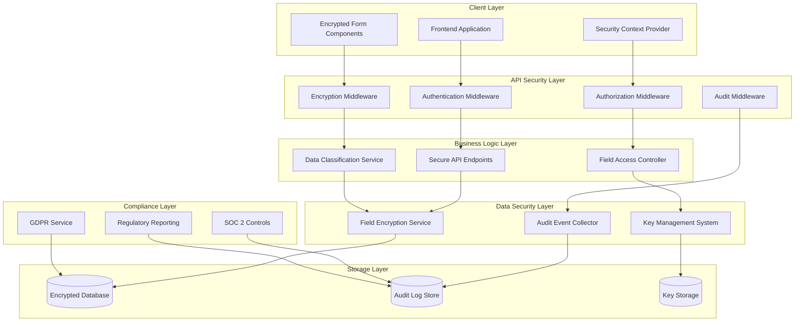

# Kingston's Portal Security Framework

## Overview

Kingston's Portal implements a comprehensive, multi-layered security framework designed specifically for wealth management applications handling sensitive financial data. This document provides an executive overview of the security architecture implemented across Phases 2-5 of the system enhancement.

## Security Architecture Summary

The security framework consists of seven integrated layers:

1. **Authentication & Authorization Layer**: Multi-factor authentication with RBAC
2. **Data Protection Layer**: Field-level encryption and data classification
3. **Communication Security Layer**: End-to-end encryption for all data transmission
4. **Audit & Compliance Layer**: Comprehensive audit trails with regulatory compliance
5. **Application Security Layer**: Input validation and secure coding practices
6. **Infrastructure Security Layer**: Network security and system hardening
7. **Monitoring & Response Layer**: Real-time threat detection and incident response

## Phase 5 Security Enhancements

### Enhanced Client Data Protection

The Phase 5 security model provides comprehensive protection for the enhanced client data functionality:

- **Field-Level Encryption**: Sensitive data fields (SSN, account numbers, DOB) encrypted using AES-256-GCM
- **Granular Access Controls**: Role-based permissions with field-level access restrictions
- **Audit Logging**: Complete audit trail for all data access and modifications
- **Compliance Framework**: GDPR, SOC 2, and financial regulatory compliance

### Security by Design Principles

- **Zero Trust Architecture**: All requests authenticated and authorized regardless of source
- **Defense in Depth**: Multiple security layers with no single point of failure
- **Least Privilege Access**: Users granted minimum permissions necessary for their role
- **Continuous Monitoring**: Real-time security monitoring with automated threat detection

## Implementation Overview

### Core Security Components

The Phase 5 security implementation consists of four main components that work together to provide comprehensive protection:

#### 1. Authentication & Session Management
- **Multi-Factor Authentication**: TOTP-based MFA required for all users
- **HttpOnly Cookie Security**: JWT tokens stored in secure, HttpOnly cookies
- **Session Management**: Concurrent session limits and automated cleanup
- **Emergency Access**: Secure procedures for emergency authentication scenarios

#### 2. Field-Level Encryption System
- **Granular Data Protection**: Individual field encryption based on data sensitivity
- **Key Management**: Automated key rotation with secure derivation
- **Performance Optimization**: Caching and batch operations for scalability
- **Access Control Integration**: Permission-based decryption and field masking

#### 3. Comprehensive Audit Framework
- **Event Classification**: Automated categorization and risk scoring
- **Correlation Tracking**: Full request/response flow correlation
- **Real-time Monitoring**: Immediate alerts for security violations
- **Compliance Reporting**: Automated regulatory compliance reports

#### 4. Privacy & Compliance Controls
- **GDPR Implementation**: Complete data subject rights automation
- **Regulatory Compliance**: SOC 2, SEC, FINRA compliance frameworks
- **Data Lifecycle Management**: Automated retention and anonymization
- **Legal Hold Capability**: Litigation hold support with audit trails

### Security Architecture Diagram

### Data Flow Security

#### Secure Data Input Flow
1. **Client-side Validation**: Input validation and sanitization at the UI layer
2. **API Gateway Security**: Request validation and rate limiting
3. **Authentication Check**: Multi-factor authentication verification
4. **Authorization Check**: Role-based access control validation
5. **Data Classification**: Automatic sensitivity level determination
6. **Field Encryption**: Selective encryption based on data sensitivity
7. **Secure Storage**: Encrypted data storage with integrity verification
8. **Audit Logging**: Complete audit trail with correlation tracking

#### Secure Data Output Flow
1. **Access Request**: User requests data with proper authentication
2. **Permission Validation**: Field-level access control checks
3. **Data Retrieval**: Encrypted data retrieval from secure storage
4. **Selective Decryption**: Permission-based field decryption
5. **Data Masking**: Automatic masking for restricted fields
6. **Response Filtering**: Removal of unauthorized data fields
7. **Audit Logging**: Access event logging with correlation
8. **Secure Transmission**: HTTPS-encrypted data transmission

### Performance and Security Balance

The security implementation maintains system performance through:

- **Selective Encryption**: Only sensitive fields are encrypted, reducing overhead
- **Caching Strategies**: Decryption result caching for frequently accessed data
- **Batch Operations**: Bulk encryption/decryption for efficiency
- **Asynchronous Processing**: Non-blocking audit logging and security operations
- **Database Optimization**: Efficient indexes and query patterns for encrypted data

### Security Monitoring and Response

#### Real-time Security Monitoring
- **Event Correlation**: Cross-system security event correlation
- **Anomaly Detection**: Behavioral analysis for threat detection
- **Automated Alerting**: Immediate notification of security violations
- **Incident Response**: Automated response to high-risk security events

#### Compliance Monitoring
- **Continuous Compliance**: Real-time compliance rule validation
- **Regulatory Reporting**: Automated generation of compliance reports
- **Audit Trail Integrity**: Cryptographic verification of audit logs
- **Legal Hold Management**: Automated legal hold processes for litigation

### Security Testing and Validation

The security framework includes comprehensive testing:

- **Penetration Testing**: Automated security vulnerability scanning
- **Encryption Testing**: Cryptographic implementation validation
- **Access Control Testing**: Permission system verification
- **Audit System Testing**: Log integrity and completeness validation
- **Compliance Testing**: Regulatory requirement verification

This multi-layered security approach ensures that Kingston's Portal provides enterprise-grade protection for sensitive financial data while maintaining regulatory compliance and operational efficiency.

## 1. Authentication & Authorization

- **Authentication:** We use a **secure httpOnly cookie-based JWT authentication** system for maximum security.
  1.  On successful login, the FastAPI backend generates a signed JSON Web Token (JWT).
  2.  This token is set as an **httpOnly cookie** (`access_token`), making it inaccessible to JavaScript and protecting against XSS attacks.
  3.  The frontend automatically includes this cookie in all API requests via browser cookie handling.
  4.  **Dual Authentication Support:** The system supports both cookie-based authentication (primary) and Authorization header authentication (fallback for API clients).
  5.  **Session Management:** A separate `session_id` cookie provides additional session tracking and management capabilities.
- **Authorization:**
  - The backend uses a `get_current_user` dependency that is injected into all protected routes, as described in the [API Design](../3_architecture/04_api_design.md) guide.
  - This dependency prioritizes httpOnly cookie authentication, then falls back to Authorization headers, then session cookies.
  - The dependency decodes the JWT, verifies its signature and expiration, and retrieves the user's profile.
- **Password Security:** User passwords are never stored in plain text. We use the `passlib` library to hash and salt passwords with a strong, modern algorithm (bcrypt).
- **XSS Protection:** JWT tokens are stored in httpOnly cookies that cannot be accessed by JavaScript, providing strong protection against Cross-Site Scripting attacks.

## 2. Data Protection

- **Input Validation (Backend):** All incoming data to the API is strictly validated using **Pydantic models**. This prevents data type mismatches and mitigates risks like data corruption attacks.
- **SQL Injection Prevention:** The backend data access layer uses parameterized queries, which treat user-provided input as data, not as executable SQL code, thus preventing SQL injection vulnerabilities.
- **Cross-Site Scripting (XSS) Prevention:**
  - **React:** React automatically escapes content rendered within JSX, preventing strings from being interpreted as HTML.
  - **httpOnly Cookies:** Authentication tokens are stored in httpOnly cookies that cannot be accessed by malicious JavaScript, providing strong protection against token theft via XSS attacks.
  - **Automatic Cookie Handling:** The browser automatically manages authentication cookies, eliminating the need for JavaScript token storage and reducing XSS attack surface.
- **Environment Variable Management:** All secrets and credentials are stored in a `.env` file, which is **explicitly ignored by Git** and should never be committed to the repository. See the [Setup and Installation](../2_getting_started/01_setup_and_installation.md) guide for more details.

## 3. Communication Security

- **HTTPS/TLS:** In a production environment, the application must be deployed behind a reverse proxy (like Nginx) that enforces HTTPS, encrypting all traffic between the client and the server.
- **CORS (Cross-Origin Resource Sharing):** The FastAPI backend is configured with a strict CORS policy that only allows requests from the specific origin of the frontend application. The CORS configuration includes `allow_credentials=True` to support secure httpOnly cookie transmission between frontend and backend.

## 4. Auditing and Logging

- **`holding_activity_log`:** This database table provides a comprehensive and immutable audit trail for all financial transactions, which is critical for compliance.
- **`provider_switch_log`:** This table tracks all changes to a product's provider, maintaining a clear history.
- **Application Logging:** The backend logs important events, errors, and security-related incidents, which can be forwarded to a centralized logging system for monitoring. 