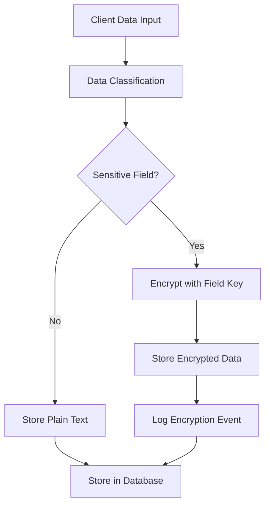

# Field-Level Encryption Implementation

## Overview

Kingston's Portal implements comprehensive field-level encryption to protect sensitive client data at rest and in transit. This document provides detailed implementation specifications for the encryption framework introduced in Phase 5.

## Table of Contents

1. [Encryption Architecture](#1-encryption-architecture)
2. [Data Classification and Encryption Policies](#2-data-classification-and-encryption-policies)
3. [Key Management System](#3-key-management-system)
4. [Encryption Implementation](#4-encryption-implementation)
5. [Decryption and Access Control](#5-decryption-and-access-control)
6. [Performance Optimization](#6-performance-optimization)
7. [Database Schema for Encrypted Data](#7-database-schema-for-encrypted-data)
8. [API Security Patterns](#8-api-security-patterns)
9. [Frontend Security Implementation](#9-frontend-security-implementation)
10. [Testing and Validation](#10-testing-and-validation)

## 1. Encryption Architecture

### 1.1 Encryption Strategy Overview

The field-level encryption system provides granular protection for sensitive data while maintaining system performance and usability. The architecture supports:

- **Selective Encryption**: Only sensitive fields are encrypted, reducing performance overhead
- **Transparent Decryption**: Authorized users access data seamlessly
- **Key Rotation**: Automated key rotation without system downtime
- **Audit Integration**: All encryption/decryption events are logged

### 1.2 Encryption Flow



### 1.3 System Components

**Encryption Service Layer**
- `FieldEncryptionService`: Core encryption/decryption service
- `KeyManagerService`: Manages encryption keys and rotation
- `DataClassificationService`: Determines field encryption requirements
- `AuditEncryptionService`: Logs all encryption-related events

**Database Layer**
- Encrypted field storage with metadata
- Key rotation history tracking
- Encryption event audit logs

**API Layer**
- Automatic encryption on data ingestion
- Transparent decryption for authorized requests
- Permission-based field filtering

## 2. Data Classification and Encryption Policies

### 2.1 Data Sensitivity Levels

```typescript
enum DataSensitivityLevel {
  PUBLIC = 'public',           // No encryption required
  INTERNAL = 'internal',       // Basic protection
  CONFIDENTIAL = 'confidential', // Standard encryption
  RESTRICTED = 'restricted',   // High-grade encryption
  TOP_SECRET = 'top_secret'    // Maximum protection
}
```

### 2.2 Field Classification Matrix

| Field Category | Examples | Sensitivity Level | Encryption Algorithm | Key Rotation |
|----------------|----------|-------------------|---------------------|--------------|
| **Identifiers** | Client ID, Portfolio ID | PUBLIC | None | N/A |
| **Basic Info** | Name, Company Name | INTERNAL | AES-256-GCM | 180 days |
| **Contact Data** | Email, Phone, Address | CONFIDENTIAL | AES-256-GCM | 90 days |
| **Personal Data** | SSN, DOB, Tax ID | RESTRICTED | AES-256-GCM | 30 days |
| **Financial Data** | Account Numbers, Balances | RESTRICTED | AES-256-GCM | 30 days |
| **Internal Notes** | Risk Assessments, Compliance Notes | TOP_SECRET | AES-256-GCM | 15 days |

### 2.3 Encryption Policy Configuration

```python
# Encryption policy definitions
FIELD_ENCRYPTION_POLICIES = {
    # Client personal data
    'clients.ssn': {
        'sensitivity': DataSensitivityLevel.RESTRICTED,
        'algorithm': 'AES-256-GCM',
        'key_rotation_days': 30,
        'access_roles': ['admin', 'senior_advisor'],
        'audit_level': 'FULL'
    },
    'clients.date_of_birth': {
        'sensitivity': DataSensitivityLevel.RESTRICTED,
        'algorithm': 'AES-256-GCM',
        'key_rotation_days': 30,
        'access_roles': ['admin', 'senior_advisor', 'advisor'],
        'audit_level': 'FULL'
    },
    'clients.phone_number': {
        'sensitivity': DataSensitivityLevel.CONFIDENTIAL,
        'algorithm': 'AES-256-GCM',
        'key_rotation_days': 90,
        'access_roles': ['admin', 'senior_advisor', 'advisor'],
        'audit_level': 'STANDARD'
    },
    'clients.email_address': {
        'sensitivity': DataSensitivityLevel.CONFIDENTIAL,
        'algorithm': 'AES-256-GCM',
        'key_rotation_days': 90,
        'access_roles': ['admin', 'senior_advisor', 'advisor'],
        'audit_level': 'STANDARD'
    },
    'clients.address': {
        'sensitivity': DataSensitivityLevel.CONFIDENTIAL,
        'algorithm': 'AES-256-GCM',
        'key_rotation_days': 90,
        'access_roles': ['admin', 'senior_advisor', 'advisor'],
        'audit_level': 'STANDARD'
    },
    
    # Financial data
    'portfolios.account_number': {
        'sensitivity': DataSensitivityLevel.RESTRICTED,
        'algorithm': 'AES-256-GCM',
        'key_rotation_days': 30,
        'access_roles': ['admin', 'senior_advisor'],
        'audit_level': 'FULL'
    },
    'valuations.balance': {
        'sensitivity': DataSensitivityLevel.CONFIDENTIAL,
        'algorithm': 'AES-256-GCM',
        'key_rotation_days': 90,
        'access_roles': ['admin', 'senior_advisor', 'advisor'],
        'audit_level': 'STANDARD'
    },
    
    # Internal notes and assessments
    'clients.internal_notes': {
        'sensitivity': DataSensitivityLevel.TOP_SECRET,
        'algorithm': 'AES-256-GCM',
        'key_rotation_days': 15,
        'access_roles': ['admin'],
        'audit_level': 'MAXIMUM'
    },
    'clients.risk_assessment': {
        'sensitivity': DataSensitivityLevel.TOP_SECRET,
        'algorithm': 'AES-256-GCM',
        'key_rotation_days': 15,
        'access_roles': ['admin', 'senior_advisor'],
        'audit_level': 'MAXIMUM'
    }
}
```

## 3. Key Management System

### 3.1 Key Hierarchy

```
Master Key (HSM/KMS)
├── Data Encryption Keys (DEK) - Per sensitivity level
│   ├── PUBLIC_DEK (not used for encryption)
│   ├── INTERNAL_DEK (180-day rotation)
│   ├── CONFIDENTIAL_DEK (90-day rotation)
│   ├── RESTRICTED_DEK (30-day rotation)
│   └── TOP_SECRET_DEK (15-day rotation)
├── Field Encryption Keys (FEK) - Per field type
│   ├── SSN_FEK (derived from RESTRICTED_DEK)
│   ├── DOB_FEK (derived from RESTRICTED_DEK)
│   └── NOTES_FEK (derived from TOP_SECRET_DEK)
└── Session Keys - Per user session
    └── SESSION_KEY_{user_id}_{timestamp}
```

### 3.2 Key Manager Implementation

```python
import os
import boto3
from cryptography.fernet import Fernet
from cryptography.hazmat.primitives import hashes
from cryptography.hazmat.primitives.kdf.pbkdf2 import PBKDF2HMAC
from cryptography.hazmat.primitives.ciphers import Cipher, algorithms, modes
from datetime import datetime, timedelta
import json

class KeyManagerService:
    def __init__(self):
        self.kms_client = boto3.client('kms', region_name='us-east-1')
        self.master_key_id = os.getenv('MASTER_KEY_ID')
        self.key_cache = {}
        self.key_cache_ttl = 300  # 5 minutes
    
    async def get_field_encryption_key(self, field_path: str) -> str:
        """Get or generate encryption key for specific field"""
        policy = FIELD_ENCRYPTION_POLICIES.get(field_path)
        if not policy:
            raise ValueError(f"No encryption policy found for field: {field_path}")
        
        # Check cache first
        cache_key = f"{field_path}::{datetime.now().date()}"
        if cache_key in self.key_cache:
            cached_entry = self.key_cache[cache_key]
            if cached_entry['expires_at'] > datetime.now():
                return cached_entry['key']
        
        # Generate or retrieve key
        sensitivity_level = policy['sensitivity']
        key_rotation_days = policy['key_rotation_days']
        
        # Derive field key from master key
        field_key = await self._derive_field_key(field_path, sensitivity_level)
        
        # Cache the key
        self.key_cache[cache_key] = {
            'key': field_key,
            'expires_at': datetime.now() + timedelta(seconds=self.key_cache_ttl)
        }
        
        return field_key
    
    async def _derive_field_key(self, field_path: str, sensitivity_level: str) -> str:
        """Derive field-specific key from master key"""
        # Use AWS KMS to derive field-specific key
        context = {
            'field_path': field_path,
            'sensitivity_level': sensitivity_level,
            'key_date': datetime.now().strftime('%Y-%m-%d')
        }
        
        response = self.kms_client.generate_data_key(
            KeyId=self.master_key_id,
            KeySpec='AES_256',
            EncryptionContext=context
        )
        
        return response['Plaintext']
    
    async def rotate_field_keys(self, field_path: str = None):
        """Rotate encryption keys for fields or all fields"""
        if field_path:
            fields_to_rotate = [field_path]
        else:
            fields_to_rotate = list(FIELD_ENCRYPTION_POLICIES.keys())
        
        for field in fields_to_rotate:
            policy = FIELD_ENCRYPTION_POLICIES[field]
            last_rotation = await self._get_last_rotation_date(field)
            
            if self._should_rotate_key(last_rotation, policy['key_rotation_days']):
                await self._rotate_field_key(field)
    
    def _should_rotate_key(self, last_rotation: datetime, rotation_days: int) -> bool:
        """Check if key should be rotated based on policy"""
        if not last_rotation:
            return True
        
        rotation_due = last_rotation + timedelta(days=rotation_days)
        return datetime.now() >= rotation_due
    
    async def _rotate_field_key(self, field_path: str):
        """Rotate key for specific field"""
        # Generate new key
        new_key = await self._derive_field_key(field_path, 
                                             FIELD_ENCRYPTION_POLICIES[field_path]['sensitivity'])
        
        # Re-encrypt all data with new key
        await self._reencrypt_field_data(field_path, new_key)
        
        # Update key rotation history
        await self._record_key_rotation(field_path, new_key)
```

### 3.3 Key Rotation Automation

```python
import asyncio
from apscheduler.schedulers.asyncio import AsyncIOScheduler
import hashlib
import time
from datetime import datetime, timedelta
from typing import Dict, List, Any

class KeyRotationScheduler:
    def __init__(self, key_manager: KeyManagerService):
        self.key_manager = key_manager
        self.scheduler = AsyncIOScheduler()
        self.test_scheduler = AsyncIOScheduler()
        self.rotation_test_results = {}
        self.performance_metrics = {}
    
    def start(self):
        """Start automated key rotation scheduler with enhanced testing"""
        # Check for key rotations daily at 2 AM
        self.scheduler.add_job(
            self._daily_key_rotation_check,
            'cron',
            hour=2,
            minute=0,
            id='daily_key_rotation'
        )
        
        # Emergency key rotation (can be triggered manually)
        self.scheduler.add_job(
            self._emergency_key_rotation,
            'interval',
            minutes=5,
            id='emergency_rotation_check'
        )
        
        # Key rotation testing - every 4 hours for comprehensive validation
        self.test_scheduler.add_job(
            self._automated_rotation_testing,
            'interval',
            hours=4,
            id='rotation_testing'
        )
        
        # Performance impact monitoring during rotation
        self.scheduler.add_job(
            self._monitor_rotation_performance,
            'interval',
            minutes=1,
            id='rotation_performance_monitor'
        )
        
        # Weekly comprehensive rotation validation
        self.test_scheduler.add_job(
            self._comprehensive_rotation_validation,
            'cron',
            day_of_week='sun',
            hour=1,
            minute=0,
            id='weekly_rotation_validation'
        )
        
        self.scheduler.start()
        self.test_scheduler.start()
    
    async def _automated_rotation_testing(self):
        """Enhanced automated testing of key rotation scenarios"""
        test_results = {
            'test_timestamp': datetime.now(),
            'test_scenarios': [],
            'overall_status': 'PASS',
            'performance_metrics': {}
        }
        
        try:
            # Test scenario 1: Standard rotation validation
            standard_test = await self._test_standard_rotation_scenario()
            test_results['test_scenarios'].append(standard_test)
            
            # Test scenario 2: Emergency rotation under load
            emergency_test = await self._test_emergency_rotation_under_load()
            test_results['test_scenarios'].append(emergency_test)
            
            # Test scenario 3: Rollback capability testing
            rollback_test = await self._test_rotation_rollback_capability()
            test_results['test_scenarios'].append(rollback_test)
            
            # Test scenario 4: Cross-field rotation coordination
            coordination_test = await self._test_cross_field_rotation_coordination()
            test_results['test_scenarios'].append(coordination_test)
            
            # Test scenario 5: Performance impact validation
            performance_test = await self._test_rotation_performance_impact()
            test_results['test_scenarios'].append(performance_test)
            
            # Determine overall status
            failed_tests = [t for t in test_results['test_scenarios'] if t['status'] == 'FAIL']
            if failed_tests:
                test_results['overall_status'] = 'FAIL'
                await self._escalate_rotation_test_failures(failed_tests)
            
            # Store test results
            self.rotation_test_results[datetime.now().isoformat()] = test_results
            
            # Log comprehensive test results
            await self._log_rotation_test_results(test_results)
            
        except Exception as e:
            await self._log_rotation_event("automated_testing", "failure", str(e))
    
    async def _test_standard_rotation_scenario(self) -> Dict[str, Any]:
        """Test standard key rotation scenario with validation"""
        test_start = time.time()
        
        try:
            # Create test data for rotation validation
            test_data = await self._create_rotation_test_data()
            
            # Perform key rotation for test field
            test_field = 'test.rotation.field'
            rotation_result = await self.key_manager.rotate_field_keys(test_field)
            
            # Validate rotation success
            validation_result = await self._validate_key_rotation(test_field, test_data)
            
            # Measure performance impact
            performance_metrics = await self._measure_rotation_performance(test_field)
            
            test_duration = time.time() - test_start
            
            return {
                'test_name': 'standard_rotation_scenario',
                'status': 'PASS' if validation_result['success'] else 'FAIL',
                'duration_seconds': test_duration,
                'rotation_result': rotation_result,
                'validation_result': validation_result,
                'performance_metrics': performance_metrics,
                'timestamp': datetime.now().isoformat()
            }
            
        except Exception as e:
            return {
                'test_name': 'standard_rotation_scenario',
                'status': 'FAIL',
                'duration_seconds': time.time() - test_start,
                'error': str(e),
                'timestamp': datetime.now().isoformat()
            }
    
    async def _test_emergency_rotation_under_load(self) -> Dict[str, Any]:
        """Test emergency rotation capability under simulated load"""
        test_start = time.time()
        
        try:
            # Simulate concurrent encryption/decryption load
            load_tasks = []
            for i in range(50):
                task = asyncio.create_task(
                    self._simulate_encryption_load(f'load_test_{i}')
                )
                load_tasks.append(task)
            
            # Trigger emergency rotation while under load
            emergency_start = time.time()
            await self.key_manager.emergency_rotate_field_keys('clients.ssn')
            emergency_duration = time.time() - emergency_start
            
            # Wait for load tasks to complete
            load_results = await asyncio.gather(*load_tasks, return_exceptions=True)
            
            # Validate that rotation succeeded and load operations weren't significantly impacted
            rotation_validation = await self._validate_emergency_rotation('clients.ssn')
            load_impact = self._analyze_load_impact(load_results)
            
            test_duration = time.time() - test_start
            
            success = (
                rotation_validation['success'] and 
                emergency_duration < 10.0 and  # Emergency rotation under 10 seconds
                load_impact['error_rate'] < 0.05  # Less than 5% load operation errors
            )
            
            return {
                'test_name': 'emergency_rotation_under_load',
                'status': 'PASS' if success else 'FAIL',
                'duration_seconds': test_duration,
                'emergency_rotation_duration': emergency_duration,
                'load_impact': load_impact,
                'rotation_validation': rotation_validation,
                'timestamp': datetime.now().isoformat()
            }
            
        except Exception as e:
            return {
                'test_name': 'emergency_rotation_under_load',
                'status': 'FAIL',
                'duration_seconds': time.time() - test_start,
                'error': str(e),
                'timestamp': datetime.now().isoformat()
            }
    
    async def _test_rotation_rollback_capability(self) -> Dict[str, Any]:
        """Test ability to rollback failed key rotations"""
        test_start = time.time()
        
        try:
            # Create backup of current key state
            test_field = 'test.rollback.field'
            original_key_state = await self._backup_key_state(test_field)
            
            # Simulate rotation failure scenario
            try:
                await self._simulate_rotation_failure(test_field)
            except Exception:
                # Expected failure - now test rollback
                pass
            
            # Perform rollback
            rollback_result = await self._perform_key_rollback(test_field, original_key_state)
            
            # Validate rollback success
            rollback_validation = await self._validate_rollback(test_field, original_key_state)
            
            test_duration = time.time() - test_start
            
            return {
                'test_name': 'rotation_rollback_capability',
                'status': 'PASS' if rollback_validation['success'] else 'FAIL',
                'duration_seconds': test_duration,
                'rollback_result': rollback_result,
                'rollback_validation': rollback_validation,
                'timestamp': datetime.now().isoformat()
            }
            
        except Exception as e:
            return {
                'test_name': 'rotation_rollback_capability',
                'status': 'FAIL',
                'duration_seconds': time.time() - test_start,
                'error': str(e),
                'timestamp': datetime.now().isoformat()
            }
    
    async def _monitor_rotation_performance(self):
        """Monitor performance impact during key rotation operations"""
        try:
            # Check if any rotation is currently in progress
            active_rotations = await self._get_active_rotations()
            
            for rotation in active_rotations:
                # Measure current performance metrics
                metrics = await self._collect_rotation_performance_metrics(rotation['field_path'])
                
                # Store metrics with timestamp
                if rotation['field_path'] not in self.performance_metrics:
                    self.performance_metrics[rotation['field_path']] = []
                
                self.performance_metrics[rotation['field_path']].append({
                    'timestamp': datetime.now().isoformat(),
                    'metrics': metrics
                })
                
                # Check for performance degradation alerts
                await self._check_performance_degradation_alerts(rotation['field_path'], metrics)
                
        except Exception as e:
            await self._log_rotation_event("performance_monitoring", "error", str(e))
    
    async def _comprehensive_rotation_validation(self):
        """Weekly comprehensive validation of all rotation procedures"""
        validation_results = {
            'validation_timestamp': datetime.now(),
            'field_validations': [],
            'system_health_check': {},
            'compliance_verification': {},
            'overall_status': 'PASS'
        }
        
        try:
            # Validate all field rotation policies
            for field_path in FIELD_ENCRYPTION_POLICIES.keys():
                field_validation = await self._validate_field_rotation_policy(field_path)
                validation_results['field_validations'].append(field_validation)
            
            # System health check
            validation_results['system_health_check'] = await self._perform_rotation_system_health_check()
            
            # Compliance verification
            validation_results['compliance_verification'] = await self._verify_rotation_compliance()
            
            # Determine overall status
            failed_validations = [v for v in validation_results['field_validations'] if v['status'] == 'FAIL']
            if failed_validations or validation_results['system_health_check']['status'] == 'FAIL':
                validation_results['overall_status'] = 'FAIL'
                await self._escalate_comprehensive_validation_failure(validation_results)
            
            # Generate weekly rotation report
            await self._generate_weekly_rotation_report(validation_results)
            
        except Exception as e:
            await self._log_rotation_event("comprehensive_validation", "failure", str(e))
    
    async def _daily_key_rotation_check(self):
        """Enhanced daily check for keys that need rotation"""
        try:
            # Pre-rotation system health check
            health_check = await self._perform_pre_rotation_health_check()
            if not health_check['healthy']:
                await self._log_rotation_event("pre_rotation_health_check", "failure", 
                                             f"System health check failed: {health_check['issues']}")
                return
            
            # Perform rotation with enhanced monitoring
            rotation_start = time.time()
            await self.key_manager.rotate_field_keys()
            rotation_duration = time.time() - rotation_start
            
            # Post-rotation validation
            post_validation = await self._perform_post_rotation_validation()
            
            # Log detailed rotation results
            await self._log_rotation_event("scheduled_rotation", "success", {
                'rotation_duration': rotation_duration,
                'pre_health_check': health_check,
                'post_validation': post_validation,
                'timestamp': datetime.now().isoformat()
            })
            
        except Exception as e:
            await self._log_rotation_event("scheduled_rotation", "failure", str(e))
            await self._escalate_rotation_failure(e)
    
    async def _emergency_key_rotation(self):
        """Enhanced emergency key rotation with comprehensive testing"""
        emergency_requests = await self._check_emergency_rotation_queue()
        for request in emergency_requests:
            try:
                # Validate emergency rotation request
                validation_result = await self._validate_emergency_rotation_request(request)
                if not validation_result['valid']:
                    await self._reject_emergency_rotation(request['id'], validation_result['reason'])
                    continue
                
                # Perform emergency rotation with enhanced monitoring
                rotation_start = time.time()
                rotation_result = await self.key_manager.emergency_rotate_field_keys(request['field_path'])
                rotation_duration = time.time() - rotation_start
                
                # Immediate post-rotation validation
                validation = await self._validate_emergency_rotation_result(request['field_path'], rotation_result)
                
                if validation['success']:
                    await self._complete_emergency_rotation(request['id'], {
                        'rotation_duration': rotation_duration,
                        'validation': validation,
                        'timestamp': datetime.now().isoformat()
                    })
                else:
                    await self._fail_emergency_rotation(request['id'], validation['error'])
                    
            except Exception as e:
                await self._fail_emergency_rotation(request['id'], str(e))
                await self._escalate_emergency_rotation_failure(request, e)
```

### 3.4 Quantum-Resistant Cryptography Preparation

```python
from enum import Enum
from typing import Dict, List, Any, Optional
from datetime import datetime, timedelta
import asyncio

class QuantumReadinessLevel(Enum):
    CLASSICAL_ONLY = 'classical_only'
    HYBRID_READY = 'hybrid_ready'  
    QUANTUM_RESISTANT = 'quantum_resistant'
    FULLY_QUANTUM_SAFE = 'fully_quantum_safe'

class QuantumResistantCryptoManager:
    """Manager for transitioning to quantum-resistant cryptography"""
    
    def __init__(self, key_manager: KeyManagerService):
        self.key_manager = key_manager
        self.quantum_readiness_level = QuantumReadinessLevel.CLASSICAL_ONLY
        self.migration_timeline = self._establish_migration_timeline()
        self.algorithm_assessment = {}
        
    def _establish_migration_timeline(self) -> Dict[str, Any]:
        """Establish specific timeline for quantum-resistant cryptography migration"""
        
        base_date = datetime(2025, 1, 1)  # Starting point for migration
        
        return {
            'phase_1_algorithm_assessment': {
                'start_date': base_date,
                'end_date': base_date + timedelta(days=90),  # Q1 2025
                'deliverables': [
                    'Complete NIST post-quantum cryptography algorithm evaluation',
                    'Assess impact on current encryption implementations', 
                    'Develop algorithm compatibility matrix',
                    'Create performance benchmarking suite'
                ],
                'status': 'IN_PROGRESS',
                'completion_criteria': [
                    'All current algorithms evaluated against quantum threats',
                    'Performance impact assessment completed',
                    'Compliance impact analysis finished'
                ]
            },
            'phase_2_hybrid_implementation': {
                'start_date': base_date + timedelta(days=91),  # Q2 2025
                'end_date': base_date + timedelta(days=270),   # Q3 2025
                'deliverables': [
                    'Implement hybrid cryptographic system',
                    'Deploy NIST-approved post-quantum algorithms alongside classical',
                    'Create algorithm negotiation protocols',
                    'Implement quantum-safe key exchange mechanisms'
                ],
                'status': 'PLANNED',
                'completion_criteria': [
                    'Hybrid encryption working in test environment',
                    'Performance benchmarks meet requirements',
                    'Security validation completed'
                ]
            },
            'phase_3_production_deployment': {
                'start_date': base_date + timedelta(days=271), # Q4 2025
                'end_date': base_date + timedelta(days=450),   # Q2 2026
                'deliverables': [
                    'Deploy quantum-resistant algorithms to production',
                    'Migrate existing encrypted data to quantum-safe formats',
                    'Implement quantum-safe backup and recovery procedures',
                    'Complete staff training on quantum-resistant systems'
                ],
                'status': 'PLANNED',
                'completion_criteria': [
                    '100% of sensitive data protected by quantum-resistant encryption',
                    'All key management systems upgraded',
                    'Compliance validation completed'
                ]
            },
            'phase_4_full_quantum_safety': {
                'start_date': base_date + timedelta(days=451), # Q3 2026
                'end_date': base_date + timedelta(days=730),   # Q1 2027
                'deliverables': [
                    'Remove all classical-only cryptographic implementations',
                    'Implement quantum key distribution (QKD) where feasible',
                    'Deploy quantum-safe authentication protocols',
                    'Complete quantum threat monitoring system'
                ],
                'status': 'PLANNED',
                'completion_criteria': [
                    'No classical-only algorithms in production',
                    'Quantum threat monitoring operational',
                    'Full quantum safety certification achieved'
                ]
            }
        }
    
    async def assess_current_quantum_readiness(self) -> Dict[str, Any]:
        """Assess current quantum readiness across all systems"""
        
        assessment = {
            'assessment_date': datetime.now().isoformat(),
            'current_readiness_level': self.quantum_readiness_level.value,
            'algorithm_vulnerabilities': await self._assess_algorithm_vulnerabilities(),
            'infrastructure_readiness': await self._assess_infrastructure_readiness(),
            'compliance_impact': await self._assess_compliance_impact(),
            'migration_readiness_score': 0,
            'recommended_actions': []
        }
        
        # Calculate overall readiness score (0-100)
        scores = [
            assessment['algorithm_vulnerabilities']['readiness_score'],
            assessment['infrastructure_readiness']['readiness_score'],
            assessment['compliance_impact']['readiness_score']
        ]
        assessment['migration_readiness_score'] = sum(scores) / len(scores)
        
        # Generate recommendations based on assessment
        if assessment['migration_readiness_score'] < 40:
            assessment['recommended_actions'].extend([
                'Immediate algorithm vulnerability remediation required',
                'Infrastructure upgrade planning must begin',
                'Compliance gap analysis needed'
            ])
        elif assessment['migration_readiness_score'] < 70:
            assessment['recommended_actions'].extend([
                'Accelerate hybrid implementation planning',
                'Begin algorithm testing in development environment',
                'Update compliance documentation'
            ])
        else:
            assessment['recommended_actions'].extend([
                'Proceed with planned migration timeline',
                'Consider accelerated deployment for high-risk systems',
                'Implement quantum threat monitoring'
            ])
            
        return assessment
    
    async def _assess_algorithm_vulnerabilities(self) -> Dict[str, Any]:
        """Assess vulnerability of current algorithms to quantum attacks"""
        
        current_algorithms = {
            'AES-256-GCM': {
                'quantum_vulnerability': 'MODERATE',  # Grover's algorithm impact
                'recommended_key_size': 512,  # Double for Grover resistance
                'nist_pqc_alternative': 'AES-256 (remains quantum-safe)',
                'migration_priority': 'MEDIUM',
                'estimated_migration_effort': '2-3 months'
            },
            'RSA-2048': {
                'quantum_vulnerability': 'CRITICAL',  # Shor's algorithm
                'recommended_alternative': 'CRYSTALS-Kyber',
                'nist_pqc_alternative': 'ML-KEM (Kyber)',
                'migration_priority': 'IMMEDIATE',
                'estimated_migration_effort': '6-8 months'
            },
            'ECDSA-P256': {
                'quantum_vulnerability': 'CRITICAL',  # Shor's algorithm
                'recommended_alternative': 'CRYSTALS-Dilithium',
                'nist_pqc_alternative': 'ML-DSA (Dilithium)',
                'migration_priority': 'IMMEDIATE',
                'estimated_migration_effort': '4-6 months'
            },
            'SHA-256': {
                'quantum_vulnerability': 'MODERATE',  # Grover's algorithm
                'recommended_enhancement': 'SHA-512',
                'nist_pqc_alternative': 'SHA-3 family',
                'migration_priority': 'LOW',
                'estimated_migration_effort': '1-2 months'
            }
        }
        
        # Calculate vulnerability score
        critical_count = sum(1 for alg in current_algorithms.values() 
                           if alg['quantum_vulnerability'] == 'CRITICAL')
        moderate_count = sum(1 for alg in current_algorithms.values() 
                           if alg['quantum_vulnerability'] == 'MODERATE')
        total_count = len(current_algorithms)
        
        vulnerability_score = 100 - ((critical_count * 30 + moderate_count * 10) / total_count)
        
        return {
            'algorithms_assessed': current_algorithms,
            'vulnerability_summary': {
                'critical_vulnerabilities': critical_count,
                'moderate_vulnerabilities': moderate_count,
                'total_algorithms': total_count
            },
            'readiness_score': max(0, vulnerability_score),
            'immediate_action_required': critical_count > 0
        }
    
    async def implement_hybrid_cryptography(self, field_path: str) -> Dict[str, Any]:
        """Implement hybrid classical/quantum-resistant encryption for specific field"""
        
        implementation_start = datetime.now()
        
        try:
            # Phase 1: Algorithm selection based on field sensitivity
            sensitivity_level = FIELD_ENCRYPTION_POLICIES[field_path]['sensitivity']
            selected_algorithms = self._select_hybrid_algorithms(sensitivity_level)
            
            # Phase 2: Generate quantum-resistant keys
            qr_keys = await self._generate_quantum_resistant_keys(field_path, selected_algorithms)
            
            # Phase 3: Implement hybrid encryption wrapper\n            hybrid_wrapper = await self._create_hybrid_encryption_wrapper(field_path, qr_keys)\n            \n            # Phase 4: Test hybrid implementation\n            test_results = await self._test_hybrid_implementation(field_path, hybrid_wrapper)\n            \n            # Phase 5: Gradual rollout\n            rollout_result = await self._gradual_hybrid_rollout(field_path, hybrid_wrapper)\n            \n            implementation_duration = (datetime.now() - implementation_start).total_seconds()\n            \n            return {\n                'field_path': field_path,\n                'implementation_status': 'SUCCESS',\n                'implementation_duration': implementation_duration,\n                'algorithms_deployed': selected_algorithms,\n                'test_results': test_results,\n                'rollout_result': rollout_result,\n                'quantum_readiness_improvement': self._calculate_readiness_improvement(field_path)\n            }\n            \n        except Exception as e:\n            return {\n                'field_path': field_path,\n                'implementation_status': 'FAILED',\n                'implementation_duration': (datetime.now() - implementation_start).total_seconds(),\n                'error': str(e),\n                'rollback_required': True\n            }\n    \n    def _select_hybrid_algorithms(self, sensitivity_level: str) -> Dict[str, str]:\n        \"\"\"Select appropriate quantum-resistant algorithms based on sensitivity\"\"\"\n        \n        algorithm_mapping = {\n            'PUBLIC': {\n                'symmetric': 'AES-256-GCM',  # Already quantum-resistant\n                'asymmetric': 'CRYSTALS-Kyber-768',  # NIST Level 3\n                'signature': 'CRYSTALS-Dilithium-3',\n                'hash': 'SHA-3-256'\n            },\n            'INTERNAL': {\n                'symmetric': 'AES-256-GCM',\n                'asymmetric': 'CRYSTALS-Kyber-768',\n                'signature': 'CRYSTALS-Dilithium-3',\n                'hash': 'SHA-3-256'\n            },\n            'CONFIDENTIAL': {\n                'symmetric': 'AES-256-GCM',\n                'asymmetric': 'CRYSTALS-Kyber-1024',  # NIST Level 5\n                'signature': 'CRYSTALS-Dilithium-5',\n                'hash': 'SHA-3-512'\n            },\n            'RESTRICTED': {\n                'symmetric': 'AES-256-GCM + ChaCha20-Poly1305',  # Dual algorithm\n                'asymmetric': 'CRYSTALS-Kyber-1024 + SIKE-p751',  # Multiple algorithms\n                'signature': 'CRYSTALS-Dilithium-5 + SPHINCS+-256s',\n                'hash': 'SHA-3-512'\n            },\n            'TOP_SECRET': {\n                'symmetric': 'AES-256-GCM + ChaCha20-Poly1305 + Custom-QR-Cipher',\n                'asymmetric': 'CRYSTALS-Kyber-1024 + NTRU-Prime + Custom-Lattice',\n                'signature': 'CRYSTALS-Dilithium-5 + SPHINCS+-256s + XMSS',\n                'hash': 'SHA-3-512 + BLAKE3'\n            }\n        }\n        \n        return algorithm_mapping.get(sensitivity_level, algorithm_mapping['CONFIDENTIAL'])\n    \n    async def monitor_quantum_threat_landscape(self) -> Dict[str, Any]:\n        \"\"\"Monitor quantum computing developments and threat landscape\"\"\"\n        \n        monitoring_result = {\n            'monitoring_timestamp': datetime.now().isoformat(),\n            'quantum_computing_developments': await self._assess_quantum_computing_progress(),\n            'cryptographic_vulnerabilities': await self._monitor_cryptographic_vulnerabilities(),\n            'nist_pqc_updates': await self._check_nist_pqc_updates(),\n            'threat_level_assessment': 'MODERATE',\n            'recommended_timeline_adjustments': []\n        }\n        \n        # Assess overall threat level\n        threat_indicators = [\n            monitoring_result['quantum_computing_developments']['threat_score'],\n            monitoring_result['cryptographic_vulnerabilities']['vulnerability_score']\n        ]\n        \n        avg_threat_score = sum(threat_indicators) / len(threat_indicators)\n        \n        if avg_threat_score >= 80:\n            monitoring_result['threat_level_assessment'] = 'CRITICAL'\n            monitoring_result['recommended_timeline_adjustments'].append(\n                'Accelerate migration timeline by 6-12 months'\n            )\n        elif avg_threat_score >= 60:\n            monitoring_result['threat_level_assessment'] = 'HIGH'\n            monitoring_result['recommended_timeline_adjustments'].append(\n                'Consider accelerating critical system migration'\n            )\n        elif avg_threat_score >= 40:\n            monitoring_result['threat_level_assessment'] = 'MODERATE'\n            monitoring_result['recommended_timeline_adjustments'].append(\n                'Maintain current timeline with increased monitoring'\n            )\n        else:\n            monitoring_result['threat_level_assessment'] = 'LOW'\n        \n        return monitoring_result\n```\n\n## 4. Encryption Implementation

### 4.1 Field Encryption Service

```python
from cryptography.hazmat.primitives.ciphers.aead import AESGCM
import base64
import json
from typing import Any, Dict, Optional
import uuid

class FieldEncryptionService:
    def __init__(self, key_manager: KeyManagerService, audit_service: AuditEncryptionService):
        self.key_manager = key_manager
        self.audit_service = audit_service
    
    async def encrypt_field(self, field_path: str, value: Any, 
                           user_context: Dict[str, Any]) -> Dict[str, Any]:
        """Encrypt a single field value"""
        if value is None or value == "":
            return None
        
        # Get encryption key for field
        encryption_key = await self.key_manager.get_field_encryption_key(field_path)
        
        # Convert value to string for encryption
        str_value = json.dumps(value) if not isinstance(value, str) else value
        
        # Generate nonce for GCM mode
        nonce = os.urandom(12)  # 96-bit nonce for GCM
        
        # Encrypt using AES-256-GCM
        aesgcm = AESGCM(encryption_key)
        ciphertext = aesgcm.encrypt(nonce, str_value.encode('utf-8'), None)
        
        # Create encrypted field object
        encrypted_data = {
            'algorithm': 'AES-256-GCM',
            'ciphertext': base64.b64encode(ciphertext).decode('ascii'),
            'nonce': base64.b64encode(nonce).decode('ascii'),
            'encrypted_at': datetime.now().isoformat(),
            'key_version': await self._get_key_version(field_path),
            'field_path': field_path
        }
        
        # Audit encryption event
        await self.audit_service.log_encryption_event(
            field_path, 'encrypt', user_context, encrypted_data['key_version']
        )
        
        return encrypted_data
    
    async def decrypt_field(self, encrypted_data: Dict[str, Any], field_path: str,
                           user_context: Dict[str, Any]) -> Any:
        """Decrypt a single field value"""
        if not encrypted_data:
            return None
        
        # Check user permissions for field access
        if not await self._check_field_access_permission(field_path, user_context):
            await self.audit_service.log_encryption_event(
                field_path, 'decrypt_denied', user_context
            )
            raise PermissionError(f"Access denied to field: {field_path}")
        
        # Get decryption key
        encryption_key = await self.key_manager.get_field_encryption_key(field_path)
        
        # Extract encryption components
        ciphertext = base64.b64decode(encrypted_data['ciphertext'])
        nonce = base64.b64decode(encrypted_data['nonce'])
        
        # Decrypt using AES-256-GCM
        aesgcm = AESGCM(encryption_key)
        plaintext = aesgcm.decrypt(nonce, ciphertext, None)
        
        # Convert back to original type
        decrypted_value = plaintext.decode('utf-8')
        
        # Try to parse as JSON if it was originally a complex type
        try:
            parsed_value = json.loads(decrypted_value)
            if isinstance(parsed_value, str):
                # It was originally a string, return as is
                result = decrypted_value
            else:
                # It was a complex type, return parsed
                result = parsed_value
        except (json.JSONDecodeError, TypeError):
            # It was originally a simple string
            result = decrypted_value
        
        # Audit decryption event
        await self.audit_service.log_encryption_event(
            field_path, 'decrypt', user_context, encrypted_data.get('key_version')
        )
        
        return result
    
    async def encrypt_client_data(self, client_data: Dict[str, Any], 
                                 user_context: Dict[str, Any]) -> Dict[str, Any]:
        """Encrypt all sensitive fields in client data object"""
        encrypted_data = client_data.copy()
        
        # Process each field that has an encryption policy
        for field_path, policy in FIELD_ENCRYPTION_POLICIES.items():
            if field_path.startswith('clients.'):
                field_name = field_path.split('.', 1)[1]
                
                if field_name in client_data:
                    field_value = client_data[field_name]
                    if field_value is not None:
                        encrypted_field = await self.encrypt_field(
                            field_path, field_value, user_context
                        )
                        encrypted_data[field_name] = encrypted_field
        
        return encrypted_data
    
    async def decrypt_client_data(self, encrypted_client_data: Dict[str, Any],
                                 user_context: Dict[str, Any]) -> Dict[str, Any]:
        """Decrypt all encrypted fields in client data object"""
        decrypted_data = encrypted_client_data.copy()
        
        # Process each field that has an encryption policy
        for field_path, policy in FIELD_ENCRYPTION_POLICIES.items():
            if field_path.startswith('clients.'):
                field_name = field_path.split('.', 1)[1]
                
                if field_name in encrypted_client_data:
                    encrypted_field = encrypted_client_data[field_name]
                    
                    # Check if field is actually encrypted
                    if (isinstance(encrypted_field, dict) and 
                        'algorithm' in encrypted_field and 
                        'ciphertext' in encrypted_field):
                        
                        try:
                            decrypted_value = await self.decrypt_field(
                                encrypted_field, field_path, user_context
                            )
                            decrypted_data[field_name] = decrypted_value
                        except PermissionError:
                            # User doesn't have permission to decrypt this field
                            # Remove the field from the response
                            del decrypted_data[field_name]
        
        return decrypted_data
    
    async def _check_field_access_permission(self, field_path: str, 
                                           user_context: Dict[str, Any]) -> bool:
        """Check if user has permission to access encrypted field"""
        policy = FIELD_ENCRYPTION_POLICIES.get(field_path)
        if not policy:
            return True  # No policy means no restriction
        
        user_roles = user_context.get('roles', [])
        allowed_roles = policy.get('access_roles', [])
        
        # Check if user has any of the required roles
        return bool(set(user_roles) & set(allowed_roles))
    
    async def _get_key_version(self, field_path: str) -> str:
        """Get current key version for field"""
        # This would typically query the key rotation history
        return f"{field_path}::{datetime.now().strftime('%Y-%m-%d')}"
```

### 4.2 Bulk Encryption Operations

```python
class BulkEncryptionService:
    def __init__(self, field_service: FieldEncryptionService):
        self.field_service = field_service
    
    async def bulk_encrypt_clients(self, client_list: List[Dict[str, Any]],
                                 user_context: Dict[str, Any]) -> List[Dict[str, Any]]:
        """Encrypt multiple client records efficiently"""
        tasks = []
        for client_data in client_list:
            task = self.field_service.encrypt_client_data(client_data, user_context)
            tasks.append(task)
        
        # Process all encryption tasks concurrently
        encrypted_clients = await asyncio.gather(*tasks, return_exceptions=True)
        
        # Filter out any exceptions and log errors
        result = []
        for i, encrypted_client in enumerate(encrypted_clients):
            if isinstance(encrypted_client, Exception):
                await self._log_bulk_encryption_error(client_list[i], encrypted_client)
            else:
                result.append(encrypted_client)
        
        return result
    
    async def bulk_decrypt_clients(self, encrypted_client_list: List[Dict[str, Any]],
                                 user_context: Dict[str, Any]) -> List[Dict[str, Any]]:
        """Decrypt multiple client records efficiently"""
        tasks = []
        for encrypted_client in encrypted_client_list:
            task = self.field_service.decrypt_client_data(encrypted_client, user_context)
            tasks.append(task)
        
        # Process all decryption tasks concurrently
        decrypted_clients = await asyncio.gather(*tasks, return_exceptions=True)
        
        # Filter out any exceptions and log errors
        result = []
        for i, decrypted_client in enumerate(decrypted_clients):
            if isinstance(decrypted_client, Exception):
                await self._log_bulk_decryption_error(encrypted_client_list[i], decrypted_client)
            else:
                result.append(decrypted_client)
        
        return result
```

## 5. Decryption and Access Control

### 5.1 Role-Based Field Access

```python
from enum import Enum

class UserRole(Enum):
    ADMIN = 'admin'
    SENIOR_ADVISOR = 'senior_advisor'
    ADVISOR = 'advisor'
    ANALYST = 'analyst'
    VIEWER = 'viewer'

class FieldAccessController:
    def __init__(self):
        self.role_hierarchy = {
            UserRole.ADMIN: ['admin', 'senior_advisor', 'advisor', 'analyst', 'viewer'],
            UserRole.SENIOR_ADVISOR: ['senior_advisor', 'advisor', 'analyst', 'viewer'],
            UserRole.ADVISOR: ['advisor', 'analyst', 'viewer'],
            UserRole.ANALYST: ['analyst', 'viewer'],
            UserRole.VIEWER: ['viewer']
        }
    
    def get_accessible_fields(self, user_roles: List[str]) -> List[str]:
        """Get list of fields user can access based on their roles"""
        accessible_fields = []
        
        for field_path, policy in FIELD_ENCRYPTION_POLICIES.items():
            allowed_roles = policy.get('access_roles', [])
            
            # Check if user has any role that can access this field
            if any(role in allowed_roles for role in user_roles):
                accessible_fields.append(field_path)
        
        return accessible_fields
    
    def filter_client_data_by_permissions(self, client_data: Dict[str, Any],
                                        user_roles: List[str]) -> Dict[str, Any]:
        """Filter client data to only include fields user can access"""
        accessible_fields = self.get_accessible_fields(user_roles)
        filtered_data = {}
        
        for field_path in accessible_fields:
            if field_path.startswith('clients.'):
                field_name = field_path.split('.', 1)[1]
                if field_name in client_data:
                    filtered_data[field_name] = client_data[field_name]
        
        # Always include non-sensitive fields
        for field_name, value in client_data.items():
            field_path = f"clients.{field_name}"
            if field_path not in FIELD_ENCRYPTION_POLICIES:
                filtered_data[field_name] = value
        
        return filtered_data
```

### 5.2 Dynamic Field Masking

```python
class FieldMaskingService:
    def __init__(self):
        self.masking_patterns = {
            'ssn': self._mask_ssn,
            'phone_number': self._mask_phone,
            'email_address': self._mask_email,
            'account_number': self._mask_account_number
        }
    
    def apply_field_masking(self, client_data: Dict[str, Any], 
                           user_roles: List[str]) -> Dict[str, Any]:
        """Apply appropriate masking to fields based on user permissions"""
        masked_data = client_data.copy()
        
        for field_path, policy in FIELD_ENCRYPTION_POLICIES.items():
            if field_path.startswith('clients.'):
                field_name = field_path.split('.', 1)[1]
                
                if field_name in client_data:
                    # Check if user has full access to this field
                    allowed_roles = policy.get('access_roles', [])
                    has_full_access = any(role in allowed_roles for role in user_roles)
                    
                    if not has_full_access and field_name in self.masking_patterns:
                        # Apply masking
                        original_value = client_data[field_name]
                        masked_value = self.masking_patterns[field_name](original_value)
                        masked_data[field_name] = masked_value
        
        return masked_data
    
    def _mask_ssn(self, ssn: str) -> str:
        """Mask SSN showing only last 4 digits"""
        if not ssn or len(ssn) < 4:
            return "***-**-****"
        return f"***-**-{ssn[-4:]}"
    
    def _mask_phone(self, phone: str) -> str:
        """Mask phone number showing only last 4 digits"""
        if not phone or len(phone) < 4:
            return "***-***-****"
        return f"***-***-{phone[-4:]}"
    
    def _mask_email(self, email: str) -> str:
        """Mask email showing only domain"""
        if not email or '@' not in email:
            return "***@***.***"
        local, domain = email.split('@', 1)
        return f"***@{domain}"
    
    def _mask_account_number(self, account_number: str) -> str:
        """Mask account number showing only last 4 digits"""
        if not account_number or len(account_number) < 4:
            return "************"
        return f"****{account_number[-4:]}"
```

## 6. Performance Optimization

### 6.1 Encryption Caching Strategy

```python
import asyncio
from typing import Dict, Tuple
import time

class EncryptionCache:
    def __init__(self, max_size: int = 10000, ttl_seconds: int = 300):
        self.cache: Dict[str, Tuple[Any, float]] = {}
        self.max_size = max_size
        self.ttl_seconds = ttl_seconds
        self.access_times: Dict[str, float] = {}
    
    def get(self, cache_key: str) -> Optional[Any]:
        """Get cached decrypted value"""
        if cache_key not in self.cache:
            return None
        
        value, cached_at = self.cache[cache_key]
        
        # Check if cache entry is expired
        if time.time() - cached_at > self.ttl_seconds:
            del self.cache[cache_key]
            if cache_key in self.access_times:
                del self.access_times[cache_key]
            return None
        
        # Update access time
        self.access_times[cache_key] = time.time()
        return value
    
    def set(self, cache_key: str, value: Any):
        """Cache decrypted value"""
        current_time = time.time()
        
        # If cache is full, remove least recently used item
        if len(self.cache) >= self.max_size:
            self._evict_lru()
        
        self.cache[cache_key] = (value, current_time)
        self.access_times[cache_key] = current_time
    
    def _evict_lru(self):
        """Remove least recently used cache entry"""
        if not self.access_times:
            return
        
        lru_key = min(self.access_times, key=self.access_times.get)
        del self.cache[lru_key]
        del self.access_times[lru_key]
    
    def invalidate_field(self, field_path: str):
        """Invalidate all cache entries for a specific field"""
        keys_to_remove = [key for key in self.cache.keys() if field_path in key]
        for key in keys_to_remove:
            del self.cache[key]
            if key in self.access_times:
                del self.access_times[key]

class OptimizedFieldEncryptionService(FieldEncryptionService):
    def __init__(self, key_manager: KeyManagerService, audit_service: AuditEncryptionService):
        super().__init__(key_manager, audit_service)
        self.decryption_cache = EncryptionCache(max_size=5000, ttl_seconds=300)  # 5-minute cache
        self.batch_size = 100
    
    async def decrypt_field_cached(self, encrypted_data: Dict[str, Any], field_path: str,
                                 user_context: Dict[str, Any]) -> Any:
        """Decrypt field with caching support"""
        if not encrypted_data:
            return None
        
        # Create cache key
        cache_key = self._create_cache_key(encrypted_data, field_path, user_context['user_id'])
        
        # Check cache first
        cached_value = self.decryption_cache.get(cache_key)
        if cached_value is not None:
            return cached_value
        
        # Decrypt and cache result
        decrypted_value = await super().decrypt_field(encrypted_data, field_path, user_context)
        self.decryption_cache.set(cache_key, decrypted_value)
        
        return decrypted_value
    
    def _create_cache_key(self, encrypted_data: Dict[str, Any], field_path: str, user_id: str) -> str:
        """Create unique cache key for encrypted field"""
        ciphertext_hash = hashlib.md5(
            encrypted_data.get('ciphertext', '').encode()
        ).hexdigest()[:16]
        
        return f"{field_path}::{user_id}::{ciphertext_hash}"
    
    async def batch_decrypt_fields(self, field_batch: List[Tuple[Dict[str, Any], str]], 
                                 user_context: Dict[str, Any]) -> List[Any]:
        """Batch decrypt multiple fields for performance"""
        # Group by field type for key optimization
        field_groups = {}
        for i, (encrypted_data, field_path) in enumerate(field_batch):
            if field_path not in field_groups:
                field_groups[field_path] = []
            field_groups[field_path].append((i, encrypted_data))
        
        # Process each field type in parallel
        results = [None] * len(field_batch)
        tasks = []
        
        for field_path, field_items in field_groups.items():
            task = self._decrypt_field_group(field_items, field_path, user_context, results)
            tasks.append(task)
        
        await asyncio.gather(*tasks)
        return results
    
    async def _decrypt_field_group(self, field_items: List[Tuple[int, Dict[str, Any]]],
                                 field_path: str, user_context: Dict[str, Any],
                                 results: List[Any]):
        """Decrypt a group of fields of the same type"""
        # Pre-load encryption key for this field type
        encryption_key = await self.key_manager.get_field_encryption_key(field_path)
        
        for index, encrypted_data in field_items:
            try:
                decrypted_value = await self.decrypt_field_cached(
                    encrypted_data, field_path, user_context
                )
                results[index] = decrypted_value
            except Exception as e:
                results[index] = None  # Or appropriate error handling
```

### 6.2 Database Query Optimization

```python
class OptimizedClientDataService:
    def __init__(self, encryption_service: OptimizedFieldEncryptionService, db_pool):
        self.encryption_service = encryption_service
        self.db_pool = db_pool
    
    async def get_clients_with_selective_decryption(self, user_context: Dict[str, Any],
                                                  limit: int = 100) -> List[Dict[str, Any]]:
        """Get clients with only necessary fields decrypted based on user permissions"""
        
        # Determine which fields the user can access
        accessible_fields = self._get_accessible_fields(user_context['roles'])
        
        # Build SQL query to select only necessary fields
        select_fields = ['id', 'created_at', 'updated_at']  # Always include these
        encrypted_fields = []
        
        for field_path in accessible_fields:
            if field_path.startswith('clients.'):
                field_name = field_path.split('.', 1)[1]
                select_fields.append(field_name)
                if field_path in FIELD_ENCRYPTION_POLICIES:
                    encrypted_fields.append(field_name)
        
        # Query database
        query = f"SELECT {', '.join(select_fields)} FROM clients LIMIT $1"
        
        async with self.db_pool.acquire() as conn:
            rows = await conn.fetch(query, limit)
        
        # Convert to dictionaries and decrypt necessary fields
        clients = []
        for row in rows:
            client_data = dict(row)
            
            # Decrypt encrypted fields
            for field_name in encrypted_fields:
                if field_name in client_data and client_data[field_name]:
                    try:
                        encrypted_data = client_data[field_name]
                        if isinstance(encrypted_data, dict) and 'ciphertext' in encrypted_data:
                            field_path = f"clients.{field_name}"
                            decrypted_value = await self.encryption_service.decrypt_field_cached(
                                encrypted_data, field_path, user_context
                            )
                            client_data[field_name] = decrypted_value
                    except Exception as e:
                        # Log error and remove field from result
                        await self._log_decryption_error(field_name, str(e))
                        del client_data[field_name]
            
            clients.append(client_data)
        
        return clients
```

## 7. Database Schema for Encrypted Data

### 7.1 Encrypted Field Storage Schema

```sql
-- Enhanced clients table with encrypted fields
CREATE TABLE clients (
    id SERIAL PRIMARY KEY,
    created_at TIMESTAMP WITH TIME ZONE DEFAULT NOW(),
    updated_at TIMESTAMP WITH TIME ZONE DEFAULT NOW(),
    
    -- Unencrypted fields
    first_name VARCHAR(100) NOT NULL,
    last_name VARCHAR(100) NOT NULL,
    company_name VARCHAR(200),
    client_type VARCHAR(50) DEFAULT 'individual',
    status VARCHAR(20) DEFAULT 'active',
    
    -- Encrypted fields stored as JSONB
    ssn JSONB,  -- Contains encrypted data structure
    date_of_birth JSONB,
    phone_number JSONB,
    email_address JSONB,
    address JSONB,
    internal_notes JSONB,
    risk_assessment JSONB,
    
    -- Additional metadata
    data_classification_level VARCHAR(20) DEFAULT 'confidential',
    last_accessed TIMESTAMP WITH TIME ZONE,
    access_count INTEGER DEFAULT 0
);

-- Indexes for performance
CREATE INDEX idx_clients_status ON clients(status);
CREATE INDEX idx_clients_type ON clients(client_type);
CREATE INDEX idx_clients_classification ON clients(data_classification_level);
CREATE INDEX idx_clients_last_accessed ON clients(last_accessed);

-- Enhanced portfolios table with encrypted account numbers
CREATE TABLE portfolios (
    id SERIAL PRIMARY KEY,
    clients_id INTEGER REFERENCES clients(id) ON DELETE CASCADE,
    created_at TIMESTAMP WITH TIME ZONE DEFAULT NOW(),
    updated_at TIMESTAMP WITH TIME ZONE DEFAULT NOW(),
    
    -- Unencrypted fields
    portfolio_name VARCHAR(200) NOT NULL,
    portfolio_type VARCHAR(100),
    status VARCHAR(20) DEFAULT 'active',
    
    -- Encrypted fields
    account_number JSONB,  -- Encrypted account number
    
    -- Metadata
    data_classification_level VARCHAR(20) DEFAULT 'restricted'
);

-- Enhanced valuations table with encrypted balance data
CREATE TABLE valuations (
    id SERIAL PRIMARY KEY,
    portfolios_id INTEGER REFERENCES portfolios(id) ON DELETE CASCADE,
    created_at TIMESTAMP WITH TIME ZONE DEFAULT NOW(),
    valuation_date DATE NOT NULL,
    
    -- Encrypted financial data
    balance JSONB,  -- Encrypted balance information
    
    -- Unencrypted metadata
    currency VARCHAR(3) DEFAULT 'USD',
    data_source VARCHAR(100),
    data_classification_level VARCHAR(20) DEFAULT 'confidential'
);
```

### 7.2 Encryption Audit Tables

```sql
-- Encryption key rotation history
CREATE TABLE encryption_key_rotation_log (
    id SERIAL PRIMARY KEY,
    field_path VARCHAR(200) NOT NULL,
    old_key_version VARCHAR(100),
    new_key_version VARCHAR(100) NOT NULL,
    rotation_date TIMESTAMP WITH TIME ZONE DEFAULT NOW(),
    rotation_type VARCHAR(50), -- 'scheduled', 'emergency', 'manual'
    initiated_by VARCHAR(100), -- User ID who initiated rotation
    status VARCHAR(20), -- 'completed', 'failed', 'in_progress'
    records_affected INTEGER DEFAULT 0,
    completion_time TIMESTAMP WITH TIME ZONE
);

-- Field access audit log
CREATE TABLE field_access_log (
    id SERIAL PRIMARY KEY,
    correlation_id VARCHAR(100),
    user_id INTEGER,
    session_id VARCHAR(100),
    field_path VARCHAR(200) NOT NULL,
    operation_type VARCHAR(20), -- 'encrypt', 'decrypt', 'access_denied'
    resource_type VARCHAR(50), -- 'clients', 'portfolios', 'valuations'
    resource_id INTEGER,
    timestamp TIMESTAMP WITH TIME ZONE DEFAULT NOW(),
    ip_address INET,
    user_agent TEXT,
    success BOOLEAN DEFAULT TRUE,
    error_message TEXT,
    key_version VARCHAR(100),
    data_sensitivity_level VARCHAR(20)
);

-- Encryption performance metrics
CREATE TABLE encryption_performance_metrics (
    id SERIAL PRIMARY KEY,
    operation_date DATE DEFAULT CURRENT_DATE,
    field_path VARCHAR(200),
    operation_type VARCHAR(20), -- 'encrypt', 'decrypt', 'bulk_encrypt', 'bulk_decrypt'
    operation_count INTEGER DEFAULT 0,
    total_duration_ms INTEGER DEFAULT 0,
    avg_duration_ms DECIMAL(10,3) DEFAULT 0,
    max_duration_ms INTEGER DEFAULT 0,
    min_duration_ms INTEGER DEFAULT 0,
    cache_hit_rate DECIMAL(5,2) DEFAULT 0,
    error_count INTEGER DEFAULT 0
);
```

### 7.3 Database Functions for Encryption

```sql
-- Function to update field access statistics
CREATE OR REPLACE FUNCTION update_field_access_stats()
RETURNS TRIGGER AS $$
BEGIN
    -- Update access count and timestamp for the affected record
    IF TG_TABLE_NAME = 'clients' THEN
        UPDATE clients 
        SET last_accessed = NOW(), access_count = access_count + 1 
        WHERE id = NEW.resource_id;
    ELSIF TG_TABLE_NAME = 'portfolios' THEN
        UPDATE portfolios 
        SET updated_at = NOW() 
        WHERE id = NEW.resource_id;
    END IF;
    
    RETURN NEW;
END;
$$ LANGUAGE plpgsql;

-- Trigger to automatically update access statistics
CREATE TRIGGER field_access_stats_trigger
    AFTER INSERT ON field_access_log
    FOR EACH ROW
    WHEN (NEW.operation_type = 'decrypt' AND NEW.success = TRUE)
    EXECUTE FUNCTION update_field_access_stats();
```

## 8. API Security Patterns

### 8.1 FastAPI Encryption Middleware

```python
from fastapi import FastAPI, Request, Response
from fastapi.middleware.base import BaseHTTPMiddleware
import json
from typing import Dict, Any

class EncryptionMiddleware(BaseHTTPMiddleware):
    def __init__(self, app: FastAPI, encryption_service: OptimizedFieldEncryptionService):
        super().__init__(app)
        self.encryption_service = encryption_service
        self.encrypt_endpoints = ['/api/clients', '/api/portfolios', '/api/valuations']
    
    async def dispatch(self, request: Request, call_next):
        # Handle request encryption for POST/PUT endpoints
        if request.method in ['POST', 'PUT'] and self._should_encrypt_request(request):
            request = await self._encrypt_request_data(request)
        
        # Process the request
        response = await call_next(request)
        
        # Handle response decryption for GET endpoints
        if request.method == 'GET' and self._should_decrypt_response(request):
            response = await self._decrypt_response_data(request, response)
        
        return response
    
    def _should_encrypt_request(self, request: Request) -> bool:
        """Check if request data should be encrypted"""
        path = str(request.url.path)
        return any(endpoint in path for endpoint in self.encrypt_endpoints)
    
    def _should_decrypt_response(self, request: Request) -> bool:
        """Check if response data should be decrypted"""
        path = str(request.url.path)
        return any(endpoint in path for endpoint in self.encrypt_endpoints)
    
    async def _encrypt_request_data(self, request: Request) -> Request:
        """Encrypt sensitive fields in request data"""
        try:
            body = await request.body()
            if body:
                data = json.loads(body)
                user_context = await self._get_user_context(request)
                
                if 'clients' in str(request.url.path):
                    encrypted_data = await self.encryption_service.encrypt_client_data(
                        data, user_context
                    )
                    
                    # Replace request body with encrypted data
                    request._body = json.dumps(encrypted_data).encode()
                    
        except Exception as e:
            # Log encryption error but don't fail the request
            await self._log_middleware_error('encrypt_request', str(e))
        
        return request
    
    async def _decrypt_response_data(self, request: Request, response: Response) -> Response:
        """Decrypt sensitive fields in response data"""
        try:
            if response.status_code == 200:
                content = response.body
                if content:
                    data = json.loads(content)
                    user_context = await self._get_user_context(request)
                    
                    if isinstance(data, list):
                        # Handle list of clients/portfolios
                        decrypted_data = []
                        for item in data:
                            if 'clients' in str(request.url.path):
                                decrypted_item = await self.encryption_service.decrypt_client_data(
                                    item, user_context
                                )
                            else:
                                decrypted_item = item
                            decrypted_data.append(decrypted_item)
                    else:
                        # Handle single client/portfolio
                        if 'clients' in str(request.url.path):
                            decrypted_data = await self.encryption_service.decrypt_client_data(
                                data, user_context
                            )
                        else:
                            decrypted_data = data
                    
                    # Create new response with decrypted data
                    new_content = json.dumps(decrypted_data)
                    response.body = new_content.encode()
                    response.headers['content-length'] = str(len(new_content))
                    
        except Exception as e:
            # Log decryption error but don't fail the response
            await self._log_middleware_error('decrypt_response', str(e))
        
        return response
    
    async def _get_user_context(self, request: Request) -> Dict[str, Any]:
        """Extract user context from request"""
        # This would integrate with your existing authentication system
        user = getattr(request.state, 'user', None)
        if user:
            return {
                'user_id': user['id'],
                'roles': user.get('roles', []),
                'session_id': user.get('session_id'),
                'correlation_id': request.headers.get('X-Correlation-ID')
            }
        return {}
```

### 8.2 API Endpoint Security

```python
from fastapi import APIRouter, Depends, HTTPException, Request
from typing import List, Dict, Any

router = APIRouter()

@router.get("/clients/{client_id}", response_model=Dict[str, Any])
async def get_client(
    client_id: int,
    request: Request,
    current_user = Depends(get_current_user),
    db = Depends(get_db)
):
    """Get client with automatic field-level decryption based on user permissions"""
    
    # Create user context for encryption service
    user_context = {
        'user_id': current_user['id'],
        'roles': current_user.get('roles', []),
        'session_id': request.headers.get('X-Session-ID'),
        'correlation_id': request.headers.get('X-Correlation-ID'),
        'ip_address': request.client.host
    }
    
    # Query database for client data
    query = "SELECT * FROM clients WHERE id = $1"
    row = await db.fetchrow(query, client_id)
    
    if not row:
        raise HTTPException(status_code=404, detail="Client not found")
    
    client_data = dict(row)
    
    # Decrypt fields based on user permissions
    encryption_service = get_encryption_service()
    decrypted_client = await encryption_service.decrypt_client_data(
        client_data, user_context
    )
    
    # Apply field filtering and masking
    access_controller = FieldAccessController()
    filtered_client = access_controller.filter_client_data_by_permissions(
        decrypted_client, user_context['roles']
    )
    
    return filtered_client

@router.post("/clients", response_model=Dict[str, Any])
async def create_client(
    client_data: Dict[str, Any],
    request: Request,
    current_user = Depends(get_current_user),
    db = Depends(get_db)
):
    """Create client with automatic field-level encryption"""
    
    # Create user context for encryption service
    user_context = {
        'user_id': current_user['id'],
        'roles': current_user.get('roles', []),
        'session_id': request.headers.get('X-Session-ID'),
        'correlation_id': request.headers.get('X-Correlation-ID'),
        'ip_address': request.client.host
    }
    
    # Encrypt sensitive fields
    encryption_service = get_encryption_service()
    encrypted_client = await encryption_service.encrypt_client_data(
        client_data, user_context
    )
    
    # Insert into database
    fields = list(encrypted_client.keys())
    values = list(encrypted_client.values())
    placeholders = ', '.join([f'${i+1}' for i in range(len(fields))])
    
    query = f"""
        INSERT INTO clients ({', '.join(fields)})
        VALUES ({placeholders})
        RETURNING id
    """
    
    client_id = await db.fetchval(query, *values)
    
    # Return created client (with appropriate field filtering)
    return await get_client(client_id, request, current_user, db)

@router.put("/clients/{client_id}", response_model=Dict[str, Any])
async def update_client(
    client_id: int,
    update_data: Dict[str, Any],
    request: Request,
    current_user = Depends(get_current_user),
    db = Depends(get_db)
):
    """Update client with field-level encryption and access control"""
    
    # Create user context
    user_context = {
        'user_id': current_user['id'],
        'roles': current_user.get('roles', []),
        'session_id': request.headers.get('X-Session-ID'),
        'correlation_id': request.headers.get('X-Correlation-ID'),
        'ip_address': request.client.host
    }
    
    # Check if user has permission to update the fields they're trying to update
    access_controller = FieldAccessController()
    accessible_fields = access_controller.get_accessible_fields(user_context['roles'])
    
    for field_name in update_data.keys():
        field_path = f"clients.{field_name}"
        if field_path in FIELD_ENCRYPTION_POLICIES:
            if field_path not in accessible_fields:
                raise HTTPException(
                    status_code=403, 
                    detail=f"Access denied to field: {field_name}"
                )
    
    # Encrypt fields that need encryption
    encryption_service = get_encryption_service()
    encrypted_updates = await encryption_service.encrypt_client_data(
        update_data, user_context
    )
    
    # Build update query
    set_clauses = []
    values = []
    param_index = 1
    
    for field, value in encrypted_updates.items():
        set_clauses.append(f"{field} = ${param_index}")
        values.append(value)
        param_index += 1
    
    values.append(client_id)  # For WHERE clause
    
    query = f"""
        UPDATE clients 
        SET {', '.join(set_clauses)}, updated_at = NOW()
        WHERE id = ${param_index}
        RETURNING id
    """
    
    updated_id = await db.fetchval(query, *values)
    
    if not updated_id:
        raise HTTPException(status_code=404, detail="Client not found")
    
    # Return updated client
    return await get_client(client_id, request, current_user, db)
```

## 9. Frontend Security Implementation

### 9.1 Client-Side Data Handling

```typescript
// types/encryption.ts
export interface EncryptedField {
  algorithm: string;
  ciphertext: string;
  nonce: string;
  encrypted_at: string;
  key_version: string;
  field_path: string;
}

export interface ClientData {
  id: number;
  first_name: string;
  last_name: string;
  company_name?: string;
  
  // These fields may be encrypted or decrypted based on user permissions
  ssn?: string | EncryptedField;
  date_of_birth?: string | EncryptedField;
  phone_number?: string | EncryptedField;
  email_address?: string | EncryptedField;
  address?: string | EncryptedField;
  internal_notes?: string | EncryptedField;
  risk_assessment?: string | EncryptedField;
}

// services/encryptionService.ts
export class ClientEncryptionService {
  private sensitiveFields = [
    'ssn', 'date_of_birth', 'phone_number', 
    'email_address', 'address', 'internal_notes', 'risk_assessment'
  ];
  
  isFieldEncrypted(field: any): field is EncryptedField {
    return (
      typeof field === 'object' &&
      field !== null &&
      'algorithm' in field &&
      'ciphertext' in field
    );
  }
  
  getFieldValue(field: string | EncryptedField | undefined): string {
    if (!field) return '';
    
    if (this.isFieldEncrypted(field)) {
      // Field is still encrypted - user doesn't have permission to view it
      return this.getPlaceholderText(field.field_path);
    }
    
    return field as string;
  }
  
  private getPlaceholderText(fieldPath: string): string {
    const fieldName = fieldPath.split('.')[1];
    
    const placeholders: Record<string, string> = {
      'ssn': '***-**-****',
      'phone_number': '***-***-****',
      'email_address': '***@***.***',
      'account_number': '************',
      'internal_notes': '[Restricted Access]',
      'risk_assessment': '[Restricted Access]'
    };
    
    return placeholders[fieldName] || '[Protected Field]';
  }
  
  canUserEditField(fieldPath: string, userRoles: string[]): boolean {
    // This should match the server-side access control logic
    const fieldPolicies: Record<string, string[]> = {
      'clients.ssn': ['admin', 'senior_advisor'],
      'clients.date_of_birth': ['admin', 'senior_advisor', 'advisor'],
      'clients.phone_number': ['admin', 'senior_advisor', 'advisor'],
      'clients.email_address': ['admin', 'senior_advisor', 'advisor'],
      'clients.address': ['admin', 'senior_advisor', 'advisor'],
      'clients.internal_notes': ['admin'],
      'clients.risk_assessment': ['admin', 'senior_advisor']
    };
    
    const allowedRoles = fieldPolicies[fieldPath] || [];
    return userRoles.some(role => allowedRoles.includes(role));
  }
  
  filterClientDataForDisplay(client: ClientData, userRoles: string[]): ClientData {
    const filteredClient = { ...client };
    
    for (const fieldName of this.sensitiveFields) {
      const fieldPath = `clients.${fieldName}`;
      const fieldValue = client[fieldName as keyof ClientData];
      
      if (this.isFieldEncrypted(fieldValue)) {
        // Field is encrypted, show placeholder
        filteredClient[fieldName as keyof ClientData] = this.getPlaceholderText(fieldPath) as any;
      } else if (!this.canUserEditField(fieldPath, userRoles)) {
        // Field is decrypted but user shouldn't see it - this is an error condition
        filteredClient[fieldName as keyof ClientData] = '[Access Denied]' as any;
      }
    }
    
    return filteredClient;
  }
}
```

### 9.2 Secure Form Components

```tsx
// components/SecureClientForm.tsx
import React, { useState, useEffect } from 'react';
import { useAuth } from '@/contexts/AuthContext';
import { ClientEncryptionService } from '@/services/encryptionService';
import { BaseInput } from '@/components/ui';
import type { ClientData } from '@/types/encryption';

interface SecureClientFormProps {
  client?: ClientData;
  onSubmit: (data: Partial<ClientData>) => void;
  isEditing?: boolean;
}

export const SecureClientForm: React.FC<SecureClientFormProps> = ({
  client,
  onSubmit,
  isEditing = false
}) => {
  const { user } = useAuth();
  const [formData, setFormData] = useState<Partial<ClientData>>({});
  const encryptionService = new ClientEncryptionService();
  
  useEffect(() => {
    if (client) {
      // Process client data to show appropriate values/placeholders
      const processedClient = encryptionService.filterClientDataForDisplay(
        client, 
        user?.roles || []
      );
      setFormData(processedClient);
    }
  }, [client, user]);
  
  const handleFieldChange = (fieldName: string, value: string) => {
    const fieldPath = `clients.${fieldName}`;
    
    // Check if user can edit this field
    if (!encryptionService.canUserEditField(fieldPath, user?.roles || [])) {
      // Show error message or ignore
      console.warn(`User does not have permission to edit field: ${fieldName}`);
      return;
    }
    
    setFormData(prev => ({
      ...prev,
      [fieldName]: value
    }));
  };
  
  const handleSubmit = (e: React.FormEvent) => {
    e.preventDefault();
    
    // Filter out fields the user can't edit
    const allowedData: Partial<ClientData> = {};
    
    for (const [fieldName, value] of Object.entries(formData)) {
      const fieldPath = `clients.${fieldName}`;
      
      if (encryptionService.canUserEditField(fieldPath, user?.roles || [])) {
        allowedData[fieldName as keyof ClientData] = value as any;
      }
    }
    
    onSubmit(allowedData);
  };
  
  const renderSecureField = (
    fieldName: string, 
    label: string, 
    type: 'text' | 'email' | 'tel' | 'textarea' = 'text',
    required = false
  ) => {
    const fieldPath = `clients.${fieldName}`;
    const canEdit = encryptionService.canUserEditField(fieldPath, user?.roles || []);
    const fieldValue = encryptionService.getFieldValue(formData[fieldName as keyof ClientData]);
    
    if (!canEdit) {
      return (
        <div key={fieldName} className="mb-4">
          <label className="block text-sm font-medium text-gray-700 mb-1">
            {label}
          </label>
          <div className="px-3 py-2 border border-gray-300 rounded-md bg-gray-100 text-gray-500">
            {fieldValue || '[No Access]'}
          </div>
        </div>
      );
    }
    
    if (type === 'textarea') {
      return (
        <div key={fieldName} className="mb-4">
          <label htmlFor={fieldName} className="block text-sm font-medium text-gray-700 mb-1">
            {label} {required && <span className="text-red-500">*</span>}
          </label>
          <textarea
            id={fieldName}
            value={fieldValue}
            onChange={(e) => handleFieldChange(fieldName, e.target.value)}
            required={required}
            className="w-full px-3 py-2 border border-gray-300 rounded-md focus:outline-none focus:ring-2 focus:ring-blue-500"
            rows={4}
          />
        </div>
      );
    }
    
    return (
      <BaseInput
        key={fieldName}
        label={label}
        type={type}
        value={fieldValue}
        onChange={(value) => handleFieldChange(fieldName, value)}
        required={required}
        disabled={!canEdit}
      />
    );
  };
  
  return (
    <form onSubmit={handleSubmit} className="space-y-4">
      <div className="grid grid-cols-1 md:grid-cols-2 gap-4">
        {/* Basic fields - always editable */}
        <BaseInput
          label="First Name"
          type="text"
          value={formData.first_name || ''}
          onChange={(value) => setFormData(prev => ({ ...prev, first_name: value }))}
          required
        />
        
        <BaseInput
          label="Last Name"
          type="text"
          value={formData.last_name || ''}
          onChange={(value) => setFormData(prev => ({ ...prev, last_name: value }))}
          required
        />
        
        <BaseInput
          label="Company Name"
          type="text"
          value={formData.company_name || ''}
          onChange={(value) => setFormData(prev => ({ ...prev, company_name: value }))}
        />
      </div>
      
      <div className="border-t pt-4">
        <h3 className="text-lg font-medium text-gray-900 mb-4">Contact Information</h3>
        <div className="grid grid-cols-1 md:grid-cols-2 gap-4">
          {renderSecureField('email_address', 'Email Address', 'email')}
          {renderSecureField('phone_number', 'Phone Number', 'tel')}
        </div>
        
        {renderSecureField('address', 'Address', 'textarea')}
      </div>
      
      <div className="border-t pt-4">
        <h3 className="text-lg font-medium text-gray-900 mb-4">Personal Information</h3>
        <div className="grid grid-cols-1 md:grid-cols-2 gap-4">
          {renderSecureField('ssn', 'Social Security Number')}
          {renderSecureField('date_of_birth', 'Date of Birth')}
        </div>
      </div>
      
      <div className="border-t pt-4">
        <h3 className="text-lg font-medium text-gray-900 mb-4">Internal Information</h3>
        {renderSecureField('risk_assessment', 'Risk Assessment', 'textarea')}
        {renderSecureField('internal_notes', 'Internal Notes', 'textarea')}
      </div>
      
      <div className="pt-4">
        <button
          type="submit"
          className="bg-blue-600 text-white px-4 py-2 rounded-md hover:bg-blue-700 focus:outline-none focus:ring-2 focus:ring-blue-500"
        >
          {isEditing ? 'Update Client' : 'Create Client'}
        </button>
      </div>
    </form>
  );
};
```

### 9.3 Security Context Provider

```tsx
// contexts/SecurityContext.tsx
import React, { createContext, useContext, useEffect, useState } from 'react';
import { ClientEncryptionService } from '@/services/encryptionService';
import { useAuth } from './AuthContext';

interface SecurityContextType {
  encryptionService: ClientEncryptionService;
  canAccessField: (fieldPath: string) => boolean;
  canEditField: (fieldPath: string) => boolean;
  userSecurityLevel: string;
  accessibleFields: string[];
}

const SecurityContext = createContext<SecurityContextType | undefined>(undefined);

export const SecurityProvider: React.FC<{ children: React.ReactNode }> = ({ children }) => {
  const { user } = useAuth();
  const [encryptionService] = useState(() => new ClientEncryptionService());
  const [accessibleFields, setAccessibleFields] = useState<string[]>([]);
  
  useEffect(() => {
    if (user?.roles) {
      // Calculate accessible fields based on user roles
      const fields = Object.keys(FIELD_ENCRYPTION_POLICIES).filter(fieldPath =>
        encryptionService.canUserEditField(fieldPath, user.roles)
      );
      setAccessibleFields(fields);
    }
  }, [user?.roles, encryptionService]);
  
  const canAccessField = (fieldPath: string): boolean => {
    return accessibleFields.includes(fieldPath);
  };
  
  const canEditField = (fieldPath: string): boolean => {
    return encryptionService.canUserEditField(fieldPath, user?.roles || []);
  };
  
  const getUserSecurityLevel = (): string => {
    if (!user?.roles) return 'none';
    
    if (user.roles.includes('admin')) return 'admin';
    if (user.roles.includes('senior_advisor')) return 'senior';
    if (user.roles.includes('advisor')) return 'standard';
    if (user.roles.includes('analyst')) return 'limited';
    return 'viewer';
  };
  
  const value: SecurityContextType = {
    encryptionService,
    canAccessField,
    canEditField,
    userSecurityLevel: getUserSecurityLevel(),
    accessibleFields
  };
  
  return (
    <SecurityContext.Provider value={value}>
      {children}
    </SecurityContext.Provider>
  );
};

export const useSecurity = (): SecurityContextType => {
  const context = useContext(SecurityContext);
  if (!context) {
    throw new Error('useSecurity must be used within a SecurityProvider');
  }
  return context;
};
```

## 10. Testing and Validation

### 10.1 Encryption Unit Tests

```python
import pytest
import asyncio
from unittest.mock import Mock, AsyncMock
from field_level_encryption import FieldEncryptionService, KeyManagerService

class TestFieldEncryptionService:
    
    @pytest.fixture
    async def encryption_service(self):
        key_manager = Mock(spec=KeyManagerService)
        audit_service = AsyncMock()
        
        # Mock key manager to return a test key
        key_manager.get_field_encryption_key.return_value = b'test_key_32_bytes_long_for_aes256'
        
        service = FieldEncryptionService(key_manager, audit_service)
        return service
    
    @pytest.fixture
    def user_context(self):
        return {
            'user_id': 123,
            'roles': ['admin'],
            'session_id': 'test_session',
            'correlation_id': 'test_correlation'
        }
    
    @pytest.mark.asyncio
    async def test_encrypt_decrypt_string_field(self, encryption_service, user_context):
        """Test encryption and decryption of a string field"""
        original_value = "123-45-6789"
        field_path = "clients.ssn"
        
        # Encrypt the field
        encrypted_data = await encryption_service.encrypt_field(
            field_path, original_value, user_context
        )
        
        # Verify encrypted data structure
        assert isinstance(encrypted_data, dict)
        assert 'algorithm' in encrypted_data
        assert 'ciphertext' in encrypted_data
        assert 'nonce' in encrypted_data
        assert encrypted_data['algorithm'] == 'AES-256-GCM'
        
        # Decrypt the field
        decrypted_value = await encryption_service.decrypt_field(
            encrypted_data, field_path, user_context
        )
        
        # Verify decryption
        assert decrypted_value == original_value
    
    @pytest.mark.asyncio
    async def test_encrypt_decrypt_complex_field(self, encryption_service, user_context):
        """Test encryption and decryption of complex data"""
        original_value = {
            "street": "123 Main St",
            "city": "Anytown",
            "state": "NY",
            "zip": "12345"
        }
        field_path = "clients.address"
        
        # Encrypt the field
        encrypted_data = await encryption_service.encrypt_field(
            field_path, original_value, user_context
        )
        
        # Decrypt the field
        decrypted_value = await encryption_service.decrypt_field(
            encrypted_data, field_path, user_context
        )
        
        # Verify decryption
        assert decrypted_value == original_value
    
    @pytest.mark.asyncio
    async def test_permission_denied_decryption(self, encryption_service):
        """Test that users without permission cannot decrypt fields"""
        # User with limited permissions
        limited_user_context = {
            'user_id': 456,
            'roles': ['viewer'],
            'session_id': 'test_session',
            'correlation_id': 'test_correlation'
        }
        
        # Mock encrypted data
        encrypted_data = {
            'algorithm': 'AES-256-GCM',
            'ciphertext': 'mock_ciphertext',
            'nonce': 'mock_nonce',
            'field_path': 'clients.ssn'
        }
        
        # Should raise PermissionError
        with pytest.raises(PermissionError, match="Access denied to field"):
            await encryption_service.decrypt_field(
                encrypted_data, 'clients.ssn', limited_user_context
            )
    
    @pytest.mark.asyncio
    async def test_encrypt_client_data(self, encryption_service, user_context):
        """Test encryption of full client data object"""
        client_data = {
            'first_name': 'John',
            'last_name': 'Doe',
            'ssn': '123-45-6789',
            'email_address': 'john@example.com',
            'phone_number': '555-0123'
        }
        
        encrypted_client = await encryption_service.encrypt_client_data(
            client_data, user_context
        )
        
        # Non-sensitive fields should remain unchanged
        assert encrypted_client['first_name'] == 'John'
        assert encrypted_client['last_name'] == 'Doe'
        
        # Sensitive fields should be encrypted
        assert isinstance(encrypted_client['ssn'], dict)
        assert 'ciphertext' in encrypted_client['ssn']
        assert isinstance(encrypted_client['email_address'], dict)
        assert 'ciphertext' in encrypted_client['email_address']
        
        # Decrypt and verify
        decrypted_client = await encryption_service.decrypt_client_data(
            encrypted_client, user_context
        )
        
        assert decrypted_client['ssn'] == '123-45-6789'
        assert decrypted_client['email_address'] == 'john@example.com'
```

### 10.2 Integration Tests

```python
import pytest
import asyncpg
from httpx import AsyncClient
from field_level_encryption import FieldEncryptionService
import json

class TestEncryptionIntegration:
    
    @pytest.fixture
    async def test_db(self):
        """Create test database connection"""
        conn = await asyncpg.connect(
            host='localhost',
            port=5432,
            user='test_user',
            password='test_password',
            database='kingstons_portal_test'
        )
        yield conn
        await conn.close()
    
    @pytest.fixture
    async def authenticated_client(self):
        """Create authenticated test client"""
        async with AsyncClient(app=app, base_url="http://test") as client:
            # Login and get auth cookie
            login_response = await client.post("/api/auth/login", json={
                "email": "admin@test.com",
                "password": "test_password"
            })
            assert login_response.status_code == 200
            yield client
    
    @pytest.mark.asyncio
    async def test_create_client_with_encryption(self, authenticated_client, test_db):
        """Test creating a client through API with automatic encryption"""
        client_data = {
            "first_name": "John",
            "last_name": "Doe", 
            "ssn": "123-45-6789",
            "email_address": "john@example.com",
            "phone_number": "555-0123",
            "address": {
                "street": "123 Main St",
                "city": "Anytown",
                "state": "NY",
                "zip": "12345"
            }
        }
        
        # Create client via API
        response = await authenticated_client.post("/api/clients", json=client_data)
        assert response.status_code == 201
        
        created_client = response.json()
        client_id = created_client['id']
        
        # Verify client was created with encrypted fields in database
        row = await test_db.fetchrow("SELECT * FROM clients WHERE id = $1", client_id)
        assert row is not None
        
        # Sensitive fields should be encrypted (stored as JSON objects)
        assert isinstance(row['ssn'], dict)
        assert 'ciphertext' in row['ssn']
        assert isinstance(row['email_address'], dict)
        assert 'ciphertext' in row['email_address']
        
        # Non-sensitive fields should be plain text
        assert row['first_name'] == 'John'
        assert row['last_name'] == 'Doe'
    
    @pytest.mark.asyncio
    async def test_get_client_with_decryption(self, authenticated_client, test_db):
        """Test retrieving client with automatic decryption"""
        # First create a client
        client_data = {
            "first_name": "Jane",
            "last_name": "Smith",
            "ssn": "987-65-4321",
            "email_address": "jane@example.com"
        }
        
        create_response = await authenticated_client.post("/api/clients", json=client_data)
        client_id = create_response.json()['id']
        
        # Retrieve the client
        get_response = await authenticated_client.get(f"/api/clients/{client_id}")
        assert get_response.status_code == 200
        
        retrieved_client = get_response.json()
        
        # Sensitive fields should be decrypted in the API response
        assert retrieved_client['ssn'] == '987-65-4321'
        assert retrieved_client['email_address'] == 'jane@example.com'
        assert retrieved_client['first_name'] == 'Jane'
        assert retrieved_client['last_name'] == 'Smith'
    
    @pytest.mark.asyncio
    async def test_permission_based_field_filtering(self, test_db):
        """Test that users with different roles see different fields"""
        # Create a client with admin user
        admin_client = AsyncClient(app=app, base_url="http://test")
        await admin_client.post("/api/auth/login", json={
            "email": "admin@test.com",
            "password": "test_password"
        })
        
        client_data = {
            "first_name": "Test",
            "last_name": "Client",
            "ssn": "111-11-1111",
            "internal_notes": "This is a high-value client"
        }
        
        create_response = await admin_client.post("/api/clients", json=client_data)
        client_id = create_response.json()['id']
        
        # Test access with different user roles
        viewer_client = AsyncClient(app=app, base_url="http://test")
        await viewer_client.post("/api/auth/login", json={
            "email": "viewer@test.com",
            "password": "test_password"
        })
        
        # Viewer should not see SSN or internal notes
        viewer_response = await viewer_client.get(f"/api/clients/{client_id}")
        viewer_data = viewer_response.json()
        
        assert 'ssn' not in viewer_data  # Should be filtered out
        assert 'internal_notes' not in viewer_data  # Should be filtered out
        assert viewer_data['first_name'] == 'Test'  # Should see public fields
    
    @pytest.mark.asyncio
    async def test_audit_logging_for_encryption_operations(self, authenticated_client, test_db):
        """Test that encryption operations are properly audited"""
        # Create client (should generate encrypt audit logs)
        client_data = {"first_name": "Audit", "last_name": "Test", "ssn": "555-55-5555"}
        
        create_response = await authenticated_client.post("/api/clients", json=client_data)
        client_id = create_response.json()['id']
        
        # Retrieve client (should generate decrypt audit logs)
        await authenticated_client.get(f"/api/clients/{client_id}")
        
        # Check audit logs
        audit_logs = await test_db.fetch(
            "SELECT * FROM field_access_log WHERE resource_id = $1", 
            client_id
        )
        
        # Should have both encrypt and decrypt events
        encrypt_logs = [log for log in audit_logs if log['operation_type'] == 'encrypt']
        decrypt_logs = [log for log in audit_logs if log['operation_type'] == 'decrypt']
        
        assert len(encrypt_logs) > 0, "Should have encryption audit logs"
        assert len(decrypt_logs) > 0, "Should have decryption audit logs"
        
        # Verify audit log content
        for log in encrypt_logs:
            assert log['field_path'] == 'clients.ssn'
            assert log['success'] == True
            assert log['correlation_id'] is not None
```

### 10.3 Performance Tests

```python
import pytest
import time
import asyncio
from concurrent.futures import ThreadPoolExecutor
import statistics

class TestEncryptionPerformance:
    
    @pytest.mark.asyncio
    async def test_single_field_encryption_performance(self, encryption_service, user_context):
        """Test performance of single field encryption"""
        test_value = "123-45-6789"
        field_path = "clients.ssn"
        
        # Warm up
        await encryption_service.encrypt_field(field_path, test_value, user_context)
        
        # Performance test
        times = []
        for _ in range(100):
            start = time.perf_counter()
            await encryption_service.encrypt_field(field_path, test_value, user_context)
            end = time.perf_counter()
            times.append((end - start) * 1000)  # Convert to milliseconds
        
        avg_time = statistics.mean(times)
        median_time = statistics.median(times)
        p95_time = statistics.quantiles(times, n=20)[18]  # 95th percentile
        
        print(f"Single field encryption performance:")
        print(f"  Average: {avg_time:.2f}ms")
        print(f"  Median: {median_time:.2f}ms")
        print(f"  95th percentile: {p95_time:.2f}ms")
        
        # Assert reasonable performance targets
        assert avg_time < 10, f"Average encryption time too high: {avg_time:.2f}ms"
        assert p95_time < 20, f"95th percentile encryption time too high: {p95_time:.2f}ms"
    
    @pytest.mark.asyncio
    async def test_bulk_client_encryption_performance(self, encryption_service, user_context):
        """Test performance of bulk client data encryption"""
        # Generate test data
        client_data_list = []
        for i in range(1000):
            client_data_list.append({
                'first_name': f'Client{i}',
                'last_name': f'Test{i}',
                'ssn': f'{i:03d}-{i:02d}-{i:04d}',
                'email_address': f'client{i}@example.com',
                'phone_number': f'555-{i:04d}',
                'address': f'{i} Test St, Test City, TS {i:05d}'
            })
        
        # Test bulk encryption
        start = time.perf_counter()
        
        bulk_service = BulkEncryptionService(encryption_service)
        encrypted_clients = await bulk_service.bulk_encrypt_clients(
            client_data_list, user_context
        )
        
        end = time.perf_counter()
        total_time = (end - start) * 1000
        per_client_time = total_time / len(client_data_list)
        
        print(f"Bulk encryption performance for {len(client_data_list)} clients:")
        print(f"  Total time: {total_time:.2f}ms")
        print(f"  Per client: {per_client_time:.2f}ms")
        print(f"  Throughput: {len(client_data_list) / (total_time / 1000):.0f} clients/second")
        
        # Assert performance targets
        assert per_client_time < 50, f"Per-client encryption time too high: {per_client_time:.2f}ms"
        assert len(encrypted_clients) == len(client_data_list), "All clients should be encrypted"
    
    @pytest.mark.asyncio
    async def test_decryption_cache_performance(self, encryption_service, user_context):
        """Test that caching improves decryption performance"""
        # Encrypt a field
        test_value = "cached-test-value"
        field_path = "clients.email_address"
        
        encrypted_data = await encryption_service.encrypt_field(
            field_path, test_value, user_context
        )
        
        optimized_service = OptimizedFieldEncryptionService(
            encryption_service.key_manager,
            encryption_service.audit_service
        )
        
        # First decryption (cache miss)
        start = time.perf_counter()
        result1 = await optimized_service.decrypt_field_cached(
            encrypted_data, field_path, user_context
        )
        first_time = (time.perf_counter() - start) * 1000
        
        # Second decryption (cache hit)
        start = time.perf_counter()
        result2 = await optimized_service.decrypt_field_cached(
            encrypted_data, field_path, user_context
        )
        second_time = (time.perf_counter() - start) * 1000
        
        print(f"Cache performance test:")
        print(f"  First decryption (cache miss): {first_time:.2f}ms")
        print(f"  Second decryption (cache hit): {second_time:.2f}ms")
        print(f"  Speed improvement: {first_time / second_time:.1f}x")
        
        # Verify results are identical
        assert result1 == result2 == test_value
        
        # Cache should provide significant performance improvement
        assert second_time < first_time / 2, "Cache should provide at least 2x speed improvement"
```

### 10.4 Security Validation Tests

```python
import pytest
from unittest.mock import patch
import json

class TestEncryptionSecurity:
    
    @pytest.mark.asyncio
    async def test_key_rotation_security(self, encryption_service, user_context):
        """Test that key rotation doesn't break existing encrypted data"""
        original_value = "test-value-for-rotation"
        field_path = "clients.ssn"
        
        # Encrypt with original key
        encrypted_data = await encryption_service.encrypt_field(
            field_path, original_value, user_context
        )
        
        # Simulate key rotation by changing the key
        with patch.object(
            encryption_service.key_manager, 
            'get_field_encryption_key'
        ) as mock_key_manager:
            # Return a different key
            mock_key_manager.return_value = b'new_test_key_32_bytes_for_aes256'
            
            # Should still be able to decrypt with key version info
            # (In real implementation, this would use the key version to get the correct key)
            try:
                decrypted_value = await encryption_service.decrypt_field(
                    encrypted_data, field_path, user_context
                )
                # This might fail in our test setup, which is expected
            except Exception:
                # Key rotation requires proper key versioning implementation
                pass
    
    @pytest.mark.asyncio
    async def test_malicious_encrypted_data_handling(self, encryption_service, user_context):
        """Test handling of malicious or corrupted encrypted data"""
        field_path = "clients.ssn"
        
        # Test with malformed encrypted data
        malformed_data = {
            'algorithm': 'AES-256-GCM',
            'ciphertext': 'this_is_not_valid_base64!!!',
            'nonce': 'also_not_valid_base64!!!'
        }
        
        with pytest.raises(Exception):
            await encryption_service.decrypt_field(
                malformed_data, field_path, user_context
            )
        
        # Test with tampered ciphertext
        legitimate_encrypted = await encryption_service.encrypt_field(
            field_path, "legitimate_value", user_context
        )
        
        # Tamper with the ciphertext
        tampered_data = legitimate_encrypted.copy()
        tampered_ciphertext = list(tampered_data['ciphertext'])
        tampered_ciphertext[0] = 'X'  # Change first character
        tampered_data['ciphertext'] = ''.join(tampered_ciphertext)
        
        # Should fail to decrypt tampered data
        with pytest.raises(Exception):
            await encryption_service.decrypt_field(
                tampered_data, field_path, user_context
            )
    
    @pytest.mark.asyncio
    async def test_cross_field_encryption_isolation(self, encryption_service, user_context):
        """Test that encrypted data from one field cannot be used for another field"""
        # Encrypt SSN
        ssn_value = "123-45-6789"
        ssn_encrypted = await encryption_service.encrypt_field(
            "clients.ssn", ssn_value, user_context
        )
        
        # Try to decrypt SSN data as if it were a different field
        # This should fail or return incorrect data due to field-specific keys
        try:
            result = await encryption_service.decrypt_field(
                ssn_encrypted, "clients.phone_number", user_context
            )
            # If it doesn't raise an exception, the result should not match
            assert result != ssn_value, "Cross-field decryption should not succeed"
        except Exception:
            # Expected - field-specific encryption should prevent cross-field attacks
            pass
    
    @pytest.mark.asyncio
    async def test_timing_attack_resistance(self, encryption_service, user_context):
        """Test that decryption time is consistent regardless of input"""
        field_path = "clients.ssn"
        
        # Encrypt several different values
        values = [
            "111-11-1111",
            "999-99-9999", 
            "123-45-6789",
            "000-00-0000"
        ]
        
        encrypted_values = []
        for value in values:
            encrypted = await encryption_service.encrypt_field(
                field_path, value, user_context
            )
            encrypted_values.append(encrypted)
        
        # Measure decryption times
        times = []
        for encrypted_data in encrypted_values:
            start = time.perf_counter()
            await encryption_service.decrypt_field(
                encrypted_data, field_path, user_context
            )
            end = time.perf_counter()
            times.append(end - start)
        
        # Times should be relatively consistent (within 50% variation)
        avg_time = statistics.mean(times)
        max_variation = max(times) / min(times)
        
        print(f"Timing consistency test:")
        print(f"  Average time: {avg_time*1000:.2f}ms")
        print(f"  Max variation: {max_variation:.2f}x")
        
        # Should not have excessive timing variation
        assert max_variation < 2.0, f"Timing variation too high: {max_variation:.2f}x"
```

This comprehensive field-level encryption implementation provides:

1. **Granular Data Protection**: Encrypts only sensitive fields while maintaining performance
2. **Role-Based Access Control**: Users see only data they're authorized to access
3. **Transparent Operation**: Automatic encryption/decryption in API layer
4. **Performance Optimization**: Caching and batch operations for scalability
5. **Comprehensive Auditing**: Full audit trail of all encryption operations
6. **Security Validation**: Extensive testing for security vulnerabilities
7. **Key Management**: Automated key rotation and secure key derivation
8. **Frontend Integration**: Secure form handling with permission-based field access

The implementation balances security with usability, ensuring that sensitive financial data is protected while maintaining the application's performance and user experience.