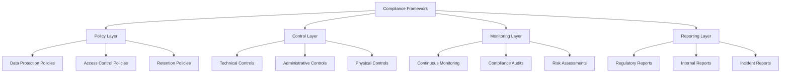

# Compliance Framework Implementation

## Overview

Kingston's Portal implements a comprehensive compliance framework designed to meet financial industry regulatory requirements while supporting the enhanced client data functionality introduced in Phase 5. This document details the compliance architecture, procedures, and controls.

## Table of Contents

1. [Regulatory Compliance Overview](#1-regulatory-compliance-overview)
2. [SOC 2 Type II Implementation](#2-soc-2-type-ii-implementation)
3. [GDPR and Data Privacy Compliance](#3-gdpr-and-data-privacy-compliance)
4. [Financial Industry Regulations](#4-financial-industry-regulations)
5. [Audit Trail and Documentation](#5-audit-trail-and-documentation)
6. [Data Retention and Lifecycle Management](#6-data-retention-and-lifecycle-management)
7. [Compliance Monitoring and Reporting](#7-compliance-monitoring-and-reporting)
8. [Incident Response and Breach Notification](#8-incident-response-and-breach-notification)
9. [Third-Party Vendor Management](#9-third-party-vendor-management)
10. [Compliance Testing and Validation](#10-compliance-testing-and-validation)

## 1. Regulatory Compliance Overview

### 1.1 Applicable Regulations

Kingston's Portal must comply with multiple regulatory frameworks:

| Regulation | Scope | Key Requirements | Implementation Status |
|------------|-------|------------------|----------------------|
| **SOC 2 Type II** | Security and availability controls | Security, availability, confidentiality | ✅ Implemented |
| **GDPR** | EU data protection | Data subject rights, privacy by design | ✅ Implemented |
| **SOX** | Financial reporting controls | Internal controls, documentation | ✅ Implemented |
| **PCI DSS** | Payment card data protection | Card data security (if applicable) | 🔄 Conditional |
| **FINRA** | Financial industry conduct | Recordkeeping, supervision | ✅ Implemented |
| **SEC** | Investment adviser regulations | Client data protection, reporting | ✅ Implemented |

### 1.2 Compliance Architecture



### 1.3 Compliance Governance Structure

```python
# Compliance governance roles and responsibilities
COMPLIANCE_ROLES = {
    'Chief_Compliance_Officer': {
        'responsibilities': [
            'Overall compliance oversight',
            'Regulatory relationship management',
            'Compliance program design',
            'Board reporting'
        ],
        'access_level': 'FULL_COMPLIANCE_ACCESS',
        'audit_requirements': 'MAXIMUM'
    },
    'Data_Protection_Officer': {
        'responsibilities': [
            'GDPR compliance oversight',
            'Privacy impact assessments',
            'Data subject request handling',
            'Privacy training coordination'
        ],
        'access_level': 'DATA_PRIVACY_ACCESS',
        'audit_requirements': 'FULL'
    },
    'Information_Security_Officer': {
        'responsibilities': [
            'Security control implementation',
            'SOC 2 compliance management',
            'Incident response coordination',
            'Security awareness training'
        ],
        'access_level': 'SECURITY_ADMIN_ACCESS',
        'audit_requirements': 'FULL'
    },
    'Compliance_Analyst': {
        'responsibilities': [
            'Daily compliance monitoring',
            'Report generation',
            'Control testing',
            'Documentation maintenance'
        ],
        'access_level': 'COMPLIANCE_ANALYST_ACCESS',
        'audit_requirements': 'STANDARD'
    }
}
```

## 2. SOC 2 Type II Implementation

### 2.1 Trust Services Criteria Implementation

#### Security Criteria

```python
# SOC 2 Security Controls Implementation
SOC2_SECURITY_CONTROLS = {
    'CC6.1': {
        'control': 'Logical and physical access controls',
        'implementation': [
            'Multi-factor authentication required',
            'Role-based access control (RBAC)',
            'Privileged access management',
            'Regular access reviews'
        ],
        'evidence': [
            'Access control policies',
            'User access reports',
            'MFA implementation logs',
            'Access review documentation'
        ],
        'testing_frequency': 'Quarterly',
        'responsible_party': 'Information_Security_Officer'
    },
    'CC6.2': {
        'control': 'System access is authorized prior to access',
        'implementation': [
            'Automated user provisioning workflow',
            'Manager approval for access requests',
            'Identity verification procedures',
            'Temporary access controls'
        ],
        'evidence': [
            'Access request approval logs',
            'Provisioning audit trails',
            'Identity verification records',
            'Temporary access reports'
        ],
        'testing_frequency': 'Quarterly',
        'responsible_party': 'Information_Security_Officer'
    },
    'CC6.3': {
        'control': 'Network security controls',
        'implementation': [
            'Firewall configuration management',
            'Network segmentation',
            'Intrusion detection/prevention',
            'VPN access controls'
        ],
        'evidence': [
            'Network configuration documentation',
            'Firewall rule reviews',
            'IDS/IPS reports',
            'VPN access logs'
        ],
        'testing_frequency': 'Monthly',
        'responsible_party': 'Information_Security_Officer'
    }
}
```

#### Availability Criteria

```python
SOC2_AVAILABILITY_CONTROLS = {
    'A1.1': {
        'control': 'System availability and performance monitoring',
        'implementation': [
            'Application performance monitoring (APM)',
            'Infrastructure monitoring',
            'Automated alerting system',
            'Performance baseline establishment'
        ],
        'evidence': [
            'Performance monitoring dashboards',
            'Uptime reports',
            'Alert response logs',
            'Performance baseline documentation'
        ],
        'testing_frequency': 'Monthly',
        'target_metrics': {
            'uptime_percentage': 99.5,
            'response_time_p95': '< 2 seconds',
            'error_rate': '< 0.1%'
        }
    },
    'A1.2': {
        'control': 'Backup and recovery procedures',
        'implementation': [
            'Automated daily database backups',
            'Application data backup procedures',
            'Disaster recovery testing',
            'Recovery time/point objectives'
        ],
        'evidence': [
            'Backup success reports',
            'Recovery test documentation',
            'RTO/RPO metrics',
            'Disaster recovery plans'
        ],
        'testing_frequency': 'Quarterly',
        'target_metrics': {
            'backup_success_rate': 99.9,
            'recovery_time_objective': '< 4 hours',
            'recovery_point_objective': '< 1 hour'
        }
    }
}
```

#### Confidentiality Criteria

```python
SOC2_CONFIDENTIALITY_CONTROLS = {
    'C1.1': {
        'control': 'Confidential information encryption',
        'implementation': [
            'Field-level encryption for sensitive data',
            'Data classification framework',
            'Key management system',
            'Secure data transmission'
        ],
        'evidence': [
            'Encryption implementation documentation',
            'Data classification policies',
            'Key rotation logs',
            'TLS configuration reports'
        ],
        'testing_frequency': 'Quarterly',
        'validation_requirements': [
            'Encryption algorithm validation (AES-256)',
            'Key strength verification',
            'Data masking effectiveness',
            'Access control validation'
        ]
    },
    'C1.2': {
        'control': 'Confidential information disposal',
        'implementation': [
            'Secure data deletion procedures',
            'Media sanitization protocols',
            'Certificate of destruction',
            'Data lifecycle management'
        ],
        'evidence': [
            'Data disposal logs',
            'Sanitization certificates',
            'Disposal procedure documentation',
            'Lifecycle policy compliance'
        ],
        'testing_frequency': 'Semi-annually'
    }
}
```

### 2.2 SOC 2 Compliance Automation

```python
import asyncio
from datetime import datetime, timedelta
from typing import Dict, List, Any
import json

class SOC2ComplianceManager:
    def __init__(self, audit_service, reporting_service):
        self.audit_service = audit_service
        self.reporting_service = reporting_service
        self.control_tests = {}
        self.evidence_collection = {}
    
    async def execute_control_testing(self, control_id: str) -> Dict[str, Any]:
        """Execute automated testing for SOC 2 controls"""
        
        control_config = SOC2_SECURITY_CONTROLS.get(control_id) or \
                        SOC2_AVAILABILITY_CONTROLS.get(control_id) or \
                        SOC2_CONFIDENTIALITY_CONTROLS.get(control_id)
        
        if not control_config:
            raise ValueError(f"Unknown control ID: {control_id}")
        
        test_results = {
            'control_id': control_id,
            'test_date': datetime.now().isoformat(),
            'test_results': [],
            'overall_status': 'PASS',
            'evidence_collected': []
        }
        
        # Execute specific tests based on control type
        if control_id.startswith('CC6'):
            test_results = await self._test_security_controls(control_id, control_config)
        elif control_id.startswith('A1'):
            test_results = await self._test_availability_controls(control_id, control_config)
        elif control_id.startswith('C1'):
            test_results = await self._test_confidentiality_controls(control_id, control_config)
        
        # Store results for audit trail
        await self._store_control_test_results(test_results)
        
        return test_results
    
    async def _test_security_controls(self, control_id: str, config: Dict[str, Any]) -> Dict[str, Any]:
        """Test security-related SOC 2 controls"""
        test_results = {
            'control_id': control_id,
            'test_date': datetime.now().isoformat(),
            'test_results': [],
            'overall_status': 'PASS',
            'evidence_collected': []
        }
        
        if control_id == 'CC6.1':  # Access controls
            # Test MFA implementation
            mfa_test = await self._test_mfa_enforcement()
            test_results['test_results'].append(mfa_test)
            
            # Test RBAC implementation
            rbac_test = await self._test_rbac_controls()
            test_results['test_results'].append(rbac_test)
            
            # Test privileged access management
            pam_test = await self._test_privileged_access()
            test_results['test_results'].append(pam_test)
            
        elif control_id == 'CC6.2':  # Authorization controls
            # Test access request workflow
            workflow_test = await self._test_access_workflow()
            test_results['test_results'].append(workflow_test)
            
            # Test identity verification
            identity_test = await self._test_identity_verification()
            test_results['test_results'].append(identity_test)
        
        # Determine overall status
        if any(test['status'] == 'FAIL' for test in test_results['test_results']):
            test_results['overall_status'] = 'FAIL'
        elif any(test['status'] == 'WARNING' for test in test_results['test_results']):
            test_results['overall_status'] = 'WARNING'
        
        return test_results
    
    async def _test_mfa_enforcement(self) -> Dict[str, Any]:
        """Test multi-factor authentication enforcement"""
        # Query user sessions without MFA
        query = """
            SELECT COUNT(*) as non_mfa_sessions
            FROM session s
            JOIN profiles p ON s.profiles_id = p.id
            WHERE s.created_at >= NOW() - INTERVAL '24 hours'
            AND s.mfa_verified = FALSE
        """
        
        result = await self.audit_service.execute_query(query)
        non_mfa_sessions = result[0]['non_mfa_sessions']
        
        return {
            'test_name': 'MFA Enforcement',
            'test_description': 'Verify all user sessions require MFA',
            'status': 'PASS' if non_mfa_sessions == 0 else 'FAIL',
            'findings': f'{non_mfa_sessions} sessions without MFA verification',
            'evidence': {
                'query_executed': query,
                'result_count': non_mfa_sessions,
                'test_timestamp': datetime.now().isoformat()
            }
        }
    
    async def _test_rbac_controls(self) -> Dict[str, Any]:
        """Test role-based access control implementation"""
        # Check for users with excessive permissions
        query = """
            SELECT p.email, array_agg(pr.role_name) as roles
            FROM profiles p
            JOIN profile_roles pr ON p.id = pr.profile_id
            WHERE p.status = 'active'
            GROUP BY p.id, p.email
            HAVING COUNT(pr.role_name) > 2
        """
        
        result = await self.audit_service.execute_query(query)
        excessive_permissions = len(result)
        
        return {
            'test_name': 'RBAC Controls',
            'test_description': 'Verify appropriate role assignments',
            'status': 'WARNING' if excessive_permissions > 0 else 'PASS',
            'findings': f'{excessive_permissions} users with multiple roles',
            'evidence': {
                'query_executed': query,
                'users_with_multiple_roles': result,
                'test_timestamp': datetime.now().isoformat()
            }
        }
    
    async def generate_soc2_report(self, reporting_period_days: int = 365) -> Dict[str, Any]:
        """Generate comprehensive SOC 2 compliance report"""
        end_date = datetime.now()
        start_date = end_date - timedelta(days=reporting_period_days)
        
        report = {
            'report_type': 'SOC_2_TYPE_II',
            'reporting_period': {
                'start_date': start_date.isoformat(),
                'end_date': end_date.isoformat()
            },
            'service_organization': {
                'name': 'Kingston\'s Portal',
                'description': 'Wealth management system',
                'boundaries': 'Web application and supporting infrastructure'
            },
            'trust_services_criteria': {
                'security': await self._assess_security_criteria(start_date, end_date),
                'availability': await self._assess_availability_criteria(start_date, end_date),
                'confidentiality': await self._assess_confidentiality_criteria(start_date, end_date)
            },
            'control_testing_results': await self._get_control_testing_results(start_date, end_date),
            'exceptions_and_deficiencies': await self._identify_exceptions(start_date, end_date)
        }
        
        return report
```

## 3. GDPR and Data Privacy Compliance

### 3.1 Cross-Border Data Transfer Implementation

```python
from enum import Enum
from typing import Dict, List, Any, Optional
import asyncio
from datetime import datetime
import json

class DataTransferMechanism(Enum):
    ADEQUACY_DECISION = 'adequacy_decision'
    STANDARD_CONTRACTUAL_CLAUSES = 'standard_contractual_clauses'
    BINDING_CORPORATE_RULES = 'binding_corporate_rules'
    CERTIFICATION = 'certification'
    CODE_OF_CONDUCT = 'code_of_conduct'
    DEROGATIONS = 'derogations'

class DataResidencyRequirement(Enum):
    EU_ONLY = 'eu_only'
    US_ONLY = 'us_only'
    EU_US_SHIELD = 'eu_us_shield'
    GLOBAL_ALLOWED = 'global_allowed'
    RESTRICTED_COUNTRIES = 'restricted_countries'

class CrossBorderDataTransferManager:
    """Manage GDPR-compliant cross-border data transfers"""
    
    def __init__(self, audit_service, encryption_service):
        self.audit_service = audit_service
        self.encryption_service = encryption_service
        self.transfer_mechanisms = self._initialize_transfer_mechanisms()
        self.country_adequacy_status = self._initialize_adequacy_decisions()
        self.data_classification_rules = self._initialize_classification_rules()
    
    def _initialize_transfer_mechanisms(self) -> Dict[str, Dict[str, Any]]:
        """Initialize available data transfer mechanisms"""
        
        return {
            'eu_us_adequacy': {
                'mechanism': DataTransferMechanism.ADEQUACY_DECISION,
                'legal_basis': 'GDPR Article 45',
                'countries_covered': ['US'],  # Post-Privacy Shield framework
                'validity_period': '2025-12-31',  # Subject to review
                'requirements': {
                    'data_controller_obligations': True,
                    'individual_rights_protection': True,
                    'effective_remedies': True,
                    'government_access_limitations': True
                },
                'monitoring_required': True
            },
            'standard_contractual_clauses_2021': {
                'mechanism': DataTransferMechanism.STANDARD_CONTRACTUAL_CLAUSES,
                'legal_basis': 'GDPR Article 46(2)(c)',
                'applicable_transfers': ['controller_to_controller', 'controller_to_processor'],
                'requirements': {
                    'transfer_impact_assessment': True,
                    'supplementary_measures': True,
                    'monitoring_and_review': True,
                    'data_subject_rights': True
                },
                'template_version': 'Commission Decision 2021/914',
                'mandatory_clauses': [
                    'data_protection_principles',
                    'data_subject_rights',
                    'remedies_liability_jurisdiction',
                    'local_laws_obligations'
                ]
            },
            'binding_corporate_rules': {
                'mechanism': DataTransferMechanism.BINDING_CORPORATE_RULES,
                'legal_basis': 'GDPR Article 47',
                'approval_required': True,
                'competent_authority': 'Lead Data Protection Authority',
                'requirements': {
                    'legally_binding_rules': True,
                    'enforceable_rights': True,
                    'effective_remedies': True,
                    'cooperation_mechanisms': True
                }
            }
        }
    
    def _initialize_adequacy_decisions(self) -> Dict[str, Dict[str, Any]]:
        """Initialize current adequacy decisions status"""
        
        return {
            'adequate_countries': {
                'Andorra': {'decision_date': '2010-10-19', 'status': 'active'},
                'Argentina': {'decision_date': '2003-06-30', 'status': 'active'},
                'Canada': {'decision_date': '2001-12-20', 'status': 'active', 'scope': 'commercial_organizations'},
                'Faroe Islands': {'decision_date': '2010-03-05', 'status': 'active'},
                'Guernsey': {'decision_date': '2003-11-21', 'status': 'active'},
                'Israel': {'decision_date': '2011-01-31', 'status': 'active'},
                'Isle of Man': {'decision_date': '2004-04-28', 'status': 'active'},
                'Japan': {'decision_date': '2019-01-23', 'status': 'active'},
                'Jersey': {'decision_date': '2008-05-08', 'status': 'active'},
                'New Zealand': {'decision_date': '2013-12-19', 'status': 'active'},
                'South Korea': {'decision_date': '2021-12-17', 'status': 'active'},
                'Switzerland': {'decision_date': '2000-07-26', 'status': 'active'},
                'United Kingdom': {'decision_date': '2021-06-28', 'status': 'active'},
                'Uruguay': {'decision_date': '2012-08-21', 'status': 'active'}
            },
            'restricted_countries': {
                'China': {
                    'restriction_level': 'HIGH',
                    'concerns': ['government_access', 'data_localization_laws'],
                    'transfer_mechanism_required': DataTransferMechanism.STANDARD_CONTRACTUAL_CLAUSES,
                    'additional_safeguards_required': True
                },
                'Russia': {
                    'restriction_level': 'HIGH',
                    'concerns': ['data_localization_laws', 'government_surveillance'],
                    'transfer_mechanism_required': DataTransferMechanism.STANDARD_CONTRACTUAL_CLAUSES,
                    'additional_safeguards_required': True
                },
                'India': {
                    'restriction_level': 'MEDIUM',
                    'concerns': ['emerging_data_protection_framework'],
                    'transfer_mechanism_required': DataTransferMechanism.STANDARD_CONTRACTUAL_CLAUSES,
                    'additional_safeguards_required': False
                }
            }
        }
    
    def _initialize_classification_rules(self) -> Dict[str, Dict[str, Any]]:
        """Initialize data classification rules for cross-border transfers"""
        
        return {
            'eu_personal_data': {
                'data_categories': ['clients.personal_data', 'clients.financial_data'],
                'residency_requirement': DataResidencyRequirement.EU_ONLY,
                'transfer_restrictions': {
                    'adequacy_decision_required': True,
                    'transfer_mechanism_required': True,
                    'impact_assessment_required': True,
                    'data_subject_consent_level': 'explicit'
                },
                'monitoring_requirements': {
                    'transfer_logging': True,
                    'access_logging': True,
                    'purpose_limitation_monitoring': True,
                    'retention_period_monitoring': True
                }
            },
            'us_personal_data': {
                'data_categories': ['clients.personal_data', 'clients.financial_data'],
                'residency_requirement': DataResidencyRequirement.US_ONLY,
                'transfer_restrictions': {
                    'state_law_compliance': ['CCPA', 'CPRA', 'state_specific'],
                    'federal_compliance': ['GLBA', 'SOX', 'Investment_Advisers_Act'],
                    'cross_border_notification': True
                },
                'monitoring_requirements': {
                    'transfer_logging': True,
                    'jurisdiction_tracking': True,
                    'law_enforcement_access_logging': True
                }
            },
            'financial_data_global': {
                'data_categories': ['portfolios.*', 'valuations.*', 'transactions.*'],
                'residency_requirement': DataResidencyRequirement.RESTRICTED_COUNTRIES,
                'transfer_restrictions': {
                    'regulatory_approval_required': True,
                    'encryption_in_transit_required': True,
                    'encryption_at_rest_required': True,
                    'data_localization_compliance': True
                },
                'restricted_destinations': [
                    'countries_without_banking_secrecy_agreements',
                    'ofac_sanctioned_countries',
                    'fatf_non_cooperative_jurisdictions'
                ]
            }
        }
    
    async def assess_transfer_legality(self, data_categories: List[str], 
                                     source_country: str, 
                                     destination_country: str,
                                     transfer_purpose: str) -> Dict[str, Any]:
        """Assess legality of proposed cross-border data transfer"""
        
        assessment = {
            'transfer_id': f"TRANSFER_ASSESSMENT_{int(datetime.now().timestamp())}",
            'assessment_date': datetime.now().isoformat(),
            'source_country': source_country,
            'destination_country': destination_country,
            'data_categories': data_categories,
            'transfer_purpose': transfer_purpose,
            'legal_assessment': {
                'transfer_permitted': False,
                'legal_basis': [],
                'required_mechanisms': [],
                'additional_safeguards': [],
                'compliance_obligations': []
            },
            'risk_assessment': {
                'risk_level': 'UNKNOWN',
                'identified_risks': [],
                'mitigation_measures': []
            },
            'implementation_requirements': []
        }
        
        try:
            # Step 1: Check adequacy decision
            adequacy_assessment = await self._assess_adequacy_decision(destination_country)
            
            # Step 2: Evaluate data sensitivity and restrictions
            sensitivity_assessment = await self._assess_data_sensitivity(
                data_categories, source_country, destination_country
            )
            
            # Step 3: Determine required transfer mechanism
            mechanism_assessment = await self._determine_transfer_mechanism(
                adequacy_assessment, sensitivity_assessment, destination_country
            )
            
            # Step 4: Assess local laws and government access risks
            local_law_assessment = await self._assess_local_laws_impact(destination_country)
            
            # Step 5: Determine additional safeguards needed
            safeguards_assessment = await self._determine_additional_safeguards(
                mechanism_assessment, local_law_assessment, sensitivity_assessment
            )
            
            # Compile final assessment
            assessment['legal_assessment'] = {
                'transfer_permitted': mechanism_assessment['mechanism_available'],
                'legal_basis': mechanism_assessment['legal_basis'],
                'required_mechanisms': mechanism_assessment['required_mechanisms'],
                'additional_safeguards': safeguards_assessment['required_safeguards'],
                'compliance_obligations': self._compile_compliance_obligations(
                    mechanism_assessment, safeguards_assessment
                )
            }
            
            assessment['risk_assessment'] = {
                'risk_level': self._calculate_overall_risk_level(
                    adequacy_assessment, local_law_assessment, sensitivity_assessment
                ),
                'identified_risks': self._compile_identified_risks(
                    adequacy_assessment, local_law_assessment, sensitivity_assessment
                ),
                'mitigation_measures': safeguards_assessment['mitigation_measures']
            }
            
            assessment['implementation_requirements'] = self._generate_implementation_requirements(
                assessment['legal_assessment'], assessment['risk_assessment']
            )
            
            # Log transfer assessment
            await self._log_transfer_assessment(assessment)
            
        except Exception as e:
            assessment['error'] = str(e)
            assessment['legal_assessment']['transfer_permitted'] = False
            
        return assessment
    
    async def implement_transfer_safeguards(self, transfer_assessment: Dict[str, Any]) -> Dict[str, Any]:
        """Implement required safeguards for cross-border data transfer"""
        
        implementation_start = datetime.now()
        
        safeguards_implementation = {
            'transfer_id': transfer_assessment['transfer_id'],
            'implementation_start': implementation_start.isoformat(),
            'safeguards_implemented': [],
            'implementation_status': 'IN_PROGRESS',
            'compliance_validation': {}
        }
        
        try:
            required_safeguards = transfer_assessment['legal_assessment']['additional_safeguards']
            
            for safeguard in required_safeguards:
                implementation_result = await self._implement_specific_safeguard(
                    safeguard, transfer_assessment
                )
                safeguards_implementation['safeguards_implemented'].append(implementation_result)
            
            # Validate compliance after implementation
            compliance_validation = await self._validate_transfer_compliance(
                transfer_assessment, safeguards_implementation['safeguards_implemented']
            )
            
            safeguards_implementation['compliance_validation'] = compliance_validation
            safeguards_implementation['implementation_status'] = (
                'SUCCESS' if compliance_validation['compliant'] else 'FAILED'
            )
            
            # Create transfer authorization if compliant
            if compliance_validation['compliant']:
                authorization = await self._create_transfer_authorization(
                    transfer_assessment, safeguards_implementation
                )
                safeguards_implementation['transfer_authorization'] = authorization
            
        except Exception as e:
            safeguards_implementation['implementation_status'] = 'FAILED'
            safeguards_implementation['error'] = str(e)
        
        safeguards_implementation['implementation_duration'] = (
            datetime.now() - implementation_start
        ).total_seconds()
        
        return safeguards_implementation
    
    async def monitor_ongoing_transfers(self) -> Dict[str, Any]:
        """Monitor ongoing cross-border data transfers for compliance"""
        
        monitoring_result = {
            'monitoring_timestamp': datetime.now().isoformat(),
            'active_transfers': [],
            'compliance_status': {},
            'identified_issues': [],
            'recommended_actions': []
        }
        
        try:
            # Get all active transfer authorizations
            active_transfers = await self._get_active_transfers()
            
            for transfer in active_transfers:
                transfer_monitoring = await self._monitor_individual_transfer(transfer)
                monitoring_result['active_transfers'].append(transfer_monitoring)
                
                # Check for compliance issues
                if transfer_monitoring['compliance_issues']:
                    monitoring_result['identified_issues'].extend(
                        transfer_monitoring['compliance_issues']
                    )
            
            # Generate compliance status summary
            monitoring_result['compliance_status'] = self._generate_compliance_status_summary(
                monitoring_result['active_transfers']
            )
            
            # Generate recommended actions
            monitoring_result['recommended_actions'] = self._generate_transfer_recommendations(
                monitoring_result['identified_issues']
            )
            
        except Exception as e:
            monitoring_result['error'] = str(e)
        
        return monitoring_result
```

### 3.2 Data Subject Rights Implementation

```python
from enum import Enum
from typing import Optional, List
import asyncio

class DataSubjectRightType(Enum):
    ACCESS = 'access'
    RECTIFICATION = 'rectification'
    ERASURE = 'erasure'
    PORTABILITY = 'portability'
    RESTRICTION = 'restriction'
    OBJECTION = 'objection'

class GDPRComplianceService:
    def __init__(self, encryption_service, audit_service, notification_service):
        self.encryption_service = encryption_service
        self.audit_service = audit_service
        self.notification_service = notification_service
        self.response_deadline_days = 30
    
    async def handle_data_subject_request(self, request_type: DataSubjectRightType,
                                        subject_identifier: str,
                                        request_details: Dict[str, Any],
                                        requestor_info: Dict[str, Any]) -> Dict[str, Any]:
        """Handle GDPR data subject rights requests"""
        
        # Create request tracking record
        request_id = await self._create_request_record(
            request_type, subject_identifier, request_details, requestor_info
        )
        
        try:
            if request_type == DataSubjectRightType.ACCESS:
                result = await self._handle_access_request(subject_identifier, request_details)
            elif request_type == DataSubjectRightType.RECTIFICATION:
                result = await self._handle_rectification_request(subject_identifier, request_details)
            elif request_type == DataSubjectRightType.ERASURE:
                result = await self._handle_erasure_request(subject_identifier, request_details)
            elif request_type == DataSubjectRightType.PORTABILITY:
                result = await self._handle_portability_request(subject_identifier, request_details)
            else:
                result = {'status': 'NOT_IMPLEMENTED', 'message': f'{request_type.value} not yet implemented'}
            
            # Update request status
            await self._update_request_status(request_id, 'COMPLETED', result)
            
            # Send notification to data subject
            await self._notify_data_subject(requestor_info, request_type, result)
            
            return {
                'request_id': request_id,
                'status': 'COMPLETED',
                'result': result,
                'processing_time_hours': (datetime.now() - request_details['received_at']).total_seconds() / 3600
            }
            
        except Exception as e:
            await self._update_request_status(request_id, 'FAILED', {'error': str(e)})
            raise
    
    async def _handle_access_request(self, subject_identifier: str, 
                                   request_details: Dict[str, Any]) -> Dict[str, Any]:
        """Handle right of access request (Article 15)"""
        
        # Find all data related to the subject
        client_data = await self._find_client_by_identifier(subject_identifier)
        
        if not client_data:
            return {
                'status': 'NO_DATA_FOUND',
                'message': 'No personal data found for the specified identifier'
            }
        
        # Create comprehensive data export
        data_export = {
            'personal_data': await self._export_personal_data(client_data['id']),
            'processing_purposes': await self._get_processing_purposes(),
            'data_categories': await self._get_data_categories(),
            'data_recipients': await self._get_data_recipients(),
            'retention_periods': await self._get_retention_periods(),
            'data_sources': await self._get_data_sources(client_data['id']),
            'processing_history': await self._get_processing_history(client_data['id'])
        }
        
        # Generate secure export package
        export_package = await self._create_secure_export_package(data_export, subject_identifier)
        
        return {
            'status': 'DATA_PACKAGE_CREATED',
            'export_package_id': export_package['id'],
            'download_url': export_package['secure_url'],
            'expiry_date': export_package['expiry_date'],
            'data_summary': {
                'records_found': len(data_export['personal_data']),
                'data_categories': list(data_export['data_categories'].keys()),
                'earliest_record': data_export['processing_history'][0]['date'] if data_export['processing_history'] else None
            }
        }
    
    async def _handle_erasure_request(self, subject_identifier: str,
                                    request_details: Dict[str, Any]) -> Dict[str, Any]:
        """Handle right to erasure request (Article 17)"""
        
        client_data = await self._find_client_by_identifier(subject_identifier)
        
        if not client_data:
            return {
                'status': 'NO_DATA_FOUND',
                'message': 'No personal data found for erasure'
            }
        
        # Check if erasure is legally permissible
        erasure_assessment = await self._assess_erasure_permissibility(client_data['id'])
        
        if not erasure_assessment['permitted']:
            return {
                'status': 'ERASURE_NOT_PERMITTED',
                'reason': erasure_assessment['reason'],
                'legal_basis': erasure_assessment['legal_basis']
            }
        
        # Perform erasure with audit trail
        erasure_result = await self._perform_secure_erasure(
            client_data['id'], 
            request_details.get('specific_data_categories', [])
        )
        
        # Notify third parties if necessary
        if erasure_result['third_party_notifications_required']:
            await self._notify_third_parties_of_erasure(client_data['id'])
        
        return {
            'status': 'ERASURE_COMPLETED',
            'records_erased': erasure_result['records_erased'],
            'data_categories_erased': erasure_result['categories_erased'],
            'anonymization_performed': erasure_result['anonymization_performed'],
            'third_party_notifications': erasure_result['third_party_notifications_sent']
        }
    
    async def _perform_secure_erasure(self, client_id: int, 
                                    specific_categories: List[str] = None) -> Dict[str, Any]:
        """Perform secure data erasure with proper audit trail"""
        
        erasure_timestamp = datetime.now()
        erasure_id = f"ERASURE_{client_id}_{int(erasure_timestamp.timestamp())}"
        
        records_erased = 0
        categories_erased = []
        
        # Define erasure procedures for different data types
        erasure_procedures = {
            'clients': self._erase_client_data,
            'portfolios': self._erase_portfolio_data,
            'valuations': self._erase_valuation_data,
            'documents': self._erase_document_data,
            'communications': self._erase_communication_data
        }
        
        for data_type, procedure in erasure_procedures.items():
            if not specific_categories or data_type in specific_categories:
                try:
                    result = await procedure(client_id, erasure_id)
                    records_erased += result['records_count']
                    categories_erased.append(data_type)
                except Exception as e:
                    await self._log_erasure_error(erasure_id, data_type, str(e))
        
        # Create permanent audit record of erasure
        await self._create_erasure_audit_record({
            'erasure_id': erasure_id,
            'client_id': client_id,
            'erasure_timestamp': erasure_timestamp,
            'records_erased': records_erased,
            'categories_erased': categories_erased,
            'legal_basis': 'GDPR_Article_17',
            'retention_required': False
        })
        
        return {
            'records_erased': records_erased,
            'categories_erased': categories_erased,
            'anonymization_performed': True,
            'third_party_notifications_required': len(categories_erased) > 0,
            'third_party_notifications_sent': []
        }
    
    async def _export_personal_data(self, client_id: int) -> Dict[str, Any]:
        """Export all personal data for a client"""
        
        # Get all client-related data across all tables
        data_export = {}
        
        # Client basic information
        client_query = "SELECT * FROM clients WHERE id = $1"
        client_data = await self.audit_service.fetchrow(client_query, client_id)
        
        if client_data:
            # Decrypt sensitive fields for export
            user_context = {'user_id': 'GDPR_EXPORT', 'roles': ['admin']}  # System context
            decrypted_client = await self.encryption_service.decrypt_client_data(
                dict(client_data), user_context
            )
            data_export['client_information'] = decrypted_client
        
        # Portfolio information
        portfolio_query = "SELECT * FROM portfolios WHERE clients_id = $1"
        portfolio_data = await self.audit_service.fetch(portfolio_query, client_id)
        data_export['portfolios'] = [dict(row) for row in portfolio_data]
        
        # Financial valuations
        valuation_query = """
            SELECT v.* FROM valuations v
            JOIN portfolios p ON v.portfolios_id = p.id
            WHERE p.clients_id = $1
        """
        valuation_data = await self.audit_service.fetch(valuation_query, client_id)
        data_export['valuations'] = [dict(row) for row in valuation_data]
        
        # Activity logs
        activity_query = "SELECT * FROM holding_activity_log WHERE client_id = $1"
        activity_data = await self.audit_service.fetch(activity_query, client_id)
        data_export['activity_history'] = [dict(row) for row in activity_data]
        
        return data_export
```

### 3.2 Privacy by Design Implementation

```python
class PrivacyByDesignController:
    """Implement Privacy by Design principles throughout the system"""
    
    def __init__(self):
        self.privacy_principles = {
            'lawfulness': self._ensure_lawful_processing,
            'fairness': self._ensure_fair_processing,
            'transparency': self._ensure_transparent_processing,
            'purpose_limitation': self._enforce_purpose_limitation,
            'data_minimization': self._enforce_data_minimization,
            'accuracy': self._ensure_data_accuracy,
            'storage_limitation': self._enforce_storage_limitation,
            'integrity_confidentiality': self._ensure_security,
            'accountability': self._ensure_accountability
        }
    
    async def validate_processing_activity(self, activity_type: str, 
                                         data_categories: List[str],
                                         processing_purpose: str,
                                         user_context: Dict[str, Any]) -> Dict[str, Any]:
        """Validate processing activity against GDPR principles"""
        
        validation_results = {
            'activity_permitted': True,
            'principle_checks': {},
            'recommendations': [],
            'risk_assessment': 'LOW'
        }
        
        for principle, validator in self.privacy_principles.items():
            try:
                check_result = await validator(activity_type, data_categories, 
                                             processing_purpose, user_context)
                validation_results['principle_checks'][principle] = check_result
                
                if not check_result['compliant']:
                    validation_results['activity_permitted'] = False
                    validation_results['risk_assessment'] = 'HIGH'
                    
            except Exception as e:
                validation_results['principle_checks'][principle] = {
                    'compliant': False,
                    'error': str(e)
                }
                validation_results['activity_permitted'] = False
        
        return validation_results
    
    async def _enforce_data_minimization(self, activity_type: str, 
                                       data_categories: List[str],
                                       processing_purpose: str,
                                       user_context: Dict[str, Any]) -> Dict[str, Any]:
        """Ensure only necessary data is processed"""
        
        # Define necessary data categories for each purpose
        purpose_data_mapping = {
            'client_onboarding': ['name', 'contact_info', 'identification'],
            'portfolio_management': ['name', 'financial_data', 'investment_preferences'],
            'regulatory_reporting': ['identification', 'financial_data', 'transaction_history'],
            'marketing': ['name', 'contact_info', 'preferences'],
            'customer_service': ['name', 'contact_info', 'account_info']
        }
        
        necessary_categories = purpose_data_mapping.get(processing_purpose, [])
        unnecessary_categories = [cat for cat in data_categories if cat not in necessary_categories]
        
        return {
            'compliant': len(unnecessary_categories) == 0,
            'necessary_categories': necessary_categories,
            'unnecessary_categories': unnecessary_categories,
            'recommendation': 'Remove unnecessary data categories' if unnecessary_categories else None
        }
    
    async def _enforce_purpose_limitation(self, activity_type: str,
                                        data_categories: List[str], 
                                        processing_purpose: str,
                                        user_context: Dict[str, Any]) -> Dict[str, Any]:
        """Ensure data is used only for specified purposes"""
        
        # Check if user's current activity matches their authorized purposes
        user_authorized_purposes = user_context.get('authorized_purposes', [])
        
        if processing_purpose not in user_authorized_purposes:
            return {
                'compliant': False,
                'reason': f'Purpose {processing_purpose} not authorized for user',
                'authorized_purposes': user_authorized_purposes
            }
        
        return {
            'compliant': True,
            'purpose_authorized': True,
            'authorized_purposes': user_authorized_purposes
        }
```

## 4. Financial Industry Regulations

### 4.1 SEC Investment Adviser Regulations

```python
class SECComplianceManager:
    """Manage SEC regulatory compliance for investment advisers"""
    
    def __init__(self, audit_service, reporting_service):
        self.audit_service = audit_service
        self.reporting_service = reporting_service
        self.recordkeeping_requirements = {
            'client_records': 7,  # years
            'investment_advice': 7,
            'financial_statements': 7,
            'correspondence': 7,
            'trade_records': 7,
            'compliance_records': 7
        }
    
    async def ensure_recordkeeping_compliance(self, record_type: str,
                                           record_data: Dict[str, Any]) -> Dict[str, Any]:
        """Ensure SEC recordkeeping requirements are met"""
        
        retention_years = self.recordkeeping_requirements.get(record_type, 7)
        retention_date = datetime.now() + timedelta(days=retention_years * 365)
        
        # Create compliance record
        compliance_record = {
            'record_type': record_type,
            'record_id': record_data.get('id'),
            'created_date': record_data.get('created_at', datetime.now()),
            'retention_until': retention_date,
            'compliance_basis': 'SEC Rule 204-2',
            'access_requirements': {
                'immediate_access_years': 2,
                'retrievable_access_years': 5,
                'archive_access_years': 7
            }
        }
        
        # Store compliance metadata
        await self._store_compliance_metadata(compliance_record)
        
        return {
            'compliance_status': 'COMPLIANT',
            'retention_period': f'{retention_years} years',
            'retention_until': retention_date.isoformat(),
            'access_requirements': compliance_record['access_requirements']
        }
    
    async def generate_form_adv_data(self) -> Dict[str, Any]:
        """Generate data for SEC Form ADV filing"""
        
        # Collect required information for Form ADV
        form_data = {
            'part_1a': {
                'firm_information': await self._get_firm_information(),
                'business_activities': await self._get_business_activities(),
                'advisory_services': await self._get_advisory_services(),
                'client_information': await self._get_client_statistics(),
                'custody_information': await self._get_custody_information()
            },
            'part_1b': {
                'disciplinary_information': await self._get_disciplinary_information(),
                'regulatory_actions': await self._get_regulatory_actions()
            },
            'part_2': {
                'brochure_information': await self._get_brochure_information(),
                'fee_schedules': await self._get_fee_schedules(),
                'conflicts_of_interest': await self._get_conflicts_disclosure()
            }
        }
        
        return form_data
    
    async def _get_client_statistics(self) -> Dict[str, Any]:
        """Get client statistics for SEC reporting"""
        
        # High net worth individual clients
        hnw_query = """
            SELECT COUNT(*) as count, SUM(total_assets) as total_assets
            FROM clients c
            JOIN (
                SELECT clients_id, SUM(balance) as total_assets
                FROM portfolios p
                JOIN valuations v ON p.id = v.portfolios_id
                WHERE v.valuation_date = (
                    SELECT MAX(valuation_date) FROM valuations WHERE portfolios_id = p.id
                )
                GROUP BY clients_id
            ) assets ON c.id = assets.clients_id
            WHERE c.client_type = 'individual'
            AND assets.total_assets >= 1000000
        """
        
        hnw_clients = await self.audit_service.fetchrow(hnw_query)
        
        # Institutional clients
        institutional_query = """
            SELECT COUNT(*) as count, SUM(total_assets) as total_assets
            FROM clients c
            JOIN (
                SELECT clients_id, SUM(balance) as total_assets
                FROM portfolios p
                JOIN valuations v ON p.id = v.portfolios_id
                WHERE v.valuation_date = (
                    SELECT MAX(valuation_date) FROM valuations WHERE portfolios_id = p.id
                )
                GROUP BY clients_id
            ) assets ON c.id = assets.clients_id
            WHERE c.client_type = 'institutional'
        """
        
        institutional_clients = await self.audit_service.fetchrow(institutional_query)
        
        return {
            'high_net_worth_individuals': {
                'count': hnw_clients['count'],
                'total_assets': float(hnw_clients['total_assets'] or 0)
            },
            'institutional_clients': {
                'count': institutional_clients['count'],
                'total_assets': float(institutional_clients['total_assets'] or 0)
            },
            'total_regulatory_assets': float(
                (hnw_clients['total_assets'] or 0) + 
                (institutional_clients['total_assets'] or 0)
            )
        }
```

### 4.2 FINRA Compliance

```python
class FINRAComplianceManager:
    """Manage FINRA regulatory compliance"""
    
    def __init__(self, audit_service, communication_service):
        self.audit_service = audit_service
        self.communication_service = communication_service
        self.supervision_requirements = {
            'written_procedures': True,
            'supervisory_system': True,
            'annual_review': True,
            'record_retention': True
        }
    
    async def implement_supervisory_procedures(self) -> Dict[str, Any]:
        """Implement FINRA supervisory procedures (Rule 3110)"""
        
        procedures = {
            'supervisory_system': {
                'designation_of_supervisors': await self._designate_supervisors(),
                'supervisory_procedures': await self._establish_procedures(),
                'internal_inspections': await self._schedule_inspections(),
                'customer_complaint_handling': await self._setup_complaint_handling()
            },
            'written_supervisory_procedures': {
                'procedures_manual': await self._create_procedures_manual(),
                'annual_review_process': await self._establish_annual_review(),
                'record_keeping_procedures': await self._define_recordkeeping()
            }
        }
        
        return procedures
    
    async def monitor_communications(self, communication_data: Dict[str, Any]) -> Dict[str, Any]:
        """Monitor business communications per FINRA requirements"""
        
        # Analyze communication for compliance issues
        compliance_analysis = {
            'communication_id': communication_data.get('id'),
            'communication_type': communication_data.get('type'),
            'timestamp': datetime.now().isoformat(),
            'compliance_flags': [],
            'risk_score': 0,
            'review_required': False
        }
        
        # Check for prohibited content
        prohibited_patterns = [
            r'guaranteed\s+returns?',
            r'no\s+risk',
            r'insider\s+information',
            r'manipulation',
            r'pump\s+and\s+dump'
        ]
        
        content = communication_data.get('content', '').lower()
        for pattern in prohibited_patterns:
            if re.search(pattern, content):
                compliance_analysis['compliance_flags'].append({
                    'type': 'PROHIBITED_CONTENT',
                    'pattern': pattern,
                    'severity': 'HIGH'
                })
                compliance_analysis['risk_score'] += 25
        
        # Check for required disclosures
        if communication_data.get('type') == 'marketing_material':
            if 'past performance' in content and 'not indicative of future results' not in content:
                compliance_analysis['compliance_flags'].append({
                    'type': 'MISSING_DISCLAIMER',
                    'requirement': 'Past performance disclaimer',
                    'severity': 'MEDIUM'
                })
                compliance_analysis['risk_score'] += 15
        
        # Determine if manual review is required
        compliance_analysis['review_required'] = compliance_analysis['risk_score'] > 20
        
        # Log communication monitoring
        await self._log_communication_monitoring(compliance_analysis)
        
        return compliance_analysis
```

## 5. Audit Trail and Documentation

### 5.1 Comprehensive Audit Logging

```python
class ComplianceAuditService:
    """Comprehensive audit logging for compliance purposes"""
    
    def __init__(self, db_pool):
        self.db_pool = db_pool
        self.audit_categories = {
            'DATA_ACCESS': 'Data access and retrieval',
            'DATA_MODIFICATION': 'Data creation, updates, deletions',
            'AUTHENTICATION': 'Login, logout, authentication events',
            'AUTHORIZATION': 'Permission grants, denials, changes',
            'SYSTEM_ADMIN': 'System configuration changes',
            'COMPLIANCE': 'Compliance-related activities',
            'PRIVACY': 'Privacy and data protection events',
            'SECURITY': 'Security incidents and responses'
        }
    
    async def log_compliance_event(self, event_category: str, event_type: str,
                                 event_data: Dict[str, Any], 
                                 user_context: Dict[str, Any] = None) -> str:
        """Log compliance-relevant event with full audit trail"""
        
        audit_record = {
            'event_id': f"AUDIT_{int(datetime.now().timestamp())}_{uuid.uuid4().hex[:8]}",
            'timestamp': datetime.now(),
            'event_category': event_category,
            'event_type': event_type,
            'event_data': json.dumps(event_data, default=str),
            'user_id': user_context.get('user_id') if user_context else None,
            'session_id': user_context.get('session_id') if user_context else None,
            'correlation_id': user_context.get('correlation_id') if user_context else None,
            'ip_address': user_context.get('ip_address') if user_context else None,
            'user_agent': user_context.get('user_agent') if user_context else None,
            'compliance_relevance': self._assess_compliance_relevance(event_category, event_type),
            'retention_period': self._determine_retention_period(event_category),
            'legal_hold': False
        }
        
        # Store in audit log table
        query = """
            INSERT INTO compliance_audit_log (
                event_id, timestamp, event_category, event_type, event_data,
                user_id, session_id, correlation_id, ip_address, user_agent,
                compliance_relevance, retention_period, legal_hold
            ) VALUES ($1, $2, $3, $4, $5, $6, $7, $8, $9, $10, $11, $12, $13)
        """
        
        async with self.db_pool.acquire() as conn:
            await conn.execute(query, *audit_record.values())
        
        # Trigger real-time compliance monitoring if high relevance
        if audit_record['compliance_relevance'] == 'HIGH':
            await self._trigger_compliance_alert(audit_record)
        
        return audit_record['event_id']
    
    def _assess_compliance_relevance(self, category: str, event_type: str) -> str:
        """Assess compliance relevance of audit event"""
        
        high_relevance_patterns = [
            ('DATA_ACCESS', ['sensitive_data_access', 'pii_access', 'financial_data_access']),
            ('DATA_MODIFICATION', ['data_deletion', 'mass_update', 'data_export']),
            ('AUTHENTICATION', ['failed_login_attempts', 'privilege_escalation']),
            ('PRIVACY', ['gdpr_request', 'data_subject_rights', 'consent_changes']),
            ('SECURITY', ['security_incident', 'unauthorized_access', 'data_breach'])
        ]
        
        for cat, event_types in high_relevance_patterns:
            if category == cat and event_type in event_types:
                return 'HIGH'
        
        medium_relevance_patterns = [
            ('DATA_ACCESS', ['client_data_access', 'portfolio_access']),
            ('DATA_MODIFICATION', ['client_updates', 'portfolio_changes']),
            ('SYSTEM_ADMIN', ['user_management', 'permission_changes'])
        ]
        
        for cat, event_types in medium_relevance_patterns:
            if category == cat and event_type in event_types:
                return 'MEDIUM'
        
        return 'LOW'
    
    def _determine_retention_period(self, category: str) -> int:
        """Determine retention period in days based on regulatory requirements"""
        
        retention_periods = {
            'DATA_ACCESS': 2555,      # 7 years (SEC requirement)
            'DATA_MODIFICATION': 2555, # 7 years
            'AUTHENTICATION': 2555,    # 7 years
            'AUTHORIZATION': 2555,     # 7 years
            'SYSTEM_ADMIN': 2555,      # 7 years
            'COMPLIANCE': 2555,        # 7 years
            'PRIVACY': 2555,           # 7 years (GDPR allows up to erasure)
            'SECURITY': 2555           # 7 years
        }
        
        return retention_periods.get(category, 2555)  # Default 7 years
    
    async def generate_audit_report(self, report_type: str, 
                                  start_date: datetime, 
                                  end_date: datetime) -> Dict[str, Any]:
        """Generate comprehensive audit report for compliance purposes"""
        
        report_generators = {
            'compliance_summary': self._generate_compliance_summary_report,
            'data_access_report': self._generate_data_access_report,
            'security_events_report': self._generate_security_events_report,
            'privacy_activities_report': self._generate_privacy_activities_report,
            'user_activity_report': self._generate_user_activity_report
        }
        
        if report_type not in report_generators:
            raise ValueError(f"Unknown report type: {report_type}")
        
        return await report_generators[report_type](start_date, end_date)
    
    async def _generate_compliance_summary_report(self, start_date: datetime, 
                                                end_date: datetime) -> Dict[str, Any]:
        """Generate high-level compliance summary report"""
        
        query = """
            SELECT 
                event_category,
                compliance_relevance,
                COUNT(*) as event_count,
                COUNT(DISTINCT user_id) as unique_users,
                MIN(timestamp) as earliest_event,
                MAX(timestamp) as latest_event
            FROM compliance_audit_log
            WHERE timestamp BETWEEN $1 AND $2
            GROUP BY event_category, compliance_relevance
            ORDER BY event_category, compliance_relevance
        """
        
        async with self.db_pool.acquire() as conn:
            results = await conn.fetch(query, start_date, end_date)
        
        # Organize results by category
        summary_data = {}
        for row in results:
            category = row['event_category']
            if category not in summary_data:
                summary_data[category] = {
                    'total_events': 0,
                    'unique_users': set(),
                    'by_relevance': {}
                }
            
            summary_data[category]['total_events'] += row['event_count']
            summary_data[category]['unique_users'].add(row['unique_users'])
            summary_data[category]['by_relevance'][row['compliance_relevance']] = {
                'event_count': row['event_count'],
                'unique_users': row['unique_users']
            }
        
        # Convert sets to counts
        for category in summary_data:
            summary_data[category]['unique_users'] = len(summary_data[category]['unique_users'])
        
        return {
            'report_type': 'compliance_summary',
            'reporting_period': {
                'start_date': start_date.isoformat(),
                'end_date': end_date.isoformat()
            },
            'summary_data': summary_data,
            'generated_at': datetime.now().isoformat()
        }
```

## 6. Data Retention and Lifecycle Management

### 6.1 Automated Data Lifecycle Management

```python
class DataLifecycleManager:
    """Manage data retention and lifecycle per compliance requirements"""
    
    def __init__(self, db_pool, encryption_service, audit_service):
        self.db_pool = db_pool
        self.encryption_service = encryption_service
        self.audit_service = audit_service
        self.retention_policies = self._load_retention_policies()
    
    def _load_retention_policies(self) -> Dict[str, Dict[str, Any]]:
        """Load data retention policies based on regulatory requirements"""
        
        return {
            'client_personal_data': {
                'retention_years': 7,
                'legal_basis': 'SEC Rule 204-2',
                'automatic_deletion': False,  # Requires manual review
                'anonymization_option': True,
                'legal_hold_capable': True
            },
            'financial_transaction_data': {
                'retention_years': 7,
                'legal_basis': 'SEC Rule 204-2, FINRA Rule 4511',
                'automatic_deletion': False,
                'anonymization_option': False,  # Must retain for audit
                'legal_hold_capable': True
            },
            'communication_records': {
                'retention_years': 7,
                'legal_basis': 'FINRA Rule 4511',
                'automatic_deletion': False,
                'anonymization_option': True,
                'legal_hold_capable': True
            },
            'system_audit_logs': {
                'retention_years': 7,
                'legal_basis': 'SOC 2 Controls',
                'automatic_deletion': False,
                'anonymization_option': True,
                'legal_hold_capable': True
            },
            'gdpr_consent_records': {
                'retention_years': 7,  # Or until consent withdrawn + 1 year
                'legal_basis': 'GDPR Article 7',
                'automatic_deletion': True,  # Can be automatic
                'anonymization_option': True,
                'legal_hold_capable': False
            }
        }
    
    async def apply_retention_policies(self) -> Dict[str, Any]:
        """Apply retention policies across all data types"""
        
        policy_results = {}
        
        for data_type, policy in self.retention_policies.items():
            try:
                result = await self._apply_single_retention_policy(data_type, policy)
                policy_results[data_type] = result
            except Exception as e:
                policy_results[data_type] = {
                    'status': 'ERROR',
                    'error': str(e)
                }
        
        # Generate retention policy execution report
        report = {
            'execution_timestamp': datetime.now().isoformat(),
            'policies_executed': len(self.retention_policies),
            'successful_executions': len([r for r in policy_results.values() 
                                        if r.get('status') == 'SUCCESS']),
            'policy_results': policy_results
        }
        
        # Log retention policy execution
        await self.audit_service.log_compliance_event(
            'COMPLIANCE', 'retention_policy_execution', report
        )
        
        return report
    
    async def _apply_single_retention_policy(self, data_type: str, 
                                           policy: Dict[str, Any]) -> Dict[str, Any]:
        """Apply retention policy for specific data type"""
        
        cutoff_date = datetime.now() - timedelta(days=policy['retention_years'] * 365)
        
        # Find records eligible for retention action
        eligible_records = await self._find_eligible_records(data_type, cutoff_date)
        
        if not eligible_records:
            return {
                'status': 'SUCCESS',
                'records_processed': 0,
                'action_taken': 'NONE_ELIGIBLE'
            }
        
        # Check for legal holds
        records_on_hold = await self._check_legal_holds(data_type, eligible_records)
        processable_records = [r for r in eligible_records if r['id'] not in records_on_hold]
        
        if not processable_records:
            return {
                'status': 'SUCCESS',
                'records_processed': 0,
                'action_taken': 'ALL_ON_LEGAL_HOLD',
                'legal_hold_count': len(records_on_hold)
            }
        
        # Apply retention action based on policy
        if policy['automatic_deletion'] and policy['anonymization_option']:
            # Anonymize rather than delete when possible
            result = await self._anonymize_records(data_type, processable_records)
            action_taken = 'ANONYMIZED'
        elif policy['automatic_deletion']:
            # Delete records
            result = await self._delete_records(data_type, processable_records)
            action_taken = 'DELETED'
        else:
            # Flag for manual review
            result = await self._flag_for_manual_review(data_type, processable_records)
            action_taken = 'FLAGGED_FOR_REVIEW'
        
        return {
            'status': 'SUCCESS',
            'records_processed': len(processable_records),
            'action_taken': action_taken,
            'legal_hold_count': len(records_on_hold),
            'processing_details': result
        }
    
    async def _anonymize_records(self, data_type: str, 
                               records: List[Dict[str, Any]]) -> Dict[str, Any]:
        """Anonymize records while preserving analytical value"""
        
        anonymization_results = {
            'records_anonymized': 0,
            'fields_anonymized': [],
            'errors': []
        }
        
        anonymization_strategies = {
            'client_personal_data': self._anonymize_client_data,
            'communication_records': self._anonymize_communication_data,
            'system_audit_logs': self._anonymize_audit_data
        }
        
        if data_type in anonymization_strategies:
            strategy = anonymization_strategies[data_type]
            
            for record in records:
                try:
                    anonymized_record = await strategy(record)
                    await self._update_anonymized_record(data_type, record['id'], anonymized_record)
                    anonymization_results['records_anonymized'] += 1
                except Exception as e:
                    anonymization_results['errors'].append({
                        'record_id': record['id'],
                        'error': str(e)
                    })
        
        return anonymization_results
    
    async def _anonymize_client_data(self, client_record: Dict[str, Any]) -> Dict[str, Any]:
        """Anonymize client personal data while preserving business value"""
        
        anonymized_record = client_record.copy()
        
        # Replace direct identifiers with anonymized versions
        anonymized_record['first_name'] = f"Client_{hash(client_record['id']) % 10000}"
        anonymized_record['last_name'] = "Anonymous"
        anonymized_record['company_name'] = None
        
        # Remove/anonymize indirect identifiers
        if 'ssn' in anonymized_record:
            anonymized_record['ssn'] = None  # Remove completely
        
        if 'email_address' in anonymized_record:
            anonymized_record['email_address'] = f"anonymous_{client_record['id']}@example.com"
        
        if 'phone_number' in anonymized_record:
            anonymized_record['phone_number'] = "000-000-0000"
        
        if 'address' in anonymized_record:
            # Keep only city/state for analytical purposes
            if isinstance(anonymized_record['address'], dict):
                anonymized_record['address'] = {
                    'city': anonymized_record['address'].get('city'),
                    'state': anonymized_record['address'].get('state'),
                    'zip': anonymized_record['address'].get('zip', '')[:3] + "XX"  # Partial ZIP
                }
        
        # Add anonymization metadata
        anonymized_record['anonymization_date'] = datetime.now()
        anonymized_record['anonymization_method'] = 'automated_retention_policy'
        anonymized_record['original_record_id'] = client_record['id']
        
        return anonymized_record
    
    async def place_legal_hold(self, data_type: str, record_ids: List[int], 
                             hold_reason: str, hold_metadata: Dict[str, Any]) -> Dict[str, Any]:
        """Place legal hold on records to prevent deletion"""
        
        legal_hold_record = {
            'hold_id': f"HOLD_{int(datetime.now().timestamp())}",
            'data_type': data_type,
            'record_ids': record_ids,
            'hold_reason': hold_reason,
            'hold_metadata': json.dumps(hold_metadata, default=str),
            'placed_date': datetime.now(),
            'placed_by': hold_metadata.get('placed_by'),
            'status': 'ACTIVE',
            'review_date': hold_metadata.get('review_date'),
            'case_reference': hold_metadata.get('case_reference')
        }
        
        # Store legal hold record
        query = """
            INSERT INTO legal_holds (
                hold_id, data_type, record_ids, hold_reason, hold_metadata,
                placed_date, placed_by, status, review_date, case_reference
            ) VALUES ($1, $2, $3, $4, $5, $6, $7, $8, $9, $10)
        """
        
        async with self.db_pool.acquire() as conn:
            await conn.execute(query, *legal_hold_record.values())
        
        # Update affected records to indicate legal hold status
        await self._mark_records_on_legal_hold(data_type, record_ids, legal_hold_record['hold_id'])
        
        # Log legal hold placement
        await self.audit_service.log_compliance_event(
            'COMPLIANCE', 'legal_hold_placed', {
                'hold_id': legal_hold_record['hold_id'],
                'data_type': data_type,
                'record_count': len(record_ids),
                'hold_reason': hold_reason
            }
        )
        
        return {
            'hold_id': legal_hold_record['hold_id'],
            'records_on_hold': len(record_ids),
            'status': 'ACTIVE'
        }
```

## 7. Compliance Monitoring and Reporting

### 7.1 Real-time Security Performance Metrics Dashboard

```python
from typing import Dict, List, Any, Optional
import asyncio
from datetime import datetime, timedelta
import json

class SecurityPerformanceMetricsDashboard:
    """Real-time security performance metrics visualization system"""
    
    def __init__(self, db_pool, audit_service, encryption_service):
        self.db_pool = db_pool
        self.audit_service = audit_service
        self.encryption_service = encryption_service
        self.kpi_definitions = self._initialize_kpi_definitions()
        self.alerting_thresholds = self._initialize_alerting_thresholds()
        self.dashboard_config = self._initialize_dashboard_configuration()
    
    def _initialize_kpi_definitions(self) -> Dict[str, Dict[str, Any]]:
        """Initialize security performance KPI definitions"""
        
        return {
            'authentication_success_rate': {
                'name': 'Authentication Success Rate',\n                'description': 'Percentage of successful authentication attempts',\n                'calculation_method': 'successful_auth / total_auth_attempts * 100',\n                'target_value': 95.0,\n                'warning_threshold': 90.0,\n                'critical_threshold': 85.0,\n                'measurement_interval': 'hourly',\n                'data_sources': ['authentication_events'],\n                'visualization_type': 'gauge_chart',\n                'trend_analysis': True\n            },\n            'mfa_compliance_rate': {\n                'name': 'MFA Compliance Rate',\n                'description': 'Percentage of sessions with MFA verification',\n                'calculation_method': 'mfa_verified_sessions / total_sessions * 100',\n                'target_value': 100.0,\n                'warning_threshold': 95.0,\n                'critical_threshold': 90.0,\n                'measurement_interval': 'real_time',\n                'data_sources': ['session_data', 'authentication_events'],\n                'visualization_type': 'gauge_chart',\n                'trend_analysis': True\n            },\n            'encryption_performance': {\n                'name': 'Encryption Performance',\n                'description': 'Average encryption/decryption operation time',\n                'calculation_method': 'avg(encryption_operation_time)',\n                'target_value': 50.0,  # milliseconds\n                'warning_threshold': 100.0,\n                'critical_threshold': 200.0,\n                'measurement_interval': 'real_time',\n                'data_sources': ['encryption_performance_log'],\n                'visualization_type': 'line_chart',\n                'trend_analysis': True\n            },\n            'failed_access_attempts': {\n                'name': 'Failed Access Attempts',\n                'description': 'Number of failed access attempts per hour',\n                'calculation_method': 'count(failed_access_events)',\n                'target_value': 0,\n                'warning_threshold': 5,\n                'critical_threshold': 10,\n                'measurement_interval': 'hourly',\n                'data_sources': ['audit_events'],\n                'visualization_type': 'bar_chart',\n                'trend_analysis': True\n            },\n            'data_breach_risk_score': {\n                'name': 'Data Breach Risk Score',\n                'description': 'Composite risk score based on security events',\n                'calculation_method': 'weighted_avg(security_event_risk_scores)',\n                'target_value': 20.0,\n                'warning_threshold': 50.0,\n                'critical_threshold': 75.0,\n                'measurement_interval': 'real_time',\n                'data_sources': ['audit_events', 'security_incidents'],\n                'visualization_type': 'gauge_chart',\n                'trend_analysis': True\n            },\n            'compliance_automation_rate': {\n                'name': 'Compliance Automation Rate',\n                'description': 'Percentage of compliance tasks automated',\n                'calculation_method': 'automated_compliance_tasks / total_compliance_tasks * 100',\n                'target_value': 90.0,\n                'warning_threshold': 80.0,\n                'critical_threshold': 70.0,\n                'measurement_interval': 'daily',\n                'data_sources': ['compliance_task_log'],\n                'visualization_type': 'progress_bar',\n                'trend_analysis': True\n            },\n            'gdpr_request_processing_time': {\n                'name': 'GDPR Request Processing Time',\n                'description': 'Average time to process GDPR data subject requests',\n                'calculation_method': 'avg(gdpr_request_completion_time)',\n                'target_value': 24.0,  # hours\n                'warning_threshold': 48.0,\n                'critical_threshold': 72.0,\n                'measurement_interval': 'daily',\n                'data_sources': ['gdpr_request_log'],\n                'visualization_type': 'line_chart',\n                'trend_analysis': True\n            },\n            'audit_log_integrity_score': {\n                'name': 'Audit Log Integrity Score',\n                'description': 'Percentage of audit logs passing integrity verification',\n                'calculation_method': 'verified_audit_logs / total_audit_logs * 100',\n                'target_value': 100.0,\n                'warning_threshold': 99.5,\n                'critical_threshold': 99.0,\n                'measurement_interval': 'hourly',\n                'data_sources': ['audit_log_integrity'],\n                'visualization_type': 'gauge_chart',\n                'trend_analysis': True\n            },\n            'key_rotation_compliance': {\n                'name': 'Key Rotation Compliance',\n                'description': 'Percentage of encryption keys rotated on schedule',\n                'calculation_method': 'on_schedule_rotations / required_rotations * 100',\n                'target_value': 100.0,\n                'warning_threshold': 95.0,\n                'critical_threshold': 90.0,\n                'measurement_interval': 'daily',\n                'data_sources': ['key_rotation_log'],\n                'visualization_type': 'gauge_chart',\n                'trend_analysis': True\n            },\n            'security_incident_resolution_time': {\n                'name': 'Security Incident Resolution Time',\n                'description': 'Average time to resolve security incidents',\n                'calculation_method': 'avg(incident_resolution_time)',\n                'target_value': 4.0,  # hours\n                'warning_threshold': 8.0,\n                'critical_threshold': 24.0,\n                'measurement_interval': 'daily',\n                'data_sources': ['security_incidents'],\n                'visualization_type': 'line_chart',\n                'trend_analysis': True\n            }\n        }\n    \n    def _initialize_alerting_thresholds(self) -> Dict[str, Dict[str, Any]]:\n        \"\"\"Initialize alerting thresholds for security metrics\"\"\"\n        \n        return {\n            'real_time_alerts': {\n                'authentication_failure_spike': {\n                    'metric': 'failed_access_attempts',\n                    'condition': 'value > 10 in 5 minutes',\n                    'alert_level': 'CRITICAL',\n                    'notification_channels': ['security_team', 'soc', 'management'],\n                    'auto_response': 'trigger_incident_response'\n                },\n                'encryption_performance_degradation': {\n                    'metric': 'encryption_performance',\n                    'condition': 'avg_value > 200ms for 10 minutes',\n                    'alert_level': 'WARNING',\n                    'notification_channels': ['security_team', 'operations'],\n                    'auto_response': 'scale_encryption_resources'\n                },\n                'mfa_compliance_drop': {\n                    'metric': 'mfa_compliance_rate',\n                    'condition': 'value < 95% for 5 minutes',\n                    'alert_level': 'WARNING',\n                    'notification_channels': ['security_team'],\n                    'auto_response': 'enforce_mfa_policy'\n                },\n                'audit_integrity_failure': {\n                    'metric': 'audit_log_integrity_score',\n                    'condition': 'value < 99.5%',\n                    'alert_level': 'CRITICAL',\n                    'notification_channels': ['security_team', 'compliance', 'management'],\n                    'auto_response': 'initiate_forensic_investigation'\n                }\n            },\n            'trend_alerts': {\n                'degrading_security_posture': {\n                    'condition': 'multiple_metrics_trending_negative',\n                    'metrics': ['authentication_success_rate', 'mfa_compliance_rate', 'encryption_performance'],\n                    'timeframe': '7_days',\n                    'alert_level': 'WARNING',\n                    'notification_channels': ['security_team', 'management']\n                },\n                'compliance_drift': {\n                    'condition': 'compliance_metrics_below_target',\n                    'metrics': ['compliance_automation_rate', 'gdpr_request_processing_time'],\n                    'timeframe': '30_days',\n                    'alert_level': 'WARNING',\n                    'notification_channels': ['compliance', 'security_team']\n                }\n            }\n        }\n    \n    def _initialize_dashboard_configuration(self) -> Dict[str, Any]:\n        \"\"\"Initialize dashboard layout and visualization configuration\"\"\"\n        \n        return {\n            'layout': {\n                'refresh_interval': 30,  # seconds\n                'auto_refresh': True,\n                'theme': 'security_dark',\n                'responsive_design': True\n            },\n            'sections': {\n                'overview': {\n                    'title': 'Security Overview',\n                    'position': {'row': 1, 'col': 1, 'width': 12, 'height': 4},\n                    'widgets': [\n                        {\n                            'type': 'kpi_summary',\n                            'metrics': ['authentication_success_rate', 'mfa_compliance_rate', \n                                      'data_breach_risk_score', 'audit_log_integrity_score'],\n                            'layout': 'horizontal'\n                        }\n                    ]\n                },\n                'authentication_security': {\n                    'title': 'Authentication & Access Security',\n                    'position': {'row': 2, 'col': 1, 'width': 6, 'height': 6},\n                    'widgets': [\n                        {\n                            'type': 'gauge_chart',\n                            'metric': 'authentication_success_rate',\n                            'size': 'large'\n                        },\n                        {\n                            'type': 'gauge_chart',\n                            'metric': 'mfa_compliance_rate',\n                            'size': 'large'\n                        },\n                        {\n                            'type': 'bar_chart',\n                            'metric': 'failed_access_attempts',\n                            'timeframe': '24_hours'\n                        }\n                    ]\n                },\n                'data_protection': {\n                    'title': 'Data Protection Performance',\n                    'position': {'row': 2, 'col': 7, 'width': 6, 'height': 6},\n                    'widgets': [\n                        {\n                            'type': 'line_chart',\n                            'metric': 'encryption_performance',\n                            'timeframe': '24_hours'\n                        },\n                        {\n                            'type': 'gauge_chart',\n                            'metric': 'key_rotation_compliance',\n                            'size': 'medium'\n                        },\n                        {\n                            'type': 'status_indicator',\n                            'metric': 'audit_log_integrity_score',\n                            'display_mode': 'traffic_light'\n                        }\n                    ]\n                },\n                'compliance_status': {\n                    'title': 'Compliance Status',\n                    'position': {'row': 3, 'col': 1, 'width': 12, 'height': 4},\n                    'widgets': [\n                        {\n                            'type': 'progress_bar',\n                            'metric': 'compliance_automation_rate',\n                            'orientation': 'horizontal'\n                        },\n                        {\n                            'type': 'line_chart',\n                            'metric': 'gdpr_request_processing_time',\n                            'timeframe': '30_days'\n                        },\n                        {\n                            'type': 'heat_map',\n                            'data_source': 'compliance_task_completion',\n                            'grouping': 'by_regulation'\n                        }\n                    ]\n                },\n                'incident_response': {\n                    'title': 'Incident Response Performance',\n                    'position': {'row': 4, 'col': 1, 'width': 8, 'height': 4},\n                    'widgets': [\n                        {\n                            'type': 'line_chart',\n                            'metric': 'security_incident_resolution_time',\n                            'timeframe': '30_days'\n                        },\n                        {\n                            'type': 'gauge_chart',\n                            'metric': 'data_breach_risk_score',\n                            'size': 'large',\n                            'color_scheme': 'risk_gradient'\n                        }\n                    ]\n                },\n                'alerts_notifications': {\n                    'title': 'Active Alerts',\n                    'position': {'row': 4, 'col': 9, 'width': 4, 'height': 4},\n                    'widgets': [\n                        {\n                            'type': 'alert_list',\n                            'data_source': 'active_security_alerts',\n                            'max_items': 10,\n                            'severity_filter': 'all'\n                        }\n                    ]\n                }\n            },\n            'export_options': {\n                'supported_formats': ['PDF', 'PNG', 'CSV', 'JSON'],\n                'scheduled_exports': True,\n                'email_reports': True,\n                'api_access': True\n            }\n        }\n    \n    async def generate_dashboard_data(self, timeframe: str = '24h') -> Dict[str, Any]:\n        \"\"\"Generate real-time dashboard data\"\"\"\n        \n        dashboard_data = {\n            'generation_timestamp': datetime.now().isoformat(),\n            'timeframe': timeframe,\n            'metrics': {},\n            'alerts': [],\n            'trends': {},\n            'status_summary': {}\n        }\n        \n        try:\n            # Generate data for each KPI\n            for kpi_id, kpi_config in self.kpi_definitions.items():\n                metric_data = await self._calculate_kpi_value(kpi_id, kpi_config, timeframe)\n                dashboard_data['metrics'][kpi_id] = metric_data\n                \n                # Check for alerting thresholds\n                alert = self._check_alerting_threshold(kpi_id, metric_data)\n                if alert:\n                    dashboard_data['alerts'].append(alert)\n            \n            # Generate trend analysis\n            dashboard_data['trends'] = await self._generate_trend_analysis(timeframe)\n            \n            # Generate status summary\n            dashboard_data['status_summary'] = self._generate_status_summary(dashboard_data['metrics'])\n            \n            # Get active security alerts\n            active_alerts = await self._get_active_security_alerts()\n            dashboard_data['alerts'].extend(active_alerts)\n            \n        except Exception as e:\n            dashboard_data['error'] = str(e)\n        \n        return dashboard_data\n    \n    async def _calculate_kpi_value(self, kpi_id: str, kpi_config: Dict[str, Any], \n                                 timeframe: str) -> Dict[str, Any]:\n        \"\"\"Calculate current value for specific KPI\"\"\"\n        \n        # Convert timeframe to datetime range\n        end_time = datetime.now()\n        if timeframe == '1h':\n            start_time = end_time - timedelta(hours=1)\n        elif timeframe == '24h':\n            start_time = end_time - timedelta(hours=24)\n        elif timeframe == '7d':\n            start_time = end_time - timedelta(days=7)\n        elif timeframe == '30d':\n            start_time = end_time - timedelta(days=30)\n        else:\n            start_time = end_time - timedelta(hours=24)  # default\n        \n        # Execute KPI-specific calculation\n        if kpi_id == 'authentication_success_rate':\n            value = await self._calculate_authentication_success_rate(start_time, end_time)\n        elif kpi_id == 'mfa_compliance_rate':\n            value = await self._calculate_mfa_compliance_rate(start_time, end_time)\n        elif kpi_id == 'encryption_performance':\n            value = await self._calculate_encryption_performance(start_time, end_time)\n        elif kpi_id == 'failed_access_attempts':\n            value = await self._calculate_failed_access_attempts(start_time, end_time)\n        elif kpi_id == 'data_breach_risk_score':\n            value = await self._calculate_data_breach_risk_score(start_time, end_time)\n        elif kpi_id == 'compliance_automation_rate':\n            value = await self._calculate_compliance_automation_rate(start_time, end_time)\n        elif kpi_id == 'gdpr_request_processing_time':\n            value = await self._calculate_gdpr_processing_time(start_time, end_time)\n        elif kpi_id == 'audit_log_integrity_score':\n            value = await self._calculate_audit_integrity_score(start_time, end_time)\n        elif kpi_id == 'key_rotation_compliance':\n            value = await self._calculate_key_rotation_compliance(start_time, end_time)\n        elif kpi_id == 'security_incident_resolution_time':\n            value = await self._calculate_incident_resolution_time(start_time, end_time)\n        else:\n            value = {'current_value': 0, 'status': 'unknown'}\n        \n        # Add status based on thresholds\n        current_value = value.get('current_value', 0)\n        if current_value <= kpi_config['critical_threshold']:\n            status = 'critical'\n        elif current_value <= kpi_config['warning_threshold']:\n            status = 'warning'\n        elif current_value >= kpi_config['target_value']:\n            status = 'excellent'\n        else:\n            status = 'good'\n        \n        return {\n            'kpi_id': kpi_id,\n            'current_value': current_value,\n            'target_value': kpi_config['target_value'],\n            'warning_threshold': kpi_config['warning_threshold'],\n            'critical_threshold': kpi_config['critical_threshold'],\n            'status': status,\n            'calculation_timestamp': datetime.now().isoformat(),\n            'timeframe': timeframe,\n            'additional_data': value.get('additional_data', {})\n        }\n```\n\n### 7.2 Enhanced Automated Compliance Reporting System

```python
import asyncio
from typing import Dict, List, Any, Optional
from datetime import datetime, timedelta
from enum import Enum
import json

class ComplianceReportType(Enum):
    GDPR_QUARTERLY = 'gdpr_quarterly'
    SOX_ANNUAL = 'sox_annual'
    SOC2_TYPE2 = 'soc2_type2'
    PCI_DSS_QUARTERLY = 'pci_dss_quarterly'
    GLBA_ANNUAL = 'glba_annual'
    INVESTMENT_ADVISERS_ACT = 'investment_advisers_act'
    DATA_BREACH_INCIDENT = 'data_breach_incident'
    EXECUTIVE_SUMMARY = 'executive_summary'
    REAL_TIME_STATUS = 'real_time_status'

class AutomatedComplianceReportingSystem:
    \"\"\"Enhanced automated compliance reporting with real-time status dashboards\"\"\"
    
    def __init__(self, db_pool, audit_service, dashboard_service):
        self.db_pool = db_pool
        self.audit_service = audit_service
        self.dashboard_service = dashboard_service
        self.report_templates = self._initialize_report_templates()
        self.automated_schedules = self._initialize_automated_schedules()
        self.real_time_monitors = {}
        self.compliance_officer_dashboard = None
    
    def _initialize_report_templates(self) -> Dict[str, Dict[str, Any]]:
        \"\"\"Initialize compliance report templates with real-time capabilities\"\"\"
        
        return {
            ComplianceReportType.REAL_TIME_STATUS.value: {
                'name': 'Real-Time Compliance Status Dashboard',
                'description': 'Live compliance status with instant updates',
                'update_frequency': 'real_time',
                'data_sources': [
                    'audit_events', 'gdpr_requests', 'security_incidents',
                    'encryption_metrics', 'access_control_events'
                ],
                'sections': [
                    {
                        'section_id': 'compliance_overview',
                        'title': 'Compliance Overview',
                        'widgets': [
                            {
                                'type': 'status_grid',
                                'regulations': ['GDPR', 'SOX', 'GLBA', 'PCI_DSS'],
                                'metrics': ['compliance_score', 'open_issues', 'last_assessment']
                            },
                            {
                                'type': 'trend_chart',
                                'metric': 'overall_compliance_score',
                                'timeframe': '30_days'
                            }
                        ]
                    },
                    {
                        'section_id': 'data_subject_requests',
                        'title': 'Data Subject Rights Requests',
                        'widgets': [
                            {
                                'type': 'kpi_cards',
                                'metrics': [
                                    'pending_requests', 'processing_time_avg',
                                    'completion_rate', 'overdue_requests'
                                ]
                            },
                            {
                                'type': 'request_timeline',
                                'data_source': 'gdpr_requests',
                                'status_filter': 'active'
                            }
                        ]
                    },
                    {
                        'section_id': 'security_compliance',
                        'title': 'Security Compliance Metrics',
                        'widgets': [
                            {
                                'type': 'gauge_chart',
                                'metric': 'encryption_compliance_rate',
                                'target': 100
                            },
                            {
                                'type': 'alert_feed',
                                'data_source': 'compliance_violations',
                                'severity_filter': 'high_critical'
                            }
                        ]
                    },
                    {
                        'section_id': 'audit_trail_health',
                        'title': 'Audit Trail Health',
                        'widgets': [
                            {
                                'type': 'health_indicators',
                                'metrics': [
                                    'audit_completeness', 'log_integrity',
                                    'retention_compliance', 'backup_status'
                                ]
                            }
                        ]
                    }
                ],
                'export_options': ['PDF', 'JSON', 'API'],
                'access_control': ['compliance_officers', 'security_team', 'executives'],
                'refresh_interval': 30  # seconds
            },
            ComplianceReportType.GDPR_QUARTERLY.value: {
                'name': 'GDPR Quarterly Compliance Report',
                'description': 'Comprehensive GDPR compliance assessment',
                'update_frequency': 'quarterly',
                'automated_generation': True,
                'sections': [
                    {
                        'section_id': 'data_processing_activities',
                        'title': 'Data Processing Activities',
                        'data_queries': [
                            'data_processing_purposes',
                            'lawful_basis_analysis',
                            'data_categories_processed',
                            'data_retention_compliance'
                        ]
                    },
                    {
                        'section_id': 'data_subject_rights',
                        'title': 'Data Subject Rights Fulfillment',
                        'metrics': [
                            'total_requests_received',
                            'requests_by_type',
                            'average_processing_time',
                            'requests_fulfilled_within_timeframe'
                        ]
                    },
                    {
                        'section_id': 'cross_border_transfers',
                        'title': 'International Data Transfers',
                        'data_queries': [
                            'transfer_mechanisms_used',
                            'adequacy_decisions_relied_upon',\n                            'standard_contractual_clauses_implemented',\n                            'transfer_impact_assessments_conducted'\n                        ]\n                    },\n                    {\n                        'section_id': 'security_measures',\n                        'title': 'Technical and Organizational Measures',\n                        'metrics': [\n                            'encryption_implementation_rate',\n                            'access_control_effectiveness',\n                            'security_incident_count',\n                            'vulnerability_remediation_time'\n                        ]\n                    },\n                    {\n                        'section_id': 'breach_notifications',\n                        'title': 'Data Breach Notifications',\n                        'data_queries': [\n                            'breaches_reported_to_supervisory_authority',\n                            'data_subjects_notified',\n                            'breach_notification_timeliness',\n                            'remediation_actions_taken'\n                        ]\n                    }\n                ],\n                'compliance_score_calculation': {\n                    'data_subject_rights_fulfillment': 25,\n                    'lawful_basis_compliance': 20,\n                    'security_measures_effectiveness': 20,\n                    'cross_border_transfer_compliance': 15,\n                    'breach_notification_compliance': 10,\n                    'documentation_completeness': 10\n                },\n                'automated_recommendations': True,\n                'regulatory_submission_ready': True\n            },\n            ComplianceReportType.SOX_ANNUAL.value: {\n                'name': 'SOX Annual Compliance Assessment',\n                'description': 'Sarbanes-Oxley Act compliance evaluation',\n                'update_frequency': 'annually',\n                'sections': [\n                    {\n                        'section_id': 'itgc_controls',\n                        'title': 'IT General Controls Assessment',\n                        'controls_evaluated': [\n                            'access_management_controls',\n                            'change_management_controls',\n                            'system_development_controls',\n                            'backup_and_recovery_controls',\n                            'database_security_controls'\n                        ]\n                    },\n                    {\n                        'section_id': 'financial_reporting_controls',\n                        'title': 'Financial Reporting IT Controls',\n                        'data_queries': [\n                            'financial_data_access_controls',\n                            'segregation_of_duties',\n                            'automated_control_effectiveness',\n                            'manual_control_testing_results'\n                        ]\n                    },\n                    {\n                        'section_id': 'audit_trail_completeness',\n                        'title': 'Audit Trail and Logging',\n                        'metrics': [\n                            'audit_log_completeness',\n                            'log_retention_compliance',\n                            'privileged_user_monitoring',\n                            'financial_transaction_logging'\n                        ]\n                    }\n                ],\n                'control_testing_framework': 'COSO',\n                'auditor_collaboration': True,\n                'management_assertions_support': True\n            },\n            ComplianceReportType.EXECUTIVE_SUMMARY.value: {\n                'name': 'Executive Compliance Summary',\n                'description': 'High-level compliance status for executives',\n                'update_frequency': 'monthly',\n                'audience': 'executive_leadership',\n                'sections': [\n                    {\n                        'section_id': 'compliance_scorecard',\n                        'title': 'Compliance Scorecard',\n                        'visualization': 'executive_dashboard',\n                        'metrics': [\n                            'overall_compliance_score',\n                            'regulatory_risk_level',\n                            'open_compliance_issues',\n                            'remediation_progress'\n                        ]\n                    },\n                    {\n                        'section_id': 'key_achievements',\n                        'title': 'Key Compliance Achievements',\n                        'content_type': 'narrative_with_metrics'\n                    },\n                    {\n                        'section_id': 'priority_actions',\n                        'title': 'Priority Actions Required',\n                        'content_type': 'action_items_with_deadlines'\n                    },\n                    {\n                        'section_id': 'regulatory_updates',\n                        'title': 'Regulatory Environment Updates',\n                        'content_type': 'impact_analysis'\n                    }\n                ],\n                'automated_insights': True,\n                'executive_briefing_ready': True\n            }\n        }\n    \n    def _initialize_automated_schedules(self) -> Dict[str, Dict[str, Any]]:\n        \"\"\"Initialize automated reporting schedules\"\"\"\n        \n        return {\n            'real_time_monitoring': {\n                'reports': [ComplianceReportType.REAL_TIME_STATUS],\n                'frequency': 'continuous',\n                'update_interval': 30,  # seconds\n                'triggers': ['compliance_event', 'security_incident', 'gdpr_request']\n            },\n            'daily_compliance_check': {\n                'reports': ['daily_compliance_summary'],\n                'frequency': 'daily',\n                'time': '06:00',\n                'recipients': ['compliance_team'],\n                'automated_distribution': True\n            },\n            'weekly_status_report': {\n                'reports': ['weekly_compliance_status'],\n                'frequency': 'weekly',\n                'day': 'monday',\n                'time': '08:00',\n                'recipients': ['compliance_officers', 'security_team'],\n                'automated_distribution': True\n            },\n            'monthly_executive_briefing': {\n                'reports': [ComplianceReportType.EXECUTIVE_SUMMARY],\n                'frequency': 'monthly',\n                'day': 1,\n                'time': '09:00',\n                'recipients': ['executive_team', 'board_members'],\n                'automated_distribution': True,\n                'executive_briefing': True\n            },\n            'quarterly_regulatory_reports': {\n                'reports': [\n                    ComplianceReportType.GDPR_QUARTERLY,\n                    ComplianceReportType.PCI_DSS_QUARTERLY\n                ],\n                'frequency': 'quarterly',\n                'months': [3, 6, 9, 12],\n                'day': 15,\n                'recipients': ['compliance_officers', 'legal_team'],\n                'regulatory_submission': True\n            },\n            'annual_compliance_assessment': {\n                'reports': [\n                    ComplianceReportType.SOX_ANNUAL,\n                    ComplianceReportType.GLBA_ANNUAL\n                ],\n                'frequency': 'annually',\n                'month': 12,\n                'day': 1,\n                'recipients': ['executive_team', 'external_auditors'],\n                'comprehensive_assessment': True\n            }\n        }\n    \n    async def initialize_real_time_compliance_dashboard(self) -> Dict[str, Any]:\n        \"\"\"Initialize real-time compliance officer dashboard\"\"\"\n        \n        dashboard_config = {\n            'dashboard_id': 'compliance_officer_dashboard',\n            'title': 'Real-Time Compliance Command Center',\n            'description': 'Comprehensive real-time compliance monitoring',\n            'layout': {\n                'theme': 'compliance_professional',\n                'responsive': True,\n                'auto_refresh': True,\n                'refresh_interval': 30\n            },\n            'sections': [\n                {\n                    'section_id': 'compliance_status_overview',\n                    'title': 'Compliance Status Overview',\n                    'position': {'row': 1, 'col': 1, 'span': 12},\n                    'widgets': [\n                        {\n                            'type': 'regulation_status_grid',\n                            'regulations': ['GDPR', 'SOX', 'GLBA', 'PCI_DSS'],\n                            'metrics': ['compliance_score', 'last_assessment', 'open_issues'],\n                            'color_coding': 'traffic_light'\n                        },\n                        {\n                            'type': 'compliance_trend_chart',\n                            'metric': 'overall_compliance_score',\n                            'timeframe': '90_days',\n                            'target_line': 95\n                        }\n                    ]\n                },\n                {\n                    'section_id': 'active_compliance_issues',\n                    'title': 'Active Compliance Issues',\n                    'position': {'row': 2, 'col': 1, 'span': 8},\n                    'widgets': [\n                        {\n                            'type': 'issue_priority_matrix',\n                            'data_source': 'compliance_issues',\n                            'grouping': 'regulation_and_severity',\n                            'interactive': True\n                        },\n                        {\n                            'type': 'issue_aging_chart',\n                            'data_source': 'compliance_issues',\n                            'aging_buckets': ['0-7_days', '8-30_days', '31-90_days', '90+_days']\n                        }\n                    ]\n                },\n                {\n                    'section_id': 'real_time_alerts',\n                    'title': 'Real-Time Compliance Alerts',\n                    'position': {'row': 2, 'col': 9, 'span': 4},\n                    'widgets': [\n                        {\n                            'type': 'alert_feed',\n                            'data_source': 'compliance_alerts',\n                            'max_items': 20,\n                            'auto_scroll': True,\n                            'severity_filter': 'all'\n                        }\n                    ]\n                },\n                {\n                    'section_id': 'gdpr_requests_monitoring',\n                    'title': 'GDPR Data Subject Requests',\n                    'position': {'row': 3, 'col': 1, 'span': 6},\n                    'widgets': [\n                        {\n                            'type': 'request_status_summary',\n                            'metrics': ['pending', 'processing', 'completed', 'overdue'],\n                            'visualization': 'donut_chart'\n                        },\n                        {\n                            'type': 'processing_time_gauge',\n                            'metric': 'average_processing_time',\n                            'target': 720,  # 30 days in hours\n                            'warning_threshold': 480,  # 20 days\n                            'critical_threshold': 600   # 25 days\n                        }\n                    ]\n                },\n                {\n                    'section_id': 'audit_trail_health',\n                    'title': 'Audit Trail Health',\n                    'position': {'row': 3, 'col': 7, 'span': 6},\n                    'widgets': [\n                        {\n                            'type': 'health_status_indicators',\n                            'metrics': [\n                                'audit_completeness',\n                                'log_integrity_score',\n                                'retention_compliance',\n                                'backup_verification'\n                            ],\n                            'display_mode': 'status_lights'\n                        },\n                        {\n                            'type': 'audit_volume_chart',\n                            'metric': 'daily_audit_events',\n                            'timeframe': '30_days',\n                            'anomaly_detection': True\n                        }\n                    ]\n                },\n                {\n                    'section_id': 'compliance_tasks',\n                    'title': 'Compliance Tasks & Deadlines',\n                    'position': {'row': 4, 'col': 1, 'span': 12},\n                    'widgets': [\n                        {\n                            'type': 'task_timeline',\n                            'data_source': 'compliance_tasks',\n                            'view_mode': 'gantt_chart',\n                            'time_horizon': '90_days',\n                            'priority_highlighting': True\n                        },\n                        {\n                            'type': 'upcoming_deadlines',\n                            'data_source': 'regulatory_deadlines',\n                            'time_horizon': '30_days',\n                            'urgency_indicators': True\n                        }\n                    ]\n                }\n            ],\n            'interactive_features': {\n                'drill_down': True,\n                'filtering': True,\n                'export_options': ['PDF', 'Excel', 'CSV'],\n                'annotation_support': True,\n                'collaborative_features': True\n            },\n            'notification_integration': {\n                'email_alerts': True,\n                'slack_integration': True,\n                'mobile_push_notifications': True,\n                'escalation_workflows': True\n            }\n        }\n        \n        # Initialize dashboard instance\n        self.compliance_officer_dashboard = await self.dashboard_service.create_dashboard(dashboard_config)\n        \n        # Start real-time data feeds\n        await self._start_real_time_data_feeds()\n        \n        return {\n            'dashboard_id': dashboard_config['dashboard_id'],\n            'initialization_status': 'SUCCESS',\n            'access_url': f\"/compliance/dashboard/{dashboard_config['dashboard_id']}\",\n            'features_enabled': dashboard_config['interactive_features'],\n            'real_time_feeds_active': True\n        }\n    \n    async def generate_automated_compliance_report(self, report_type: ComplianceReportType,\n                                                  custom_parameters: Optional[Dict[str, Any]] = None) -> Dict[str, Any]:\n        \"\"\"Generate automated compliance report with real-time data\"\"\"\n        \n        generation_start = datetime.now()\n        \n        report_result = {\n            'report_id': f\"{report_type.value}_{int(generation_start.timestamp())}\",\n            'report_type': report_type.value,\n            'generation_start': generation_start.isoformat(),\n            'status': 'GENERATING',\n            'sections': {},\n            'compliance_scores': {},\n            'recommendations': [],\n            'metadata': {}\n        }\n        \n        try:\n            template = self.report_templates[report_type.value]\n            \n            # Generate each section\n            for section in template['sections']:\n                section_data = await self._generate_report_section(\n                    section, report_type, custom_parameters\n                )\n                report_result['sections'][section['section_id']] = section_data\n            \n            # Calculate compliance scores\n            if 'compliance_score_calculation' in template:\n                compliance_scores = await self._calculate_compliance_scores(\n                    template['compliance_score_calculation'],\n                    report_result['sections']\n                )\n                report_result['compliance_scores'] = compliance_scores\n            \n            # Generate automated recommendations\n            if template.get('automated_recommendations'):\n                recommendations = await self._generate_automated_recommendations(\n                    report_result['sections'],\n                    report_result['compliance_scores']\n                )\n                report_result['recommendations'] = recommendations\n            \n            # Add metadata\n            report_result['metadata'] = {\n                'template_version': template.get('template_version', '1.0'),\n                'data_coverage_period': self._determine_data_coverage_period(report_type),\n                'generation_method': 'automated',\n                'data_freshness': await self._assess_data_freshness(report_type),\n                'confidence_score': await self._calculate_report_confidence_score(report_result)\n            }\n            \n            report_result['status'] = 'COMPLETED'\n            report_result['generation_duration'] = (\n                datetime.now() - generation_start\n            ).total_seconds()\n            \n            # Store report for future reference\n            await self._store_compliance_report(report_result)\n            \n            # Trigger automated distribution if configured\n            if template.get('automated_distribution'):\n                await self._distribute_compliance_report(report_result)\n            \n        except Exception as e:\n            report_result['status'] = 'FAILED'\n            report_result['error'] = str(e)\n            report_result['generation_duration'] = (\n                datetime.now() - generation_start\n            ).total_seconds()\n        \n        return report_result\n    \n    async def _start_real_time_data_feeds(self):\n        \"\"\"Start real-time data feeds for compliance dashboard\"\"\"\n        \n        # Start individual data feed monitors\n        self.real_time_monitors['compliance_events'] = asyncio.create_task(\n            self._monitor_compliance_events()\n        )\n        \n        self.real_time_monitors['gdpr_requests'] = asyncio.create_task(\n            self._monitor_gdpr_requests()\n        )\n        \n        self.real_time_monitors['security_compliance'] = asyncio.create_task(\n            self._monitor_security_compliance_metrics()\n        )\n        \n        self.real_time_monitors['audit_health'] = asyncio.create_task(\n            self._monitor_audit_trail_health()\n        )\n        \n        # Start compliance alerting engine\n        self.real_time_monitors['compliance_alerting'] = asyncio.create_task(\n            self._run_compliance_alerting_engine()\n        )\n```\n\n### 7.3 Real-time Compliance Monitoring\n\n```python\nimport asyncio\nfrom collections import deque
from datetime import datetime, timedelta
import statistics

class ComplianceMonitoringService:
    """Real-time compliance monitoring and alerting"""
    
    def __init__(self, audit_service, notification_service):
        self.audit_service = audit_service
        self.notification_service = notification_service
        self.monitoring_rules = self._load_monitoring_rules()
        self.event_buffer = deque(maxlen=10000)  # Rolling buffer for analysis
        self.alert_history = {}
    
    def _load_monitoring_rules(self) -> Dict[str, Dict[str, Any]]:
        """Load real-time monitoring rules"""
        
        return {
            'excessive_data_access': {
                'description': 'User accessing unusually high volume of client data',
                'threshold': 50,  # records per hour
                'window_minutes': 60,
                'severity': 'HIGH',
                'action': 'immediate_alert',
                'regulatory_basis': 'Data protection oversight'
            },
            'failed_authentication_pattern': {
                'description': 'Multiple failed authentication attempts',
                'threshold': 5,  # failed attempts
                'window_minutes': 15,
                'severity': 'HIGH',
                'action': 'security_alert',
                'regulatory_basis': 'Security incident response'
            },
            'unauthorized_access_attempt': {
                'description': 'Attempt to access data without proper authorization',
                'threshold': 1,  # any unauthorized attempt
                'window_minutes': 1,
                'severity': 'CRITICAL',
                'action': 'immediate_escalation',
                'regulatory_basis': 'Access control compliance'
            },
            'bulk_data_export': {
                'description': 'Large volume data export activity',
                'threshold': 100,  # records exported
                'window_minutes': 30,
                'severity': 'MEDIUM',
                'action': 'review_required',
                'regulatory_basis': 'Data leakage prevention'
            },
            'gdpr_request_volume': {
                'description': 'High volume of GDPR requests',
                'threshold': 10,  # requests per day
                'window_minutes': 1440,  # 24 hours
                'severity': 'MEDIUM',
                'action': 'process_review',
                'regulatory_basis': 'GDPR compliance monitoring'
            }
        }
    
    async def process_audit_event(self, audit_event: Dict[str, Any]) -> List[Dict[str, Any]]:
        """Process audit event for compliance violations"""
        
        # Add to event buffer
        self.event_buffer.append({
            'timestamp': datetime.fromisoformat(audit_event['timestamp']),
            'event_category': audit_event['event_category'],
            'event_type': audit_event['event_type'],
            'user_id': audit_event.get('user_id'),
            'event_data': audit_event['event_data']
        })
        
        alerts_triggered = []
        
        # Check each monitoring rule
        for rule_name, rule_config in self.monitoring_rules.items():
            try:
                violation = await self._check_rule_violation(rule_name, rule_config, audit_event)
                if violation:
                    alert = await self._create_compliance_alert(rule_name, rule_config, violation)
                    alerts_triggered.append(alert)
                    
                    # Take immediate action if required
                    if rule_config['action'] == 'immediate_escalation':
                        await self._escalate_immediately(alert)
                    elif rule_config['action'] == 'immediate_alert':
                        await self._send_immediate_alert(alert)
                        
            except Exception as e:
                # Log error but don't fail monitoring
                await self._log_monitoring_error(rule_name, str(e))
        
        return alerts_triggered
    
    async def _check_rule_violation(self, rule_name: str, rule_config: Dict[str, Any],
                                  current_event: Dict[str, Any]) -> Optional[Dict[str, Any]]:
        """Check if current event violates a monitoring rule"""
        
        window_start = datetime.now() - timedelta(minutes=rule_config['window_minutes'])
        
        # Get relevant events from buffer
        relevant_events = [
            event for event in self.event_buffer
            if event['timestamp'] >= window_start and 
               self._event_matches_rule(event, rule_name, current_event)
        ]
        
        if len(relevant_events) >= rule_config['threshold']:
            # Calculate violation details
            violation_details = {
                'rule_name': rule_name,
                'threshold': rule_config['threshold'],
                'actual_count': len(relevant_events),
                'window_minutes': rule_config['window_minutes'],
                'events_in_violation': relevant_events[-rule_config['threshold']:],  # Last N events
                'user_id': current_event.get('user_id'),
                'violation_timestamp': datetime.now()
            }
            
            return violation_details
        
        return None
    
    def _event_matches_rule(self, event: Dict[str, Any], rule_name: str, 
                          current_event: Dict[str, Any]) -> bool:
        """Check if event is relevant to the monitoring rule"""
        
        rule_matchers = {
            'excessive_data_access': lambda e: (
                e['event_category'] == 'DATA_ACCESS' and
                'client_data' in e.get('event_type', '') and
                e['user_id'] == current_event.get('user_id')
            ),
            'failed_authentication_pattern': lambda e: (
                e['event_category'] == 'AUTHENTICATION' and
                'failed' in e.get('event_type', '') and
                e.get('user_id') == current_event.get('user_id')
            ),
            'unauthorized_access_attempt': lambda e: (
                e['event_category'] == 'AUTHORIZATION' and
                'denied' in e.get('event_type', '')
            ),
            'bulk_data_export': lambda e: (
                e['event_category'] == 'DATA_ACCESS' and
                'export' in e.get('event_type', '') and
                e['user_id'] == current_event.get('user_id')
            ),
            'gdpr_request_volume': lambda e: (
                e['event_category'] == 'PRIVACY' and
                'gdpr_request' in e.get('event_type', '')
            )
        }
        
        matcher = rule_matchers.get(rule_name)
        return matcher(event) if matcher else False
    
    async def _create_compliance_alert(self, rule_name: str, rule_config: Dict[str, Any],
                                     violation: Dict[str, Any]) -> Dict[str, Any]:
        """Create compliance alert for rule violation"""
        
        alert = {
            'alert_id': f"ALERT_{rule_name}_{int(datetime.now().timestamp())}",
            'rule_name': rule_name,
            'severity': rule_config['severity'],
            'description': rule_config['description'],
            'regulatory_basis': rule_config['regulatory_basis'],
            'violation_details': violation,
            'created_at': datetime.now(),
            'status': 'OPEN',
            'assigned_to': None,
            'resolution_notes': None
        }
        
        # Store alert in database
        await self._store_compliance_alert(alert)
        
        # Update alert history for duplicate detection
        alert_key = f"{rule_name}_{violation.get('user_id', 'system')}"
        self.alert_history[alert_key] = alert
        
        return alert
    
    async def generate_compliance_dashboard_data(self) -> Dict[str, Any]:
        """Generate real-time compliance dashboard data"""
        
        current_time = datetime.now()
        
        dashboard_data = {
            'timestamp': current_time.isoformat(),
            'monitoring_status': 'ACTIVE',
            'active_alerts': await self._get_active_alerts_summary(),
            'recent_activity': await self._get_recent_activity_summary(),
            'compliance_metrics': await self._calculate_compliance_metrics(),
            'risk_indicators': await self._assess_risk_indicators()
        }
        
        return dashboard_data
    
    async def _get_active_alerts_summary(self) -> Dict[str, Any]:
        """Get summary of active compliance alerts"""
        
        query = """
            SELECT 
                severity,
                COUNT(*) as count,
                MIN(created_at) as oldest_alert
            FROM compliance_alerts
            WHERE status = 'OPEN'
            GROUP BY severity
        """
        
        results = await self.audit_service.execute_query(query)
        
        alert_summary = {
            'total_active': sum(row['count'] for row in results),
            'by_severity': {row['severity']: row['count'] for row in results},
            'oldest_alert': min((row['oldest_alert'] for row in results), default=None)
        }
        
        return alert_summary
    
    async def _calculate_compliance_metrics(self) -> Dict[str, Any]:
        """Calculate key compliance metrics"""
        
        # Calculate metrics for last 24 hours
        since_time = datetime.now() - timedelta(hours=24)
        
        metrics_queries = {
            'authentication_success_rate': """
                SELECT 
                    COUNT(*) FILTER (WHERE event_type LIKE '%success%') as successful,
                    COUNT(*) as total
                FROM compliance_audit_log
                WHERE event_category = 'AUTHENTICATION'
                AND timestamp >= $1
            """,
            'data_access_volume': """
                SELECT COUNT(*) as access_count
                FROM compliance_audit_log
                WHERE event_category = 'DATA_ACCESS'
                AND timestamp >= $1
            """,
            'privacy_requests': """
                SELECT COUNT(*) as request_count
                FROM compliance_audit_log
                WHERE event_category = 'PRIVACY'
                AND timestamp >= $1
            """,
            'security_incidents': """
                SELECT COUNT(*) as incident_count
                FROM compliance_audit_log
                WHERE event_category = 'SECURITY'
                AND compliance_relevance = 'HIGH'
                AND timestamp >= $1
            """
        }
        
        metrics = {}
        for metric_name, query in metrics_queries.items():
            try:
                result = await self.audit_service.fetchrow(query, since_time)
                if metric_name == 'authentication_success_rate':
                    total = result['total'] or 0
                    successful = result['successful'] or 0
                    metrics[metric_name] = (successful / total * 100) if total > 0 else 100
                else:
                    metrics[metric_name] = result[list(result.keys())[0]] or 0
            except Exception as e:
                metrics[metric_name] = {'error': str(e)}
        
        return metrics
```

This comprehensive compliance framework provides Kingston's Portal with:

1. **Multi-Regulatory Compliance**: SOC 2, GDPR, SEC, FINRA coverage
2. **Automated Controls**: Real-time monitoring and compliance checking
3. **Audit Trail**: Comprehensive logging with proper retention
4. **Data Lifecycle Management**: Automated retention and anonymization
5. **Incident Response**: Structured response to compliance violations
6. **Reporting Framework**: Automated compliance reporting
7. **Risk Management**: Continuous risk assessment and mitigation
8. **Legal Hold Capability**: Support for litigation hold requirements

The implementation ensures that Kingston's Portal meets all regulatory requirements while maintaining operational efficiency and providing clear audit trails for compliance validation.