# Enhanced Operations Framework Overview

## Executive Summary

This document provides a comprehensive overview of Kingston's Portal enhanced operations framework, covering all operational procedures and management systems implemented across Phase 2 through Phase 7 of the enhanced client data functionality project. It serves as the master guide for operational teams managing the complete enhanced architecture.

**Enhanced Operations Scope:**
- **Phase 2-6 Enhanced Systems**: Complete operational coverage for all enhanced functionality
- **Multi-Layer Operations**: Integrated operations across database, API, frontend, security, performance, and compliance layers
- **Automated Operations**: Comprehensive automation for monitoring, maintenance, incident response, and compliance
- **Proactive Management**: Predictive operations with early warning systems and automated remediation
- **Professional-Grade Operations**: Enterprise-level operational procedures for financial services compliance

---

## 1. Enhanced Operations Architecture

### 1.1 Operations Framework Structure

```mermaid
graph TB
    A[Enhanced Operations Framework] --> B[Infrastructure Operations]
    A --> C[Application Operations]
    A --> D[Security Operations]
    A --> E[Compliance Operations]
    A --> F[Performance Operations]
    
    B --> B1[Database Management]
    B --> B2[System Maintenance]
    B --> B3[Infrastructure Monitoring]
    
    C --> C1[Deployment Operations]
    C --> C2[Application Monitoring]
    C --> C3[Incident Response]
    
    D --> D1[Multi-Layer Security]
    D --> D2[Field-Level Encryption]
    D --> D3[Audit Trail Management]
    
    E --> E1[Regulatory Compliance]
    E --> E2[Automated Reporting]
    E --> E3[Privacy Operations]
    
    F --> F1[Real-Time Monitoring]
    F --> F2[Performance Optimization]
    F --> F3[Capacity Management]
```



### 1.2 Enhanced Operations Integration

**Horizontal Integration:**
- **Cross-System Monitoring**: Unified monitoring across all enhanced systems
- **Shared Operations Data**: Centralized operations data warehouse
- **Integrated Alerting**: Coordinated alerting across all operational domains
- **Unified Dashboards**: Comprehensive operational visibility

**Vertical Integration:**
- **Layer-Specific Operations**: Specialized operations for each architectural layer
- **End-to-End Workflows**: Complete operational workflows spanning all layers
- **Dependency Management**: Automated dependency tracking and impact analysis
- **Cascading Operations**: Coordinated operations that cascade across system layers

---

## 2. Operations Documentation Structure

### 2.1 Core Operations Documents

| Document | Focus Area | Enhanced Coverage |
|----------|------------|-------------------|
| `01_deployment_process.md` | Standard deployment procedures | Enhanced with Phase 2-6 deployment automation |
| `02_rollback_procedures.md` | System rollback and recovery | Multi-layer rollback with enhanced validation |
| `03_maintenance_guide.md` | **ENHANCED** | Comprehensive Phase 2-6 maintenance operations |
| `04_phase2_deployment_operations.md` | **ENHANCED** | Complete enhanced deployment procedures |
| `05_security_operations_guide.md` | **ENHANCED** | Multi-layer security operations framework |
| `06_performance_monitoring_operations.md` | Performance management | Real-time monitoring with automated optimization |
| `07_incident_response_procedures.md` | Incident management | Enhanced incident response with automation |
| `08_compliance_operations_guide.md` | **ENHANCED** | Advanced regulatory compliance operations |

### 2.2 Enhanced Operations Features

**Comprehensive Coverage:**
- **Enhanced Client Data Operations**: Full operational support for information-dense interfaces
- **Professional Workflow Operations**: Operational procedures for optimized financial workflows  
- **Ultra-Fast Analytics Operations**: Operations for sub-2-second analytics performance
- **Multi-Layer Security Operations**: Complete security operations across all layers
- **Advanced Performance Operations**: Real-time performance management and optimization
- **Automated Compliance Operations**: Continuous regulatory compliance with automated reporting

**Operational Automation:**
- **Automated Health Checks**: Continuous system health validation
- **Predictive Maintenance**: Early warning systems with automated remediation
- **Intelligent Alerting**: Context-aware alerting with automated escalation
- **Self-Healing Systems**: Automated recovery for common operational issues
- **Compliance Automation**: Automated regulatory compliance validation and reporting

---

## 3. Daily Operations Workflow

### 3.1 Morning Operations Sequence

**08:00 - Enhanced System Health Check**
```bash
# Comprehensive morning health validation
./scripts/morning_operations_check.sh

# Components validated:
# - Enhanced client data functionality
# - Information-dense interface performance
# - Ultra-fast analytics system status
# - Multi-layer security health
# - Field-level encryption operations
# - Real-time performance metrics
# - Compliance system status
```

**08:30 - Professional Workflow Validation**
```python
# Professional workflow performance validation
python3 ./scripts/workflow_performance_check.py

# Validates:
# - Client data loading times (< 1.5 seconds)
# - Portfolio overview responsiveness (< 1 second)  
# - Analytics dashboard performance (< 2 seconds)
# - Bulk operations efficiency (< 3 seconds)
# - Navigation and search performance
```

**09:00 - Security and Compliance Review**
```python
# Daily security and compliance validation
python3 ./scripts/security_compliance_check.py

# Reviews:
# - Authentication system health
# - Field-level encryption operations
# - Audit trail completeness
# - Compliance status updates
# - Security incident summaries
# - Privacy rights request status
```

### 3.2 Continuous Monitoring Operations

**Real-Time Operations Dashboard:**
- **Enhanced System Metrics**: Live performance data for all enhanced systems
- **Professional Workflow Efficiency**: Real-time workflow performance tracking
- **Security Operations Status**: Multi-layer security system health
- **Compliance Monitoring**: Continuous regulatory compliance validation
- **Performance Optimization**: Automated performance tuning and alerts

**Automated Operations Tasks:**
- **Performance Optimization**: Continuous system performance tuning
- **Security Monitoring**: Real-time threat detection and response
- **Compliance Validation**: Automated regulatory requirement checking
- **Data Integrity Checks**: Continuous data validation and error correction
- **System Health Monitoring**: Proactive system health management

### 3.3 Evening Operations Review

**18:00 - Daily Operations Summary**
```python
# Comprehensive daily operations report
python3 ./scripts/daily_operations_summary.py

# Generates:
# - Enhanced system performance summary
# - Security operations summary
# - Compliance status report
# - Incident and alert summary
# - Performance optimization results
# - Next-day operational priorities
```

---

## 4. Weekly Operations Procedures

### 4.1 Comprehensive Weekly Assessment

**Monday - Enhanced System Review**
- Complete enhanced client data functionality assessment
- Information-dense interface performance analysis
- Professional workflow efficiency evaluation
- Ultra-fast analytics system optimization review

**Tuesday - Security Operations Assessment**
- Multi-layer security framework review
- Field-level encryption operations audit
- Authentication and authorization system evaluation
- Security incident analysis and pattern recognition

**Wednesday - Performance Optimization Review**
- Real-time performance monitoring assessment
- Automated optimization effectiveness review
- Capacity planning and scaling analysis
- Performance trend analysis and forecasting

**Thursday - Compliance Operations Audit**
- Regulatory compliance status comprehensive review
- Automated reporting system validation
- Privacy operations and data rights management
- Audit trail integrity and completeness verification

**Friday - Integration and Planning**
- Cross-system integration assessment
- Operational procedure effectiveness review
- Next week planning and priority setting
- Documentation updates and maintenance

### 4.2 Weekly Operations Metrics

**Enhanced System Performance Metrics:**
- Client data functionality response times
- Information-dense interface performance scores
- Professional workflow completion times
- Analytics system query performance
- Overall user experience metrics

**Security Operations Metrics:**
- Authentication success rates and patterns
- Encryption operation performance and reliability
- Security incident detection and response times
- Compliance validation success rates
- Audit trail completeness scores

**Compliance Operations Metrics:**
- Regulatory requirement fulfillment rates
- Automated reporting success rates
- Privacy rights request processing times
- Data protection compliance scores
- Overall compliance status ratings

---

## 5. Incident Response Integration

### 5.1 Multi-Layer Incident Classification

| Severity | Impact Scope | Response Integration | Example Incidents |
|----------|--------------|---------------------|-------------------|
| **CRITICAL** | Multiple enhanced systems | Cross-team coordinated response | Enhanced client data system failure |
| **HIGH** | Single enhanced system | Specialized team response | Field-level encryption system issues |
| **MEDIUM** | Component-level impact | Standard team response | Performance degradation in analytics |
| **LOW** | Minimal impact | Automated response | Minor UI responsiveness issues |

### 5.2 Enhanced Incident Response Procedures

**Automated Incident Detection:**
```python
# Enhanced incident detection system
class EnhancedIncidentDetector:
    def __init__(self):
        self.detection_rules = {
            'client_data_system': self.detect_client_data_issues,
            'security_framework': self.detect_security_incidents,
            'compliance_system': self.detect_compliance_violations,
            'performance_system': self.detect_performance_degradation
        }
    
    async def continuous_monitoring(self):
        """Continuous incident detection across all enhanced systems"""
        while True:
            for system, detector in self.detection_rules.items():
                try:
                    incidents = await detector()
                    for incident in incidents:
                        await self.process_incident(incident)
                except Exception as e:
                    await self.log_detector_error(system, e)
            
            await asyncio.sleep(30)  # Check every 30 seconds
```

**Coordinated Response Workflows:**
- **Cross-System Impact Analysis**: Automated assessment of incident impact across all systems
- **Intelligent Escalation**: Context-aware escalation based on system dependencies
- **Automated Remediation**: Self-healing capabilities for common operational issues
- **Coordinated Communication**: Automated stakeholder notification with impact assessment

---

## 6. Performance Operations Integration

### 6.1 Comprehensive Performance Monitoring

**Real-Time Performance Dashboard Integration:**
- **Enhanced Client Data Performance**: Live monitoring of all client data operations
- **Professional Workflow Efficiency**: Real-time workflow performance tracking
- **Security Operations Performance**: Multi-layer security system performance
- **Compliance Operations Efficiency**: Regulatory compliance system performance

**Automated Performance Optimization:**
```python
# Integrated performance optimization system
class IntegratedPerformanceOptimizer:
    def __init__(self):
        self.optimization_strategies = {
            'database_layer': DatabaseOptimizer(),
            'api_layer': APIOptimizer(),
            'frontend_layer': FrontendOptimizer(),
            'security_layer': SecurityOptimizer(),
            'compliance_layer': ComplianceOptimizer()
        }
    
    async def continuous_optimization(self):
        """Continuous performance optimization across all layers"""
        optimization_results = {}
        
        for layer, optimizer in self.optimization_strategies.items():
            try:
                result = await optimizer.optimize()
                optimization_results[layer] = result
                
                if result.get('improvement_achieved'):
                    await self.log_optimization_success(layer, result)
                
            except Exception as e:
                await self.log_optimization_error(layer, e)
        
        return optimization_results
```

### 6.2 Predictive Performance Management

**Performance Trend Analysis:**
- **Historical Performance Patterns**: Advanced analytics on system performance trends
- **Predictive Performance Modeling**: Machine learning models for performance forecasting
- **Capacity Planning Automation**: Automated capacity planning based on performance trends
- **Proactive Optimization**: Automated optimization triggers based on predictive analysis

**Performance SLA Management:**
- **Enhanced Client Data SLAs**: < 1.5 seconds for information-dense interfaces
- **Professional Workflow SLAs**: < 1 second for standard workflow operations
- **Ultra-Fast Analytics SLAs**: < 2 seconds for complex analytics queries
- **Security Operations SLAs**: < 10ms for encryption/decryption operations
- **Compliance Operations SLAs**: < 24 hours for regulatory reporting

---

## 7. Compliance Operations Integration

### 7.1 Automated Compliance Validation

**Continuous Compliance Monitoring:**
```python
# Integrated compliance monitoring system
class IntegratedComplianceMonitor:
    def __init__(self):
        self.compliance_validators = {
            'financial_regulations': FinancialRegulationValidator(),
            'data_protection': DataProtectionValidator(),
            'audit_requirements': AuditRequirementValidator(),
            'security_compliance': SecurityComplianceValidator(),
            'privacy_regulations': PrivacyRegulationValidator()
        }
    
    async def continuous_compliance_check(self):
        """Continuous compliance validation across all regulatory areas"""
        compliance_status = {}
        
        for regulation, validator in self.compliance_validators.items():
            try:
                status = await validator.validate_compliance()
                compliance_status[regulation] = status
                
                if not status.get('compliant'):
                    await self.trigger_compliance_alert(regulation, status)
                
            except Exception as e:
                await self.log_compliance_error(regulation, e)
        
        return compliance_status
```

### 7.2 Regulatory Reporting Automation

**Automated Report Generation:**
- **Real-Time Regulatory Reports**: Automated generation of regulatory reports
- **Multi-Jurisdiction Support**: Support for multiple regulatory jurisdictions
- **Automated Submission**: Direct regulatory submission capabilities where supported
- **Compliance Dashboard**: Real-time compliance status across all regulations

**Regulatory Change Management:**
- **Automated Regulatory Update Detection**: Monitoring for regulatory changes
- **Impact Analysis**: Automated assessment of regulatory change impact
- **Compliance Adaptation**: Automated system adaptation to regulatory changes
- **Change Tracking**: Comprehensive tracking of regulatory compliance changes

---

## 8. Operational Excellence Framework

### 8.1 Continuous Improvement

**Operations Metrics and KPIs:**
- **Enhanced System Uptime**: 99.95% availability target for enhanced systems
- **Performance Optimization Effectiveness**: Measurable performance improvements
- **Security Incident Response Time**: < 15 minutes for critical security incidents
- **Compliance Validation Accuracy**: 99.9% accuracy in compliance validation
- **Automated Operations Success Rate**: > 95% success rate for automated operations

**Operational Maturity Assessment:**
- **Automation Level**: Percentage of operations that are fully automated
- **Predictive Capability**: Effectiveness of predictive operational systems
- **Integration Effectiveness**: Cross-system operational integration success
- **Response Effectiveness**: Speed and effectiveness of incident response
- **Compliance Automation**: Level of compliance process automation

### 8.2 Strategic Operations Planning

**Quarterly Operations Review:**
- **Enhanced System Performance Analysis**: Comprehensive performance trend analysis
- **Security Operations Effectiveness**: Security framework effectiveness assessment
- **Compliance Operations Maturity**: Regulatory compliance process maturity evaluation
- **Operational Automation Progress**: Progress toward full operational automation
- **Strategic Operations Planning**: Next quarter operational priorities and goals

**Annual Operations Evolution:**
- **Technology Stack Evolution**: Assessment and planning for operational technology upgrades
- **Process Optimization**: Annual review and optimization of operational processes
- **Team Development**: Operational team skill development and training planning
- **Strategic Alignment**: Alignment of operations with business strategic objectives

---

## 9. Operations Team Structure

### 9.1 Enhanced Operations Roles

**Operations Team Composition:**
- **Operations Manager**: Overall operations coordination and strategic planning
- **Enhanced Systems Specialist**: Focus on Phase 2-6 enhanced system operations
- **Security Operations Specialist**: Multi-layer security framework operations
- **Compliance Operations Specialist**: Regulatory compliance and reporting operations
- **Performance Operations Specialist**: Performance monitoring and optimization
- **Automation Engineer**: Operations automation development and maintenance

### 9.2 Operations Competency Framework

**Core Operations Competencies:**
- **Enhanced System Architecture Understanding**: Deep knowledge of Phase 2-6 enhancements
- **Professional Financial Workflows**: Understanding of financial services operational requirements
- **Multi-Layer Security Operations**: Security framework operational expertise
- **Regulatory Compliance Management**: Financial services regulatory compliance expertise
- **Performance Optimization**: Advanced performance monitoring and optimization skills
- **Operations Automation**: Automation development and maintenance capabilities

**Specialized Competencies:**
- **Advanced Database Operations**: Enhanced database schema and performance management
- **API Operations Management**: Advanced API architecture operational support
- **Frontend Operations**: Information-dense interface operational support
- **Security Framework Management**: Multi-layer security system operations
- **Compliance Automation**: Automated regulatory compliance system management

---

## 10. Future Operations Evolution

### 10.1 Next-Generation Operations

**Emerging Operations Capabilities:**
- **AI-Powered Operations**: Machine learning integration for predictive operations
- **Advanced Automation**: Next-generation operations automation capabilities
- **Cloud-Native Operations**: Evolution toward cloud-native operational frameworks
- **Real-Time Operations Intelligence**: Advanced real-time operational intelligence systems

**Operations Technology Roadmap:**
- **Enhanced Monitoring Systems**: Next-generation monitoring and observability platforms
- **Advanced Automation Platforms**: AI-powered operations automation platforms
- **Integrated Operations Dashboards**: Advanced operational visibility and control systems
- **Predictive Operations Analytics**: Machine learning-powered operational analytics

### 10.2 Strategic Operations Vision

**5-Year Operations Vision:**
- **Fully Automated Operations**: 95% of routine operations fully automated
- **Predictive Operations**: Proactive operational management with predictive capabilities
- **Zero-Downtime Operations**: Ultra-high availability operational frameworks
- **Self-Optimizing Systems**: Systems that continuously optimize themselves
- **Intelligent Operations**: AI-powered operational decision making and optimization

---

This enhanced operations framework provides comprehensive operational coverage for Kingston's Portal enhanced architecture, ensuring professional-grade operations management across all enhanced systems while maintaining regulatory compliance and optimal performance.