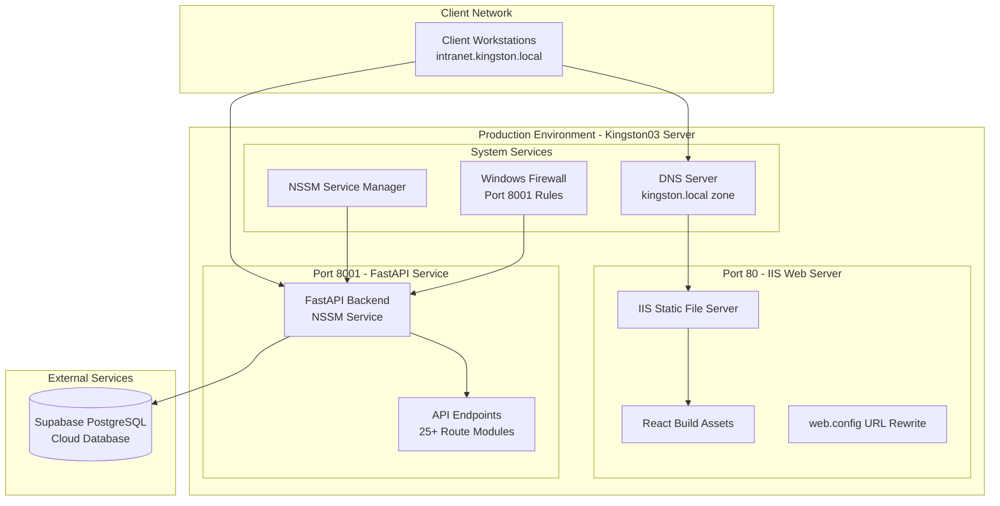
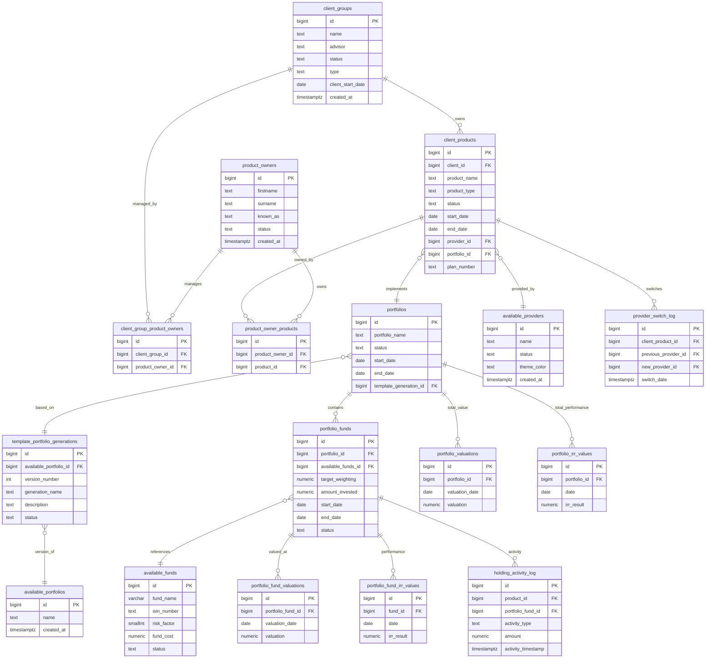
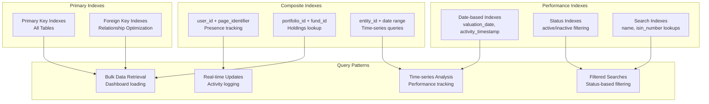
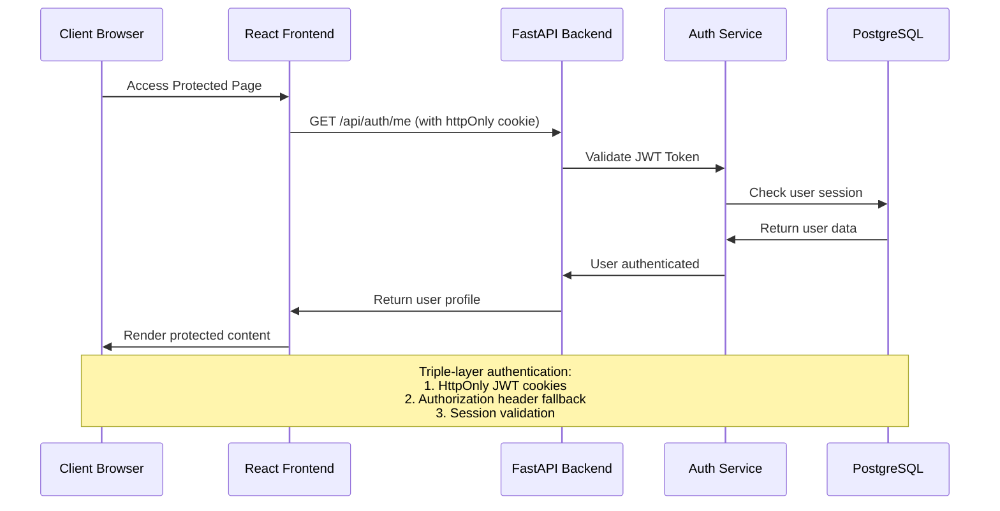
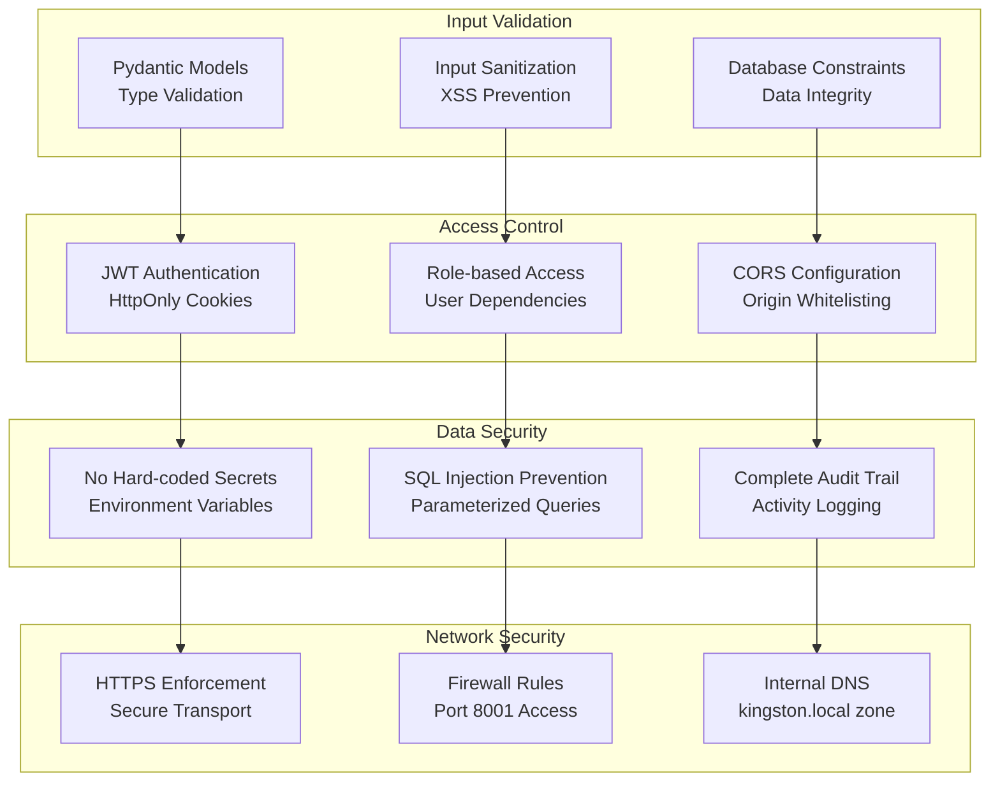
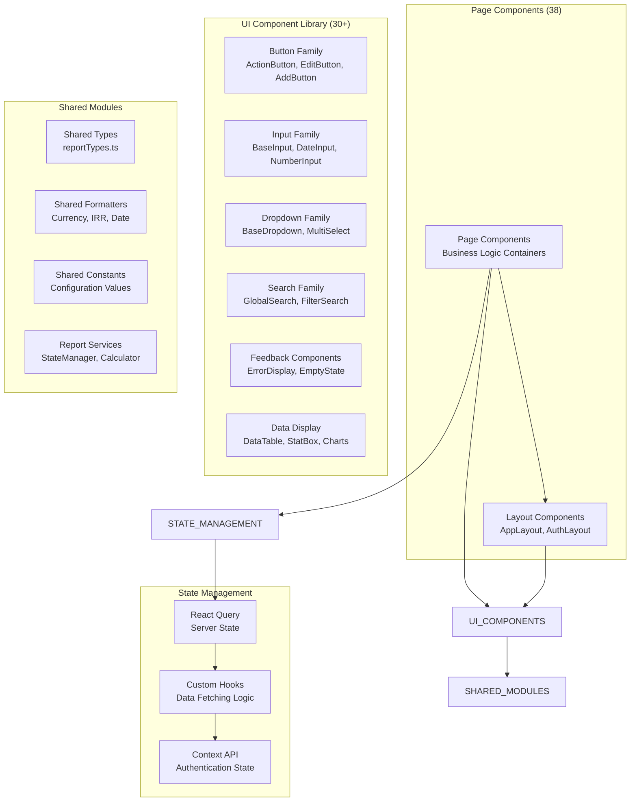
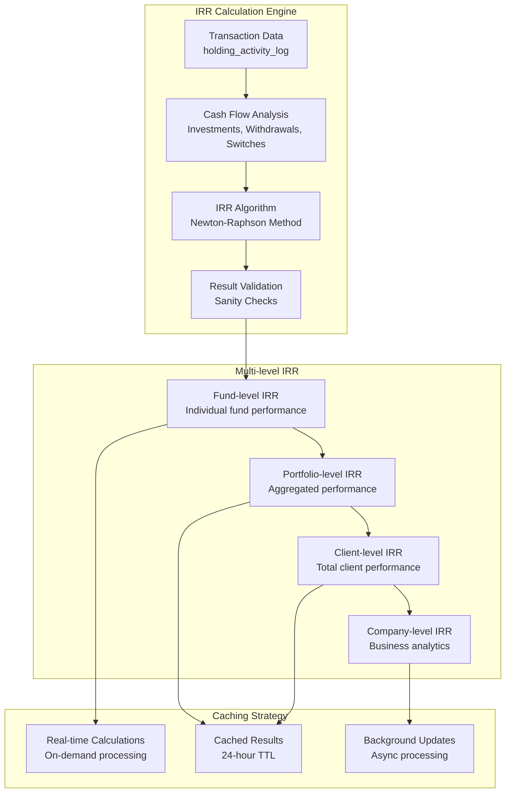
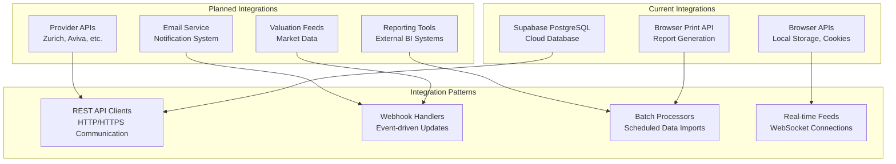

# Kingston's Portal - Database Architecture Analysis Report

## Executive Summary

Kingston's Portal is a sophisticated wealth management system with a comprehensive PostgreSQL database architecture supporting client relationship management, portfolio administration, and performance analytics. This report provides a detailed analysis of the database structure, architectural patterns, and system integration points.

## 1. System Architecture Overview

### Technology Stack
```mermaid
graph TB
    subgraph "Client Layer"
        BROWSER[Web Browser<br/>Chrome/Edge/Firefox]
        MOBILE[Mobile Devices<br/>Responsive Design]
    end
    
    subgraph "Presentation Layer"
        REACT[React 18 + TypeScript<br/>Vite Build System]
        TAILWIND[Tailwind CSS<br/>Component Library]
        QUERY[React Query<br/>State Management]
    end
    
    subgraph "API Layer"
        FASTAPI[FastAPI Backend<br/>Python 3.9+]
        AUTH[JWT Authentication<br/>HttpOnly Cookies]
        CORS[CORS Middleware<br/>Cross-Origin Support]
    end
    
    subgraph "Business Logic Layer"
        ROUTES[25+ Route Modules<br/>RESTful Endpoints]
        SERVICES[Business Services<br/>IRR Calculations]
        VALIDATION[Pydantic Models<br/>Data Validation]
    end
    
    subgraph "Data Layer"
        POSTGRES[(PostgreSQL Database<br/>Production Ready)]
        VIEWS[50+ Optimized Views<br/>Performance Optimization]
        FUNCTIONS[Database Functions<br/>Complex Calculations)]
    end
    
    BROWSER --> REACT
    MOBILE --> REACT
    REACT --> TAILWIND
    REACT --> QUERY
    QUERY --> FASTAPI
    FASTAPI --> AUTH
    FASTAPI --> CORS
    FASTAPI --> ROUTES
    ROUTES --> SERVICES
    SERVICES --> VALIDATION
    VALIDATION --> POSTGRES
    POSTGRES --> VIEWS
    POSTGRES --> FUNCTIONS
```

### Deployment Architecture


## 2. Database Architecture Analysis

### Entity Relationship Overview


### Data Flow Architecture
```mermaid
flowchart TD
    subgraph "Frontend Components"
        DASHBOARD[Analytics Dashboard]
        CLIENT_LIST[Client Groups List]
        CLIENT_DETAIL[Client Details]
        PRODUCT_MGMT[Product Management]
        PORTFOLIO_VIEW[Portfolio Views]
        REPORT_GEN[Report Generator]
    end
    
    subgraph "API Endpoints"
        BULK_API[/api/bulk_client_data<br/>Optimized Bulk Retrieval]
        CLIENT_API[/api/client_groups<br/>Client Management]
        PRODUCT_API[/api/client_products<br/>Product Management]
        PORTFOLIO_API[/api/portfolios<br/>Portfolio Management]
        FUND_API[/api/portfolio_funds<br/>Fund Management]
        ANALYTICS_API[/api/analytics<br/>Performance Analytics]
        SEARCH_API[/api/search<br/>Global Search]
    end
    
    subgraph "Performance Views"
        CLIENT_COMPLETE[client_group_complete_data<br/>Client Dashboard Data]
        ANALYTICS_SUMMARY[analytics_dashboard_summary<br/>KPI Metrics]
        LATEST_VALUATIONS[latest_portfolio_valuations<br/>Current Values]
        LATEST_IRR[latest_portfolio_irr_values<br/>Performance Data]
        FUND_COMPLETE[complete_fund_data<br/>Fund Analytics]
        COMPANY_IRR_CACHE[company_irr_cache<br/>Cached Calculations]
    end
    
    subgraph "Core Tables"
        CLIENT_TABLES[client_groups<br/>client_products<br/>product_owners]
        PORTFOLIO_TABLES[portfolios<br/>portfolio_funds<br/>available_funds]
        VALUATION_TABLES[portfolio_valuations<br/>portfolio_fund_valuations]
        IRR_TABLES[portfolio_irr_values<br/>portfolio_fund_irr_values]
        ACTIVITY_TABLES[holding_activity_log<br/>provider_switch_log]
    end
    
    DASHBOARD --> ANALYTICS_API
    CLIENT_LIST --> BULK_API
    CLIENT_DETAIL --> CLIENT_API
    PRODUCT_MGMT --> PRODUCT_API
    PORTFOLIO_VIEW --> PORTFOLIO_API
    PORTFOLIO_VIEW --> FUND_API
    REPORT_GEN --> ANALYTICS_API
    
    BULK_API --> CLIENT_COMPLETE
    CLIENT_API --> CLIENT_TABLES
    PRODUCT_API --> CLIENT_TABLES
    PORTFOLIO_API --> PORTFOLIO_TABLES
    FUND_API --> FUND_COMPLETE
    ANALYTICS_API --> ANALYTICS_SUMMARY
    ANALYTICS_API --> COMPANY_IRR_CACHE
    SEARCH_API --> CLIENT_COMPLETE
    
    CLIENT_COMPLETE --> CLIENT_TABLES
    ANALYTICS_SUMMARY --> VALUATION_TABLES
    ANALYTICS_SUMMARY --> IRR_TABLES
    LATEST_VALUATIONS --> VALUATION_TABLES
    LATEST_IRR --> IRR_TABLES
    FUND_COMPLETE --> PORTFOLIO_TABLES
    COMPANY_IRR_CACHE --> IRR_TABLES
```

## 3. Performance Optimization Architecture

### Ultra-Fast Analytics System
```mermaid
graph TB
    subgraph "Analytics Dashboard Request Flow"
        USER_REQUEST[User Requests Dashboard]
        FAST_ENDPOINT[/analytics/dashboard-fast<br/>Primary Endpoint]
        CACHE_CHECK{Cache Valid?<br/>24hr TTL}
        PRE_COMPUTED[Pre-computed Views<br/>Sub-second Response]
        BACKGROUND_REFRESH[Background Refresh<br/>Async Processing]
        FALLBACK[Real-time Calculation<br/>Fallback Option]
    end
    
    subgraph "Specialized Analytics Views"
        COMPANY_IRR[company_irr_cache<br/>Company-wide IRR]
        DASHBOARD_SUMMARY[analytics_dashboard_summary<br/>KPI Aggregations]
        FUND_DIST[fund_distribution_fast<br/>Fund Allocations]
        PROVIDER_DIST[provider_distribution_fast<br/>Provider Analysis]
    end
    
    subgraph "Background Processing"
        REFRESH_TRIGGER[Manual/Scheduled Refresh]
        IRR_CALCULATION[Complex IRR Calculations]
        CACHE_UPDATE[Cache Invalidation & Update]
        STATUS_MONITORING[Cache Health Monitoring]
    end
    
    USER_REQUEST --> FAST_ENDPOINT
    FAST_ENDPOINT --> CACHE_CHECK
    CACHE_CHECK -->|Valid| PRE_COMPUTED
    CACHE_CHECK -->|Stale| BACKGROUND_REFRESH
    CACHE_CHECK -->|Failed| FALLBACK
    
    PRE_COMPUTED --> COMPANY_IRR
    PRE_COMPUTED --> DASHBOARD_SUMMARY
    PRE_COMPUTED --> FUND_DIST
    PRE_COMPUTED --> PROVIDER_DIST
    
    BACKGROUND_REFRESH --> REFRESH_TRIGGER
    REFRESH_TRIGGER --> IRR_CALCULATION
    IRR_CALCULATION --> CACHE_UPDATE
    CACHE_UPDATE --> STATUS_MONITORING
```

### Database Indexing Strategy


## 4. Security Architecture

### Authentication & Authorization Flow


### Data Protection Layers


## 5. Frontend Architecture Patterns

### Component Architecture


### Smart Navigation Pattern
```mermaid
graph TB
    subgraph "Navigation Context Sources"
        URL_PARAMS[URL Parameters<br/>?from=client-details&clientId=123]
        LOCATION_STATE[React Router State<br/>{ from: { pathname: '/products' } }]
        BREADCRUMB_ARRAY[Breadcrumb Trail<br/>[{path, label}, ...]]
    end
    
    subgraph "Smart Navigation Hook"
        CONTEXT_PARSER[getNavigationContext()<br/>Parse URL & State]
        DESTINATION_RESOLVER[determineBackDestination()<br/>Priority-based Resolution]
        NAVIGATOR[navigateBack()<br/>Execute Navigation]
    end
    
    subgraph "Priority Resolution"
        P1[Priority 1: URL Parameters<br/>client-details, portfolio-details]
        P2[Priority 2: Location State<br/>Products page, other pages]
        P3[Priority 3: Breadcrumb Array<br/>Complex navigation paths]
        P4[Priority 4: Fallback Client ID<br/>Product's client group]
        P5[Priority 5: Default Fallback<br/>Products listing page]
    end
    
    URL_PARAMS --> CONTEXT_PARSER
    LOCATION_STATE --> CONTEXT_PARSER
    BREADCRUMB_ARRAY --> CONTEXT_PARSER
    
    CONTEXT_PARSER --> DESTINATION_RESOLVER
    DESTINATION_RESOLVER --> P1
    P1 --> P2
    P2 --> P3
    P3 --> P4
    P4 --> P5
    
    DESTINATION_RESOLVER --> NAVIGATOR
```

## 6. Data Integrity & Business Logic

### Financial Calculations Flow


### Data Consistency Patterns

```mermaid
graph TB
    subgraph "Template System"
        AVAILABLE_PORTFOLIOS[Available Portfolios<br/>Master Templates]
        TEMPLATE_GENERATIONS[Template Generations<br/>Versioned Implementations]
        PORTFOLIO_INSTANCES[Portfolio Instances<br/>Client Implementations]
        HISTORICAL_PRESERVATION[Historical Preservation<br/>Version Integrity]
    end
    
    subgraph "Status Management"
        SOFT_DELETES[Soft Deletes<br/>Status-based Archiving]
        LIFECYCLE_TRACKING[Lifecycle Tracking<br/>Start/End Dates]
        AUDIT_TRAILS[Audit Trails<br/>Change Logging]
    end
    
    subgraph "Referential Integrity"
        FOREIGN_KEYS[Foreign Key Constraints<br/>Relationship Enforcement]
        CASCADE_RULES[Cascade Rules<br/>Dependency Management]
        UNIQUE_CONSTRAINTS[Unique Constraints<br/>Data Uniqueness]
    end
    
    AVAILABLE_PORTFOLIOS --> TEMPLATE_GENERATIONS
    TEMPLATE_GENERATIONS --> PORTFOLIO_INSTANCES
    PORTFOLIO_INSTANCES --> HISTORICAL_PRESERVATION
    
    SOFT_DELETES --> LIFECYCLE_TRACKING
    LIFECYCLE_TRACKING --> AUDIT_TRAILS
    
    FOREIGN_KEYS --> CASCADE_RULES
    CASCADE_RULES --> UNIQUE_CONSTRAINTS
```


## 7. Integration Points & APIs

### API Endpoint Organization
```mermaid
graph TB
    subgraph "Authentication Endpoints"
        AUTH_LOGIN[POST /api/auth/login<br/>User authentication]
        AUTH_LOGOUT[POST /api/auth/logout<br/>Session termination]
        AUTH_ME[GET /api/auth/me<br/>User profile]
        AUTH_RESET[POST /api/auth/reset-password<br/>Password management]
    end
    
    subgraph "Client Management Endpoints"
        CLIENT_BULK[GET /api/bulk_client_data<br/>Optimized bulk retrieval]
        CLIENT_GROUPS[/api/client_groups/*<br/>CRUD operations]
        CLIENT_PRODUCTS[/api/client_products/*<br/>Product management]
        PRODUCT_OWNERS[/api/product_owners/*<br/>Owner management]
    end
    
    subgraph "Portfolio Management Endpoints"
        PORTFOLIOS[/api/portfolios/*<br/>Portfolio CRUD]
        PORTFOLIO_FUNDS[/api/portfolio_funds/*<br/>Fund management]
        AVAILABLE_PORTFOLIOS[/api/available_portfolios/*<br/>Template management]
        FUND_VALUATIONS[/api/fund_valuations/*<br/>Valuation tracking]
    end
    
    subgraph "Analytics & Reporting Endpoints"
        ANALYTICS_FAST[GET /api/analytics/dashboard-fast<br/>Ultra-fast dashboard]
        ANALYTICS_IRR[GET /api/analytics/client/{id}/irr<br/>Client IRR calculations]
        HISTORICAL_IRR[/api/historical-irr/*<br/>Historical performance]
        REVENUE[/api/revenue/*<br/>Revenue analytics]
    end
    
    subgraph "Utility Endpoints"
        SEARCH[GET /api/search<br/>Global search]
        HEALTH[GET /api/health<br/>System health]
        PRESENCE[/api/presence/*<br/>User presence tracking]
    end
```

### External System Integration Points


## 8. Scalability & Performance Considerations

### Current Performance Optimizations
- **Ultra-fast Analytics**: Reduced dashboard load times from 67+ seconds to sub-second response
- **Pre-computed Views**: 50+ optimized database views for common queries
- **Intelligent Caching**: 24-hour cache duration with background refresh capabilities
- **Bulk Data Endpoints**: Single API calls for complex data requirements
- **Database Indexing**: Strategic indexes for high-frequency queries

### Future Scalability Paths
- **Horizontal Scaling**: Stateless API design supports load balancing
- **Database Sharding**: Partition by client groups or geographic regions
- **Microservices**: Decompose monolithic API into specialized services
- **CDN Integration**: Static asset optimization and global distribution
- **Real-time Updates**: WebSocket integration for live data synchronization

## 9. Recommendations

### Immediate Improvements
1. **Complete TDD Implementation**: Expand test coverage beyond shared modules
2. **API Rate Limiting**: Implement rate limiting for production security
3. **Monitoring & Alerting**: Add comprehensive logging and monitoring
4. **Database Migration**: Complete transition from Supabase to in-house PostgreSQL

### Long-term Enhancements
1. **Machine Learning Analytics**: Advanced portfolio optimization algorithms
2. **Mobile Application**: Native mobile app for advisor field access
3. **Real-time Collaboration**: Multi-user editing with conflict resolution
4. **Advanced Reporting**: Custom report builder with drag-drop interface

## Conclusion

Kingston's Portal demonstrates a sophisticated, well-architected wealth management system with strong separation of concerns, optimized performance, and excellent scalability potential. The comprehensive database design, modular API architecture, and modern frontend patterns provide a solid foundation for continued growth and feature expansion.

The system successfully addresses the complex requirements of wealth management while maintaining clean code principles, security best practices, and user experience excellence. The recent performance optimizations and architectural improvements demonstrate the team's commitment to technical excellence and continuous improvement.

