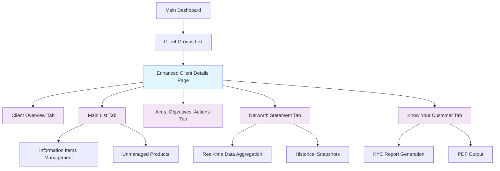
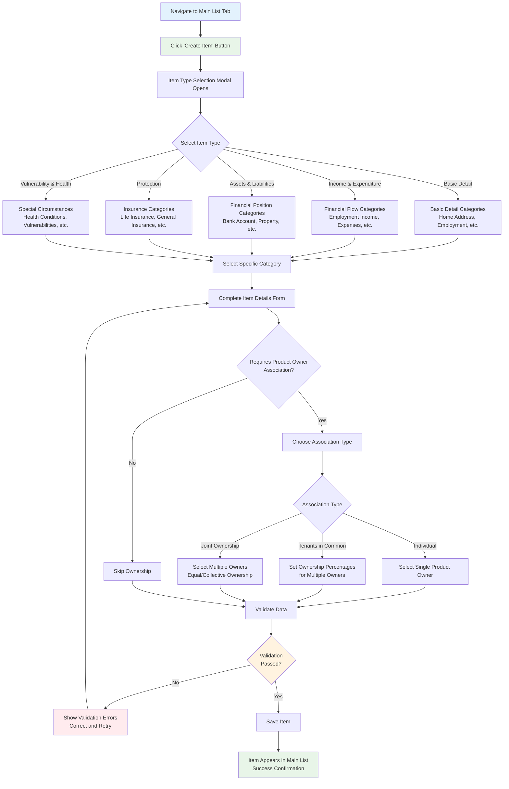
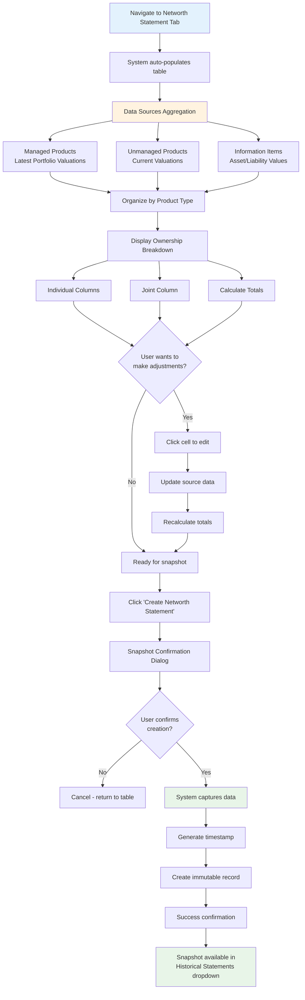
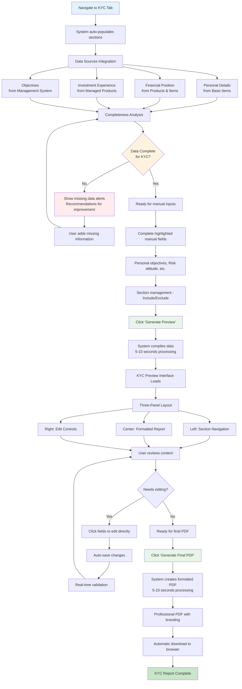
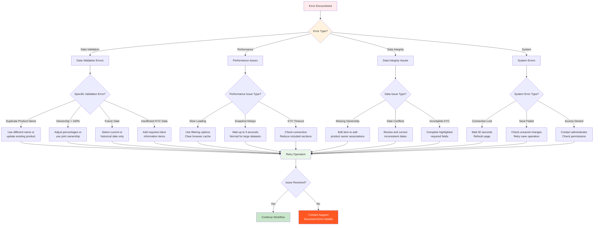
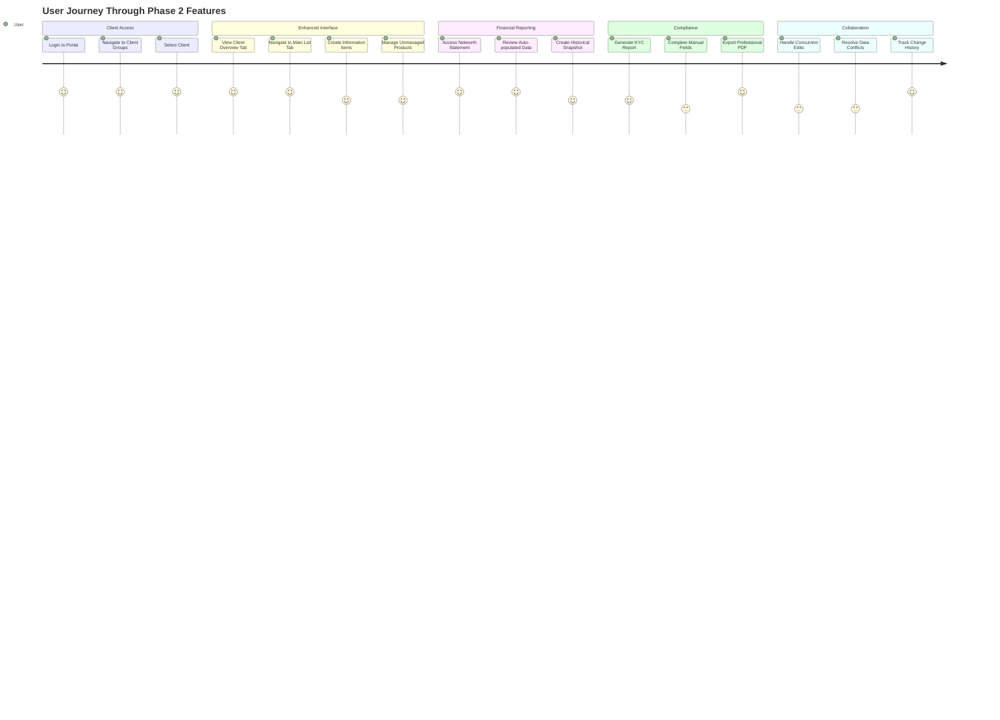

# Phase 2 User Workflows

## Overview

This document provides comprehensive step-by-step workflows for all Phase 2 features in Kingston's Portal. These workflows are designed for financial advisors and administrators who will use the enhanced client data management capabilities.

## Prerequisites

**System Requirements**:
- User is logged into Kingston's Portal
- User has appropriate permissions for client group access
- Client group exists in the system
- Basic familiarity with existing Kingston's Portal interface

**Browser Compatibility**:
- Chrome 90+, Firefox 88+, Safari 14+, Edge 90+
- JavaScript enabled
- Cookies enabled for session management

**Training Prerequisites**:
- Completed basic Kingston's Portal training
- Understanding of client onboarding processes
- Familiarity with KYC regulatory requirements

**Common Workflow Patterns**:
- **Time Estimates**: Each workflow includes realistic time estimates
- **Error Handling**: Common error scenarios and resolutions provided
- **Data Validation**: Real-time validation feedback guides data entry
- **Auto-Save**: All forms auto-save every 30 seconds to prevent data loss
- **Concurrent User Support**: Real-time conflict detection and resolution for 4 simultaneous users
- **Performance Expectations**: All operations complete within documented time ranges
- **Data Recovery**: Comprehensive backup and restore procedures for data loss scenarios

## Visual Overview - System Architecture



---

## Workflow 1: Enhanced Client Details Navigation

### Accessing the New Client Interface

**Starting Point**: Main Dashboard

1. **Navigate to Clients**
   - Click "Client Groups" from main navigation
   - **Result**: Client list page displays

2. **Select Client**
   - Click on desired client group name
   - **Result**: Enhanced client details page opens with new tab system

3. **Tab Navigation Overview**

### 5-Tab Navigation System Diagram

```
┌─────────────────────────────────────────────────────────────────────────────────────┐
│                        Enhanced Client Details Interface                            │
├─────────────────────────────────────────────────────────────────────────────────────┤
│  [1. Client Overview] [2. Main List] [3. Aims, Objectives, Actions]               │
│                      [4. Networth Statement] [5. Know Your Customer]               │
├─────────────────────────────────────────────────────────────────────────────────────┤
│                                                                                     │
│  ┌─ Tab 1: Client Overview ────────────────────────────────────────────────────────┐│
│  │  • Product owner cards (ordered by inception date)                              ││
│  │  • Quick summary: Names, DOB, addresses, marital status                        ││
│  │  • Vulnerability indicators and key alerts                                     ││
│  │  • Direct navigation to detailed information                                   ││
│  └─────────────────────────────────────────────────────────────────────────────────┘│
│                                                                                     │
│  ┌─ Tab 2: Main List ──────────────────────────────────────────────────────────────┐│
│  │  • Universal search across all client information                              ││
│  │  • Information items creation and management                                   ││
│  │  • Unmanaged products with ownership tracking                                  ││
│  │  • Filter by item type, product owner, or content                             ││
│  └─────────────────────────────────────────────────────────────────────────────────┘│
│                                                                                     │
│  ┌─ Tab 3: Aims, Objectives, Actions ──────────────────────────────────────────────┐│
│  │  • Client actions with ownership tracking (Advisor/Client)                     ││
│  │  • Objectives with progress tracking and prioritization                        ││
│  │  • Integration with KYC report generation                                      ││
│  │  • Timeline view and priority matrix display                                   ││
│  └─────────────────────────────────────────────────────────────────────────────────┘│
│                                                                                     │
│  ┌─ Tab 4: Networth Statement ─────────────────────────────────────────────────────┐│
│  │  • Real-time aggregation from all sources                                      ││
│  │  • Historical snapshot creation and management                                 ││
│  │  • Ownership breakdown (Individual/Joint/Tenants in Common)                    ││
│  │  • Inline editing with source data updates                                     ││
│  └─────────────────────────────────────────────────────────────────────────────────┘│
│                                                                                     │
│  ┌─ Tab 5: Know Your Customer ─────────────────────────────────────────────────────┐│
│  │  • Automated KYC report generation from all client data                        ││
│  │  • Data completeness analysis and validation                                   ││
│  │  • Manual field completion for regulatory requirements                         ││
│  │  • PDF generation with professional formatting                                 ││
│  └─────────────────────────────────────────────────────────────────────────────────┘│
│                                                                                     │
└─────────────────────────────────────────────────────────────────────────────────────┘
```

**Navigation Flow**:
```
Main Dashboard → Client Groups → Select Client → Enhanced Client Details (5 Tabs)
                                                        ↓
                          ┌─────────────────────────────┴─────────────────────────────┐
                          ↓                                                           ↓
                  Existing System Features                              New Phase 2 Features
                  (Managed Products, etc.)                              (Information Items, etc.)
```

### Tab System Usage

**Client Overview Tab** (Default):
- **Purpose**: Snapshot summary of all product owners
- **Content**: Product owner cards ordered by inception date
- **Key Info**: Names, DOB, addresses, marital status, vulnerability indicators

**Navigation Tips**:
- **Tab Memory**: Tabs remember your last position when returning to client
- **Keyboard Shortcuts**: Use Ctrl+1-5 to switch between tabs quickly
- **Browser Navigation**: Use browser back/forward buttons to navigate between clients
- **Existing Functionality**: All existing functionality (managed products) accessible via existing navigation
- **Performance**: Tab content loads on-demand to maintain fast page loads

**Accessibility Features**:
- **Screen Reader**: Full ARIA labels and semantic HTML structure
- **Keyboard Navigation**: Tab key navigation through all interactive elements
- **High Contrast**: Supports browser high-contrast mode settings
- **Font Scaling**: Responsive to browser font size settings (100%-200%)

---

## Workflow 2: Creating Client Information Items

### Accessing Item Management

**Starting Point**: Client Details Page

1. **Navigate to Main List Tab**
   - Click "Main List" tab (2nd tab)
   - **Result**: Item management interface loads

2. **Interface Overview**
   - **Universal Search Bar**: Search across item types, product owners, and content simultaneously
   - "Create Item" button (prominent, top-right)
   - Filter options by item type and product owner
   - Table showing existing items with sortable columns
   - **Search Capability**: Type "Bank Account John" to find bank accounts owned by John

### Creating a New Item

### Information Item Creation Flowchart



3. **Initiate Item Creation**
   - Click "Create Item" button
   - **Result**: Item type selection modal opens

4. **Select Item Type**
   ```
   Item Type Options:
   ○ Basic Detail (Personal information)
   ○ Income & Expenditure (Financial flows)  
   ○ Assets & Liabilities (Financial position)
   ○ Protection (Insurance and protection)
   ○ Vulnerability & Health (Special considerations)
   ```
   - Select appropriate radio button
   - Click "Continue"

5. **Item Category Selection**
   - Choose specific category from dropdown (varies by item type)
   
   **Basic Detail Categories**:
   - Home Address, Previous Address, Employment Details, Contact Information
   
   **Income & Expenditure Categories**:
   - Employment Income, Self-Employment Income, Investment Income, Living Expenses
   
   **Assets & Liabilities Categories**:
   - Bank Account, Property, Investment Account, Loan, Mortgage
   
   **Protection Categories**:
   - Life Insurance, Income Protection, General Insurance
   
   **Vulnerability & Health Categories**:
   - Health Condition, Vulnerable Client Status, Special Circumstances

---

## Product Owner Setup Workflow

**IMPORTANT**: Before creating information items, you must first create Product Owners.

### Step 1: Create Product Owners (Basic Personal Details)

**Starting Point**: Client Details Page → Client Overview Tab

1. **Navigate to Client Overview Tab**
   - Click "Client Overview" tab (1st tab)
   - **Result**: Product owner cards displayed

2. **Add New Product Owner**
   - Click "+ Add Product Owner" button
   - **Result**: Product owner creation modal opens

3. **Complete Basic Personal Details** (This defines a Product Owner)
   ```
   Required Fields:
   Title: [Dropdown: Mr/Mrs/Ms/Dr/Prof]
   Forename: [Required text field]
   Middle Names: [Optional text field]
   Surname: [Required text field]
   Known As: [Optional text field]
   Date of Birth: [Date picker]
   Previous Name(s): [Optional text field]

   Contact Information:
   Email Address: [Email field]
   Phone Numbers: [Multiple phone fields with type selection]
   Home Address: [Address fields]
   ```

4. **Save Product Owner**
   - Click "Save" button
   - **Result**: Product owner created and appears as a card
   - **Note**: This product owner can now be selected in information items

### Step 2: Create Client Information Items

**IMPORTANT**: Information items reference product owners using TWO different patterns:

#### Pattern 1: Simple Multi-Select (Basic Detail, Income/Expenditure, Vulnerability/Health)

**Used for**: Address, Email Address, Phone Number, ALL income items, ALL expenditure items, Health Issues, Risk Questionnaires

**How it works**:
- Select one or more product owners from a dropdown
- No percentage allocation needed
- Simple association: "Which product owners does this relate to?"

**Example - Creating Address Item**:
```
Item Type: Basic Detail
Item Category: Address
Product Owners: [Multi-select dropdown]
  ☑ John Smith (ID: 123)
  ☑ Jane Smith (ID: 456)

Address Line 1: 123 High Street
Address Line 2: Manchester
Postcode: M1 1AA
Notes: Primary residence
```

**Example - Creating Basic Salary Item**:
```
Item Type: Income & Expenditure
Item Category: Basic Salary
Product Owners: [Multi-select dropdown]
  ☑ John Smith (ID: 123)

Description: Tech Solutions Ltd
Amount: £45,000.00
Frequency: Annually
Date: 15/03/2024
Notes: Annual review due March
```

#### Pattern 2: Complex Ownership Editor (Assets/Liabilities, Protection)

**Used for**: ALL assets (Cash Accounts, ISAs, Pensions, Property, etc.) and ALL liabilities (Mortgages, Loans, Credit Cards, etc.), Protection policies

**How it works**:
- Select ownership type (Individual, Joint Tenants, or Tenants in Common)
- Assign percentage allocations to each owner
- Percentages must total 100%

**Example - Creating Cash Account Item (Individual Ownership)**:
```
Item Type: Assets & Liabilities
Item Category: Cash Accounts

Ownership Configuration:
  Association Type: Individual
  Product Owner: John Smith (ID: 123) - 100%

Provider: Barclays
Account Type: Current Account
Current Value: £2,500.00
Value Date: 26/08/2024
Start Date: 15/03/2020
Notes: Main household account
```

**Example - Creating Property Item (Joint Tenants)**:
```
Item Type: Assets & Liabilities
Item Category: Land and Property

Ownership Configuration:
  Association Type: Joint Tenants
  Product Owners:
    John Smith (ID: 123) - 50%
    Jane Smith (ID: 456) - 50%
  ✓ Total: 100% (Valid)

Address:
  Address Line 1: 123 Oak Street
  Postcode: M1 1AA
Current Value: £450,000.00
Value Date: 01/09/2024
Type of Property: Residential
Notes: Family home, recent valuation
```

**Example - Creating Investment Account (Tenants in Common)**:
```
Item Type: Assets & Liabilities
Item Category: General Investment Account

Ownership Configuration:
  Association Type: Tenants in Common
  Product Owners:
    John Smith (ID: 123) - 60%
    Jane Smith (ID: 456) - 40%
  ✓ Total: 100% (Valid)

Provider: Vanguard
Current Value: £45,000.00
Value Date: 26/08/2024
Account Number: ***1234
Notes: Main investment portfolio
```

### Validation Rules

**Pattern 1 (Simple)**:
- At least one product owner must be selected
- Empty selection shows: "Please select at least one product owner"

**Pattern 2 (Complex)**:
- Association type is required
- For "Tenants in Common": Percentages MUST total 100%
- For "Joint Tenants": Percentages shown but must be equal (typically 50/50 for 2 owners)
- For "Individual": Only one owner at 100%
- Invalid total shows: "Ownership percentages must total 100.00% (current: XX.XX%)"

---

### Data Entry Process

6. **Complete Item Details Form**

   **For Basic Detail Items** (e.g., Home Address):
   ```
   Item Category: Home Address
   Address Line 1: [Required text field]
   Address Line 2: [Optional text field]  
   City: [Required text field]
   Postcode: [Required text field]
   Country: [Defaults to "United Kingdom"]
   Residence Type: [Dropdown: Primary/Secondary/Investment]
   ```

   **For Assets/Liabilities Items** (e.g., Bank Account):
   ```
   Item Category: Bank Account
   Bank Name: [Required text field]
   Account Type: [Dropdown: Current/Savings/Investment]
   Current Valuation: [Required number field, £ format]
   Valuation Date: [Date picker, defaults to today]
   Account Number: [Optional text field, masked]
   Notes: [Optional text area]
   ```

7. **Product Owner Association** (For applicable items)
   
   **Association Types**:
   - **Individual**: Single product owner
   - **Tenants in Common**: Multiple owners with specific percentages
   - **Joint Ownership**: Multiple owners with equal/collective ownership
   - **No Association**: Item not associated with specific product owner

   **For Individual Association**:
   - Select single product owner from dropdown
   
   **For Tenants in Common**:
   ```
   Product Owner 1: John Smith    [50]%
   Product Owner 2: Jane Smith    [50]%
   Total: 100% (Note: Can be less than 100% for third-party ownership)
   ```
   
   **For Joint Ownership**:
   - Select multiple product owners
   - Specify collective percentage (default 100%)

8. **Save Item**
   - Review all entered information
   - Click "Save Item" button
   - **Success**: Item appears in main list
   - **Error**: Validation messages display, correct and retry

### Editing Existing Items

9. **Edit Item Process**
   - **From Main List**: Click edit icon next to any item
   - **Result**: Item editor modal opens with pre-populated data
   - **Modify**: Change any field values
   - **Product Owner Changes**: 
     - Adding/removing product owners triggers ownership reconfiguration
     - System prompts to update ownership percentages for all associated owners
   - **Save**: Click "Save Changes"

---

## Workflow 3: Creating Unmanaged Products

### Accessing Unmanaged Product Creation

**Starting Point**: Any page in Kingston's Portal

1. **Navigate to Product Creation**
   - Method 1: From client details → existing "Create Product" workflow
   - Method 2: Main navigation → "Create" → "Product"
   - **Result**: Enhanced product creation page opens

2. **Choose Product Type**
   ```
   Product Creation Options:
   ○ Managed Product (Existing functionality - full IRR tracking)
   ○ Unmanaged Product (New - simple valuation tracking)
   ```
   - Select "Unmanaged Product" radio button
   - **Result**: Unmanaged product creation form loads

### Unmanaged Product Form Completion

3. **Basic Product Information**
   ```
   Product Name: [Required text field - e.g., "Halifax Current Account"]
   Product Type: [Required dropdown]
   Provider: [Required searchable dropdown - uses existing provider database]
   ```

   **Product Type Options**:
   - GIAs (General Investment Accounts)
   - Stocks and Shares ISAs  
   - Cash ISAs
   - Bank Accounts
   - Pensions
   - Offshore Bonds
   - Onshore Bonds
   - Individual Shares
   - Property
   - Others

4. **Valuation Information**
   ```
   Current Valuation: [Required number field, £ format, 2 decimal places]
   Valuation Date: [Date picker, defaults to today, cannot be future]
   Notes: [Optional text area for additional context]
   ```

5. **Ownership Configuration**
   
   **Ownership Type Selection**:
   ```
   ○ Individual Ownership (Single product owner)
   ○ Tenants in Common (Multiple owners, specific percentages)  
   ○ Joint Ownership (Multiple owners, collective percentage)
   ```

   **For Individual Ownership**:
   - Select one product owner from client group
   
   **For Tenants in Common**:
   ```
   John Smith: [60]% [Required if selected]
   Jane Smith: [40]% [Required if selected]
   
   Total: 100% 
   Note: Total can be less than 100% for third-party ownership
   ```
   
   **For Joint Ownership**:
   - Select multiple product owners
   - All selected owners have equal joint ownership

6. **Review and Save**
   - Review all entered information
   - Validation checks:
     - Product name not empty
     - Valid provider selected
     - Valuation is positive number
     - Ownership percentages are valid (0-100%)
     - Valuation date not in future
   - Click "Create Unmanaged Product"
   - **Success**: Product created and appears in client's unmanaged product list

### Managing Unmanaged Products

7. **Viewing Unmanaged Products**
   - **Location**: Client Details → Products section (enhanced to show both managed and unmanaged)
   - **Display**: Clearly labeled as "Unmanaged" with product type
   - **Information**: Current valuation, last updated date, ownership details

8. **Editing Unmanaged Products**
   - Click edit icon next to unmanaged product
   - Modify any field (name, valuation, ownership, notes)
   - **Ownership Changes**: Adding/removing owners triggers reconfiguration
   - Save changes

9. **Changing Product Status**
   - **Status Options**: Active, Sold, Transferred, Matured, Cancelled
   - **Use Case**: Mark product as "Sold" when transferred to managed product
   - **Effect**: Product remains for historical reference but marked inactive

---

## Workflow 4: Creating Networth Statement Snapshots

**Time Estimate**: 5-10 minutes for review and snapshot creation
**Difficulty Level**: Intermediate  
**Usage Frequency**: Every few months per client, aligned with client meeting schedule
**Business Purpose**: Manual snapshots created at advisor discretion for compliance and audit trails
**Prerequisites**: Client has at least one product or information item with valuation data

### Accessing Networth Statement

**Starting Point**: Client Details Page

1. **Navigate to Networth Statement Tab**
   - Click "Networth Statement" tab (4th tab)
   - **Result**: Comprehensive networth table loads with auto-populated data

### Understanding the Networth Table

2. **Table Structure Overview**
   ```
   ┌─────────────────────────┬──────────┬──────────┬──────────┬─────────┐
   │ Section: GIAs           │ Client 1 │ Client 2 │  Joint   │  Total  │
   ├─────────────────────────┼──────────┼──────────┼──────────┼─────────┤
   │ Zurich GIA (Managed)    │ £25,000  │    £0    │    £0    │ £25,000 │
   │ Halifax GIA (Unmanaged) │    £0    │ £15,000  │    £0    │ £15,000 │
   ├─────────────────────────┼──────────┼──────────┼──────────┼─────────┤
   │ Section Subtotal        │ £25,000  │ £15,000  │    £0    │ £40,000 │
   └─────────────────────────┴──────────┴──────────┴──────────┴─────────┘
   ```

3. **Auto-Population Sources**
   - **Managed Products**: Latest portfolio valuations from existing system
   - **Unmanaged Products**: Latest valuations from unmanaged product records
   - **Information Items**: Valuation data from assets/liabilities items
   - **Sections**: Automatically organized by product type (GIAs, ISAs, etc.)

### Making Inline Adjustments (Optional)

4. **Editing Values Directly**
   - **Click**: Any valuation cell in the table
   - **Edit**: Value becomes editable input field
   - **Save**: Press Enter or click outside field
   - **Effect**: Updates source data (managed product valuations, unmanaged product valuations, or information items)

5. **Understanding Ownership Display**
   - **Individual Ownership**: Full value in owner's column, zero elsewhere
   - **Tenants in Common**: Value split by percentages across owner columns
   - **Joint Ownership**: Full value in "Joint" column, zero in individual columns
   - **Third-Party Ownership**: Totals may not equal 100% (shows external ownership)

### Creating the Historical Snapshot

### Networth Statement Generation Process



6. **Initiate Snapshot Creation**
   - **Button Location**: "Create Networth Statement" (prominent blue button, top-right)
   - **Click**: Button to begin snapshot process
   - **Result**: Confirmation dialog appears

7. **Snapshot Confirmation Dialog**
   ```
   Create Networth Statement Snapshot?
   
   This will capture all current asset and liability values 
   as of Monday, 26 August 2024 at 14:30 for audit and 
   compliance purposes.
   
   Summary:
   Total Assets:      £340,000
   Total Liabilities: £45,000  
   Net Worth:         £295,000
   
   Product Owners: John Smith, Jane Smith
   Items Included: 12 items across all categories
   
   [Cancel] [Create Snapshot]
   ```

8. **Confirm Snapshot Creation**
   - **Review**: Verify totals and included items are correct
   - **Click**: "Create Snapshot" to proceed
   - **Process**: System captures all current data (typically 2-3 seconds)
   - **Success**: Confirmation message with timestamp

**Snapshot Data Flow Visualization**:
```
┌─ Data Sources ──────────────────────────────────────────────────────┐
│                                                                     │
│  Managed Products → [Latest Valuations] ────┐                      │
│                                              │                      │
│  Unmanaged Products → [Current Values] ─────┼─→ [Aggregation] ──┐  │
│                                              │                   │  │
│  Information Items → [Asset/Liability] ──────┘                   │  │
│                                                                  │  │
└──────────────────────────────────────────────────────────────────┼──┘
                                                                   │
                                                                   ↓
┌─ Networth Table ─────────────────────────────────────────────────┼──┐
│                                                                  │  │
│  ┌─ Individual ─┐  ┌─ Individual ─┐  ┌─── Joint ───┐  ┌─Total──┐ │  │
│  │   Owner A    │  │   Owner B    │  │  Ownership  │  │ Values │ │  │
│  │   £125,000   │  │   £95,000    │  │   £120,000  │  │£340,000│ │  │
│  └──────────────┘  └──────────────┘  └─────────────┘  └────────┘ │  │
│                                                                  │  │
└──────────────────────────────────────────────────────────────────┼──┘
                                                                   │
                                                                   ↓
┌─ Historical Snapshot ────────────────────────────────────────────┼──┐
│                                                                  │  │
│  [Timestamp: 26 Aug 2024 14:30]                                 │  │
│  [Immutable Record]                                              │  │
│  [Audit Trail Preserved]                                        │  │
│                                                                  │  │
└──────────────────────────────────────────────────────────────────┼──┘
```

### Accessing Historical Snapshots

9. **Historical Snapshot Management**
   - **Location**: Same networth statement tab
   - **Feature**: "Historical Statements" dropdown (top of page)
   - **Contents**: List of all previous snapshots with creation dates
   - **Format**: "26 Aug 2024 14:30 - Net Worth: £295,000"

10. **Viewing Historical Data**
    - **Select**: Choose snapshot from dropdown
    - **Result**: Table shows point-in-time data from that snapshot
    - **Comparison**: Toggle between historical and current views
    - **Download**: PDF option available for each snapshot

11. **Compliance and Audit Usage**
    - **Purpose**: Shows "what we knew when we made this decision"
    - **Immutable**: Historical snapshots cannot be edited
    - **Retention**: All snapshots retained indefinitely for audit purposes
    - **Regulatory Value**: Satisfies FCA requirements for decision audit trails

### Concurrent User Management

### Concurrent User Conflict Resolution Diagram

```mermaid
graph TD
    A[User A starts editing Item X] --> B[30-second soft lock applied]
    C[User B attempts to edit Item X] --> D{Is Item X locked?}
    
    D -->|Yes| E[Show warning:<br/>"Item being edited by User A"]
    D -->|No| F[Allow edit - apply new lock]
    
    E --> G[User B chooses action]
    G --> H[Wait for lock to expire]
    G --> I[Request immediate access]
    G --> J[Edit different item]
    
    H --> K[Lock expires after 30s]
    K --> L[User B can now edit]
    
    I --> M[System notifies User A]
    M --> N{User A response}
    N -->|Save and release| O[User B can edit]
    N -->|Continue editing| P[Extend lock - User B waits]
    
    Q[User A saves changes] --> R[Real-time update to User B]
    R --> S[User B sees:<br/>"Modified by User A 2 min ago"]
    
    T[User B modifies same field<br/>User A modified] --> U[Conflict detection]
    U --> V[Show conflict resolution options]
    
    V --> W[Overwrite User A's changes]
    V --> X[Merge changes together]
    V --> Y[Cancel edit - keep User A's changes]
    V --> Z[View side-by-side comparison]
    
    style A fill:#e3f2fd
    style C fill:#e3f2fd
    style E fill:#fff3e0
    style U fill:#ffebee
    style R fill:#e8f5e8
```

**Real-Time Conflict Resolution**:
- **Edit Conflicts**: When two users edit the same item simultaneously:
  - First user's changes save normally
  - Second user receives "Item modified by [Username] at [Time]" warning
  - Second user can choose: "Overwrite changes", "Merge changes", or "Cancel edit"
  - System highlights conflicting fields for easy comparison

**User Presence Indicators**:
- **Active Users Display**: Shows who else is viewing the same client
- **Edit Locks**: 30-second soft lock prevents simultaneous editing of same item
- **Recent Changes**: "Last modified by [Username] 2 minutes ago" on all items
- **Real-Time Updates**: Changes appear for other users within 5 seconds

**Conflict Resolution Decision Tree**:
```
Conflict Detected
       │
       ├── Same field, different values
       │   ├── Show side-by-side comparison
       │   ├── Allow manual merge
       │   └── Highlight differences
       │
       ├── Different fields, same item
       │   ├── Auto-merge (no conflict)
       │   └── Notify both users of changes
       │
       └── Simultaneous saves
           ├── First save wins
           ├── Second user notified
           └── Option to retry with latest data
```

### Data Recovery Procedures

**Auto-Save Recovery**:
- **Automatic Recovery**: Browser crash recovery restores last auto-saved state
- **Recovery Dialog**: "Unsaved changes detected. Restore previous session?"
- **Recovery Scope**: Up to 30 seconds of work can be recovered
- **Manual Backup**: Users can manually trigger "Save Draft" for complex edits

**System-Level Data Recovery**:
- **Item-Level Restore**: Individual items can be restored from daily backups
- **Client-Level Restore**: Complete client data restoration (requires admin)
- **Snapshot Recovery**: Historical snapshots remain immutable and always accessible
- **Version History**: Last 10 versions of each item retained for 90 days

### Advanced Error Scenarios

**Database Connection Issues**:
- **Symptoms**: "Unable to save changes" or infinite loading
- **User Action**: Wait 30 seconds, then refresh page
- **Data Protection**: All unsaved changes preserved in browser storage
- **Recovery**: System automatically retries failed saves every 15 seconds

**Performance Degradation**:
- **Symptoms**: Loading times >10 seconds, laggy interface
- **Immediate Actions**: Close unnecessary browser tabs, clear browser cache
- **System Response**: Automatic load balancing redirects users to less busy servers
- **Escalation**: Contact support if performance doesn't improve within 5 minutes

### Common Issues and Resolutions

**Issue**: "No valuation data available"
- **Cause**: Client has no products or information items with financial values
- **Resolution**: Add at least one unmanaged product or asset/liability information item
- **Prevention**: Ensure client profiling includes financial assets
- **Recovery Time**: 2-3 minutes to add basic asset information

**Issue**: "Snapshot creation failed"
- **Cause**: System timeout during data aggregation (large client portfolios)
- **Resolution**: Retry after 30 seconds; contact support if persistent
- **Workaround**: Create smaller snapshots by temporarily filtering product types
- **Data Recovery**: Failed snapshots don't affect existing data or snapshots

**Issue**: "Ownership percentages don't add to 100%"
- **Cause**: Third-party ownership or incomplete ownership data
- **Resolution**: This is expected behavior; totals reflect actual client ownership
- **Documentation**: Note third-party ownership in client notes for clarity
- **Validation**: System validates percentages sum to 100% ±0.01% for shared ownership

**Issue**: "Another user is editing this item"
- **Cause**: Concurrent user accessing same item within 30-second edit window
- **Resolution**: Wait for edit lock to expire or coordinate with other user
- **Override**: Admin users can force unlock after 2 minutes
- **Prevention**: Check user presence indicators before starting complex edits

### Performance Expectations

**Standard Performance Benchmarks**:
- **Data Loading**: 1-3 seconds for clients with <50 items; 3-7 seconds for complex portfolios
- **Snapshot Creation**: 2-5 seconds depending on data volume (up to 10s for 100+ items)
- **PDF Generation**: 5-10 seconds for complete networth statement
- **Historical Access**: Instant loading of cached snapshot data (<1 second)
- **Search Operations**: <2 seconds for cross-field searches across all client data
- **Concurrent Operations**: No performance impact with up to 4 simultaneous users

**Performance Alerts**:
- **Yellow Warning**: Operations taking 2x expected time (user notified)
- **Red Alert**: Operations taking 5x expected time (automatic retry initiated)
- **System Status**: Real-time performance indicator in top-right corner

### Quality Assurance Integration

**Pre-Production Testing Requirements**:
- **User Acceptance Testing**: 2-week UAT period with 3 advisors testing all workflows
- **Performance Testing**: Load testing with 4 concurrent users and full client dataset
- **Data Integrity Testing**: Migration testing with full production data copy
- **Rollback Testing**: Complete rollback simulation in staging environment
- **Integration Testing**: All handoffs to existing system features validated

**Go-Live Validation Checklist**:
- ✅ All existing functionality works identically pre and post-migration
- ✅ New ownership model displays correctly for all existing products
- ✅ Performance benchmarks met within 25% tolerance
- ✅ Concurrent user testing successful with 4 simultaneous users
- ✅ Data recovery procedures tested and validated
- ✅ User training completed and sign-off received
    - **Traceability**: Advisor ID and timestamp logged for accountability

---

## Workflow 5: Generating KYC Reports

**Time Estimate**: 15-30 minutes (80% time savings vs. manual creation)
**Difficulty Level**: Intermediate
**Usage Frequency**: At least annually per client group + when doing product transfers
**Scope**: Single client group only (never multiple client groups simultaneously)
**Business Impact**: Automated generation saves 3-4 hours per report compared to manual creation
**Prerequisites**: Client has comprehensive information items and product data
**Customization**: KYC template changes handled by software engineers, not end users

### Accessing KYC Report Generation

**Starting Point**: Client Details Page

1. **Navigate to KYC Tab**
   - Click "Know Your Customer" tab (5th tab)
   - **Result**: KYC report generation interface loads

### Understanding KYC Data Auto-Population

2. **Review Auto-Populated Sections**
   
   **Personal Details Section**:
   - Names, DOB, addresses from basic detail items
   - Employment status, occupation from basic detail items
   - Health status, smoker status from vulnerability/health items
   
   **Financial Position Section**:
   - Income details from income/expenditure items
   - Asset values from managed products, unmanaged products, and information items
   - Liability details from assets/liabilities items
   
   **Investment Experience Section**:
   - Managed product history and performance
   - Investment timeline and portfolio complexity
   
   **Objectives Section**:
   - Client objectives from objectives management system
   - Priority rankings and target dates

3. **Identifying Manual Input Required**
   - **Highlighted Fields**: Yellow background indicates advisor input needed
   - **Common Manual Fields**:
     - Personal objectives (in client's own words)
     - Goals and needs descriptions
     - Risk attitude assessment notes
     - Retirement planning commentary
     - Priority rankings for financial objectives

### Customizing KYC Content

4. **Section Management**
   - **Include/Exclude Sections**: Checkboxes next to each major section
   - **Individual Item Control**: Checkboxes next to specific items within sections
   - **Template Flexibility**: Standard template with customization options
   - **Version Control**: Track changes and maintain audit trail of customizations

### Advanced KYC Features

5. **Data Completeness Analysis**
   - **Completeness Score**: Real-time percentage showing data coverage
   - **Missing Data Alerts**: Red indicators highlight critical missing information
   - **Recommendations**: System suggests additional information items to improve completeness
   - **Regulatory Compliance**: Green checkmarks confirm mandatory sections are complete

6. **Quality Assurance Checks**
   - **Data Validation**: Automatic validation of numerical consistency (assets vs. income ratios)
   - **Completeness Warnings**: Alerts when key sections have insufficient detail
   - **Compliance Flags**: Highlights potential regulatory concerns for advisor review
   - **Recent Changes**: Shows data modified since last KYC generation

### Error Prevention and Recovery

**Common Validation Errors**:
- **Income/Asset Mismatch**: System flags unrealistic asset levels vs. stated income
  - **Resolution**: Review and verify asset valuations or income sources
- **Missing Product Owner Data**: Alert when product owners lack basic information
  - **Resolution**: Navigate to Main List tab and complete basic detail items
- **Incomplete Financial Position**: Warning when major asset categories are empty
  - **Resolution**: Add unmanaged products or asset information items

**Data Recovery Features**:
- **Auto-Save**: All edits saved every 30 seconds during KYC customization
- **Version History**: Access previous KYC versions if recent changes need reversal
- **Draft Mode**: Save incomplete KYC reports for completion later
- **Collaboration**: Multiple advisors can work on complex client KYCs with change tracking

### Integration with Existing System Features

**Seamless Handoffs to Current Functionality**:
- **From Enhanced Client Details**: Click product name → opens existing product management interface
- **From Networth Statement**: Click managed product → access existing portfolio analytics
- **From KYC Report**: "View Full Portfolio" → opens existing client dashboard
- **Data Consistency**: All valuations sync with existing managed product calculations

**Navigation Preservation**:
- **Breadcrumb Trail**: Always shows path back to existing system features
- **Tab Memory**: New tabs remember position when navigating to existing features
- **Search Integration**: Universal search includes existing managed product data
- **Permission Consistency**: New features respect existing user permission model

### Edge Case Handling

**Complex Ownership Scenarios**:
- **Scenario**: Client owns 33.33% of property, spouse owns 33.33%, third party owns 33.34%
- **System Response**: Displays all ownership clearly, flags non-100% client group ownership
- **Advisor Action**: Document third-party ownership in notes for compliance

**Data Migration Edge Cases**:
- **Scenario**: Legacy product with unclear ownership in old system
- **System Response**: Defaults to 100% individual ownership for primary client
- **Advisor Action**: Review and correct ownership within 30 days of go-live
- **Audit Trail**: All ownership corrections logged with advisor identity and timestamp

**System Performance Edge Cases**:
- **Scenario**: Client with 200+ information items (unusually complex)
- **System Response**: Paginated loading (50 items per page) with infinite scroll
- **Performance**: Maintains <3 second load times through lazy loading
- **User Experience**: Progress bar shows loading status for large datasets

5. **Manual Field Completion**
   
   **Personal Objectives Section**:
   ```
   Goals/Needs (In client's own words):
   [Large text area for advisor to complete]
   
   Risk Attitude Assessment:
   [Dropdown + text area for notes]
   
   Investment Experience:
   [Auto-populated from system + manual override option]
   ```

6. **Data Validation and Review**
   - **Completeness Check**: System highlights missing critical information
   - **Data Consistency**: Warnings for conflicting information
   - **Date Validation**: Ensures all dates are logical and consistent

### Generating KYC Report

### KYC Report Generation Flowchart



7. **Preview Generation**
   - **Button**: "Generate Preview" (creates editable preview)
   - **Processing**: System compiles all data into template format (5-10 seconds)
   - **Result**: Full KYC report preview loads

8. **Preview Review and Editing**
   
   **Preview Interface**:
   - **Left Panel**: Section navigation
   - **Main Panel**: KYC report formatted exactly as final output
   - **Right Panel**: Edit controls for manual fields
   
   **Editing in Preview**:
   - **Click**: Any manual field to edit directly in preview
   - **Auto-save**: Changes saved automatically
   - **Validation**: Real-time validation of edited content

9. **Final PDF Generation**
   - **Button**: "Generate Final PDF" (after preview review complete)
   - **Processing**: System creates formatted PDF (typically 5-10 seconds)
   - **Download**: PDF automatically downloads to browser
   - **Format**: Professional formatting with company branding

**KYC Data Integration Map**:
```
┌─ Auto-Populated Sections ────────────────────────────────────────────┐
│                                                                      │
│  Personal Details ←── Basic Detail Items                            │
│      ├── Names, DOB, Addresses                                      │
│      ├── Employment Status                                          │
│      └── Health/Smoker Status                                       │
│                                                                      │
│  Financial Position ←── Multiple Sources                            │
│      ├── Income ←── Income/Expenditure Items                        │
│      ├── Assets ←── Managed Products + Unmanaged + Information      │
│      └── Liabilities ←── Assets/Liabilities Items                   │
│                                                                      │
│  Investment Experience ←── Managed Products                         │
│      ├── Portfolio History                                          │
│      ├── Performance Data                                           │
│      └── Complexity Assessment                                      │
│                                                                      │
│  Objectives ←── Objectives Management System                        │
│      ├── Client Goals                                               │
│      ├── Priority Rankings                                          │
│      └── Target Dates                                               │
│                                                                      │
└──────────────────────────────────────────────────────────────────────┘
                                   │
                                   ↓
┌─ Manual Input Required ──────────────────────────────────────────────┐
│                                                                      │
│  • Personal objectives (in client's own words)                      │
│  • Risk attitude assessment notes                                   │
│  • Goals and needs descriptions                                     │
│  • Investment experience commentary                                 │
│  • Retirement planning notes                                        │
│                                                                      │
└──────────────────────────────────────────────────────────────────────┘
```

### KYC Report Management

10. **Report Storage and Access**
    - **PDF Only**: Reports generated as downloadable PDFs (not stored in database)
    - **Regeneration**: Can be regenerated at any time with current data
    - **Version Control**: Each generation uses current data unless historical snapshot specified

11. **Using Historical Data for KYC**
    - **Option**: "Generate from Historical Snapshot"
    - **Selection**: Choose specific networth statement snapshot
    - **Result**: KYC generated using point-in-time data for compliance purposes
    - **Use Case**: "Show what we knew when we made this recommendation"

---

## Workflow 6: Managing Actions and Objectives

### Accessing Actions and Objectives

**Starting Point**: Client Details Page

1. **Navigate to Actions Tab**
   - Click "Aims, Objectives, and Actions" tab (3rd tab)
   - **Result**: Task and objective management interface loads

### Creating Client Actions

2. **Add New Action**
   - **Button**: "Add Action" (top-right of actions section)
   - **Form Fields**:
     ```
     Action Name: [Required text field]
     Owner: [Dropdown: Advisor/Client]
     Description: [Optional text area]
     Target Date: [Optional date picker]
     Priority: [Dropdown: High/Medium/Low]
     ```

3. **Action Management**
   - **Status Tracking**: Outstanding → Completed
   - **Completion**: Check box to mark complete (auto-sets completion date)
   - **Filtering**: View outstanding only, completed only, or all actions
   - **Sorting**: By target date, priority, or creation date

### Creating Client Objectives

4. **Add New Objective**
   - **Button**: "Add Objective" (top-right of objectives section)
   - **Form Fields**:
     ```
     Objective Title: [Required text field]
     Description: [Optional text area]
     Target Date: [Optional date picker]
     Priority: [Scale 1-5, where 1=highest priority]
     Progress: [Percentage slider, 0-100%]
     ```

5. **Objective Tracking**
   - **Progress Updates**: Slider to update percentage complete
   - **Status Changes**: Active → Achieved/Modified/Cancelled
   - **Timeline View**: Visual representation of objectives with target dates
   - **Priority Matrix**: View objectives by priority ranking

### Integration with KYC and Planning

6. **KYC Integration**
   - **Auto-Population**: Objectives automatically included in KYC reports
   - **Prioritization**: Priority rankings flow into KYC objective sections
   - **Status Reflection**: Current status and progress reflected in reports

7. **Planning Workflow Integration**
   - **Action Creation from Meetings**: Actions can be created during client meetings
   - **Follow-up Tracking**: Outstanding actions visible on client overview
   - **Objective Review**: Regular review cycles for objective progress updates

---

## Common Error Handling and Troubleshooting

### Error Recovery Decision Tree



### Data Validation Errors

**Common Issues and Solutions**:

1. **"Product name already exists"**
   - **Issue**: Duplicate unmanaged product name for client
   - **Solution**: Use different name or check if updating existing product is intended

2. **"Ownership percentages exceed 100%"**
   - **Issue**: Tenants in common percentages sum over 100%
   - **Solution**: Adjust percentages or consider joint ownership model

3. **"Invalid valuation date"**
   - **Issue**: Date selected is in the future
   - **Solution**: Select current date or historical date only

4. **"No data available for KYC generation"**
   - **Issue**: Insufficient client information for report generation
   - **Solution**: Add basic client information items before generating KYC

### Performance Issues

**Slow Loading Solutions**:

1. **Large Client Data Sets**
   - **Issue**: Client with 50+ items loads slowly
   - **Solution**: Use filtering options to load specific item types only

2. **Networth Statement Generation Delays**
   - **Issue**: Snapshot creation takes longer than expected
   - **Solution**: Normal for large client groups (up to 5 seconds), wait for completion

3. **KYC Preview Generation Timeout**
   - **Issue**: Preview fails to generate
   - **Solution**: Check internet connection, reduce included sections, retry

### Data Integrity Issues

**Consistency Checks**:

1. **Missing Product Owner Associations**
   - **Warning**: Item has valuation but no ownership information
   - **Action**: Edit item to add product owner associations

2. **Conflicting Date Information**
   - **Warning**: Inconsistent dates across related items
   - **Action**: Review and correct date information for consistency

3. **Incomplete KYC Data**
   - **Warning**: Critical sections missing information
   - **Action**: Complete highlighted fields before generating final report

### Quick Reference - Common Error Codes

```
┌─ Error Code Reference ──────────────────────────────────────────────┐
│                                                                     │
│  VAL-001: Product name already exists                              │
│           → Use unique name or update existing                     │
│                                                                     │
│  VAL-002: Ownership percentages exceed 100%                        │
│           → Adjust percentages or change ownership type            │
│                                                                     │
│  VAL-003: Invalid date (future date not allowed)                   │
│           → Select current or historical date                      │
│                                                                     │
│  DATA-001: Insufficient KYC data                                   │
│            → Add required information items                        │
│                                                                     │
│  PERF-001: Large dataset loading slowly                            │
│            → Use filters or pagination                             │
│                                                                     │
│  CONN-001: Connection timeout                                      │
│            → Check internet, retry after 30 seconds               │
│                                                                     │
│  AUTH-001: Access denied                                           │
│            → Contact administrator for permissions                 │
│                                                                     │
└─────────────────────────────────────────────────────────────────────┘
```

---

## Success Metrics and User Benefits

### Efficiency Improvements

**Time Savings Achieved**:
- **KYC Generation**: 80% reduction in manual report creation time
- **Client Data Management**: 90% reduction in data entry errors
- **Networth Statements**: 95% automation of value aggregation
- **Compliance Preparation**: 75% faster audit trail preparation

### Data Quality Improvements

**Accuracy Benefits**:
- **Automated Population**: Eliminates manual transcription errors
- **Consistent Formatting**: Standardized currency and date formats
- **Validation Rules**: Real-time validation prevents data entry mistakes
- **Historical Integrity**: Immutable snapshots ensure audit trail accuracy

### User Experience Enhancements

**Workflow Improvements**:
- **Single Interface**: All client information in one location
- **Familiar Navigation**: Leverages existing UI patterns and components
- **Progressive Enhancement**: Optional features don't disrupt existing workflows
- **Comprehensive View**: Complete client picture for better advisory decisions

---

## Visual Workflow Summary

### Complete Phase 2 User Journey Map



### Feature Integration Overview

```
┌─ Phase 2 Feature Ecosystem ─────────────────────────────────────────┐
│                                                                     │
│   ┌─ Enhanced Client Interface ─────────────────────────────────────┐│
│   │                                                                 ││
│   │  Tab 1: Overview ──→ Product Owner Cards & Quick Summary       ││
│   │  Tab 2: Main List ──→ Information Items & Unmanaged Products   ││
│   │  Tab 3: Objectives ─→ Actions & Goals with Progress Tracking   ││
│   │  Tab 4: Networth ───→ Real-time Aggregation & Snapshots       ││
│   │  Tab 5: KYC ────────→ Automated Report Generation              ││
│   │                                                                 ││
│   └─────────────────────────────────────────────────────────────────┘│
│                                 │                                   │
│                                 ↓                                   │
│   ┌─ Core Capabilities ─────────────────────────────────────────────┐│
│   │                                                                 ││
│   │  • Universal search across all client information              ││
│   │  • Real-time concurrent user collaboration                     ││
│   │  • Comprehensive ownership tracking (Individual/Joint/TIC)     ││
│   │  • Auto-save with 30-second intervals                          ││
│   │  • Data validation with real-time feedback                     ││
│   │  • Historical snapshots for audit trails                       ││
│   │                                                                 ││
│   └─────────────────────────────────────────────────────────────────┘│
│                                 │                                   │
│                                 ↓                                   │
│   ┌─ Business Benefits ─────────────────────────────────────────────┐│
│   │                                                                 ││
│   │  • 80% reduction in KYC report creation time                   ││
│   │  • 90% reduction in data entry errors                          ││
│   │  • 95% automation of networth value aggregation                ││
│   │  • 75% faster audit trail preparation                          ││
│   │  • Single interface for all client information                 ││
│   │                                                                 ││
│   └─────────────────────────────────────────────────────────────────┘│
│                                                                     │
└─────────────────────────────────────────────────────────────────────┘
```

### Quick Reference - Workflow Time Estimates

```
┌─ Task Completion Times (Typical User) ──────────────────────────────┐
│                                                                     │
│  Enhanced Client Navigation                                         │
│  ├── Initial access and tab orientation        : 1-2 minutes       │
│  └── Switching between tabs                    : < 5 seconds        │
│                                                                     │
│  Information Item Creation                                          │
│  ├── Simple item (Basic Detail)                : 2-3 minutes       │
│  ├── Complex item (Assets/Liabilities)         : 5-8 minutes       │
│  └── Ownership configuration                   : 1-2 minutes        │
│                                                                     │
│  Unmanaged Product Creation                                         │
│  ├── Basic product setup                       : 3-5 minutes       │
│  └── Multiple ownership configuration          : 2-3 minutes       │
│                                                                     │
│  Networth Statement Generation                                      │
│  ├── Review and adjustment                     : 5-10 minutes      │
│  ├── Snapshot creation                         : 2-5 seconds       │
│  └── Historical access                         : < 1 second        │
│                                                                     │
│  KYC Report Generation                                              │
│  ├── Data review and manual input              : 10-20 minutes     │
│  ├── Preview generation                        : 5-10 seconds      │
│  ├── Final PDF creation                        : 5-10 seconds      │
│  └── Total time vs. manual creation           : 80% time savings   │
│                                                                     │
│  Actions and Objectives Management                                  │
│  ├── Create new action                         : 1-2 minutes       │
│  ├── Create new objective                      : 2-3 minutes       │
│  └── Progress updates                          : 30 seconds        │
│                                                                     │
└─────────────────────────────────────────────────────────────────────┘
```

### Training Progression Path

```
Phase 2 Training Journey
│
├── Week 1: Foundation
│   ├── Enhanced Interface Navigation (2 hours)
│   ├── Information Items Creation (3 hours)
│   └── Basic Ownership Concepts (1 hour)
│
├── Week 2: Advanced Features  
│   ├── Networth Statements & Snapshots (2 hours)
│   ├── Concurrent User Management (1 hour)
│   └── Error Handling & Recovery (1 hour)
│
├── Week 3: Reporting & Compliance
│   ├── KYC Report Generation (3 hours)
│   ├── Data Validation & Quality (2 hours)
│   └── Historical Data & Audit Trails (1 hour)
│
└── Week 4: Integration & Optimization
    ├── Existing System Integration (2 hours)
    ├── Performance Optimization Tips (1 hour)
    └── Advanced Troubleshooting (2 hours)

Total Training Time: 20 hours over 4 weeks
Success Metrics: 95% user adoption within 30 days
```

### Accessibility Features Summary

```
┌─ Accessibility & Usability Features ────────────────────────────────┐
│                                                                     │
│  Screen Reader Support                                              │
│  ├── Full ARIA labels on all interactive elements                  │
│  ├── Semantic HTML structure throughout                            │
│  └── Screen reader compatible navigation                           │
│                                                                     │
│  Keyboard Navigation                                                │
│  ├── Tab key navigation through all interfaces                     │
│  ├── Keyboard shortcuts (Ctrl+1-5 for tab switching)               │
│  └── Focus indicators on all interactive elements                  │
│                                                                     │
│  Visual Accessibility                                               │
│  ├── High contrast mode support                                    │
│  ├── Responsive font scaling (100%-200%)                           │
│  ├── Color-blind friendly design patterns                          │
│  └── Clear visual hierarchy and spacing                            │
│                                                                     │
│  Performance Accessibility                                          │
│  ├── Lazy loading for large datasets                               │
│  ├── Progressive enhancement                                        │
│  ├── Offline capability for form data                              │
│  └── Connection status indicators                                   │
│                                                                     │
└─────────────────────────────────────────────────────────────────────┘
```

---

*These enhanced workflows with visual diagrams provide comprehensive guidance for all Phase 2 features. The visual elements are designed to reduce training time and improve user comprehension. For technical implementation details, see the corresponding architecture documentation. For training materials, contact the system administrator.*