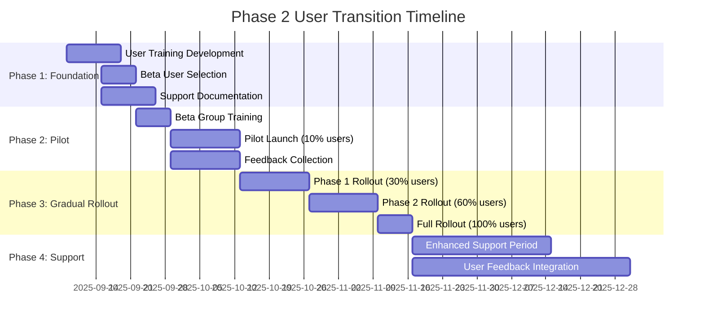

# User Transition Plan - Phase 2 Implementation

**Meeting:** Phase 2 Demo Feedback Session  
**Date:** September 1, 2025  
**Document Version:** 1.0  
**Target Audience:** Internal stakeholders, training team, support team

## Overview

This document outlines the comprehensive user transition plan for Phase 2 Client Data Enhancement, addressing the significant UI/UX changes from card-based to information-dense table layouts and the introduction of new enhanced data fields.

## Transition Challenge Analysis

### 1. Interface Paradigm Shift

| Current Interface | Phase 2 Interface | Impact Level | User Adaptation Required |
|------------------|-------------------|--------------|-------------------------|
| 3-column product_owner_cards | 2-column enhanced cards | **Medium** | Layout relearning |
| Card-based information_items | Dense table format | **High** | Complete workflow change |
| Linked objectives-actions | Separated columnar display | **High** | Mental model restructure |
| Basic net_worth display | Liquidity-ordered hierarchy | **Medium** | Financial concept learning |

### 2. User Impact Assessment

```typescript
interface UserImpactAnalysis {
  // User groups affected
  userGroups: {
    seniorAdvisors: {
      adaptationDifficulty: 'low';
      benefitRealization: 'high';
      trainingHours: 2;
      supportRequired: 'minimal';
    };
    juniorAdvisors: {
      adaptationDifficulty: 'medium';
      benefitRealization: 'medium';
      trainingHours: 4;
      supportRequired: 'moderate';
    };
    administrators: {
      adaptationDifficulty: 'high';
      benefitRealization: 'low';
      trainingHours: 6;
      supportRequired: 'extensive';
    };
    complianceTeam: {
      adaptationDifficulty: 'low';
      benefitRealization: 'very_high';
      trainingHours: 3;
      supportRequired: 'minimal';
    };
  };
  
  // Workflow impact areas
  workflowChanges: {
    clientMeetingPreparation: 'significant_improvement';
    dataEntry: 'learning_curve_initially';
    reporting: 'major_efficiency_gains';
    complianceReviews: 'streamlined_process';
  };
}
```

## Gradual Rollout Strategy

### 1. Phased Implementation Timeline



### 2. Feature Flag Configuration

```typescript
interface FeatureFlagStrategy {
  // Progressive feature enablement
  flags: {
    'phase2-product-owner-cards': {
      defaultValue: false;
      rolloutPercentage: 0;
      userGroups: ['beta_testers'];
      dependencies: ['enhanced-data-fields'];
    };
    
    'information-dense-tables': {
      defaultValue: false;
      rolloutPercentage: 0;
      userGroups: ['senior_advisors'];
      dependencies: ['table-virtualization'];
    };
    
    'separated-objectives-actions': {
      defaultValue: false;
      rolloutPercentage: 0;
      userGroups: ['compliance_team'];
      dependencies: ['global-actions-api'];
    };
    
    'liquidity-based-net_worth': {
      defaultValue: false;
      rolloutPercentage: 0;
      userGroups: ['all'];
      dependencies: ['asset-liquidity-rankings'];
    };
  };
  
  // Rollback capabilities
  rollbackTriggers: {
    userSatisfactionBelow: 70; // percentage
    supportTicketsAbove: 50; // per day
    performanceRegressionAbove: 20; // percentage
    criticalBugsReported: 5; // count
  };
}
```

## User Training Program

### 1. Training Module Structure

```typescript
interface TrainingProgram {
  // Core training modules
  modules: {
    'module-1-overview': {
      title: 'Phase 2 Overview: Information Density Benefits';
      duration: 30; // minutes
      format: 'video + interactive demo';
      prerequisites: ['current_system_familiarity'];
      learningObjectives: [
        'Understand information density benefits',
        'Recognize new layout paradigms',
        'Identify key workflow changes'
      ];
    };
    
    'module-2-product-owners': {
      title: 'Enhanced Product Owner Cards';
      duration: 45; // minutes
      format: 'hands-on practice';
      prerequisites: ['module-1-overview'];
      learningObjectives: [
        'Navigate 2-column card layout',
        'Input enhanced contact information',
        'Understand security word handling'
      ];
    };
    
    'module-3-information-tables': {
      title: 'Information-Dense Tables Mastery';
      duration: 60; // minutes
      format: 'guided practice + assessment';
      prerequisites: ['module-2-product-owners'];
      learningObjectives: [
        'Efficiently scan dense table data',
        'Use sorting and filtering effectively',
        'Understand priority and status indicators'
      ];
    };
    
    'module-4-objectives-actions': {
      title: 'Separated Objectives & Global Actions';
      duration: 45; // minutes
      format: 'workflow simulation';
      prerequisites: ['module-3-information-tables'];
      learningObjectives: [
        'Create and manage separated objectives',
        'Use global_actions across clients',
        'Export actions to PDF'
      ];
    };
    
    'module-5-net_worth': {
      title: 'Liquidity-Based Networth Analysis';
      duration: 30; // minutes
      format: 'case study analysis';
      prerequisites: ['module-4-objectives-actions'];
      learningObjectives: [
        'Understand liquidity hierarchy',
        'Interpret enhanced net_worth displays',
        'Explain liquidity ordering to clients'
      ];
    };
  };
}
```

### 2. Training Delivery Methods

```typescript
interface TrainingDelivery {
  // Multiple delivery formats
  deliveryMethods: {
    selfPaced: {
      platform: 'built_in_system_tutorials'; // No existing LMS - use in-app guidance
      availability: '24/7';
      progress_tracking: true;
      certification: false; // Simplified without LMS
      estimatedCompletion: '2 hours'; // Reduced without formal certification
    };
    
    instructorLed: {
      sessionDuration: 1.5; // hours - focused on 2 advisors needing onboarding
      maxParticipants: 4; // Small groups for personalized attention
      frequency: 'as_needed_for_new_advisors';
      handsonPractice: true;
      qaSessions: true;
      focusAreas: ['system_capabilities_demo', 'advisor_onboarding'];
    };
    
    microlearning: {
      format: 'daily_tips';
      duration: 5; // minutes per tip
      delivery: 'email + in_app_notifications';
      topics: [
        'Keyboard shortcuts for dense tables',
        'Quick filtering techniques',
        'Efficient data entry patterns'
      ];
    };
    
    justInTimeHelp: {
      format: 'contextual_tooltips';
      triggers: ['first_use', 'error_states', 'feature_discovery'];
      progressiveDisclosure: true;
    };
  };
}
```

## Change Management Strategy

### 1. Communication Plan

```typescript
interface CommunicationStrategy {
  // Stakeholder communication timeline
  communications: {
    announcement: {
      audience: 'all_users';
      timeline: '4_weeks_before_rollout';
      channels: ['email', 'company_meeting', 'dashboard_banner'];
      message: 'Exciting Phase 2 enhancements coming - information density improvements';
    };
    
    trainingAvailable: {
      audience: 'all_users';
      timeline: '3_weeks_before_rollout';
      channels: ['email', 'in_app_notifications'];
      message: 'Phase 2 training materials now available - access via help menu';
    };
    
    pilotLaunch: {
      audience: 'beta_users';
      timeline: 'pilot_start';
      channels: ['direct_email', 'phone_call'];
      message: 'Welcome to Phase 2 pilot - your feedback shapes the future';
    };
    
    rolloutNotification: {
      audience: 'per_rollout_phase';
      timeline: 'week_before_activation';
      channels: ['email', 'in_app_notification', 'team_meetings'];
      message: 'Phase 2 activating for your account on [date]';
    };
    
    postRolloutSupport: {
      audience: 'newly_activated_users';
      timeline: 'day_after_activation';
      channels: ['email', 'in_app_guidance'];
      message: 'Phase 2 activated! Here are your quick start resources';
    };
  };
}
```

### 2. Change Champions Program

```typescript
interface ChangeChampionsProgram {
  // Power user network
  champions: {
    selection: {
      criteria: [
        'system_expertise',
        'positive_attitude',
        'influence_within_team',
        'willingness_to_help_others'
      ];
      targetNumber: 15; // One per team/department
      timeCommitment: '2_hours_per_week';
    };
    
    responsibilities: {
      earlyAdoption: 'Test features and provide detailed feedback';
      peerSupport: 'Answer questions and help colleagues';
      feedbackCollection: 'Gather and relay user concerns';
      trainingAssistance: 'Co-facilitate training sessions';
    };
    
    incentives: {
      recognition: 'Company-wide acknowledgment';
      earlyAccess: 'Preview upcoming features';
      directInfluence: 'Input on future developments';
      skillDevelopment: 'Advanced system training';
    };
  };
}
```

## User Support Enhancement

### 1. Tiered Support Strategy

```typescript
interface TieredSupport {
  // Support level escalation
  supportTiers: {
    level1_selfService: {
      resources: [
        'contextual_help_tooltips',
        'video_tutorials',
        'searchable_knowledge_base',
        'interactive_walkthroughs'
      ];
      responseTime: 'immediate';
      availability: '24/7';
    };
    
    level2_peerSupport: {
      resources: [
        'change_champions_network',
        'user_forums',
        'team_slack_channels',
        'weekly_office_hours'
      ];
      responseTime: '< 2 hours';
      availability: 'business_hours';
    };
    
    level3_technicalSupport: {
      resources: [
        'dedicated_support_team',
        'screen_sharing_sessions',
        'phone_support',
        'ticket_system'
      ];
      responseTime: '< 4 hours';
      availability: 'extended_hours';
    };
    
    level4_escalatedSupport: {
      resources: [
        'development_team_involvement',
        'product_manager_consultation',
        'emergency_hotline'
      ];
      responseTime: '< 1 hour';
      availability: 'on_demand';
    };
  };
}
```

### 2. Enhanced Documentation

```markdown
# User Support Documentation Structure

## Quick Start Guides
- **5-Minute Product Owner Cards Guide**: Essential tasks only
- **Information Tables Quick Reference**: Keyboard shortcuts and filters
- **Global Actions Workflow**: Step-by-step process guide
- **Networth Analysis Cheat Sheet**: Liquidity hierarchy explanation

## Detailed User Manuals
- **Complete Phase 2 User Manual**: Comprehensive feature documentation
- **Workflow Guides**: End-to-end process documentation
- **Troubleshooting Guide**: Common issues and solutions
- **Advanced Features Guide**: Power user tips and tricks

## Interactive Resources
- **Guided Tours**: In-app onboarding sequences
- **Video Library**: Task-specific tutorial videos
- **Practice Environment**: Safe space to explore features
- **FAQ Database**: Searchable common questions

## Comparison Resources
- **Before/After Workflows**: Side-by-side process comparisons
- **Feature Mapping**: Where old features moved in new interface
- **Efficiency Tips**: How to work faster with new layouts
```

## User Feedback Integration

### 1. Continuous Feedback Collection

```typescript
interface FeedbackSystem {
  // Feedback collection methods
  collectionMethods: {
    inAppFeedback: {
      triggers: ['feature_completion', 'error_recovery', 'session_end'];
      format: 'rating + optional_comment';
      frequency: 'maximum_once_per_day';
    };
    
    weeklyPulse: {
      delivery: 'email_survey';
      questions: 5; // Keep short to maximize response rate
      focus: ['satisfaction', 'efficiency', 'confidence', 'support_needs'];
    };
    
    focusGroups: {
      frequency: 'bi_weekly';
      participants: 8;
      duration: 90; // minutes
      format: 'structured_discussion';
    };
    
    usabilityTesting: {
      frequency: 'monthly';
      participants: 6;
      format: 'task_observation';
      metrics: ['task_completion_time', 'error_rate', 'satisfaction'];
    };
  };
  
  // Feedback analysis and response
  responseProcess: {
    dataAnalysis: {
      frequency: 'weekly';
      metrics: [
        'user_satisfaction_score',
        'feature_adoption_rate',
        'support_ticket_volume',
        'task_completion_efficiency'
      ];
    };
    
    actionableInsights: {
      threshold: 70; // satisfaction percentage
      responseTime: 48; // hours to address critical issues
      communicationRequired: true; // Users informed of changes
    };
  };
}
```

### 2. Iterative Improvement Process

```typescript
interface IterativeImprovement {
  // Improvement cycle
  improvementCycle: {
    dataCollection: {
      duration: 2; // weeks
      sources: ['analytics', 'support_tickets', 'user_surveys'];
    };
    
    analysisAndPrioritization: {
      duration: 1; // week
      criteria: ['user_impact', 'implementation_effort', 'business_value'];
    };
    
    implementationPlanning: {
      duration: 1; // week
      stakeholders: ['product_team', 'ux_team', 'development_team'];
    };
    
    developmentAndTesting: {
      duration: 2; // weeks
      process: 'agile_sprints';
    };
    
    rolloutAndValidation: {
      duration: 2; // weeks
      validation: 'a_b_testing_where_possible';
    };
  };
}
```

## Accessibility Transition Support

### 1. Accessibility Enhancements

```typescript
interface AccessibilitySupport {
  // Enhanced accessibility features
  enhancements: {
    denseTables: {
      keyboardNavigation: {
        enabled: true;
        shortcuts: {
          'Arrow keys': 'Cell navigation',
          'Tab/Shift+Tab': 'Focusable element navigation',
          'Enter/Space': 'Activate buttons/links',
          'Ctrl+Home/End': 'Table start/end navigation'
        };
      };
      
      screenReaderSupport: {
        ariaLabels: 'comprehensive';
        tableHeaders: 'properly_associated';
        liveRegions: 'status_updates';
        roleDefinitions: 'semantic_markup';
      };
      
      visualAccommodations: {
        highContrast: 'theme_option';
        fontSize: 'user_scalable';
        colorBlindness: 'alternative_indicators';
        reducedMotion: 'animation_controls';
      };
    };
  };
}
```

## Success Metrics & KPIs

### 1. Transition Success Measurement

```typescript
interface TransitionMetrics {
  // Key performance indicators
  successMetrics: {
    userAdoption: {
      target: 95; // percentage of users actively using Phase 2
      measurement: 'weekly_active_users_on_new_features';
      timeframe: '8_weeks_post_rollout';
    };
    
    userSatisfaction: {
      target: 80; // satisfaction score
      measurement: 'nps_and_satisfaction_surveys';
      timeframe: 'monthly';
    };
    
    trainingCompletion: {
      target: 90; // percentage
      measurement: 'training_module_completion_rates';
      timeframe: '4_weeks_post_availability';
    };
    
    supportTicketReduction: {
      target: 30; // percentage reduction from baseline
      measurement: 'phase2_related_support_tickets';
      timeframe: '12_weeks_post_rollout';
    };
    
    taskEfficiency: {
      target: 25; // percentage improvement
      measurement: 'time_to_complete_common_workflows';
      timeframe: '6_weeks_post_user_adaptation';
    };
    
    errorReduction: {
      target: 40; // percentage reduction
      measurement: 'user_error_rate_in_key_workflows';
      timeframe: '8_weeks_post_rollout';
    };
  };
  
  // Risk indicators
  riskIndicators: {
    lowAdoptionRate: {
      threshold: 70; // percentage
      action: 'enhance_training_and_support';
    };
    
    highSupportVolume: {
      threshold: 150; // percentage of normal volume
      action: 'additional_support_resources';
    };
    
    userResistance: {
      threshold: 60; // satisfaction score
      action: 'stakeholder_engagement_and_feedback_sessions';
    };
  };
}
```

## Rollback and Contingency Planning

### 1. Rollback Procedures

```typescript
interface RollbackProcedures {
  // Rollback triggers and procedures
  rollbackTriggers: {
    criticalBugReports: {
      threshold: 5; // P1 bugs
      timeframe: 24; // hours
      autoRollback: false;
      approvalRequired: 'product_manager';
    };
    
    userSatisfactionDrop: {
      threshold: 50; // satisfaction score
      timeframe: 72; // hours
      autoRollback: false;
      approvalRequired: 'stakeholder_committee';
    };
    
    systemPerformance: {
      threshold: 50; // percentage degradation
      timeframe: 1; // hour
      autoRollback: true;
      approvalRequired: 'technical_lead';
    };
  };
  
  rollbackProcess: {
    preparation: {
      featureFlags: 'instant_disable_capability';
      dataBackup: 'automated_pre_rollback';
      userNotification: 'automated_email_template';
      supportTeamAlert: 'immediate_notification';
    };
    
    execution: {
      phaseRollback: 'reverse_order_of_rollout';
      dataIntegrity: 'validation_checks';
      userCommunication: 'transparent_explanation';
      timelineCommitment: 'return_to_service_eta';
    };
    
    postRollback: {
      rootCauseAnalysis: 'required_within_48_hours';
      userFeedback: 'collect_improvement_suggestions';
      remediation: 'address_issues_before_retry';
      stakeholderUpdate: 'lessons_learned_report';
    };
  };
}
```

## Communication Templates

### 1. User Communication Templates

```markdown
# Email Template: Phase 2 Rollout Notification

Subject: 🚀 Phase 2 Enhancements Activating for Your Account

Dear [User Name],

Great news! Phase 2 of our Client Data Enhancement system will be activated for your account on [Date]. 

## What's New:
✅ **Enhanced Product Owner Cards**: More comprehensive client information in a cleaner 2-column layout
✅ **Information-Dense Tables**: Maximum data visibility for efficient client review
✅ **Separated Objectives & Actions**: Streamlined workflow with global action management
✅ **Liquidity-Based Networth**: Professional wealth management asset ordering

## Your Success Resources:
📚 **Training**: Complete your modules at [Training Link] (3.5 hours total)
🎥 **Quick Start**: Watch the 15-minute overview video
📞 **Support**: Extended support hours during your first week
👥 **Champions**: Connect with your team's Phase 2 champion: [Champion Name]

## What to Expect:
- First few days: Focus on exploring the enhanced interface
- Week 1-2: Increased efficiency as you adapt to new workflows  
- Week 3+: Significant time savings and improved client service

Questions? Your Phase 2 success team is here to help:
- Email: phase2support@company.com
- Slack: #phase2-help
- Office Hours: Daily 2-3 PM

We're excited to see how Phase 2 enhances your client service capabilities!

Best regards,
The Phase 2 Team
```

## Success Criteria Summary

### 1. Transition Success Criteria

- ✅ **User Adoption:** 95% of users actively using Phase 2 features within 8 weeks
- ✅ **Training Completion:** 90% completion rate for core training modules
- ✅ **User Satisfaction:** 80+ satisfaction score maintained post-transition
- ✅ **Support Efficiency:** 30% reduction in support tickets after adaptation period
- ✅ **Workflow Efficiency:** 25% improvement in common task completion times
- ✅ **Error Reduction:** 40% decrease in user errors after learning curve

### 2. Support and Communication Success

- ✅ **Communication Clarity:** > 90% of users understand upcoming changes
- ✅ **Resource Accessibility:** All users can access training and support resources
- ✅ **Champion Network:** Effective peer support network established
- ✅ **Feedback Integration:** User feedback incorporated into ongoing improvements
- ✅ **Accessibility Compliance:** WCAG 2.1 AA standards maintained throughout transition