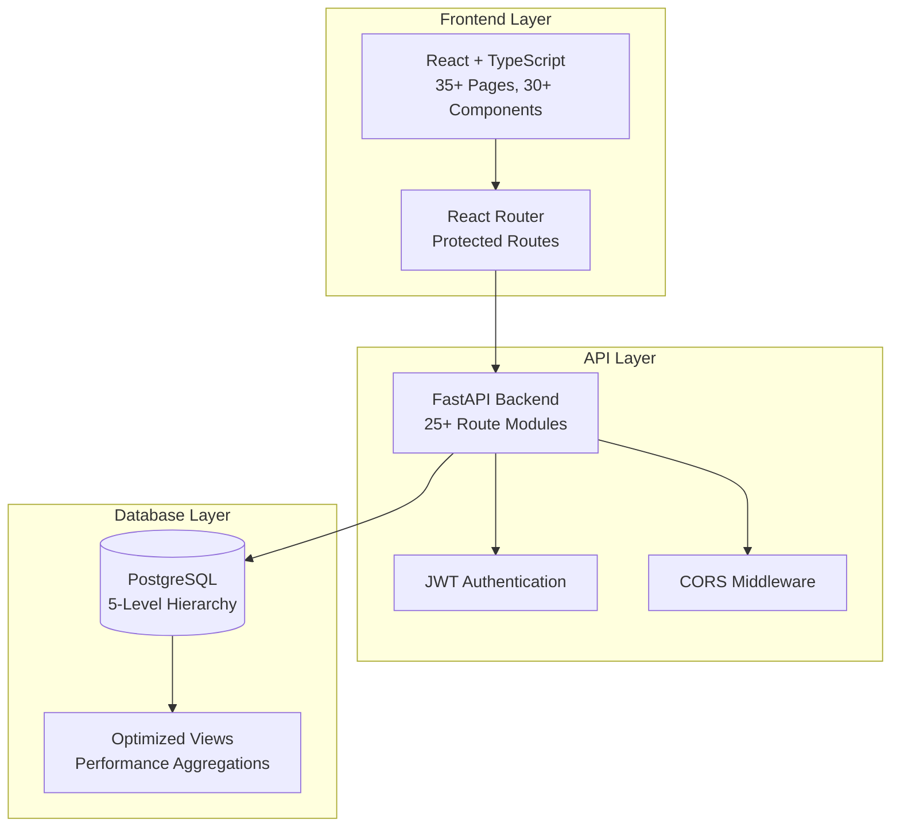
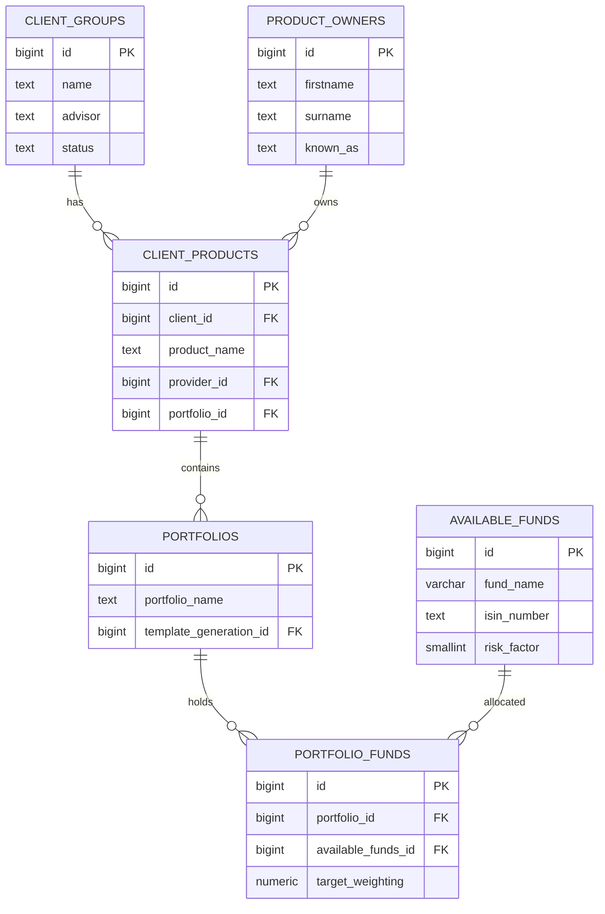
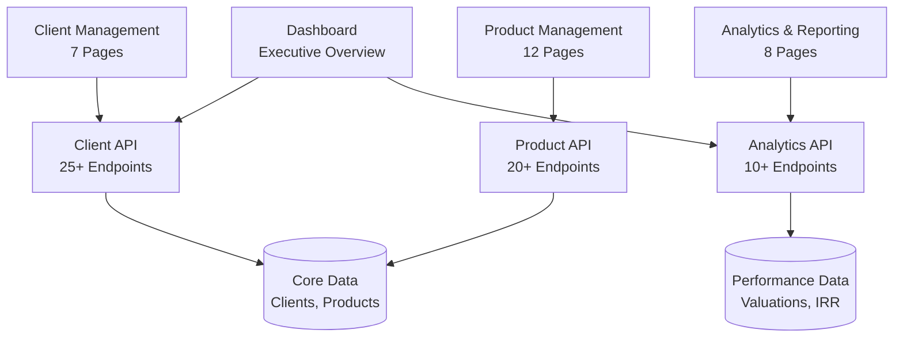
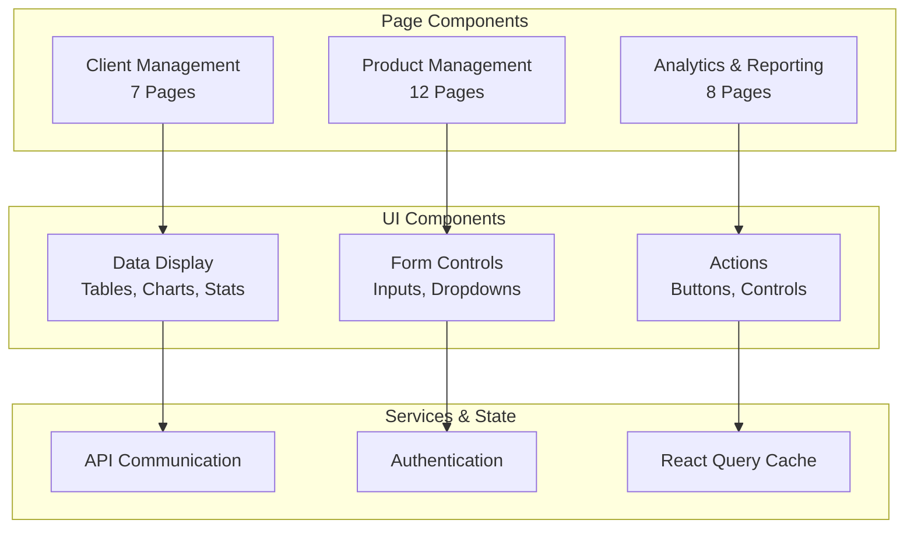
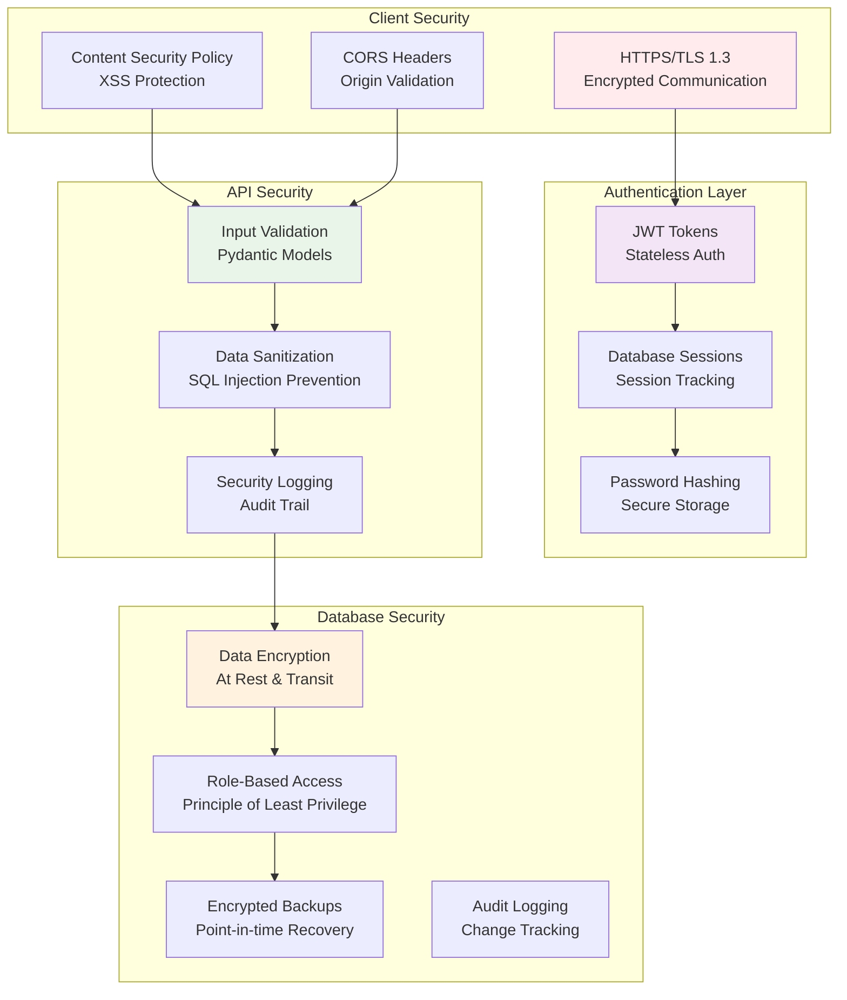
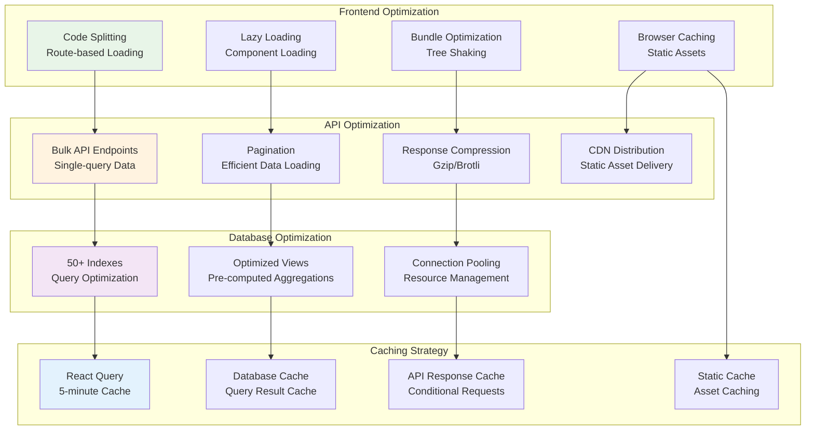
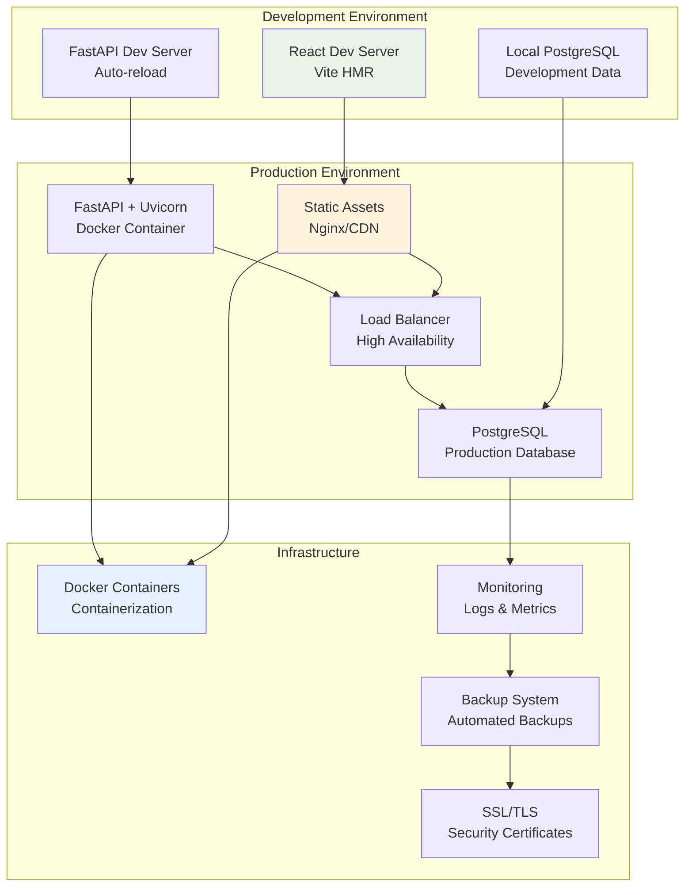
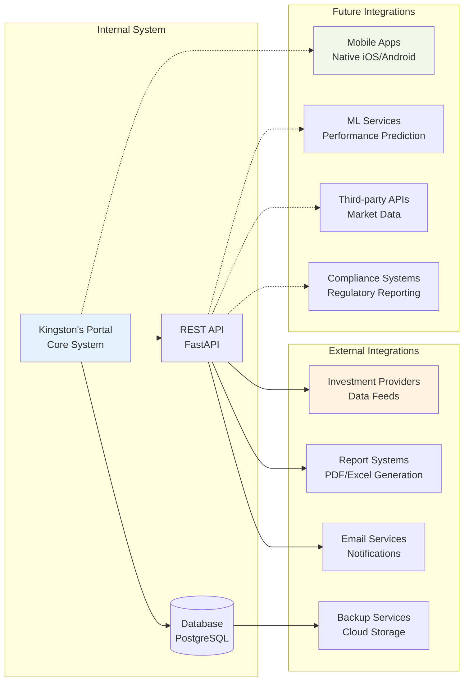

# Kingston's Portal - System Architecture Diagrams

This document contains a series of [Mermaid](https://mermaid.js.org/) diagrams that visualize the system architecture, database relationships, and data flows. For a narrative explanation of these diagrams, please refer to the [System Architecture Overview](./01_system_architecture_overview.md).

## System Overview

## Database Entity Relationships

This diagram shows the primary relationships between the core entities. For a full breakdown of tables and columns, see the [Database Schema](./03_database_schema.md) document.

## Application Data Flow

This diagram illustrates how data flows from the UI components, through the API layer, to the database.

## Component Architecture

This diagram shows the relationship between the major parts of the frontend architecture. See the [State Management](./../5_frontend_guide/02_state_management.md) guide for more details.

## Security Architecture

## Performance Optimization Architecture

## Deployment Architecture

## Integration Points

