# Architecture Diagrams

This document provides visual representations of the system architecture for both development and production environments.

## Production Architecture - Kingston03 Server

### Overall System Architecture


### Environment-Based API Communication
```mermaid
graph TB
    subgraph "Development Environment"
        DEVBROWSER[Browser<br/>localhost:3000]
        VITE[Vite Dev Server<br/>:3000]
        PROXY[Vite Proxy<br/>API Calls]
        DEVAPI[FastAPI Dev<br/>:8001]
    end
    
    subgraph "Production Environment"
        PRODBROWSER[Browser<br/>intranet.kingston.local]
        PRODII[IIS Server<br/>:80]
        PRODAPI[FastAPI Service<br/>:8001]
    end
    
    subgraph "API Configuration Logic"
        ENVDETECT[Environment Detection<br/>getApiBaseUrl()]
        DEVCONFIG[Development:<br/>baseURL = '']
        PRODCONFIG[Production:<br/>baseURL = 'http://intranet.kingston.local:8001']
    end
    
    DEVBROWSER --> VITE
    VITE --> PROXY
    PROXY --> DEVAPI
    
    PRODBROWSER --> PRODII
    PRODBROWSER --> |"Direct API Calls"| PRODAPI
    
    ENVDETECT --> DEVCONFIG
    ENVDETECT --> PRODCONFIG
    
    style DEVBROWSER fill:#e3f2fd
    style PRODBROWSER fill:#f1f8e9
    style ENVDETECT fill:#fff3e0
```

## Development Architecture

### Local Development Setup

```mermaid
graph TB
    subgraph "Developer Machine"
        subgraph "Terminal 1 - Backend"
            BACKEND[FastAPI Backend<br/>uvicorn main:app<br/>--port 8001]
            HOTRELOAD[Hot Reload<br/>--reload flag]
        end
        
        subgraph "Terminal 2 - Frontend"
            FRONTEND[Vite Dev Server<br/>npm start<br/>:3000]
            HMR[Hot Module Replacement<br/>React Components]
        end
        
        subgraph "Browser"
            DEVAPP[Development App<br/>localhost:3000]
            DEVTOOLS[Browser DevTools<br/>Network Debugging]
        end
    end
    
    subgraph "External Services"
        SUPABASE[(Supabase<br/>PostgreSQL)]
    end
    
    FRONTEND --> DEVAPP
    DEVAPP --> |"API Proxy<br/>/api/* → :8001"| BACKEND
    BACKEND --> SUPABASE
    HOTRELOAD --> BACKEND
    HMR --> FRONTEND
    DEVTOOLS --> DEVAPP
    
    style BACKEND fill:#f3e5f5
    style FRONTEND fill:#e1f5fe
    style SUPABASE fill:#e8f5e8
```


## Data Flow Diagrams

### Authentication Flow


### API Request Flow


## CORS Configuration Diagram

```mermaid
graph TB
    subgraph "FastAPI CORS Configuration"
        CORSM[CORS Middleware]
        ORIGINS[allow_origins:<br/>- http://intranet.kingston.local<br/>- http://localhost:3000<br/>- http://127.0.0.1:3000]
        CREDENTIALS[allow_credentials: True]
        METHODS[allow_methods:<br/>GET, POST, PUT, DELETE, OPTIONS, PATCH]
        HEADERS[allow_headers: ["*"]]
    end
    
    subgraph "Request Sources"
        PROD[Production Frontend<br/>intranet.kingston.local]
        DEV[Development Frontend<br/>localhost:3000]
        DEV2[Development Frontend<br/>127.0.0.1:3000]
    end
    
    PROD --> CORSM
    DEV --> CORSM
    DEV2 --> CORSM
    
    CORSM --> ORIGINS
    CORSM --> CREDENTIALS
    CORSM --> METHODS
    CORSM --> HEADERS
    
    style CORSM fill:#fff3e0
    style ORIGINS fill:#e8f5e8
    style CREDENTIALS fill:#fce4ec
    style METHODS fill:#e3f2fd
    style HEADERS fill:#f1f8e9
```

## Network Architecture

### Kingston03 Server Network Configuration


## Key Architectural Benefits

### 1. **Performance Optimization**
- **IIS**: Optimized for static file serving with caching
- **FastAPI**: Direct API communication eliminates proxy overhead
- **Separation of Concerns**: Clear boundaries between frontend and backend

### 2. **Scalability**
- **Horizontal Scaling**: Services can be scaled independently
- **Load Balancing**: Future load balancers can be added easily
- **Microservices Ready**: Architecture supports future service decomposition

### 3. **Security**
- **Firewall Protection**: Port-specific access control
- **CORS Configuration**: Explicit origin whitelisting
- **Service Isolation**: Frontend and backend run in separate contexts

### 4. **Maintainability**
- **Environment Detection**: Automatic configuration switching
- **Service Management**: NSSM provides reliable service management
- **Debugging**: Clear separation makes troubleshooting easier

This architecture provides a robust, scalable foundation for the Kingston's Portal application while maintaining simplicity and performance. 