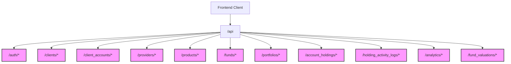

# Kingstons Portal - API Boundaries

This document defines the API boundaries between the frontend and backend components of the Kingstons Portal system. It serves as a contract for communication between these components.

## API Overview

The Kingstons Portal API follows RESTful principles with JSON as the primary data format. All endpoints are prefixed with `/api` and grouped by resource type.



## Authentication Endpoints

### `/api/auth/signup`
- **Method**: POST
- **Purpose**: Register a new user
- **Request Body**:
  ```json
  {
    "first_name": "string",
    "last_name": "string",
    "email": "string",
    "password": "string"
  }
  ```
- **Response**:
  ```json
  {
    "message": "User created successfully"
  }
  ```
- **Status Codes**:
  - 200: Success
  - 400: Email already exists
  - 500: Server error

### `/api/auth/login`
- **Method**: POST
- **Purpose**: Authenticate user and create session
- **Request Body**:
  ```json
  {
    "email": "string",
    "password": "string"
  }
  ```
- **Response**:
  ```json
  {
    "message": "Login successful",
    "access_token": "string",
    "token_type": "bearer",
    "user": {
      "id": "integer",
      "email": "string",
      "first_name": "string",
      "last_name": "string",
      "profile_picture_url": "string",
      "preferred_client_view": "string",
      "preferred_landing_page": "string"
    }
  }
  ```
- **Status Codes**:
  - 200: Success
  - 401: Invalid credentials
  - 500: Server error

### `/api/auth/logout`
- **Method**: POST
- **Purpose**: End user session
- **Request Body**: Empty
- **Response**:
  ```json
  {
    "message": "Logout successful"
  }
  ```
- **Status Codes**:
  - 200: Success
  - 500: Server error

### `/api/auth/me`
- **Method**: GET
- **Purpose**: Get current user profile
- **Authentication**: Required
- **Response**:
  ```json
  {
    "id": "integer",
    "email": "string",
    "first_name": "string",
    "last_name": "string",
    "profile_picture_url": "string",
    "preferred_client_view": "string",
    "preferred_landing_page": "string"
  }
  ```
- **Status Codes**:
  - 200: Success
  - 401: Not authenticated
  - 500: Server error

### `/api/auth/forgot-password`
- **Method**: POST
- **Purpose**: Request password reset
- **Request Body**:
  ```json
  {
    "email": "string"
  }
  ```
- **Response**:
  ```json
  {
    "message": "If your email exists in our system, you will receive a password reset link"
  }
  ```
- **Status Codes**:
  - 200: Success
  - 500: Server error

### `/api/auth/reset-password`
- **Method**: POST
- **Purpose**: Reset password with token
- **Request Body**:
  ```json
  {
    "token": "string",
    "new_password": "string"
  }
  ```
- **Response**:
  ```json
  {
    "message": "Password has been reset successfully"
  }
  ```
- **Status Codes**:
  - 200: Success
  - 400: Invalid or expired token
  - 500: Server error

## Client Management Endpoints

### `/api/clients`
- **Method**: GET
- **Purpose**: List all clients
- **Authentication**: Required
- **Query Parameters**:
  - `status`: Filter by status (active, inactive)
  - `advisor`: Filter by advisor
  - `search`: Search term for client name
- **Response**:
  ```json
  [
    {
      "id": "integer",
      "name": "string",
      "relationship": "string",
      "advisor": "string",
      "status": "string",
      "created_at": "string (ISO date)",
      "total_fum": "number (optional)"
    }
  ]
  ```
- **Status Codes**:
  - 200: Success
  - 401: Not authenticated
  - 500: Server error

### `/api/clients/{client_id}`
- **Method**: GET
- **Purpose**: Get client details
- **Authentication**: Required
- **Path Parameters**:
  - `client_id`: Client ID
- **Response**:
  ```json
  {
    "id": "integer",
    "name": "string",
    "relationship": "string",
    "advisor": "string",
    "status": "string",
    "created_at": "string (ISO date)",
    "total_fum": "number",
    "accounts": [
      {
        "id": "integer",
        "account_name": "string",
        "product_name": "string",
        "provider_name": "string",
        "status": "string",
        "start_date": "string (ISO date)",
        "end_date": "string (ISO date, optional)",
        "total_value": "number"
      }
    ]
  }
  ```
- **Status Codes**:
  - 200: Success
  - 401: Not authenticated
  - 404: Client not found
  - 500: Server error

### `/api/clients`
- **Method**: POST
- **Purpose**: Create new client
- **Authentication**: Required
- **Request Body**:
  ```json
  {
    "name": "string",
    "relationship": "string",
    "advisor": "string",
    "status": "string (default: active)"
  }
  ```
- **Response**:
  ```json
  {
    "id": "integer",
    "name": "string",
    "relationship": "string",
    "advisor": "string",
    "status": "string",
    "created_at": "string (ISO date)"
  }
  ```
- **Status Codes**:
  - 201: Created
  - 400: Invalid request
  - 401: Not authenticated
  - 500: Server error

### `/api/clients/{client_id}`
- **Method**: PUT
- **Purpose**: Update client details
- **Authentication**: Required
- **Path Parameters**:
  - `client_id`: Client ID
- **Request Body**:
  ```json
  {
    "name": "string (optional)",
    "relationship": "string (optional)",
    "advisor": "string (optional)",
    "status": "string (optional)"
  }
  ```
- **Response**:
  ```json
  {
    "id": "integer",
    "name": "string",
    "relationship": "string",
    "advisor": "string",
    "status": "string",
    "created_at": "string (ISO date)"
  }
  ```
- **Status Codes**:
  - 200: Success
  - 400: Invalid request
  - 401: Not authenticated
  - 404: Client not found
  - 500: Server error

## Account Management Endpoints

### `/api/client_accounts`
- **Method**: GET
- **Purpose**: List all client accounts
- **Authentication**: Required
- **Query Parameters**:
  - `client_id`: Filter by client
  - `status`: Filter by status
  - `product_id`: Filter by product
- **Response**:
  ```json
  [
    {
      "id": "integer",
      "client_id": "integer",
      "client_name": "string",
      "available_products_id": "integer",
      "product_name": "string",
      "provider_name": "string",
      "account_name": "string",
      "status": "string",
      "start_date": "string (ISO date)",
      "end_date": "string (ISO date, optional)",
      "weighting": "number",
      "total_value": "number (optional)"
    }
  ]
  ```
- **Status Codes**:
  - 200: Success
  - 401: Not authenticated
  - 500: Server error

### `/api/client_accounts/{account_id}`
- **Method**: GET
- **Purpose**: Get account details
- **Authentication**: Required
- **Path Parameters**:
  - `account_id`: Account ID
- **Response**:
  ```json
  {
    "id": "integer",
    "client_id": "integer",
    "client_name": "string",
    "available_products_id": "integer",
    "product_name": "string",
    "provider_name": "string",
    "account_name": "string",
    "status": "string",
    "start_date": "string (ISO date)",
    "end_date": "string (ISO date, optional)",
    "weighting": "number",
    "total_value": "number",
    "holdings": [
      {
        "id": "integer",
        "portfolio_id": "integer",
        "portfolio_name": "string",
        "status": "string",
        "start_date": "string (ISO date)",
        "end_date": "string (ISO date, optional)"
      }
    ]
  }
  ```
- **Status Codes**:
  - 200: Success
  - 401: Not authenticated
  - 404: Account not found
  - 500: Server error

### `/api/client_accounts`
- **Method**: POST
- **Purpose**: Create new client account
- **Authentication**: Required
- **Request Body**:
  ```json
  {
    "client_id": "integer",
    "available_products_id": "integer",
    "account_name": "string",
    "status": "string (default: active)",
    "start_date": "string (ISO date)",
    "weighting": "number (optional)",
    "product_type": "string (optional)",
    "portfolio_id": "integer (optional)",
    "notes": "string (optional)",
    "template_generation_id": "integer (optional)"
  }
  ```
- **Response**:
  ```json
  {
    "id": "integer",
    "client_id": "integer",
    "available_products_id": "integer",
    "account_name": "string",
    "status": "string",
    "start_date": "string (ISO date)",
    "weighting": "number",
    "product_type": "string (optional)",
    "portfolio_id": "integer (optional)",
    "notes": "string (optional)",
    "template_generation_id": "integer (optional)",
    "created_at": "string (ISO date)"
  }
  ```
- **Status Codes**:
  - 201: Created
  - 400: Invalid request
  - 401: Not authenticated
  - 500: Server error

## Investment Management Endpoints

### `/api/portfolios`
- **Method**: GET
- **Purpose**: List all portfolios
- **Authentication**: Required
- **Query Parameters**:
  - `status`: Filter by status
- **Response**:
  ```json
  [
    {
      "id": "integer",
      "portfolio_name": "string",
      "status": "string",
      "start_date": "string (ISO date)",
      "end_date": "string (ISO date, optional)",
      "created_at": "string (ISO date)",
      "total_value": "number (optional)",
      "irr": "number (optional)"
    }
  ]
  ```
- **Status Codes**:
  - 200: Success
  - 401: Not authenticated
  - 500: Server error

### `/api/portfolios/{portfolio_id}`
- **Method**: GET
- **Purpose**: Get portfolio details
- **Authentication**: Required
- **Path Parameters**:
  - `portfolio_id`: Portfolio ID
- **Response**:
  ```json
  {
    "id": "integer",
    "portfolio_name": "string",
    "status": "string",
    "start_date": "string (ISO date)",
    "end_date": "string (ISO date, optional)",
    "created_at": "string (ISO date)",
    "total_value": "number",
    "irr": "number",
    "funds": [
      {
        "id": "integer",
        "available_funds_id": "integer",
        "fund_name": "string",
        "target_weighting": "number",
        "start_date": "string (ISO date)",
        "end_date": "string (ISO date, optional)",
        "amount_invested": "number",
        "current_value": "number",
        "irr": "number"
      }
    ]
  }
  ```
- **Status Codes**:
  - 200: Success
  - 401: Not authenticated
  - 404: Portfolio not found
  - 500: Server error

### `/api/portfolios/{portfolio_id}/calculate-irr`
- **Method**: POST
- **Purpose**: Calculate IRR for portfolio
- **Authentication**: Required
- **Path Parameters**:
  - `portfolio_id`: Portfolio ID
- **Response**:
  ```json
  {
    "portfolio_id": "integer",
    "portfolio_name": "string",
    "irr": "number",
    "calculation_date": "string (ISO date)",
    "fund_irrs": [
      {
        "fund_id": "integer",
        "fund_name": "string",
        "irr": "number"
      }
    ]
  }
  ```
- **Status Codes**:
  - 200: Success
  - 401: Not authenticated
  - 404: Portfolio not found
  - 500: Server error

### `/api/fund_valuations`
- **Method**: POST
- **Purpose**: Create fund valuation
- **Authentication**: Required
- **Request Body**:
  ```json
  {
    "portfolio_fund_id": "integer",
    "valuation_date": "string (ISO date)",
    "value": "number"
  }
  ```
- **Response**:
  ```json
  {
    "id": "integer",
    "portfolio_fund_id": "integer",
    "valuation_date": "string (ISO date)",
    "value": "number",
    "created_at": "string (ISO date)"
  }
  ```
- **Status Codes**:
  - 201: Created
  - 400: Invalid request
  - 401: Not authenticated
  - 500: Server error

## Analytics Endpoints

### `/api/analytics/company-overview`
- **Method**: GET
- **Purpose**: Get company-wide analytics
- **Authentication**: Required
- **Query Parameters**:
  - `start_date`: Start date for analysis
  - `end_date`: End date for analysis
- **Response**:
  ```json
  {
    "total_fum": "number",
    "company_irr": "number",
    "client_count": "integer",
    "active_account_count": "integer",
    "provider_breakdown": [
      {
        "provider_id": "integer",
        "provider_name": "string",
        "total_fum": "number",
        "percentage": "number"
      }
    ],
    "product_breakdown": [
      {
        "product_id": "integer",
        "product_name": "string",
        "total_fum": "number",
        "percentage": "number"
      }
    ],
    "fund_breakdown": [
      {
        "fund_id": "integer",
        "fund_name": "string",
        "total_fum": "number",
        "percentage": "number"
      }
    ]
  }
  ```
- **Status Codes**:
  - 200: Success
  - 401: Not authenticated
  - 500: Server error

### `/api/analytics/client/{client_id}`
- **Method**: GET
- **Purpose**: Get client-specific analytics
- **Authentication**: Required
- **Path Parameters**:
  - `client_id`: Client ID
- **Response**:
  ```json
  {
    "client_id": "integer",
    "client_name": "string",
    "total_fum": "number",
    "overall_irr": "number",
    "account_breakdown": [
      {
        "account_id": "integer",
        "account_name": "string",
        "product_name": "string",
        "provider_name": "string",
        "total_value": "number",
        "percentage": "number",
        "irr": "number"
      }
    ],
    "fund_breakdown": [
      {
        "fund_id": "integer",
        "fund_name": "string",
        "total_value": "number",
        "percentage": "number",
        "irr": "number"
      }
    ]
  }
  ```
- **Status Codes**:
  - 200: Success
  - 401: Not authenticated
  - 404: Client not found
  - 500: Server error

## Error Handling

All API endpoints follow a consistent error response format:

```json
{
  "detail": "Error message describing the issue"
}
```

Common HTTP status codes:
- 200: Success
- 201: Created
- 400: Bad Request (invalid input)
- 401: Unauthorized (authentication required)
- 403: Forbidden (insufficient permissions)
- 404: Not Found (resource doesn't exist)
- 500: Internal Server Error

## Authentication

The API uses two authentication mechanisms:

1. **JWT Token Authentication**:
   - Include token in Authorization header: `Authorization: Bearer {token}`
   - Used for stateless API requests

2. **Session Cookie Authentication**:
   - HTTP-only cookie named `session_id`
   - Used for maintaining user sessions

## Data Models

### User/Profile
```json
{
  "id": "integer",
  "email": "string",
  "first_name": "string",
  "last_name": "string",
  "profile_picture_url": "string",
  "preferred_client_view": "string",
  "preferred_landing_page": "string",
  "created_at": "string (ISO date)"
}
```

### Client
```json
{
  "id": "integer",
  "name": "string",
  "relationship": "string",
  "advisor": "string",
  "status": "string",
  "created_at": "string (ISO date)"
}
```

### Client Account
```json
{
  "id": "integer",
  "client_id": "integer",
  "available_products_id": "integer",
  "account_name": "string",
  "status": "string",
  "start_date": "string (ISO date)",
  "end_date": "string (ISO date, optional)",
  "weighting": "number",
  "created_at": "string (ISO date)",
  "plan_number": "string (optional)",
  "product_type": "string (optional)",
  "portfolio_id": "integer (optional)",
  "notes": "string (optional)",
  "template_generation_id": "integer (optional)"
}
```

### Portfolio
```json
{
  "id": "integer",
  "portfolio_name": "string",
  "status": "string",
  "start_date": "string (ISO date)",
  "end_date": "string (ISO date, optional)",
  "created_at": "string (ISO date)"
}
```

### Portfolio Fund
```json
{
  "id": "integer",
  "portfolio_id": "integer",
  "available_funds_id": "integer",
  "target_weighting": "number",
  "start_date": "string (ISO date)",
  "end_date": "string (ISO date, optional)",
  "created_at": "string (ISO date)",
  "amount_invested": "number"
}
```

### Fund
```json
{
  "id": "integer",
  "fund_name": "string",
  "isin_number": "string",
  "risk_factor": "integer",
  "fund_cost": "number",
  "status": "string",
  "created_at": "string (ISO date)"
}
```

### Fund Valuation
```json
{
  "id": "integer",
  "portfolio_fund_id": "integer",
  "valuation_date": "string (ISO date)",
  "value": "number",
  "created_at": "string (ISO date)"
}
```

### Activity Log
```json
{
  "id": "integer",
  "account_holding_id": "integer",
  "portfolio_fund_id": "integer",
  "activity_timestamp": "string (ISO date)",
  "activity_type": "string",
  "amount": "number",
  "created_at": "string (ISO date)",
  "related_fund": "integer (optional)"
}
```

## API Versioning

The current API version is implicitly v1. Future versions will be explicitly versioned using URL path versioning:

```
/api/v2/resource
```

## Rate Limiting

API requests are subject to rate limiting to prevent abuse:
- 100 requests per minute per IP address
- 1000 requests per hour per user

Rate limit headers are included in responses:
- `X-RateLimit-Limit`: Maximum requests allowed in the current period
- `X-RateLimit-Remaining`: Number of requests remaining in the current period
- `X-RateLimit-Reset`: Time when the rate limit will reset (Unix timestamp)

## Pagination

List endpoints support pagination using query parameters:
- `page`: Page number (default: 1)
- `limit`: Items per page (default: 20, max: 100)

Paginated responses include metadata:
```json
{
  "items": [...],
  "pagination": {
    "total": "integer",
    "pages": "integer",
    "page": "integer",
    "limit": "integer",
    "has_next": "boolean",
    "has_prev": "boolean"
  }
}