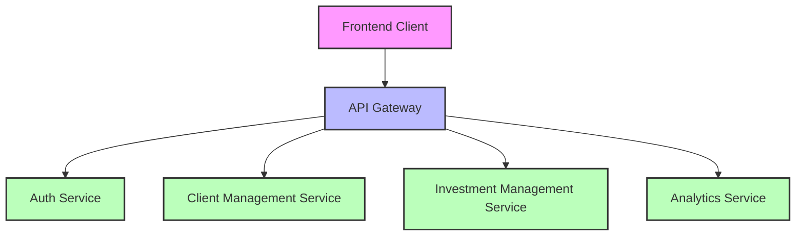
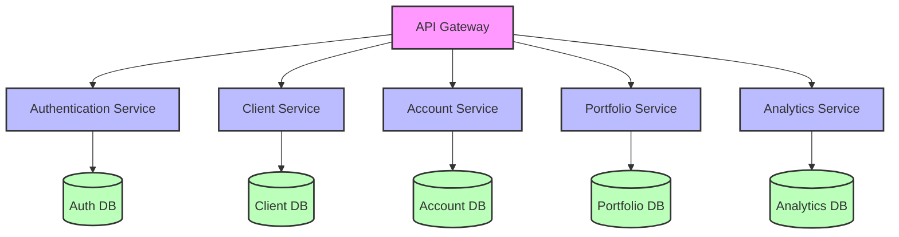
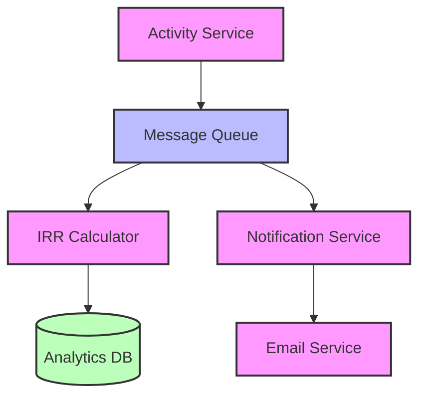
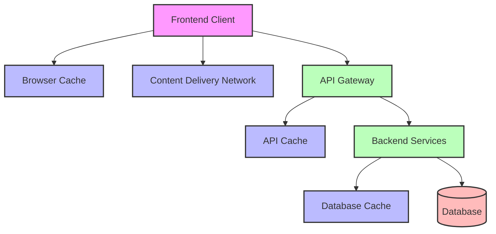
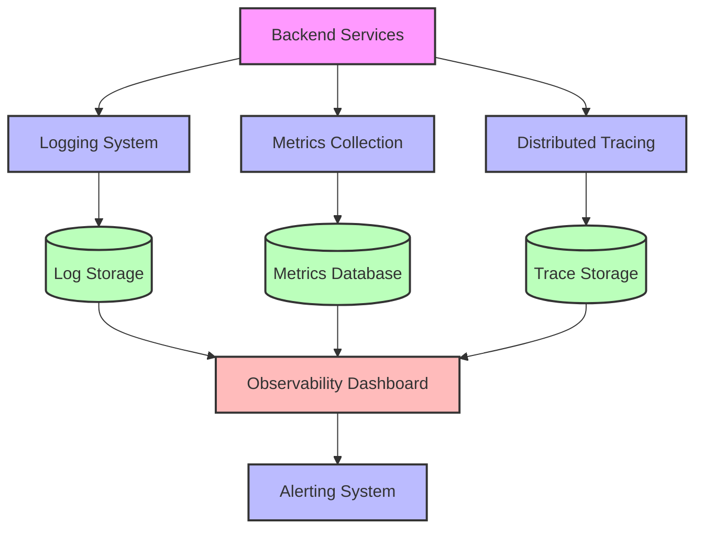
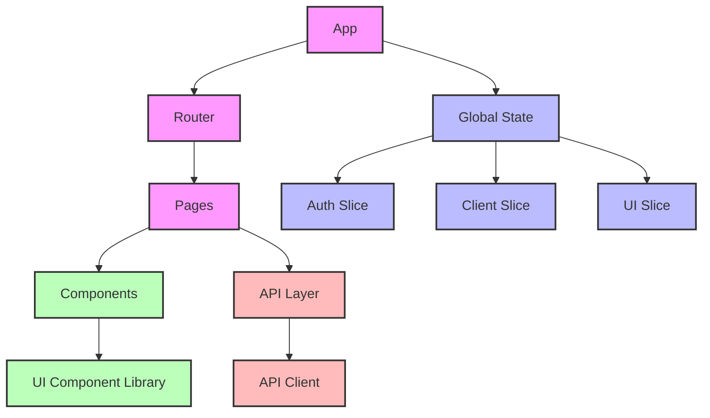
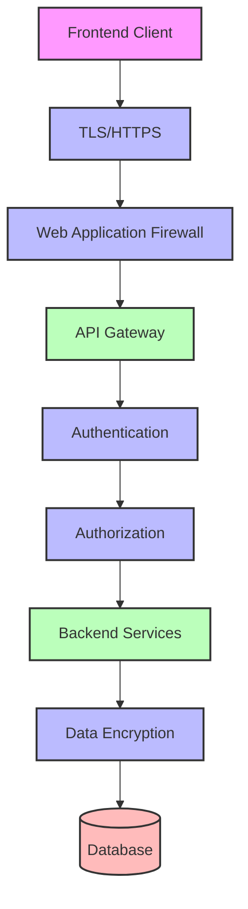
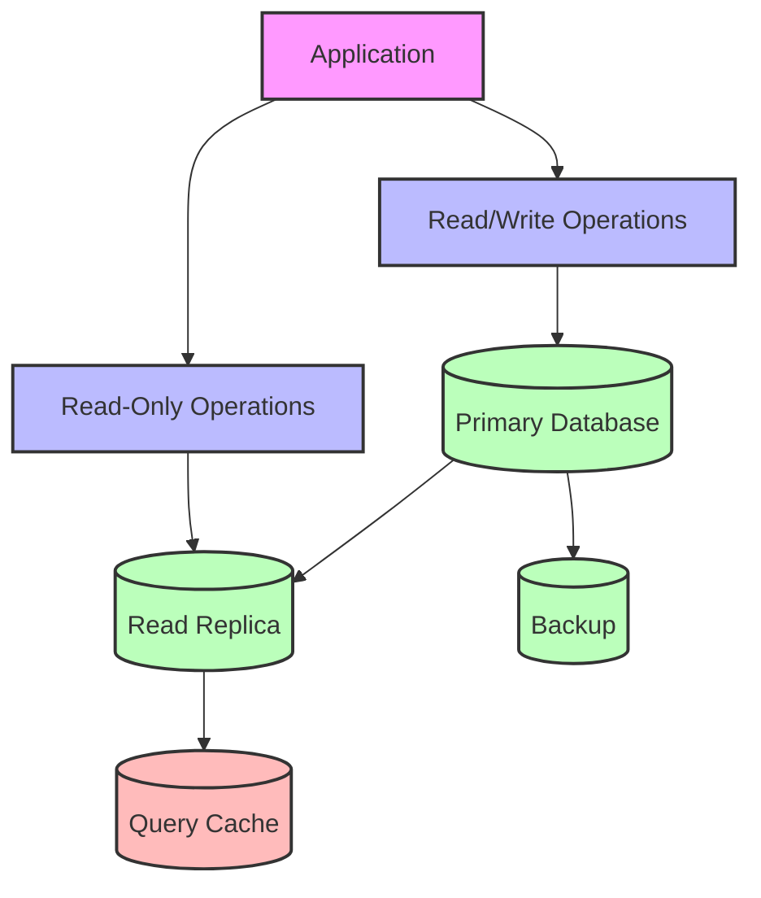
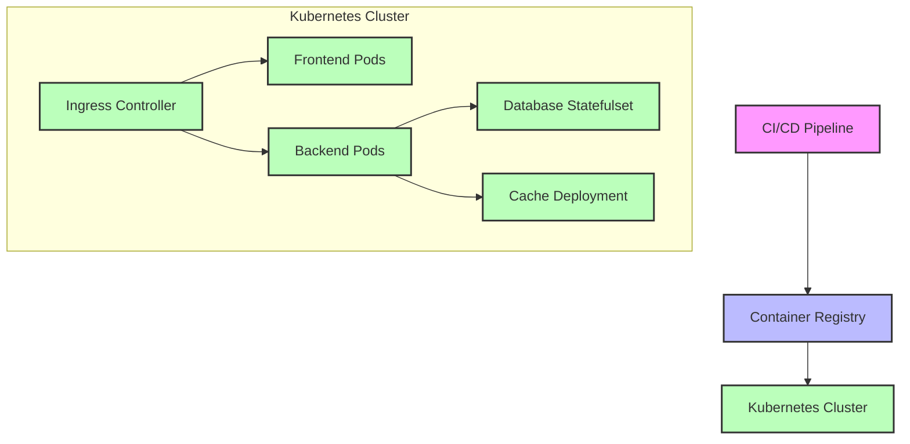
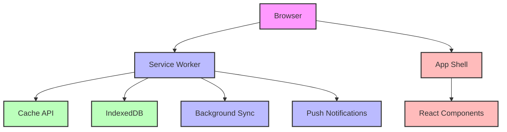

# Kingstons Portal - Architectural Recommendations

This document outlines strategic architectural recommendations for enhancing the Kingstons Portal system. These recommendations aim to improve scalability, maintainability, security, and performance while preserving existing functionality.

## 1. API Gateway Implementation

### Current State
The system currently uses direct API calls from the frontend to the backend FastAPI service. While functional, this approach lacks centralized request handling, authentication, and cross-cutting concerns management.

### Recommendation
Implement an API Gateway as an intermediary layer between clients and backend services.

### Benefits
1. **Centralized Authentication**: Unified authentication and authorization handling
2. **Request Routing**: Intelligent routing to appropriate backend services
3. **Rate Limiting**: Protection against abuse and DoS attacks
4. **Request/Response Transformation**: Standardized API responses
5. **Monitoring**: Centralized logging and metrics collection
6. **Caching**: Response caching for improved performance

### Implementation Approach
1. **Technology Selection**: Consider Kong, AWS API Gateway, or Azure API Management
2. **Phased Migration**: Implement gateway for new endpoints first, then gradually migrate existing endpoints
3. **Authentication Integration**: Integrate with existing JWT and session-based authentication
4. **Monitoring Setup**: Configure logging, metrics, and alerting

### Estimated Effort
- Medium (2-3 sprints)
- Requires DevOps expertise for setup and configuration

## 2. Microservices Architecture Evolution

### Current State
The current system follows a monolithic architecture with a single FastAPI backend service handling all functionality. While well-organized internally, this approach limits independent scaling and deployment.

### Recommendation
Gradually evolve toward a microservices architecture by decomposing the monolith into domain-specific services.

### Benefits
1. **Independent Scaling**: Scale services based on specific load patterns
2. **Technology Flexibility**: Use appropriate technologies for each service
3. **Deployment Independence**: Deploy services independently without affecting others
4. **Team Autonomy**: Enable teams to work on separate services
5. **Fault Isolation**: Contain failures within service boundaries

### Implementation Approach
1. **Domain Analysis**: Identify bounded contexts and service boundaries
   - Authentication Service: User management, authentication, authorization
   - Client Service: Client information management
   - Account Service: Client accounts and holdings
   - Portfolio Service: Portfolios, funds, and valuations
   - Analytics Service: Performance calculations and reporting

2. **Strangler Pattern**: Gradually migrate functionality from monolith to microservices
   - Start with less critical, more isolated domains
   - Use the API Gateway to route requests to appropriate services
   - Maintain backward compatibility during migration

3. **Data Management Strategy**:
   - Consider database-per-service approach
   - Implement data synchronization patterns (event sourcing, CDC)
   - Address data consistency challenges

### Estimated Effort
- High (6-12 months)
- Requires careful planning and incremental implementation

## 3. Event-Driven Architecture for Analytics

### Current State
The current system uses direct API calls for analytics calculations, which can be resource-intensive and lead to performance bottlenecks during peak usage.

### Recommendation
Implement an event-driven architecture for analytics processing, using message queues for asynchronous calculations.

### Benefits
1. **Improved Performance**: Offload resource-intensive calculations
2. **Scalability**: Scale calculation workers independently
3. **Resilience**: Retry failed calculations automatically
4. **Real-time Updates**: Enable real-time analytics through event streaming
5. **Decoupling**: Reduce dependencies between system components

### Implementation Approach
1. **Technology Selection**: Consider RabbitMQ, Apache Kafka, or AWS SQS/SNS
2. **Event Identification**: Define key events to track
   - Account creation/modification
   - Holding creation/modification
   - Fund valuation updates
   - Activity log entries

3. **Event Schema Design**: Create standardized event schemas
   - Include event type, timestamp, and payload
   - Version events for backward compatibility

4. **Consumer Implementation**:
   - IRR Calculator: Process events to calculate performance metrics
   - Notification Service: Generate alerts for significant events
   - Reporting Service: Update reports based on new data

### Estimated Effort
- Medium (2-3 sprints)
- Requires expertise in message queuing systems

## 4. Enhanced Caching Strategy

### Current State
The current system has limited caching, primarily relying on React Query's client-side caching. This can lead to redundant API calls and slower user experience.

### Recommendation
Implement a comprehensive multi-level caching strategy.

### Benefits
1. **Improved Performance**: Faster response times for frequently accessed data
2. **Reduced Load**: Lower database and API server load
3. **Cost Efficiency**: Reduced infrastructure costs
4. **Scalability**: Better handling of traffic spikes
5. **User Experience**: More responsive application

### Implementation Approach
1. **Client-Side Caching**:
   - Optimize React Query configuration
   - Implement service worker for offline capabilities
   - Use localStorage for appropriate data

2. **CDN Integration**:
   - Cache static assets (JS, CSS, images)
   - Consider edge caching for API responses

3. **API Gateway Caching**:
   - Cache frequently accessed API responses
   - Implement cache invalidation strategies

4. **Server-Side Caching**:
   - Implement Redis for shared application cache
   - Cache database query results
   - Cache expensive calculations (IRR, analytics)

5. **Database Caching**:
   - Optimize database query cache
   - Consider read replicas for reporting queries

### Cache Invalidation Strategy
- Time-based expiration for relatively static data
- Event-based invalidation for frequently changing data
- Versioned cache keys for easy invalidation

### Estimated Effort
- Medium (2-3 sprints)
- Requires careful planning for cache invalidation

## 5. Comprehensive Observability Implementation

### Current State
The current system has basic logging but lacks comprehensive observability, making it difficult to monitor performance, detect issues, and troubleshoot problems.

### Recommendation
Implement a comprehensive observability stack with logging, metrics, tracing, and alerting.

### Benefits
1. **Proactive Issue Detection**: Identify problems before they affect users
2. **Faster Troubleshooting**: Reduce mean time to resolution (MTTR)
3. **Performance Insights**: Identify bottlenecks and optimization opportunities
4. **User Experience Monitoring**: Track real user metrics
5. **Capacity Planning**: Make informed infrastructure decisions

### Implementation Approach
1. **Structured Logging**:
   - Implement consistent log format across services
   - Include correlation IDs for request tracing
   - Log appropriate detail levels (INFO, DEBUG, ERROR)
   - Consider ELK stack (Elasticsearch, Logstash, Kibana) or similar

2. **Metrics Collection**:
   - Implement application metrics (request rates, error rates, latencies)
   - Track business metrics (active users, transactions, FUM)
   - Consider Prometheus + Grafana or similar

3. **Distributed Tracing**:
   - Implement OpenTelemetry for end-to-end request tracing
   - Track request flow across services
   - Identify performance bottlenecks

4. **Alerting**:
   - Define SLOs (Service Level Objectives)
   - Implement alerting for SLO violations
   - Set up on-call rotation and escalation policies

5. **Dashboards**:
   - Create operational dashboards for system health
   - Implement business dashboards for key metrics
   - Set up user experience dashboards

### Estimated Effort
- Medium (2-3 sprints)
- Requires DevOps expertise

## 6. Enhanced Frontend Architecture

### Current State
The current frontend uses React with a component-based architecture. While functional, it could benefit from more advanced state management and performance optimizations.

### Recommendation
Enhance the frontend architecture with improved state management, code splitting, and performance optimizations.

### Benefits
1. **Improved Maintainability**: Better code organization and separation of concerns
2. **Enhanced Performance**: Faster page loads and interactions
3. **Better Developer Experience**: Easier debugging and testing
4. **Code Reusability**: More reusable components
5. **Consistent UI**: Standardized design system

### Implementation Approach
1. **State Management Enhancement**:
   - Consider Redux Toolkit for complex state
   - Implement context-based state for simpler cases
   - Use React Query for server state management

2. **Code Splitting and Lazy Loading**:
   - Implement route-based code splitting
   - Lazy load heavy components
   - Optimize bundle size

3. **Component Library Development**:
   - Create a standardized UI component library
   - Implement design system with consistent styling
   - Document components with Storybook

4. **Performance Optimizations**:
   - Implement memoization for expensive calculations
   - Use virtualization for long lists
   - Optimize rendering with React.memo and useMemo

5. **Testing Strategy**:
   - Implement comprehensive unit tests
   - Add integration tests for key flows
   - Consider end-to-end tests for critical paths

### Estimated Effort
- Medium (2-3 sprints)
- Can be implemented incrementally

## 7. Security Enhancements

### Current State
The current system has basic security measures including JWT authentication and password hashing. However, additional security enhancements could further protect the system and user data.

### Recommendation
Implement comprehensive security enhancements across the application stack.

### Benefits
1. **Data Protection**: Better protection of sensitive financial data
2. **Compliance**: Easier compliance with financial regulations
3. **Threat Mitigation**: Reduced risk of common attack vectors
4. **User Trust**: Enhanced user confidence in the system
5. **Incident Response**: Better preparation for security incidents

### Implementation Approach
1. **Infrastructure Security**:
   - Implement WAF (Web Application Firewall)
   - Set up DDoS protection
   - Configure network security groups
   - Implement proper TLS configuration

2. **Authentication Enhancements**:
   - Add multi-factor authentication
   - Implement OAuth 2.0 / OpenID Connect
   - Enhance password policies
   - Add account lockout mechanisms

3. **Authorization Improvements**:
   - Implement role-based access control (RBAC)
   - Add attribute-based access control (ABAC) for fine-grained permissions
   - Enforce principle of least privilege

4. **Data Security**:
   - Implement encryption at rest
   - Add encryption in transit
   - Consider field-level encryption for sensitive data
   - Implement proper key management

5. **Application Security**:
   - Add CSRF protection
   - Implement Content Security Policy
   - Add rate limiting for sensitive endpoints
   - Implement input validation and sanitization

6. **Security Monitoring**:
   - Set up security logging
   - Implement intrusion detection
   - Add regular security scanning
   - Conduct periodic penetration testing

### Estimated Effort
- Medium to High (3-6 sprints)
- Requires security expertise

## 8. Database Optimization

### Current State
The current database schema is well-designed but could benefit from optimization for performance, especially as data volume grows.

### Recommendation
Implement database optimizations to improve query performance and scalability.

### Benefits
1. **Improved Performance**: Faster query execution
2. **Better Scalability**: Support for growing data volumes
3. **Reduced Load**: Lower database server load
4. **Cost Efficiency**: More efficient resource utilization
5. **Reliability**: Enhanced data durability and availability

### Implementation Approach
1. **Query Optimization**:
   - Review and optimize existing queries
   - Add appropriate indexes
   - Consider materialized views for complex queries
   - Implement query caching

2. **Database Scaling**:
   - Set up read replicas for reporting queries
   - Implement connection pooling
   - Consider database sharding for future growth
   - Optimize database configuration

3. **Data Lifecycle Management**:
   - Implement data archiving strategy
   - Consider time-series data optimization
   - Add data partitioning for large tables
   - Implement efficient backup and restore procedures

4. **Monitoring and Tuning**:
   - Set up database performance monitoring
   - Implement query performance analysis
   - Add automated index recommendations
   - Schedule regular maintenance tasks

### Estimated Effort
- Medium (2-3 sprints)
- Requires database expertise

## 9. Containerization and Orchestration

### Current State
The current deployment approach is not specified but likely uses traditional deployment methods. Containerization would provide benefits in terms of consistency, scalability, and deployment flexibility.

### Recommendation
Implement containerization and orchestration for the application components.

### Benefits
1. **Deployment Consistency**: Same environment across development, testing, and production
2. **Scalability**: Easy horizontal scaling of application components
3. **Resource Efficiency**: Better utilization of infrastructure
4. **Deployment Automation**: Streamlined deployment process
5. **High Availability**: Improved system resilience and fault tolerance

### Implementation Approach
1. **Containerization**:
   - Create Docker images for application components
   - Implement multi-stage builds for efficiency
   - Optimize container security
   - Set up container registry

2. **Kubernetes Implementation**:
   - Set up Kubernetes cluster
   - Configure namespaces for environment separation
   - Implement resource limits and requests
   - Set up auto-scaling

3. **Service Configuration**:
   - Configure services and ingress
   - Set up persistent storage
   - Implement secrets management
   - Configure network policies

4. **CI/CD Integration**:
   - Update CI/CD pipeline for container builds
   - Implement automated testing in containers
   - Set up deployment automation
   - Configure blue/green or canary deployments

5. **Monitoring and Management**:
   - Set up container monitoring
   - Implement logging aggregation
   - Configure alerting
   - Set up dashboard for cluster management

### Estimated Effort
- High (3-6 sprints)
- Requires DevOps expertise

## 10. Progressive Web App (PWA) Implementation

### Current State
The current frontend is a standard web application without offline capabilities or native-like features.

### Recommendation
Enhance the frontend to be a Progressive Web App (PWA) with offline capabilities and improved user experience.

### Benefits
1. **Offline Capabilities**: Allow users to work without internet connection
2. **Improved Performance**: Faster load times and interactions
3. **Enhanced User Experience**: Native-like experience on mobile devices
4. **Reduced Data Usage**: Less data transfer for returning users
5. **Engagement**: Push notifications and home screen installation

### Implementation Approach
1. **Service Worker Implementation**:
   - Register service worker
   - Implement caching strategies
   - Add offline fallbacks
   - Configure update handling

2. **App Shell Architecture**:
   - Create app shell for instant loading
   - Implement route-based caching
   - Optimize critical rendering path
   - Add loading indicators

3. **Offline Data Management**:
   - Implement IndexedDB for offline data storage
   - Add data synchronization
   - Handle conflict resolution
   - Implement optimistic UI updates

4. **Enhanced Features**:
   - Add push notifications for important events
   - Implement background sync
   - Add "Add to Home Screen" prompt
   - Implement share functionality

5. **Progressive Enhancement**:
   - Ensure base functionality works without service worker
   - Add advanced features progressively
   - Test across different devices and browsers
   - Implement fallbacks for unsupported features

### Estimated Effort
- Medium (2-3 sprints)
- Can be implemented incrementally

## Implementation Roadmap

The following roadmap provides a suggested order for implementing these recommendations, based on value, dependencies, and effort:

### Phase 1: Foundation (3-4 months)
1. **Enhanced Caching Strategy** - Immediate performance improvements
2. **Comprehensive Observability** - Better visibility into system behavior
3. **Database Optimization** - Performance improvements for growing data

### Phase 2: Architecture Evolution (6-8 months)
4. **API Gateway Implementation** - Foundation for microservices
5. **Event-Driven Architecture for Analytics** - Performance improvements for calculations
6. **Enhanced Frontend Architecture** - Better maintainability and performance

### Phase 3: Advanced Capabilities (6-8 months)
7. **Security Enhancements** - Improved protection of sensitive data
8. **Containerization and Orchestration** - Better deployment and scaling
9. **Microservices Architecture Evolution** - Gradual decomposition of monolith
10. **Progressive Web App Implementation** - Enhanced user experience

## Conclusion

These architectural recommendations provide a roadmap for evolving the Kingstons Portal system to meet future needs while preserving existing functionality. The recommendations are designed to be implemented incrementally, with each phase building on the previous one.

By following this roadmap, the system can achieve:
- Improved performance and scalability
- Enhanced security and reliability
- Better maintainability and extensibility
- Improved user experience
- More efficient development and operations

The implementation approach emphasizes incremental changes, allowing the system to evolve without disrupting existing functionality. Each recommendation includes specific benefits, implementation approaches, and estimated effort to help prioritize and plan the work.