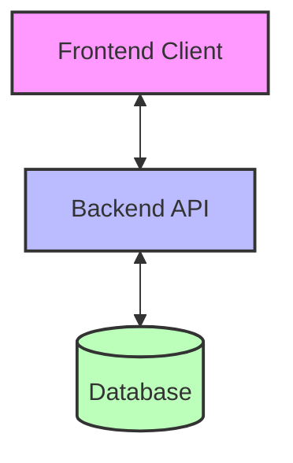
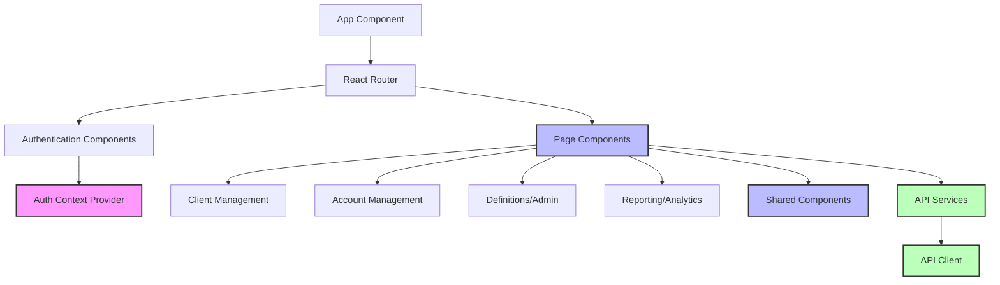
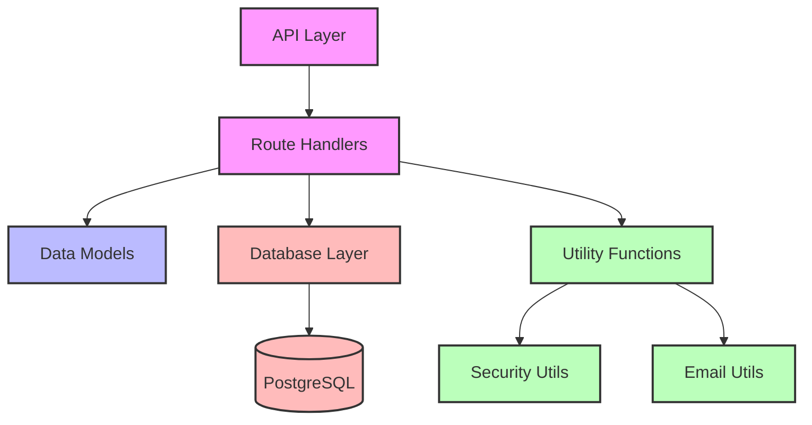
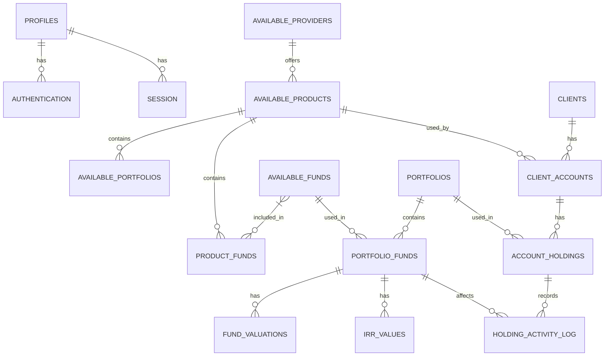
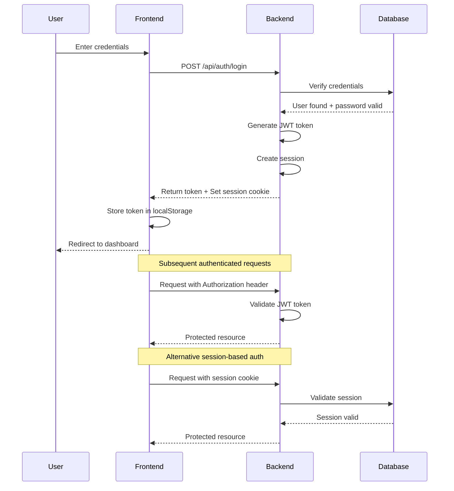
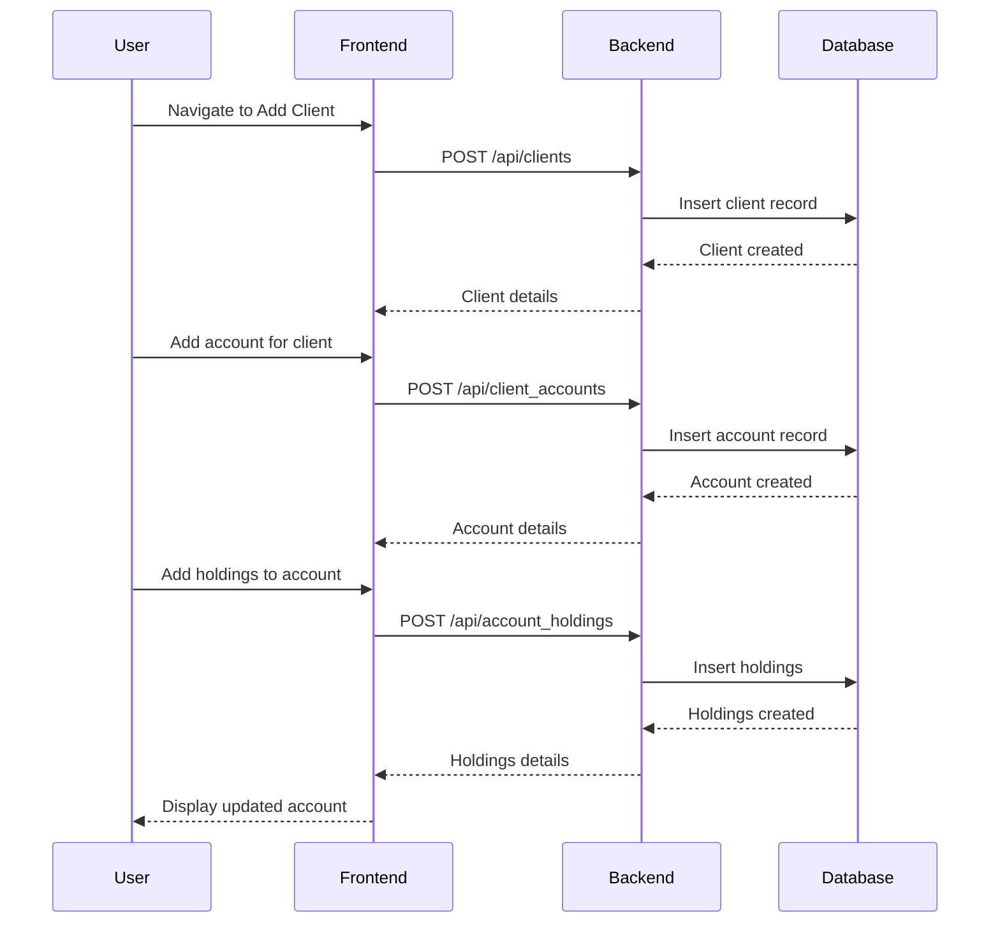
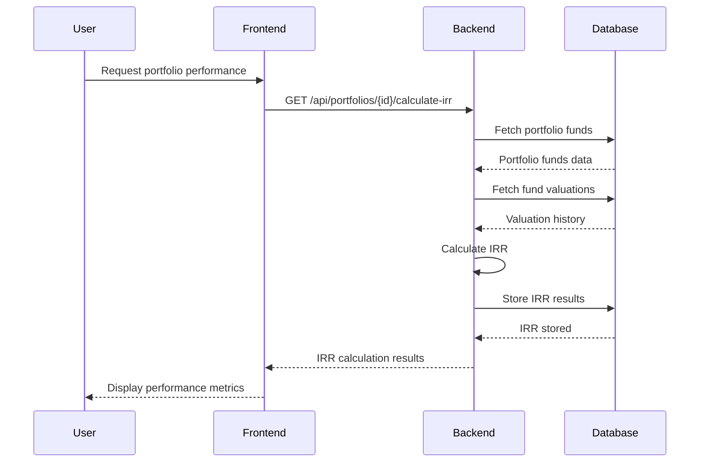
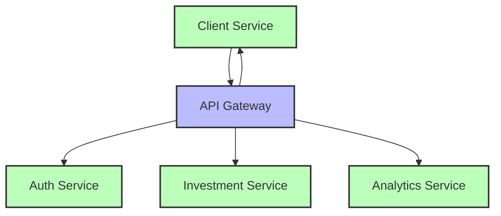
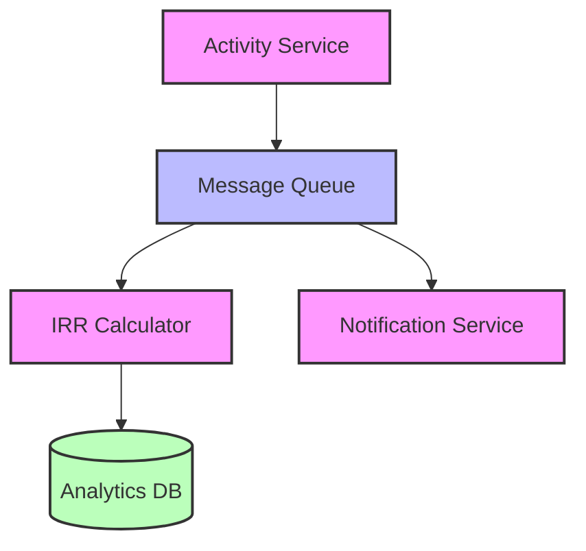

# Kingstons Portal - Architectural Documentation

## 1. System Overview

Kingstons Portal is a wealth management platform designed for financial advisors and administrators to manage client information, accounts, and investments. The system tracks investment performance using IRR (Internal Rate of Return) and provider data, with a focus on readability, clarity, and simplicity for users potentially aged 50+.

## 2. High-Level Architecture

The application follows a modern client-server architecture with clear separation of concerns:



### 2.1 Technology Stack

- **Frontend**: React (TypeScript), React Router, React Query, Tailwind CSS
- **Backend**: Python with FastAPI
- **Database**: PostgreSQL (with SQL queries via a database abstraction layer)
- **Authentication**: JWT tokens + HTTP-only cookies for session management

## 3. Component Architecture

### 3.1 Frontend Architecture

The frontend follows a component-based architecture with clear separation of concerns:



#### Key Frontend Components:

1. **Authentication Components**:
   - Login/Signup forms
   - Password reset functionality
   - Protected route wrapper

2. **Client Management**:
   - Client listing and search
   - Client details and editing
   - Client account management

3. **Account Management**:
   - Account listing and details
   - Holdings management
   - Activity logging

4. **Definitions/Admin**:
   - Providers management
   - Products configuration
   - Funds administration
   - Portfolio templates

5. **Reporting/Analytics**:
   - Performance reporting
   - IRR calculations
   - Fund valuations

### 3.2 Backend Architecture

The backend follows a layered architecture with clear API boundaries:



#### Key Backend Components:

1. **API Routes**:
   - Authentication endpoints
   - Client management
   - Account and holdings management
   - Portfolio and fund management
   - Analytics and reporting

2. **Data Models**:
   - Pydantic models for request/response validation
   - Database entity models

3. **Database Layer**:
   - Connection management
   - Query execution
   - Transaction handling

4. **Utility Functions**:
   - Security (password hashing, JWT handling)
   - Email services
   - Data formatting

## 4. Data Architecture

The database schema is organized in layers of dependencies, from basic entities to complex relationships:



### Key Database Entities:

1. **User Management**:
   - Profiles (user information)
   - Authentication (credentials)
   - Sessions (active user sessions)

2. **Investment Structure**:
   - Providers (financial institutions)
   - Products (financial products offered by providers)
   - Funds (investment vehicles)
   - Portfolios (collections of funds with weightings)

3. **Client Management**:
   - Clients (wealth management clients)
   - Client Accounts (accounts held by clients)
   - Account Holdings (investments held in accounts)
   - Holding Activity Log (transactions and valuations)

4. **Performance Tracking**:
   - Fund Valuations (point-in-time values)
   - IRR Values (calculated performance metrics)

## 5. Authentication and Security

The system implements a dual authentication approach:



### Security Features:

1. **JWT Token Authentication**:
   - Stateless authentication for API requests
   - Tokens stored in localStorage
   - Included in Authorization header

2. **Session-based Authentication**:
   - HTTP-only cookies for session ID
   - Server-side session validation
   - Protection against XSS attacks

3. **Password Security**:
   - Secure password hashing
   - Password reset functionality
   - Token-based verification

4. **Access Control**:
   - Protected routes on frontend
   - Authentication middleware on backend
   - Role-based permissions (implicit)

## 6. API Boundaries

The API follows a RESTful design with clear resource boundaries:

```mermaid
graph LR
    Client[Frontend Client] --> Auth[/api/auth/*]
    Client --> Clients[/api/clients/*]
    Client --> Products[/api/products/*]
    Client --> Funds[/api/funds/*]
    Client --> Portfolios[/api/portfolios/*]
    Client --> Providers[/api/providers/*]
    Client --> Accounts[/api/client_accounts/*]
    Client --> Holdings[/api/account_holdings/*]
    Client --> Activities[/api/holding_activity_logs/*]
    Client --> Analytics[/api/analytics/*]
    
    classDef endpoint fill:#f9f,stroke:#333,stroke-width:2px;
    
    class Auth,Clients,Products,Funds,Portfolios,Providers,Accounts,Holdings,Activities,Analytics endpoint;
```

### Key API Endpoints:

1. **Authentication**:
   - `/api/auth/login` - User login
   - `/api/auth/signup` - User registration
   - `/api/auth/logout` - User logout
   - `/api/auth/me` - Get current user

2. **Client Management**:
   - `/api/clients` - CRUD operations for clients
   - `/api/client_accounts` - Manage client accounts

3. **Investment Management**:
   - `/api/providers` - Investment providers
   - `/api/products` - Financial products
   - `/api/funds` - Investment funds
   - `/api/portfolios` - Portfolio management

4. **Account Operations**:
   - `/api/account_holdings` - Holdings in accounts
   - `/api/holding_activity_logs` - Activity tracking

5. **Analytics**:
   - `/api/analytics` - Performance metrics
   - `/api/fund_valuations` - Fund valuation history

## 7. Data Flow

### 7.1 Client Account Creation Flow



### 7.2 Performance Calculation Flow



## 8. Architectural Strengths

1. **Clear Separation of Concerns**:
   - Distinct frontend and backend boundaries
   - Well-organized component structure
   - Modular API design

2. **Comprehensive Data Model**:
   - Detailed entity relationships
   - Proper foreign key constraints
   - Efficient indexing strategy

3. **Robust Authentication**:
   - Dual authentication mechanisms
   - Secure password handling
   - Session management

4. **Maintainable Frontend**:
   - Component-based architecture
   - Centralized state management
   - Consistent UI patterns

5. **Scalable Backend**:
   - FastAPI's asynchronous capabilities
   - Efficient database queries
   - Proper error handling

## 9. Improvement Opportunities

1. **API Versioning Strategy**:
   - Implement explicit API versioning
   - Document version compatibility
   - Plan for API evolution

2. **Enhanced Caching**:
   - Implement server-side caching for frequent queries
   - Optimize client-side caching strategy
   - Consider Redis for distributed caching

3. **Comprehensive Logging and Monitoring**:
   - Implement structured logging
   - Add performance monitoring
   - Set up alerting for critical issues

4. **Microservices Consideration**:
   - Evaluate breaking down monolithic backend
   - Identify independent service boundaries
   - Plan for service communication

5. **Enhanced Security Measures**:
   - Implement rate limiting
   - Add CSRF protection
   - Consider security headers

## 10. Architectural Recommendations

1. **API Gateway Implementation**:
   - Add an API gateway for request routing
   - Implement request validation at gateway level
   - Centralize cross-cutting concerns



2. **Event-Driven Architecture for Analytics**:
   - Implement event sourcing for activity logs
   - Use message queue for asynchronous processing
   - Enable real-time analytics updates



3. **Enhanced Frontend State Management**:
   - Consider Redux for complex state
   - Implement optimistic UI updates
   - Add offline capabilities

4. **Containerization and Orchestration**:
   - Containerize application components
   - Implement Kubernetes for orchestration
   - Set up CI/CD pipeline

5. **Performance Optimization**:
   - Implement database query optimization
   - Add server-side rendering for initial load
   - Optimize bundle size with code splitting

## 11. Glossary of Domain Terms

- **FUM**: Funds Under Management - Total value of investments managed
- **IRR**: Internal Rate of Return - Performance measurement of investments
- **Portfolio**: Collection of investment funds with target allocations
- **Holding**: Specific investment position within an account
- **Valuation**: Point-in-time value assessment of an investment
- **Activity**: Transaction or event affecting a holding (purchase, sale, valuation)
- **Provider**: Financial institution offering investment products
- **Product**: Financial product offered by a provider
- **Fund**: Specific investment vehicle within a product
- **Client Account**: Account held by a client with a specific product