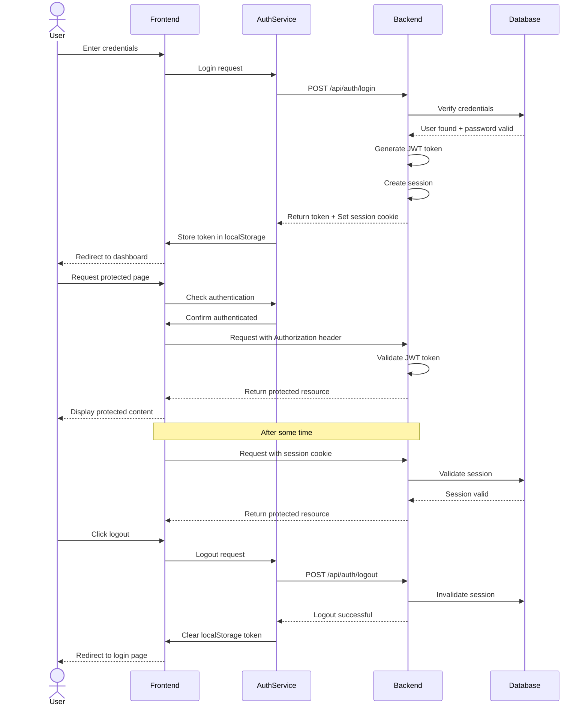
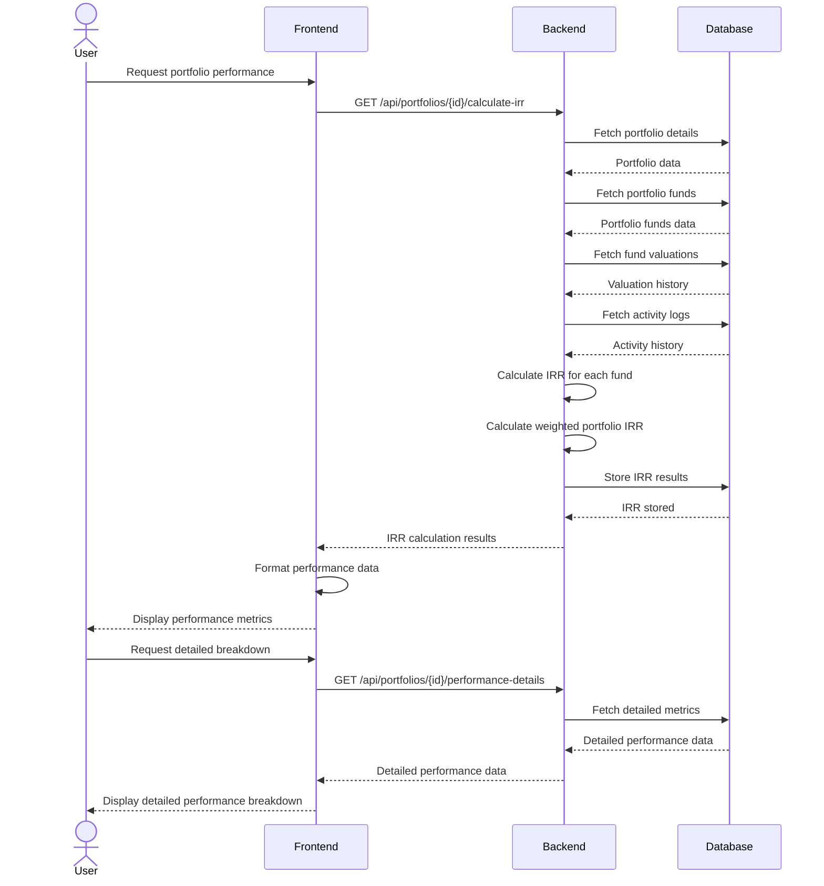

# Kingstons Portal - Component Diagram

## System Component Diagram

The following diagram illustrates the key components of the Kingstons Portal system and their interactions:

```mermaid
graph TD
    %% Client-side components
    subgraph "Frontend (React)"
        App[App Component]
        AuthContext[Auth Context]
        Router[React Router]
        QueryClient[React Query Client]
        
        %% Main sections
        subgraph "Authentication"
            LoginForm[Login Form]
            SignupForm[Signup Form]
            ResetPassword[Password Reset]
            ProtectedRoute[Protected Route]
        end
        
        subgraph "Client Management"
            ClientsList[Clients List]
            ClientDetails[Client Details]
            AddClient[Add Client]
        end
        
        subgraph "Account Management"
            AccountsList[Accounts List]
            AccountDetails[Account Details]
            Holdings[Holdings Management]
            ActivityLog[Activity Log]
        end
        
        subgraph "Definitions/Admin"
            Providers[Providers]
            Products[Products]
            Funds[Funds]
            Portfolios[Portfolios]
        end
        
        subgraph "Reporting"
            Analytics[Analytics Dashboard]
            Performance[Performance Reports]
        end
        
        %% Shared components
        UIComponents[UI Components]
        
        %% Services
        APIService[API Service]
        AuthService[Auth Service]
        ProfileService[Profile Service]
    end
    
    %% Server-side components
    subgraph "Backend (FastAPI)"
        FastAPI[FastAPI Application]
        
        subgraph "API Routes"
            AuthRoutes[Auth Routes]
            ClientRoutes[Client Routes]
            AccountRoutes[Account Routes]
            ProviderRoutes[Provider Routes]
            ProductRoutes[Product Routes]
            FundRoutes[Fund Routes]
            PortfolioRoutes[Portfolio Routes]
            AnalyticsRoutes[Analytics Routes]
        end
        
        subgraph "Models"
            AuthModels[Auth Models]
            ClientModels[Client Models]
            AccountModels[Account Models]
            InvestmentModels[Investment Models]
            AnalyticsModels[Analytics Models]
        end
        
        subgraph "Utilities"
            Security[Security Utils]
            Email[Email Utils]
            Database[Database Utils]
        end
        
        Middleware[Middleware]
    end
    
    %% Database
    subgraph "Database (PostgreSQL)"
        UserTables[User Tables]
        ClientTables[Client Tables]
        AccountTables[Account Tables]
        InvestmentTables[Investment Tables]
        PerformanceTables[Performance Tables]
    end
    
    %% Connections between components
    
    %% Frontend internal connections
    App --> AuthContext
    App --> Router
    App --> QueryClient
    
    Router --> LoginForm
    Router --> SignupForm
    Router --> ResetPassword
    Router --> ProtectedRoute
    Router --> ClientsList
    Router --> ClientDetails
    Router --> AddClient
    Router --> AccountsList
    Router --> AccountDetails
    Router --> Providers
    Router --> Products
    Router --> Funds
    Router --> Portfolios
    Router --> Analytics
    Router --> Performance
    
    ClientsList --> UIComponents
    ClientDetails --> UIComponents
    AccountDetails --> UIComponents
    Holdings --> UIComponents
    ActivityLog --> UIComponents
    
    LoginForm --> AuthService
    SignupForm --> AuthService
    ResetPassword --> AuthService
    ProtectedRoute --> AuthContext
    
    ClientsList --> APIService
    ClientDetails --> APIService
    AccountsList --> APIService
    AccountDetails --> APIService
    Holdings --> APIService
    ActivityLog --> APIService
    Providers --> APIService
    Products --> APIService
    Funds --> APIService
    Portfolios --> APIService
    Analytics --> APIService
    Performance --> APIService
    
    AuthService --> APIService
    ProfileService --> APIService
    
    %% Backend internal connections
    FastAPI --> AuthRoutes
    FastAPI --> ClientRoutes
    FastAPI --> AccountRoutes
    FastAPI --> ProviderRoutes
    FastAPI --> ProductRoutes
    FastAPI --> FundRoutes
    FastAPI --> PortfolioRoutes
    FastAPI --> AnalyticsRoutes
    
    AuthRoutes --> AuthModels
    ClientRoutes --> ClientModels
    AccountRoutes --> AccountModels
    ProviderRoutes --> InvestmentModels
    ProductRoutes --> InvestmentModels
    FundRoutes --> InvestmentModels
    PortfolioRoutes --> InvestmentModels
    AnalyticsRoutes --> AnalyticsModels
    
    AuthRoutes --> Security
    AuthRoutes --> Email
    ClientRoutes --> Database
    AccountRoutes --> Database
    ProviderRoutes --> Database
    ProductRoutes --> Database
    FundRoutes --> Database
    PortfolioRoutes --> Database
    AnalyticsRoutes --> Database
    
    FastAPI --> Middleware
    
    %% Database connections
    Database --> UserTables
    Database --> ClientTables
    Database --> AccountTables
    Database --> InvestmentTables
    Database --> PerformanceTables
    
    %% Frontend to Backend connections
    APIService --> FastAPI
    
    %% Styling
    classDef frontend fill:#f9f,stroke:#333,stroke-width:1px;
    classDef backend fill:#bbf,stroke:#333,stroke-width:1px;
    classDef database fill:#bfb,stroke:#333,stroke-width:1px;
    classDef context fill:#ff9,stroke:#333,stroke-width:1px;
    classDef service fill:#fbb,stroke:#333,stroke-width:1px;
    
    class App,Router,LoginForm,SignupForm,ResetPassword,ProtectedRoute,ClientsList,ClientDetails,AddClient,AccountsList,AccountDetails,Holdings,ActivityLog,Providers,Products,Funds,Portfolios,Analytics,Performance,UIComponents,QueryClient frontend;
    class FastAPI,AuthRoutes,ClientRoutes,AccountRoutes,ProviderRoutes,ProductRoutes,FundRoutes,PortfolioRoutes,AnalyticsRoutes,AuthModels,ClientModels,AccountModels,InvestmentModels,AnalyticsModels,Security,Email,Middleware backend;
    class UserTables,ClientTables,AccountTables,InvestmentTables,PerformanceTables database;
    class AuthContext context;
    class APIService,AuthService,ProfileService,Database service;
```

## Data Flow Diagram

This diagram illustrates how data flows through the system during key operations:

```mermaid
flowchart TD
    %% External entities
    User([User/Advisor])
    
    %% Processes
    Auth[Authentication Process]
    ClientMgmt[Client Management]
    AccountMgmt[Account Management]
    InvestmentMgmt[Investment Management]
    PerformanceCalc[Performance Calculation]
    Reporting[Reporting Process]
    
    %% Data stores
    UserStore[(User Data)]
    ClientStore[(Client Data)]
    AccountStore[(Account Data)]
    InvestmentStore[(Investment Data)]
    PerformanceStore[(Performance Data)]
    
    %% Data flows
    User -->|Credentials| Auth
    Auth -->|User Profile| User
    Auth -->|Store User Data| UserStore
    
    User -->|Client Information| ClientMgmt
    ClientMgmt -->|Client List/Details| User
    ClientMgmt -->|Store Client Data| ClientStore
    ClientMgmt -->|Retrieve Client Data| ClientStore
    
    User -->|Account Information| AccountMgmt
    AccountMgmt -->|Account List/Details| User
    AccountMgmt -->|Store Account Data| AccountStore
    AccountMgmt -->|Retrieve Account Data| AccountStore
    AccountMgmt -->|Client Lookup| ClientStore
    
    User -->|Investment Setup| InvestmentMgmt
    InvestmentMgmt -->|Investment Details| User
    InvestmentMgmt -->|Store Investment Data| InvestmentStore
    InvestmentMgmt -->|Retrieve Investment Data| InvestmentStore
    
    User -->|Request Performance| PerformanceCalc
    PerformanceCalc -->|Performance Metrics| User
    PerformanceCalc -->|Retrieve Investment Data| InvestmentStore
    PerformanceCalc -->|Retrieve Account Data| AccountStore
    PerformanceCalc -->|Store Performance Results| PerformanceStore
    
    User -->|Request Reports| Reporting
    Reporting -->|Generated Reports| User
    Reporting -->|Retrieve Performance Data| PerformanceStore
    Reporting -->|Retrieve Client Data| ClientStore
    Reporting -->|Retrieve Account Data| AccountStore
    
    %% Styling
    classDef entity fill:#f9f,stroke:#333,stroke-width:1px;
    classDef process fill:#bbf,stroke:#333,stroke-width:1px;
    classDef datastore fill:#bfb,stroke:#333,stroke-width:1px;
    
    class User entity;
    class Auth,ClientMgmt,AccountMgmt,InvestmentMgmt,PerformanceCalc,Reporting process;
    class UserStore,ClientStore,AccountStore,InvestmentStore,PerformanceStore datastore;
```

## Authentication Sequence Diagram

This diagram shows the detailed authentication flow:

## Portfolio Performance Calculation Sequence

This diagram illustrates the process of calculating portfolio performance:

These diagrams provide a comprehensive view of the system's components, their interactions, and key data flows within the Kingstons Portal application.