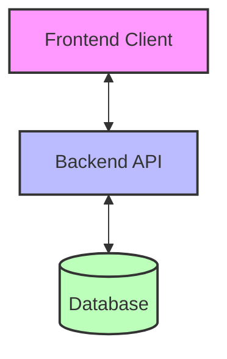

# Kingstons Portal - Architectural Analysis Executive Summary

## Overview

This document provides an executive summary of the comprehensive architectural analysis conducted for the Kingstons Portal system. The analysis includes a detailed examination of the current architecture, component relationships, API boundaries, and recommendations for future enhancements.

## Purpose

The Kingstons Portal is a wealth management platform designed for financial advisors and administrators to manage client information, accounts, and investments. The system tracks investment performance using IRR (Internal Rate of Return) and provider data, with a focus on readability, clarity, and simplicity for users potentially aged 50+.

## Key Architectural Documents

The following documents provide a comprehensive view of the system architecture:

1. **[Architecture Overview](architecture.md)** - Comprehensive documentation of the current system architecture
2. **[Component Diagram](component_diagram.md)** - Detailed visualization of system components and their interactions
3. **[API Boundaries](api_boundaries.md)** - Specification of the interfaces between frontend and backend
4. **[Architectural Recommendations](architectural_recommendations.md)** - Strategic recommendations for system enhancement

## Current Architecture Summary

The Kingstons Portal follows a modern client-server architecture with clear separation of concerns:

### Technology Stack

- **Frontend**: React (TypeScript), React Router, React Query, Tailwind CSS
- **Backend**: Python with FastAPI
- **Database**: PostgreSQL
- **Authentication**: JWT tokens + HTTP-only cookies for session management

### Key System Components

1. **Frontend Components**:
   - Authentication (login, signup, password reset)
   - Client Management (client listing, details, editing)
   - Account Management (account listing, details, holdings)
   - Definitions/Admin (providers, products, funds, portfolios)
   - Reporting/Analytics (performance reporting, IRR calculations)

2. **Backend Components**:
   - API Routes (RESTful endpoints for all resources)
   - Data Models (request/response validation, database entities)
   - Database Layer (connection management, query execution)
   - Utility Functions (security, email, data formatting)

3. **Database Structure**:
   - User Management (profiles, authentication, sessions)
   - Investment Structure (providers, products, funds, portfolios)
   - Client Management (clients, accounts, holdings, activity logs)
   - Performance Tracking (valuations, IRR calculations)

## Architectural Strengths

1. **Clear Separation of Concerns**:
   - Distinct frontend and backend boundaries
   - Well-organized component structure
   - Modular API design

2. **Comprehensive Data Model**:
   - Detailed entity relationships
   - Proper foreign key constraints
   - Efficient indexing strategy

3. **Robust Authentication**:
   - Dual authentication mechanisms
   - Secure password handling
   - Session management

4. **Maintainable Frontend**:
   - Component-based architecture
   - Centralized state management
   - Consistent UI patterns

5. **Scalable Backend**:
   - FastAPI's asynchronous capabilities
   - Efficient database queries
   - Proper error handling

## Key Architectural Recommendations

The following strategic recommendations have been identified to enhance the system:

1. **API Gateway Implementation** (Medium Effort, 2-3 sprints):
   - Centralize authentication, routing, and cross-cutting concerns
   - Implement request/response transformation
   - Add monitoring and caching capabilities

2. **Microservices Architecture Evolution** (High Effort, 6-12 months):
   - Gradually decompose monolith into domain-specific services
   - Enable independent scaling and deployment
   - Improve team autonomy and fault isolation

3. **Event-Driven Architecture for Analytics** (Medium Effort, 2-3 sprints):
   - Implement message queues for asynchronous calculations
   - Enable real-time analytics updates
   - Improve system resilience and scalability

4. **Enhanced Caching Strategy** (Medium Effort, 2-3 sprints):
   - Implement multi-level caching
   - Reduce database and API server load
   - Improve user experience with faster responses

5. **Comprehensive Observability** (Medium Effort, 2-3 sprints):
   - Add structured logging, metrics, and tracing
   - Implement alerting for proactive issue detection
   - Create operational and business dashboards

## Implementation Roadmap

The recommendations are organized into a phased implementation roadmap:

### Phase 1: Foundation (3-4 months)
- Enhanced Caching Strategy
- Comprehensive Observability
- Database Optimization

### Phase 2: Architecture Evolution (6-8 months)
- API Gateway Implementation
- Event-Driven Architecture for Analytics
- Enhanced Frontend Architecture

### Phase 3: Advanced Capabilities (6-8 months)
- Security Enhancements
- Containerization and Orchestration
- Microservices Architecture Evolution
- Progressive Web App Implementation

## Conclusion

The Kingstons Portal has a solid architectural foundation with clear separation of concerns, a comprehensive data model, and robust authentication. The recommended enhancements will further improve the system's scalability, maintainability, security, and performance while preserving existing functionality.

By following the proposed implementation roadmap, the system can evolve incrementally without disrupting current operations, ultimately providing a better experience for both users and developers.

## Next Steps

1. Review the detailed architectural documentation
2. Prioritize recommendations based on business needs
3. Create detailed implementation plans for Phase 1 initiatives
4. Establish metrics to measure the impact of architectural improvements
5. Begin implementation of highest-priority recommendations