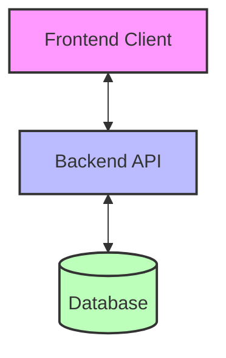

# Kingstons Portal - Architectural Documentation

## Introduction

This repository contains comprehensive architectural documentation for the Kingstons Portal system. The documentation provides a detailed analysis of the current architecture, component relationships, API boundaries, and recommendations for future enhancements.

## Documentation Structure

The architectural documentation is organized into the following documents:

| Document | Description |
|----------|-------------|
| [Executive Summary](executive_summary.md) | High-level overview of the architectural analysis and key findings |
| [Architecture Overview](architecture.md) | Comprehensive documentation of the current system architecture |
| [Component Diagram](component_diagram.md) | Detailed visualization of system components and their interactions |
| [API Boundaries](api_boundaries.md) | Specification of the interfaces between frontend and backend |
| [Architectural Recommendations](architectural_recommendations.md) | Strategic recommendations for system enhancement |

## Quick Start

For a high-level understanding of the architecture, start with the [Executive Summary](executive_summary.md). This document provides an overview of the system, key architectural components, strengths, and recommendations.

For more detailed information, refer to the specific documents:

- **Understanding the current architecture**: [Architecture Overview](architecture.md)
- **Visualizing component relationships**: [Component Diagram](component_diagram.md)
- **API contract between frontend and backend**: [API Boundaries](api_boundaries.md)
- **Future architectural enhancements**: [Architectural Recommendations](architectural_recommendations.md)

## System Overview

The Kingstons Portal is a wealth management platform designed for financial advisors and administrators to manage client information, accounts, and investments. The system tracks investment performance using IRR (Internal Rate of Return) and provider data, with a focus on readability, clarity, and simplicity for users potentially aged 50+.

### Key Features

- Client management
- Account management
- Investment tracking
- Portfolio management
- Performance reporting
- Analytics

### Technology Stack

- **Frontend**: React (TypeScript), React Router, React Query, Tailwind CSS
- **Backend**: Python with FastAPI
- **Database**: PostgreSQL
- **Authentication**: JWT tokens + HTTP-only cookies for session management

## Architecture Diagram

## Key Architectural Recommendations

The following strategic recommendations have been identified to enhance the system:

1. **API Gateway Implementation**
2. **Microservices Architecture Evolution**
3. **Event-Driven Architecture for Analytics**
4. **Enhanced Caching Strategy**
5. **Comprehensive Observability**

For detailed information on these recommendations, refer to the [Architectural Recommendations](architectural_recommendations.md) document.

## Implementation Roadmap

The recommendations are organized into a phased implementation roadmap:

### Phase 1: Foundation (3-4 months)
- Enhanced Caching Strategy
- Comprehensive Observability
- Database Optimization

### Phase 2: Architecture Evolution (6-8 months)
- API Gateway Implementation
- Event-Driven Architecture for Analytics
- Enhanced Frontend Architecture

### Phase 3: Advanced Capabilities (6-8 months)
- Security Enhancements
- Containerization and Orchestration
- Microservices Architecture Evolution
- Progressive Web App Implementation

## Conclusion

The Kingstons Portal has a solid architectural foundation with clear separation of concerns, a comprehensive data model, and robust authentication. The recommended enhancements will further improve the system's scalability, maintainability, security, and performance while preserving existing functionality.

By following the proposed implementation roadmap, the system can evolve incrementally without disrupting current operations, ultimately providing a better experience for both users and developers.